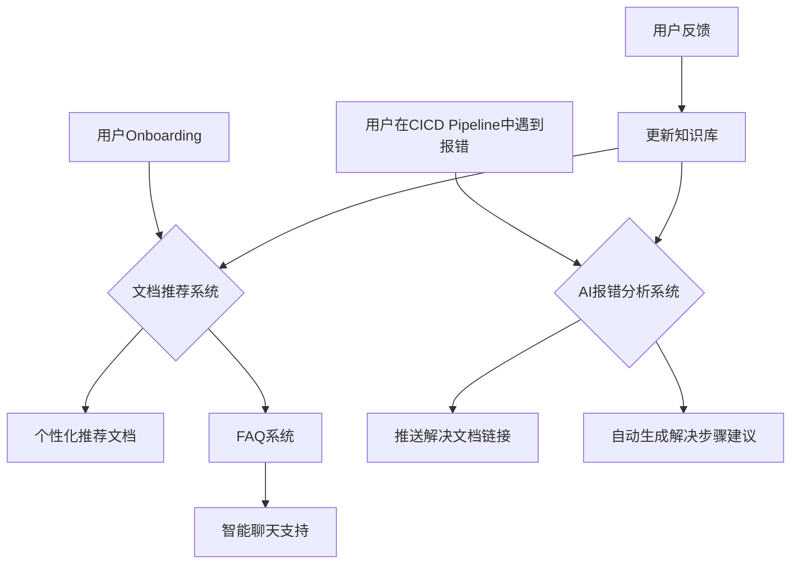

在您描述的环境中，可以利用AI来优化Onboarding和CICD报错支持。这不仅能减少SRE团队的负担，还能提升用户的自助解决能力。以下是一些可以考虑的AI应用方向：

### 1. **自动化Onboarding文档推荐系统**

- **文档分类与推荐**：通过自然语言处理（NLP）模型对Onboarding文档进行分类和整理。可以利用Google Cloud的 **Document AI** 或 **Vertex AI** 来训练模型，让系统根据用户的具体需求自动推荐相关的文档。
- **FAQ和智能搜索系统**：构建FAQ系统，利用知识图谱或信息检索算法支持用户快速查询。用户在输入问题时，系统可以根据关键词自动找到匹配的文档或步骤。
- **聊天机器人支持**：设置一个Onboarding的智能聊天机器人，使用Google Dialogflow等工具，使用户在入驻过程中可以直接通过聊天机器人获取帮助。
- **定制化Onboarding路径生成**：在用户入驻时自动生成个性化的Onboarding流程，并推荐必需的文档列表，帮助用户按照个性化步骤快速入门。

### 2. **CICD Pipeline中的智能报错处理**

- **实时报错解析与建议**：使用AI模型分析CICD pipeline中的报错日志。当检测到典型报错时，直接从预设的解决方案库中提取推荐步骤，或自动将报错信息与相应的解决文档链接。
- **自动生成报错解决建议**：对于一些新的或少见的报错，可以通过预先训练的模型（如BERT或GPT）生成潜在的解决步骤，帮助用户快速找到解决思路。
- **CICD步骤嵌入解决方案**：在CI/CD配置文件中加入AI接口，支持自动化的报错信息检测和解决方案推送。可以将这种支持直接集成到CICD的Pipeline中，让用户在日志中快速找到解决文档。

### 3. **知识库的动态更新与反馈系统**

- **知识库自动更新**：对于用户反馈的常见报错和问题，通过收集反馈自动化地更新知识库。系统可以定期扫描Onboarding或CICD问题反馈，将新的解决方法引入知识库。
- **反馈和优化循环**：根据用户是否接受或忽略推荐的文档，优化推荐系统的准确性。结合用户反馈，机器学习模型可以逐步适应更准确的推荐方式。
- **实时更新提示**：当有新的解决方案或方法加入到知识库时，自动推送到相关的用户或项目，确保用户始终访问到最新的解决方法。

### 实现流程示例

下面是如何在用户入驻和CICD Pipeline中的智能支持流程的设计示例：



### 技术栈建议

| 功能                    | Google Cloud 服务            | 说明                           |
| ----------------------- | ---------------------------- | ------------------------------ |
| 文档分类与推荐          | Document AI, Vertex AI       | 对文档进行NLP分类和推荐        |
| FAQ智能搜索与聊天机器人 | Dialogflow, Custom Search AI | 支持FAQ系统和个性化聊天支持    |
| 报错分析与解决方案生成  | BERT, GPT等NLP模型           | 自动分析报错并生成相应解决方案 |
| 知识库自动化更新        | BigQuery, Firestore          | 存储和管理解决方案文档         |
| 反馈收集与模型优化      | AutoML, Vertex AI            | 通过反馈数据训练优化推荐模型   |

通过这些方向的AI应用，用户Onboarding和CICD过程中的报错处理可以得到显著改善，同时减轻SRE团队的日常支持工作量。

这是一个很好的方向，让我们分别从Onboarding文档智能化和Pipeline错误自动诊断两个方面来探讨解决方案：

1. Onboarding文档智能化系统：

```python
from langchain.document_loaders import DirectoryLoader
from langchain.text_splitter import RecursiveCharacterTextSplitter
from langchain.embeddings import VertexAIEmbeddings
from langchain.vectorstores import Chroma
from langchain.chains import RetrievalQA
from google.cloud import aiplatform
import json

class OnboardingAssistant:
    def __init__(self, docs_directory, embeddings_model="textembedding-gecko@latest"):
        self.docs_directory = docs_directory
        self.embeddings = VertexAIEmbeddings(model_name=embeddings_model)
        self.vector_store = None
        self.qa_chain = None

    def initialize_knowledge_base(self):
        """初始化文档知识库"""
        # 加载文档
        loader = DirectoryLoader(
            self.docs_directory,
            glob="**/*.{txt,md,pdf}",
            recursive=True
        )
        documents = loader.load()

        # 分割文档
        text_splitter = RecursiveCharacterTextSplitter(
            chunk_size=1000,
            chunk_overlap=200
        )
        texts = text_splitter.split_documents(documents)

        # 创建向量存储
        self.vector_store = Chroma.from_documents(
            documents=texts,
            embedding=self.embeddings
        )

        # 初始化QA链
        self.qa_chain = RetrievalQA.from_chain_type(
            llm=aiplatform.VertexAI(),
            chain_type="stuff",
            retriever=self.vector_store.as_retriever()
        )

    def get_relevant_docs(self, query):
        """获取相关文档"""
        return self.vector_store.similarity_search(query)

    def answer_question(self, question):
        """回答用户问题"""
        return self.qa_chain.run(question)

    def generate_custom_guide(self, user_context):
        """根据用户上下文生成定制化指南"""
        context_prompt = f"""
        Based on the following user context:
        - Team: {user_context['team']}
        - Project: {user_context['project']}
        - Tech Stack: {', '.join(user_context['tech_stack'])}

        Generate a customized onboarding guide.
        """

        relevant_docs = self.get_relevant_docs(context_prompt)
        return self.qa_chain.run(context_prompt)

class OnboardingAPI:
    def __init__(self):
        self.assistant = OnboardingAssistant("/path/to/docs")

    def setup_endpoints(self, app):
        @app.route('/api/docs/search', methods=['POST'])
        def search_docs():
            query = request.json['query']
            results = self.assistant.get_relevant_docs(query)
            return jsonify(results)

        @app.route('/api/docs/generate-guide', methods=['POST'])
        def generate_guide():
            user_context = request.json
            guide = self.assistant.generate_custom_guide(user_context)
            return jsonify(guide)

```

2. Pipeline错误自动诊断系统：

```python
from google.cloud import aiplatform
from google.cloud import error_reporting
import re
import json
import logging

class PipelineDiagnostics:
    def __init__(self, project_id):
        self.project_id = project_id
        self.vertex_ai = aiplatform.VertexAI()
        self.error_patterns = self._load_error_patterns()

    def _load_error_patterns(self):
        """加载常见错误模式和解决方案"""
        return {
            "permission_denied": {
                "pattern": r"Permission denied|AccessDenied|403",
                "solutions": [
                    "检查Service Account权限",
                    "验证IAM角色配置",
                    "检查资源访问策略"
                ]
            },
            "resource_exhausted": {
                "pattern": r"ResourceExhausted|Quota exceeded|429",
                "solutions": [
                    "检查资源配额",
                    "调整资源限制",
                    "优化资源使用"
                ]
            },
            # 添加更多错误模式
        }

    def analyze_error(self, error_log):
        """分析错误日志并提供解决方案"""
        # 使用AI模型分析错误
        analysis_prompt = f"""
        分析以下Pipeline错误并提供解决方案：
        {error_log}

        考虑以下方面：
        1. 错误根本原因
        2. 可能的解决步骤
        3. 预防措施
        """

        response = self.vertex_ai.predict(
            endpoint="error-analysis-endpoint",
            instances=[{"text": analysis_prompt}]
        )

        # 匹配已知错误模式
        for error_type, info in self.error_patterns.items():
            if re.search(info["pattern"], error_log):
                return {
                    "error_type": error_type,
                    "solutions": info["solutions"],
                    "ai_analysis": response.predictions[0]
                }

        return {"ai_analysis": response.predictions[0]}

    def auto_remediate(self, error_info):
        """自动修复常见问题"""
        if error_info["error_type"] == "permission_denied":
            return self._fix_permissions()
        elif error_info["error_type"] == "resource_exhausted":
            return self._adjust_resources()

        return None

    def _fix_permissions(self):
        """修复权限问题"""
        # 实现权限修复逻辑
        pass

    def _adjust_resources(self):
        """调整资源配置"""
        # 实现资源调整逻辑
        pass

class PipelineMonitor:
    def __init__(self, project_id):
        self.diagnostics = PipelineDiagnostics(project_id)
        self.logger = logging.getLogger(__name__)

    def monitor_pipeline(self, pipeline_id):
        """监控Pipeline执行状态"""
        @app.route('/api/pipeline/error', methods=['POST'])
        def handle_pipeline_error():
            error_log = request.json['error_log']
            pipeline_id = request.json['pipeline_id']

            # 分析错误
            error_analysis = self.diagnostics.analyze_error(error_log)

            # 记录错误信息
            self.logger.error(f"Pipeline {pipeline_id} error: {error_log}")

            # 尝试自动修复
            remediation_result = self.diagnostics.auto_remediate(error_analysis)

            return jsonify({
                "analysis": error_analysis,
                "remediation_result": remediation_result
            })

```

3. 实施建议：

a) Onboarding文档智能化：

```
1. 文档整理和标准化
- 建立文档模板
- 统一文档格式
- 添加元数据标签

2. AI助手实现
- 集成Google Cloud AI服务
- 实现文档检索和问答
- 提供个性化推荐

3. 用户界面
- 交互式文档导航
- 智能搜索功能
- 上下文相关推荐
```

b) Pipeline错误诊断：

```
1. 错误模式库建设
- 收集常见错误
- 建立解决方案数据库
- 持续更新和优化

2. 自动诊断实现
- 实时错误监控
- AI分析和诊断
- 自动修复建议

3. 反馈循环
- 收集用户反馈
- 优化诊断准确率
- 更新解决方案库
```

4. 创新功能建议：

a) 智能文档功能：

- 自动生成个性化入门指南
- 基于用户行为推荐相关文档
- 交互式故障排除向导

b) Pipeline增强：

- 预测性错误预警
- 自动化修复建议
- 学习型错误处理

5. 集成建议：

```
1. 与现有系统集成
- 接入CI/CD系统
- 集成监控告警
- 对接工单系统

2. 数据收集和分析
- 错误日志分析
- 用户行为跟踪
- 效果度量分析

3. 持续优化
- 模型定期训练
- 解决方案更新
- 用户反馈收集
```

您觉得这些方案中哪些部分最适合优先实施？或者您还有其他特定的需求需要考虑？
