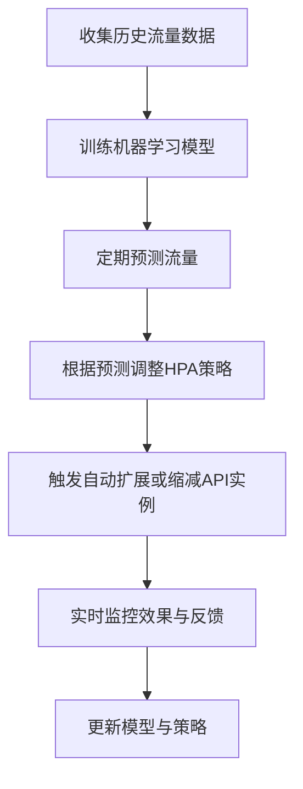

在Google Cloud平台中，利用机器学习预测分析来自动化API的资源调整，可以帮助更精确地适应流量波动，减少资源浪费，同时避免因资源不足导致的请求失败或延迟。以下是一个具体实施方案：

### 1. **数据收集与监控**

- **流量模式数据**：首先，需要收集API的历史流量数据（如请求速率、响应时间、失败率等）。在Google Cloud上，可以使用 **Stackdriver Logging** 和 **Monitoring** 来获取这些实时和历史数据。
- **资源使用数据**：收集与API实例相关的资源使用数据，如CPU、内存使用率等。可以在GKE的节点或Pod级别上使用Google Cloud Monitoring来进行资源监控。
- **关键业务指标（KPI）**：确定具体的KPI，如用户请求的延迟、成功率等，将这些指标也纳入数据采集中。

### 2. **机器学习模型的训练**

- **选择模型**：可以选择基于时间序列的预测模型（如ARIMA、LSTM等）来预测未来流量。Google Cloud的 **AI Platform** 可以支持这些模型的训练和部署。
- **数据准备**：将收集的流量模式、资源使用率、KPI等历史数据进行清洗和标准化，以便输入到模型中。
- **训练模型**：通过Google Cloud AI Platform的 **AutoML Tables** 或 **Vertex AI** 可以快速构建和训练模型。目标是让模型识别流量的峰值和低谷、日常模式和异常情况，以便预测未来短时间内的流量。

### 3. **预测与资源分配策略**

- **流量预测**：利用训练好的模型定期预测短期内（如下一小时或一天）的流量需求，从而决定资源分配计划。
- **策略制定**：
  - **扩展策略**：当预测到流量高峰即将到来时，可以提前增加API实例的数量。这可以通过GKE的 **Horizontal Pod Autoscaler (HPA)** 实现，基于预测到的流量需求来自动调整Pod的数量。
  - **缩减策略**：在流量减少时，释放不必要的资源，减少资源成本。GKE的HPA同样支持缩减Pod数量的操作。

### 4. **自动化资源管理流程**

- **定期更新预测**：使用 **Cloud Scheduler** 定期运行预测流程（如每5分钟或每小时），并根据最新的预测更新资源分配计划。
- **自动触发资源扩缩**：在GKE中，通过API接口可以编程化地调整HPA的阈值。可以利用 **Cloud Functions** 或 **Cloud Run** 结合Cloud Scheduler触发自动化的API，以此动态调整HPA的配置，达到根据预测结果调整资源的效果。

### 5. **反馈与持续改进**

- **实时监控与反馈**：监控实际流量与预测流量之间的差距。如果差距较大，可能需要调整模型或更新训练数据。
- **模型更新**：根据监控反馈和新收集的流量数据，定期重新训练模型，保持模型的预测准确性。

### 实现流程图



### 可能的技术栈组合

| 功能             | Google Cloud 服务                | 说明                             |
| ---------------- | -------------------------------- | -------------------------------- |
| 数据收集         | Stackdriver Logging, Monitoring  | 实时监控API流量和资源使用率      |
| 机器学习模型训练 | Vertex AI 或 AI Platform         | 支持LSTM或AutoML模型训练         |
| 流量预测与触发   | Cloud Scheduler, Cloud Functions | 定时触发预测任务和资源分配调整   |
| 资源分配         | GKE HPA                          | 根据预测结果动态扩展/缩减Pod数量 |

这种基于预测的自动化资源分配方案，能够有效地动态应对流量波动，既保证用户体验又控制了成本。

在Google Cloud Platform中实现API的智能自动化调整，我们可以利用几个关键服务和技术来实现。让我来详细展开：

1. 数据收集层

```
- Cloud Monitoring (原Stackdriver)收集以下指标：
  - API请求量
  - 响应时间
  - 错误率
  - CPU/内存使用率
  - 并发连接数

- Cloud Logging收集：
  - 应用日志
  - 系统日志
  - 访问日志
```

2. 预测分析实现

```python
使用Google Cloud服务组合：
- Cloud AI Platform用于训练预测模型
- BigQuery存储历史数据
- Cloud Functions处理实时数据
```

3. 具体实施方案：

```python
from google.cloud import monitoring_v3
from google.cloud import bigquery
from google.cloud import aiplatform
import numpy as np
from datetime import datetime, timedelta

class APIResourceOptimizer:
    def __init__(self, project_id, zone, cluster_name):
        self.project_id = project_id
        self.zone = zone
        self.cluster_name = cluster_name
        self.client = monitoring_v3.MetricServiceClient()
        self.bq_client = bigquery.Client()

    def collect_metrics(self, window_minutes=30):
        """收集最近期间的API指标"""
        project_name = f"projects/{self.project_id}"

        # 定义要收集的指标
        metric_types = [
            'kubernetes.io/container/cpu/core_usage_time',
            'kubernetes.io/container/memory/used_bytes',
            'kubernetes.io/container/request_count'
        ]

        metrics_data = {}
        now = datetime.utcnow()
        interval = monitoring_v3.TimeInterval({
            'end_time': {'seconds': int(now.timestamp())},
            'start_time': {'seconds': int((now - timedelta(minutes=window_minutes)).timestamp())}
        })

        for metric_type in metric_types:
            results = self.client.list_time_series(
                request={
                    "name": project_name,
                    "filter": f'metric.type = "{metric_type}"',
                    "interval": interval,
                    "view": monitoring_v3.ListTimeSeriesRequest.TimeSeriesView.FULL
                }
            )
            metrics_data[metric_type] = list(results)

        return metrics_data

    def predict_resource_needs(self, historical_data):
        """使用AI Platform预测未来资源需求"""
        # 准备训练数据
        training_data = self._prepare_training_data(historical_data)

        # 创建和训练预测模型
        model = aiplatform.Model.upload(
            display_name="api-resource-predictor",
            artifact_uri="gs://{bucket}/model/",
            serving_container_image_uri="gcr.io/{project}/predictor:v1"
        )

        # 获取预测结果
        prediction_job = model.batch_predict(
            job_display_name="resource-prediction",
            instances=[training_data]
        )

        return prediction_job.predictions

    def adjust_resources(self, predictions):
        """根据预测结果调整资源配置"""
        min_replicas = self._calculate_min_replicas(predictions)
        max_replicas = self._calculate_max_replicas(predictions)

        # 更新HPA配置
        hpa_config = {
            "apiVersion": "autoscaling/v2",
            "kind": "HorizontalPodAutoscaler",
            "metadata": {
                "name": "api-hpa"
            },
            "spec": {
                "minReplicas": min_replicas,
                "maxReplicas": max_replicas,
                "metrics": [
                    {
                        "type": "Resource",
                        "resource": {
                            "name": "cpu",
                            "target": {
                                "type": "Utilization",
                                "averageUtilization": 70
                            }
                        }
                    },
                    {
                        "type": "Resource",
                        "resource": {
                            "name": "memory",
                            "target": {
                                "type": "Utilization",
                                "averageUtilization": 75
                            }
                        }
                    }
                ]
            }
        }

        return self._apply_hpa_config(hpa_config)

    def _prepare_training_data(self, historical_data):
        """准备模型训练数据"""
        query = f"""
        SELECT
            TIMESTAMP_TRUNC(timestamp, HOUR) as hour,
            AVG(request_count) as avg_requests,
            AVG(cpu_usage) as avg_cpu,
            AVG(memory_usage) as avg_memory
        FROM `{self.project_id}.metrics.api_metrics`
        WHERE timestamp >= TIMESTAMP_SUB(CURRENT_TIMESTAMP(), INTERVAL 30 DAY)
        GROUP BY 1
        ORDER BY 1
        """

        query_job = self.bq_client.query(query)
        return query_job.result()

    def _calculate_min_replicas(self, predictions):
        """计算最小副本数"""
        base_load = np.percentile(predictions['load'], 25)
        return max(2, int(base_load / 0.7))  # 假设单个实例最大负载70%

    def _calculate_max_replicas(self, predictions):
        """计算最大副本数"""
        peak_load = np.percentile(predictions['load'], 95)
        return max(5, int(peak_load / 0.7 * 1.5))  # 额外50%容量作为缓冲

    def _apply_hpa_config(self, config):
        """应用HPA配置"""
        # 这里需要调用Kubernetes API
        # 实际实现需要使用kubernetes-client
        pass

# 使用示例
optimizer = APIResourceOptimizer(
    project_id='your-project',
    zone='us-central1-a',
    cluster_name='main-cluster'
)

# 收集当前指标
current_metrics = optimizer.collect_metrics()

# 预测资源需求
predictions = optimizer.predict_resource_needs(current_metrics)

# 调整资源配置
optimizer.adjust_resources(predictions)

```

4. 核心功能说明：

a) 智能数据收集

- 持续监控API调用模式和资源使用情况
- 收集历史数据用于训练模型
- 实时收集性能指标

b) 预测分析

- 使用机器学习模型预测未来负载
- 考虑时间模式（如每日高峰期）
- 考虑特殊事件（如促销活动）

c) 自动调整机制

- 动态调整HPA（Horizontal Pod Autoscaling）参数
- 智能设置资源限制和请求
- 根据预测提前扩容

5. 优化建议：

a) 监控指标选择

- 请求延迟（Latency）
- 错误率（Error Rate）
- 资源使用率（CPU/Memory）
- 并发连接数
- 队列长度

b) 告警配置

- 设置多级告警阈值
- 配置渐进式响应机制
- 预测性告警

c) 成本优化

- 设置资源使用上限
- 实现成本预算控制
- 闲时自动缩容

6. 实施建议：

第一阶段：基础设施搭建

```
- 部署监控系统
- 配置数据收集管道
- 建立基础告警机制
```

第二阶段：智能化实现

```
- 训练预测模型
- 实现自动调整逻辑
- 测试和优化
```

第三阶段：持续优化

```
- 收集反馈
- 优化预测模型
- 调整控制参数
```

您想了解以上哪个方面的更多细节？或者有什么具体的实施问题需要讨论？
