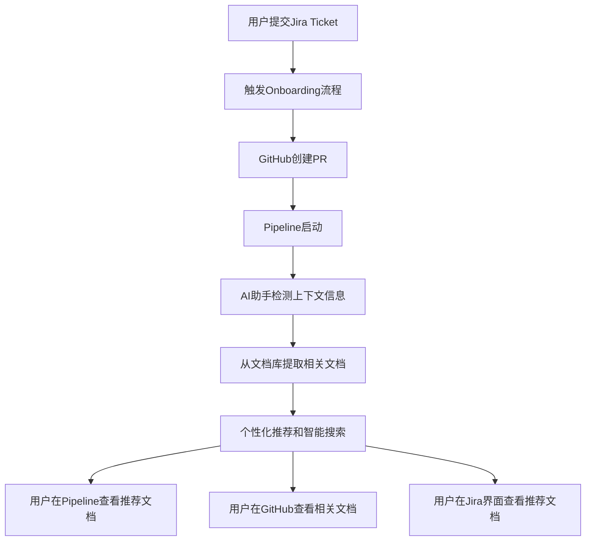
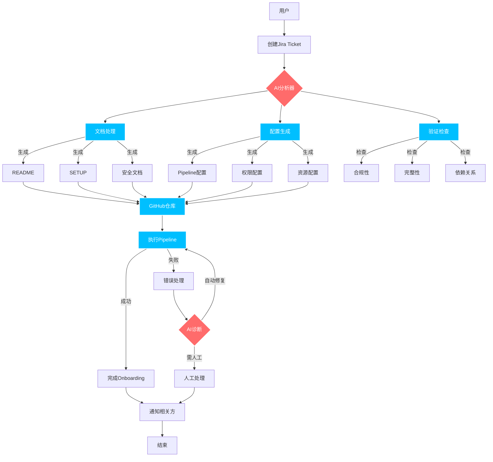

好的，为了实现Onboarding文档的智能化和简化用户体验，可以基于现有的流程和需求进一步细化以下几个方面：

### 1. **文档整理和标准化**

- **建立文档模板**：创建一套标准化的Onboarding文档模板，涵盖不同类型的API和服务接入场景。模板可以包含用户基本信息、常见问题、常见错误解决等关键节点。
- **统一文档格式**：确保所有Onboarding文档使用相同的结构和格式，使用户能够快速找到相应信息。可以包括统一的段落、标题、注意事项、代码示例等，并确保内容更新后自动同步到用户界面。
- **添加元数据标签**：为文档添加多层次元数据标签（如API类型、环境、错误类型等），以便后续的搜索和个性化推荐。元数据还能支持AI模型识别特定问题类别，从而提供更精准的帮助。

### 2. **AI助手实现**

- **集成Google Cloud AI服务**：通过集成Google Cloud Natural Language和Document AI等服务，支持文档的语义理解和自动化问答功能。这些服务可以从结构化和非结构化文本中提取关键信息，为用户提供实时解答。
- **实现文档检索和问答**：基于Google Cloud Search或Elastic Search搭建文档检索功能，结合AI模型理解用户查询意图。在用户提出特定问题时，自动从文档库中提取相关部分并进行智能回答，或直接推送文档的相关片段。
- **提供个性化推荐**：结合用户Onboarding时的任务信息（如API类型、团队角色），使用AI推荐相关文档或FAQ页面。比如，首次登录用户可以优先查看“初始设置指南”，而熟练用户则可直接跳转至“高级配置”。

### 3. **用户界面优化**

- **交互式文档导航**：在用户界面中设计交互式导航结构，便于用户按需求浏览文档。可以在Jira Ticket或GitHub PR界面嵌入可视化导航组件，引导用户到相关Onboarding文档部分，提升查找效率。
- **智能搜索功能**：提供基于AI的搜索框，支持用户输入自然语言查询（如“如何配置API X？”），并自动跳转至相关文档。结合搜索热度和用户反馈，动态调整搜索结果的优先级和相关性。
- **上下文相关推荐**：通过AI助手在Onboarding过程中跟踪用户行为，将当前任务的上下文信息（如用户环境配置、API类型）传递给推荐系统，从而动态推荐相关文档和配置指南。例如，在用户提交Jira Ticket或GitHub PR时，系统可以自动生成个性化帮助信息或提示。

### 整体实现流程

可以考虑以下流程来结合Pipeline、Jira和GitHub完成整体的Onboarding文档支持：



### **拓展思路**

1. **文档版本管理**：考虑将文档与代码版本关联，保证特定版本的文档与特定版本的API或配置一致。
2. **定期优化推荐模型**：通过分析用户使用日志和反馈，优化文档推荐和搜索模型的准确性。

我来详细展开基于Jira工单驱动的智能化Onboarding系统设计：

1. 智能工单处理系统：

```python
from jira import JIRA
from github import Github
from google.cloud import aiplatform
from google.cloud import storage
import yaml
import json

class SmartOnboardingSystem:
    def __init__(self, config):
        self.jira = JIRA(
            server=config['jira_url'],
            basic_auth=(config['jira_user'], config['jira_token'])
        )
        self.github = Github(config['github_token'])
        self.ai_platform = aiplatform.VertexAI()

    def process_onboarding_ticket(self, ticket_id):
        """处理onboarding工单"""
        ticket = self.jira.issue(ticket_id)

        # 提取工单信息
        onboarding_info = self._extract_ticket_info(ticket)

        # 生成文档和配置
        docs = self.generate_documentation(onboarding_info)
        configs = self.generate_configurations(onboarding_info)

        # 创建GitHub仓库和配置
        self.setup_github_resources(onboarding_info, docs, configs)

        # 触发Pipeline
        self.trigger_onboarding_pipeline(onboarding_info)

    def generate_documentation(self, onboarding_info):
        """基于用户信息生成定制化文档"""
        # 准备提示信息
        prompt = self._prepare_doc_prompt(onboarding_info)

        # 调用AI生成文档
        response = self.ai_platform.predict(
            endpoint="doc-generation",
            instances=[{"text": prompt}]
        )

        # 格式化文档
        return self._format_documentation(response.predictions[0])

    def _format_documentation(self, content):
        """格式化文档内容"""
        return {
            "README.md": self._generate_readme(content),
            "SETUP.md": self._generate_setup_guide(content),
            "SECURITY.md": self._generate_security_guide(content),
            "TROUBLESHOOTING.md": self._generate_troubleshooting_guide(content)
        }

    def _generate_readme(self, content):
        """生成README文件"""
        template = """
        # {project_name} Onboarding Guide

        ## Overview
        {overview}

        ## Quick Start
        {quick_start}

        ## Architecture
        {architecture}

        ## Contact
        {contact}
        """
        return template.format(**content)

    def generate_configurations(self, onboarding_info):
        """生成所需的配置文件"""
        return {
            "pipeline-config.yaml": self._generate_pipeline_config(onboarding_info),
            "security-config.yaml": self._generate_security_config(onboarding_info),
            "monitoring-config.yaml": self._generate_monitoring_config(onboarding_info)
        }

    def setup_github_resources(self, onboarding_info, docs, configs):
        """设置GitHub资源"""
        # 创建代码仓库
        repo = self._create_github_repo(onboarding_info)

        # 设置分支保护
        self._setup_branch_protection(repo)

        # 提交文档和配置
        self._commit_resources(repo, docs, configs)

        # 设置GitHub Actions
        self._setup_github_actions(repo, onboarding_info)

    def _setup_github_actions(self, repo, onboarding_info):
        """设置GitHub Actions工作流"""
        workflow = {
            "name": "Onboarding Pipeline",
            "on": {
                "push": {
                    "branches": ["main"]
                },
                "pull_request": {
                    "branches": ["main"]
                }
            },
            "jobs": {
                "onboard": {
                    "runs-on": "ubuntu-latest",
                    "steps": [
                        {
                            "name": "Checkout code",
                            "uses": "actions/checkout@v2"
                        },
                        {
                            "name": "Setup GCloud",
                            "uses": "google-github-actions/setup-gcloud@v0"
                        },
                        {
                            "name": "Run Onboarding Steps",
                            "run": "./scripts/onboard.sh"
                        }
                    ]
                }
            }
        }

        repo.create_file(
            ".github/workflows/onboarding.yml",
            "Add onboarding workflow",
            yaml.dump(workflow)
        )

    def trigger_onboarding_pipeline(self, onboarding_info):
        """触发onboarding pipeline"""
        pipeline_config = {
            "project_id": onboarding_info["project_id"],
            "pipeline_id": f"onboarding-{onboarding_info['team_id']}",
            "parameters": {
                "team_id": onboarding_info["team_id"],
                "env": onboarding_info["environment"],
                "resources": onboarding_info["resources"]
            }
        }

        # 触发Pipeline
        response = self._trigger_cloud_build(pipeline_config)

        # 更新Jira工单
        self._update_ticket_status(onboarding_info["ticket_id"], response)

class OnboardingUI:
    def __init__(self):
        self.onboarding_system = SmartOnboardingSystem(config)

    def setup_routes(self, app):
        @app.route('/api/onboarding/start', methods=['POST'])
        def start_onboarding():
            ticket_id = request.json['ticket_id']
            self.onboarding_system.process_onboarding_ticket(ticket_id)
            return jsonify({"status": "success"})

        @app.route('/api/onboarding/status/<ticket_id>', methods=['GET'])
        def get_status(ticket_id):
            status = self.onboarding_system.get_onboarding_status(ticket_id)
            return jsonify(status)

```

2. 文档管理系统增强：

```yaml
文档结构：
1. 标准化模板
   - README.md（项目概览）
   - SETUP.md（环境设置）
   - SECURITY.md（安全规范）
   - TROUBLESHOOTING.md（故障排除）

2. 元数据标签
   - team: 团队信息
   - project: 项目信息
   - environment: 环境信息
   - dependencies: 依赖服务
   - security_level: 安全级别
   - compliance: 合规要求

3. 自动化检查
   - 文档完整性检查
   - 链接有效性验证
   - 格式规范检查
```

3. 智能助手功能：

a) Jira工单智能处理

```
- 自动分类和优先级设置
- 智能字段提取
- 自动分配处理人
- SLA监控和提醒
```

b) 文档生成和管理

```
- 基于模板自动生成
- 智能内容补充
- 版本控制和追踪
- 变更通知
```

c) Pipeline集成

```
- 配置文件自动生成
- 依赖关系检查
- 环境变量管理
- 权限配置生成
```

4. 用户交互优化：

a) Web界面功能

```
- 交互式配置向导
- 实时文档预览
- 进度追踪展示
- 问题诊断界面
```

b) 通知和反馈

```
- 多渠道通知（Email/Slack）
- 进度状态更新
- 操作确认和回滚
- 用户反馈收集
```

5. 智能化建议：

a) 预测性分析

```
- 识别潜在问题
- 推荐最佳实践
- 资源使用预测
- 性能优化建议
```

b) 个性化定制

```
- 团队特定配置
- 项目类型适配
- 环境差异处理
- 安全级别调整
```

6. 持续优化机制：

a) 数据收集

```
- 用户行为分析
- 文档使用情况
- 常见问题记录
- 反馈统计
```

b) 系统优化

```
- 模型定期更新
- 文档内容优化
- 流程简化改进
- 自动化程度提升
```

建议实施步骤：

1. 第一阶段：基础建设

```
- 搭建文档管理系统
- 实现Jira集成
- 建立基础Pipeline
```

2. 第二阶段：智能化升级

```
- 集成AI服务
- 实现自动文档生成
- 添加智能检索功能
```

3. 第三阶段：优化和扩展

```
- 添加高级分析功能
- 优化用户界面
- 扩展自动化范围
```

您觉得这个设计方案是否符合您的需求？是否需要在某些方面进行调整或者深入讨论？



Intelligent Onboarding System architecture

```mindmap
  root((智能Onboarding系统))
    (入口层)
        [Jira集成]
            工单创建
            状态追踪
            自动更新
        [用户界面]
            进度展示
            配置向导
            文档预览
    (AI处理层)
        [文档处理]
            模板选择
            内容生成
            格式化
        [配置生成]
            环境配置
            权限设置
            资源分配
        [智能分析]
            需求分析
            风险评估
            依赖检查
    (执行层)
        [GitHub集成]
            仓库创建
            代码提交
            分支保护
        [Pipeline管理]
            构建流程
            部署步骤
            验证检查
    (监控层)
        [状态监控]
            进度追踪
            错误检测
            性能分析
        [通知系统]
            邮件通知
            Slack集成
            状态报告
    (优化层)
        [数据收集]
            使用统计
            错误记录
            反馈采集
        [持续改进]
            流程优化
            模型更新
            自动化提升
```
