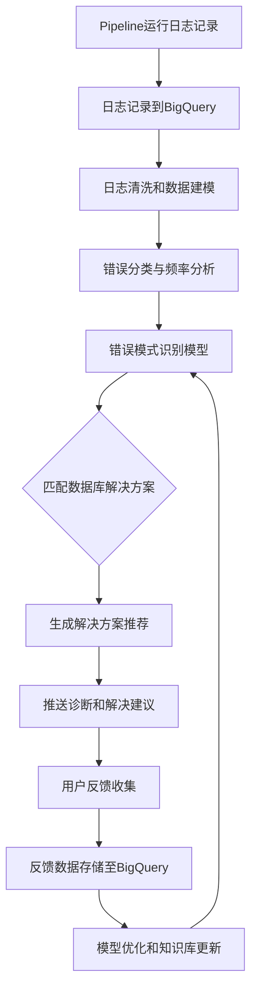
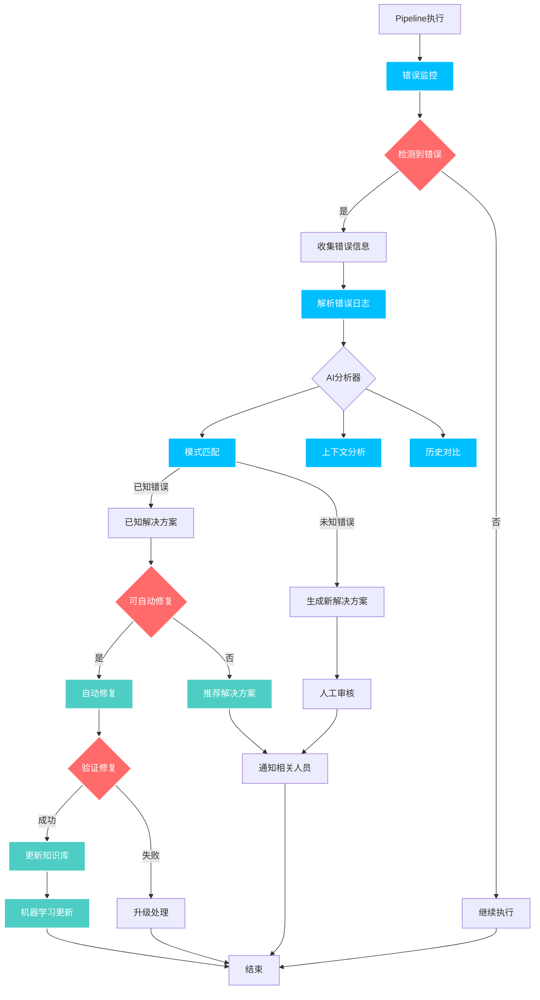
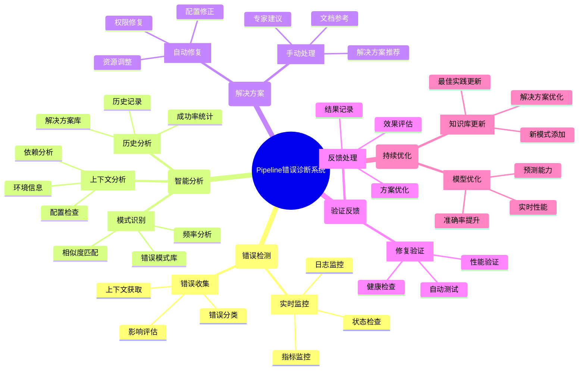

- [1. **BigQuery数据分析和清洗**](#1-bigquery数据分析和清洗)
- [2. **构建错误模式识别模型**](#2-构建错误模式识别模型)
- [3. **错误自动诊断与推荐系统的实现**](#3-错误自动诊断与推荐系统的实现)
- [4. **用户反馈和改进**](#4-用户反馈和改进)
- [实现流程图](#实现流程图)
- [技术栈建议](#技术栈建议)
- [优化效果](#优化效果)

很好！既然已经有了BigQuery中记录的Pipeline日志数据，可以基于此来构建一套数据驱动的分析和改进系统。以下是整合数据分析与错误自动诊断的一些具体实现思路：

### 1. **BigQuery数据分析和清洗**

- **数据模型构建**：在BigQuery中设计数据模型，将Pipeline日志的关键信息（如错误码、错误消息、时间戳、用户ID、任务ID、环境配置等）结构化存储。这样便于后续聚合分析和模型训练。
- **日志数据清洗**：对日志中的无用或重复数据进行清洗，并针对错误类型、发生频率、环境变量等字段进行规范化，确保数据一致性。可以利用SQL或Dataflow实现数据的清洗和预处理。
- **错误分类与频率分析**：使用BigQuery SQL聚合统计出高频错误，按错误类型、发生时间和环境等维度生成不同视角的分析报告，帮助识别关键问题。

### 2. **构建错误模式识别模型**

- **训练数据集准备**：将BigQuery中的历史错误数据导出到Vertex AI，将其作为模型训练的数据源。提取Pipeline任务上下文（如任务名称、环境、错误信息等）作为特征，标注错误类型和解决方案，以建立模型的训练集。
- **模型选择与训练**：可以选择文本分类模型（如BERT、Random Forests等）来对错误日志进行分类。模型的目标是基于错误信息自动识别错误类型，并推荐对应的解决方案。
- **定期重新训练**：随着日志数据的增加，可以定期从BigQuery中抽取新数据重新训练模型，确保它能够适应新的错误模式和解决方案。

### 3. **错误自动诊断与推荐系统的实现**

- **实时数据流分析**：将BigQuery中的实时日志流数据与错误模式识别模型对接。当检测到新的错误日志时，系统会自动分析并匹配到数据库中的错误模式，从而进行诊断。
- **解决方案推荐**：模型根据识别到的错误类型，直接从BigQuery中查找相应的解决方案记录，并推送给用户。例如，可以通过Cloud Functions或Cloud Pub/Sub触发，将诊断结果和建议推送到CICD Pipeline中。
- **自动生成数据驱动的推荐**：对于未完全匹配现有错误模式的日志，可通过聚类算法（如KMeans）在BigQuery中进行相似错误聚类，为其生成可能的解决方法，并建议相关文档。

### 4. **用户反馈和改进**

- **反馈表单嵌入与收集**：在Pipeline界面或日志中加入反馈表单，收集用户对推荐解决方案的评价。这可以包括是否解决问题、是否需要进一步支持等。
- **反馈数据回流BigQuery**：将用户的反馈结果存入BigQuery，并用于模型优化。定期分析反馈数据，识别推荐准确性较低的错误类型，进一步提升错误诊断模型的准确率。
- **动态更新知识库**：基于反馈数据和新出现的错误类型，自动更新知识库和错误模式库，并在Pipeline界面展示最新的解决方案，保持知识库的实效性和准确性。

### 实现流程图

### 技术栈建议

| 功能                   | Google Cloud 服务            | 说明                                     |
| ---------------------- | ---------------------------- | ---------------------------------------- |
| 数据清洗与建模         | BigQuery, Dataflow           | 日志清洗、错误分类，构建数据模型         |
| 实时日志分析与监控     | Stackdriver Logging, Pub/Sub | 实时采集和传递Pipeline中的日志           |
| 错误模式识别与模型训练 | Vertex AI, BERT              | 错误分析和分类模型训练                   |
| 自动解决方案推送       | Cloud Functions, Cloud Run   | 根据诊断结果生成解决方案并推送到Pipeline |
| 反馈采集和存储         | BigQuery                     | 用户反馈数据存储，定期优化推荐模型       |

### 优化效果

1. **高效识别与解决常见错误**：通过错误模式识别模型，实现快速响应和解决建议，提高错误处理效率。
2. **数据驱动的智能推荐**：利用BigQuery数据支持，确保错误分析和解决方案的准确性和实时性。
3. **反馈闭环的知识库优化**：通过用户反馈不断优化模型和知识库，为用户提供越来越精确和有效的支持。

这样，不仅实现了错误的自动化诊断和推荐，还能随着数据积累持续优化模型，为用户和SRE团队提供更加完善的支持体验。

- mindmap

