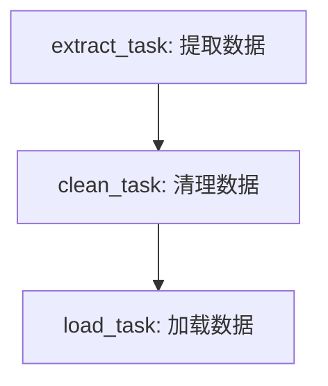

在 Airflow 中，DAG（Directed Acyclic Graph，有向无环图）是工作流的核心概念。一个 DAG 是一系列任务的有序集合，这些任务会按照特定的依赖关系执行。DAG 确保任务按照依赖顺序运行，从而实现复杂的工作流调度。

1. Airflow DAG 的核心概念

•	DAG：有向无环图，定义了一组任务以及任务之间的依赖关系。

•	Task：DAG 中的基本操作单元，可以是一个 Python 函数、Bash 脚本、SQL 查询等。

•	Operator：定义任务执行的操作，例如 PythonOperator、BashOperator 等。

•	Dependencies（依赖关系）：任务之间的依赖关系，即 Task A 需要在 Task B 之前完成，Airflow 会按照依赖顺序调度任务执行。

2. DAG 示例

以下是一个典型的 Airflow DAG 例子，表示在每日凌晨定时执行以下任务：
	1.	提取数据。

	2.	清理数据。

	3.	加载数据。

这些任务有依赖关系，需要按顺序执行。
```python
from airflow import DAG
from airflow.operators.python_operator import PythonOperator
from datetime import datetime

# 定义任务执行的函数
def extract_data():
    print("Extracting data...")

def clean_data():
    print("Cleaning data...")

def load_data():
    print("Loading data...")

# 定义 DAG
dag = DAG(
    'data_pipeline',
    description='A simple data pipeline',
    schedule_interval='0 0 * * *',  # 每日午夜执行
    start_date=datetime(2023, 11, 12),
    catchup=False
)

# 定义任务
extract_task = PythonOperator(task_id='extract', python_callable=extract_data, dag=dag)
clean_task = PythonOperator(task_id='clean', python_callable=clean_data, dag=dag)
load_task = PythonOperator(task_id='load', python_callable=load_data, dag=dag)

# 设置任务依赖关系
extract_task >> clean_task >> load_task
```
在上面的例子中：
	•	extract_task 是第一个任务，提取数据。
	•	clean_task 是第二个任务，清理数据，依赖于 extract_task 完成。
	•	load_task 是第三个任务，加载数据，依赖于 clean_task 完成。

3. 示例图示

以下是该 DAG 的可视化流程图表示：

4. Airflow DAG 的运行流程

Airflow DAG 会根据任务依赖关系依次调度和执行各任务，确保每个任务都在其依赖的任务完成后再运行。例如，上述 DAG 会先执行 extract_task，然后 clean_task，最后执行 load_task。这样可以确保数据流处理按顺序完成。
