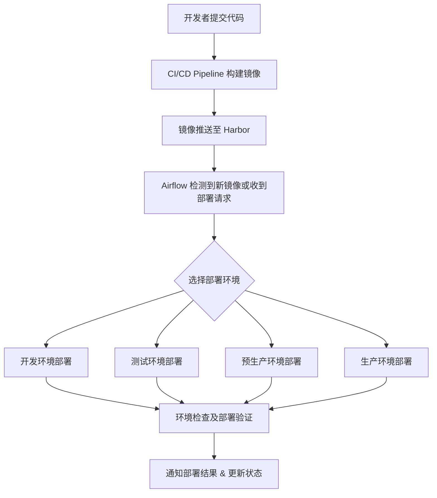

基于您的需求，Harbor + Airflow 的组合架构可以有效地实现自动化 Release 部署，支持多环境管理和版本发布。下面是一个可能的架构设计思路，以帮助您评估其可行性：

1. 架构设计思路

	•	Harbor：作为制品库（artifact registry），管理镜像的存储和发布。不同环境的部署将基于指定版本的镜像，因此 Harbor 可用于集中管理并控制各版本的镜像，同时支持镜像的扫描和签名以确保安全。
	•	Airflow：用于管理和触发部署流程的 Orchestrator。Airflow 的 DAGS（有向无环图）可以定时或基于事件触发对应的 Pipeline，支持灵活的工作流定义。
	•	CI/CD Pipeline：由 Airflow DAG 触发的实际部署管道，连接各环境的 Kubernetes 集群（GKE 或其他），实现镜像拉取、应用部署等操作。各阶段可以分为开发、测试、预生产和生产等。

2. 自动化Release部署流程

以下为基于 Harbor + Airflow 的自动化 Release 方案流程图：

3. 架构组件

|组件	|作用|
| --- | --- |
|Harbor|	镜像仓库管理，负责存储各版本镜像、扫描漏洞、管理镜像标签等。
|Airflow|	负责调度部署工作流，可以自定义 DAG 以实现多环境自动化部署。
|CI/CD |Pipeline	使用 GitLab CI、Jenkins 等工具，构建并推送镜像到 Harbor。
|Kubernetes 集群|	多环境管理，支持开发、测试、预生产和生产环境的部署。
|监控与通知|	结合 Prometheus + Grafana、Slack 或邮件通知发布状态。

4. 可行性与优缺点

可行性

	•	优势：Harbor + Airflow 组合支持稳定的镜像管理和灵活的部署调度。可以实现镜像控制、版本管理和按环境发布。Harbor 支持的安全扫描和签名功能有助于保障部署的安全性。
	•	挑战：Airflow 的调度操作需要与 Kubernetes API 交互，若多环境集群复杂，Airflow 配置将更繁琐。此外，针对不同环境的资源隔离也需关注，以确保发布不会相互影响。

优点

	•	多环境支持：支持开发、测试、预生产、生产等多环境发布，保证发布的规范性。
	•	灵活性：Airflow 方便配置和定制 DAG，使得部署流程易于扩展。
	•	安全性：Harbor 的镜像扫描和签名保障了制品的安全。

缺点

	•	复杂性：Airflow 依赖 DAG 配置和环境参数管理，可能需要额外的配置管理工具。
	•	依赖管理：需要管理 Harbor 和 Airflow 的依赖及其 HA 部署方案。

总结

此架构通过集中镜像管理和自动化工作流调度，实现多环境的高效发布。特别是对于多团队协作和频繁的版本迭代，可以提升开发部署效率。
