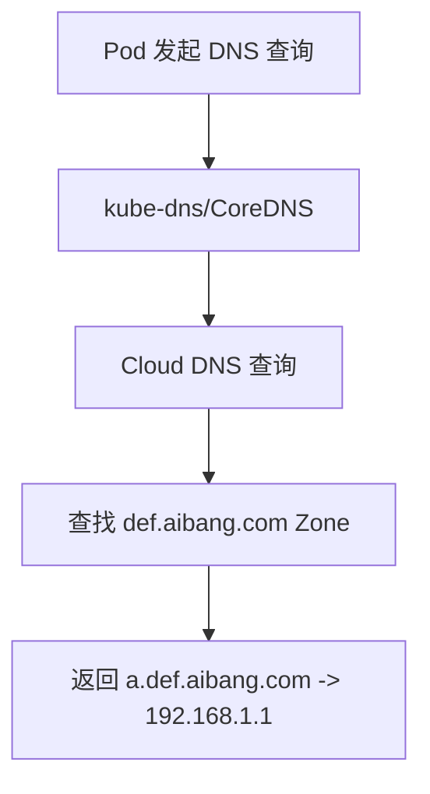
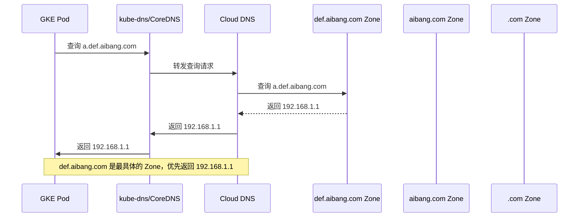
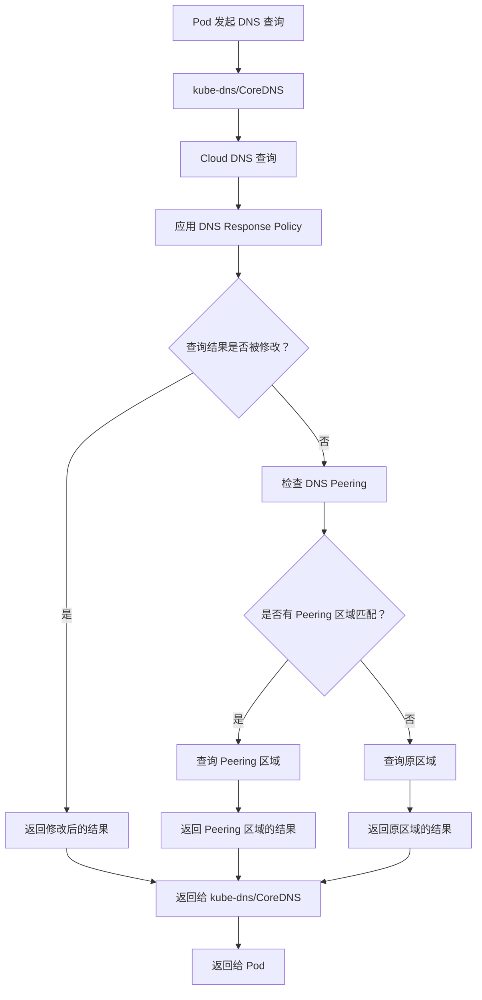

# Q

我在 Google Cloud 的 GKE 环境中使用 Cloud DNS 和 DNS Peering。我在 def.aibang.com、aibang.com 和 .com 这几个 DNS 区域里都配置了 a.def.aibang.com 的 A 记录，分别是 192.168.1.1、192.168.1.2 和 192.168.1.3。当我的 GKE Pod 查询 a.def.aibang.com 时，它会拿到哪个 IP？能否帮我详细解释这个 DNS 查询的过程，并生成一个可视化的流程图来展示这个过程?

帮我分析下DNS的工作原来,特别是针对Google工程环境里面的一些流程,比如我我的Google工程里面运行了GKE ,Instances,dns respose policy.GKE 内部我使用Cloud DNS. 也配置了DNS peering .我想了解比如从一个GKE Pod去访问一个域名的详细过程, 我想了解比如我在CLoud DNS里面配置了 一个def.aibang.com 的zone.里面配置了一条记录是 a.def.aibang.com A记录是192.168.1.1然后我还在aibang.com的zone里面配置了一条 a.def.aibang.com A记录是192.168.1.2 我还在工程的.com的zone里面配置了一条 a.def.aibang.com A记录是192.168.1.3 那么我的Pod拿到的真正记录是那个

在 Google Cloud 工程环境（GKE, Instances, Cloud DNS 等）下，DNS 的工作原理涉及多个层次，尤其是在你使用 Cloud DNS 和 DNS Peering 的环境下。以下是一个详细的 DNS 查询过程分析，结合了你提到的不同 Zone 和记录配置。

### 1. **GKE Pod 进行域名查询的过程**

当一个 GKE Pod 需要访问某个域名时，例如 `a.def.aibang.com`，以下是详细的流程：

1. **Pod 的 DNS 请求发起**  
   GKE 集群内的 Pod 通常会通过 Kubernetes 自带的 DNS 解析器（通常是 CoreDNS 或 kube-dns）发起 DNS 查询。
   - **Pod DNS 服务器** 通常会指向 GKE 内部的 kube-dns/CoreDNS 服务，这些服务充当集群的 DNS 代理。
2. **kube-dns/CoreDNS 解析流程**

   - kube-dns/CoreDNS 会根据查询的域名首先检查内部缓存，如果没有缓存命中，它会根据 Pod 的 DNS 配置，将查询转发给 Cloud DNS 或集群外部配置的 DNS 服务器。

3. **查询 Cloud DNS**
   - 假设在你的 GKE 集群内，你已经使用 Cloud DNS 服务作为主要的 DNS 解析器。
   - 当 GKE Pod 查询 `a.def.aibang.com` 时，kube-dns/CoreDNS 会将该查询转发到 Cloud DNS（通过 DNS Peering 实现的内部 DNS 连接）。
4. **Cloud DNS 的查询处理**
   在你的描述中，你配置了多个 Zone 和不同的 A 记录：

   - **Zone 1: def.aibang.com**
     - A 记录：`a.def.aibang.com -> 192.168.1.1`
   - **Zone 2: aibang.com**
     - A 记录：`a.def.aibang.com -> 192.168.1.2`
   - **Zone 3: com**
     - A 记录：`a.def.aibang.com -> 192.168.1.3`

### 2. **DNS 匹配规则**

DNS 查询的结果通常基于 DNS 解析的匹配顺序，DNS 系统会从最具体的 Zone 开始解析域名，然后逐渐泛化到更大的 Zone。如果多个 Zone 都包含相同的域名解析记录，解析器会根据最优匹配（最具体的匹配）返回结果。

在你的例子中：

- `def.aibang.com` Zone 是最具体的 Zone，定义了 `a.def.aibang.com` 的 A 记录为 `192.168.1.1`。
- `aibang.com` Zone 定义了 `a.def.aibang.com` 的 A 记录为 `192.168.1.2`。
- `com` Zone 定义了 `a.def.aibang.com` 的 A 记录为 `192.168.1.3`。

### 3. **实际解析的结果**

在 DNS 解析中，系统会选择最匹配的 Zone 进行响应，因此解析器会优先使用最具体的 Zone。

- **`def.aibang.com` Zone** 是最具体的，因为它直接包含了 `a.def.aibang.com` 的记录。因此，最终 Pod 拿到的 A 记录是 `192.168.1.1`。

除非你明确在查询中指定其他 Zone 或配置了特殊的 DNS 策略，DNS 系统总是会优先选择最具体的匹配。

### 4. **总结流程**



### 5. **影响结果的因素**

1. **DNS 缓存**  
   如果某个层级有缓存，Pod 可能会从缓存中获取到以前查询的结果。
2. **DNS Peering 和自定义 DNS 响应策略**  
   如果你配置了自定义的 DNS 响应策略（DNS Response Policy），可能会影响 Pod 的最终查询结果，比如通过策略重写或者屏蔽特定的 DNS 响应。

### 6. **如何验证结果**

你可以通过以下方法在 Pod 内验证实际解析的 DNS 记录：

```bash
nslookup a.def.aibang.com
```

或者使用 `dig` 命令检查具体的 DNS 解析路径：

```bash
dig a.def.aibang.com
```

希望这个流程帮助你理解在 Google Cloud 环境下，特别是使用 Cloud DNS 和多个 Zone 时的 DNS 解析过程。

好的，我来为你详细分析一下 Google 工程环境中 DNS 的工作原理，并结合你提到的 GKE、Instances、DNS response policy、Cloud DNS、DNS peering 等概念，深入探讨从 GKE Pod 访问域名时的详细过程。

**DNS 工作原理简述**

DNS（Domain Name System）是一种分布式的域名解析系统，它将易于记忆的域名（如 [www.google.com](https://www.google.com/url?sa=E&source=gmail&q=https://www.google.com)）转换为计算机能够理解的 IP 地址（如 216.58.217.36）。当你在浏览器中输入一个域名时，系统会向 DNS 服务器发送一个查询请求，DNS 服务器会根据配置好的域名和 IP 地址的映射关系，返回对应的 IP 地址。

**Google 工程环境中的 DNS**

- **GKE (Google Kubernetes Engine)**：Google 的托管式 Kubernetes 服务，用于部署和管理容器化应用程序。
- **Instances**：Google Compute Engine 中的虚拟机实例。
- **DNS response policy**：Cloud DNS 提供的一项功能，用于自定义 DNS 查询的响应。
- **Cloud DNS**：Google 的托管式 DNS 服务，用于管理域名和 DNS 记录。
- **DNS peering**：将两个或多个 DNS 区域连接起来，以便它们可以相互解析域名。

**GKE Pod 访问域名的详细过程**

1. **Pod 发起 DNS 查询**：当一个 GKE Pod 需要访问一个域名时，它会向本地 DNS 服务器发送一个 DNS 查询请求。
2. **本地 DNS 服务器转发请求**：本地 DNS 服务器通常会配置为转发请求到 Cloud DNS 或其他上游 DNS 服务器。
3. **Cloud DNS 处理请求**：
   - **匹配 DNS 区域**：Cloud DNS 会根据查询的域名，匹配到相应的 DNS 区域（如 [移除了无效网址] 或 aibang.com）。
   - **应用 DNS response policy**：如果配置了 DNS response policy，Cloud DNS 会根据 policy 的规则，对查询结果进行修改。
   - **返回查询结果**：Cloud DNS 会将匹配到的 IP 地址返回给本地 DNS 服务器。
4. **本地 DNS 服务器返回结果给 Pod**：本地 DNS 服务器将收到的 IP 地址返回给发起查询的 Pod。
5. **Pod 建立连接**：Pod 使用返回的 IP 地址与目标服务器建立连接。

**你的配置场景分析**

在你的配置中，你配置了多个 DNS 区域和多个 A 记录：

- **[移除了无效网址]** 区域：a.def.aibang.com -\> 192.168.1.1
- **aibang.com** 区域：a.def.aibang.com -\> 192.168.1.2
- **工程的 .com** 区域：a.def.aibang.com -\> 192.168.1.3

**Pod 拿到的真正记录**

**影响 Pod 拿到的记录的因素主要有以下几点：**

- **DNS 区域的优先级**：Cloud DNS 会按照一定的优先级顺序来匹配 DNS 区域。一般来说，越具体的域名（如 [移除了无效网址]）优先级越高。
- **DNS response policy**：如果配置了 DNS response policy，policy 中的规则会覆盖默认的匹配规则。
- **DNS peering 配置**：如果配置了 DNS peering，Cloud DNS 会根据 peering 的关系来查询其他 DNS 区域。

**通常情况下，Pod 会优先获取 [移除了无效网址] 区域中的 A 记录，也就是 192.168.1.1**。但是，如果配置了 DNS response policy，或者 DNS peering 的配置影响了查询结果，那么 Pod 获取到的记录可能会不同。

**如何确定 Pod 获取到的记录**

- **使用 dig 命令**：在 Pod 内部使用 dig 命令查询域名，可以查看 DNS 查询的详细过程和返回结果。
- **查看 Cloud DNS 日志**：查看 Cloud DNS 的日志，可以了解 DNS 查询的流量和匹配情况。
- **配置 DNS response policy**：通过配置 DNS response policy，可以人为地控制 Pod 获取到的记录。

**总结**

Google 工程环境中的 DNS 配置非常灵活，可以通过多种方式来控制域名解析的结果。要准确地确定 Pod 获取到的记录，需要综合考虑 DNS 区域的优先级、DNS response policy 的配置、DNS peering 的配置等因素。

**希望这个分析能帮助你更好地理解 Google 工程环境中的 DNS 工作原理。如果你还有其他问题，欢迎随时提出。**

**以下是一些可以进一步探讨的问题：**

- **DNS response policy 的高级用法**
- **DNS peering 的最佳实践**
- **如何优化 DNS 查询性能**
- **DNSSEC 的配置和作用**

**请根据你的具体需求提出问题，我将竭诚为你解答。**

为了帮助你可视化 GKE Pod 从 DNS 查询域名到获得解析结果的过程，我将使用 `sequenceDiagram` 来表示整个流程，包括 Cloud DNS 和 DNS 区域的优先级。



### 流程说明

1. Pod 发起查询请求 `a.def.aibang.com`，通过 GKE 内部的 kube-dns/CoreDNS。
2. kube-dns/CoreDNS 转发请求到 Cloud DNS。
3. Cloud DNS 首先查询最具体的 DNS 区域，即 `def.aibang.com`，并匹配到 `a.def.aibang.com` 的 A 记录。
4. `def.aibang.com` 区域返回 `192.168.1.1`，这是最优先的结果。
5. Pod 最终拿到的记录是 `192.168.1.1`。

这种方式清晰展示了 DNS 查询的整个过程，包括多个 DNS 区域以及解析优先级。如果配置了 DNS response policy 或者 peering，流程可能会有所不同。

如果你想进一步扩大问题范围，覆盖 `DNS Peering` 和 `DNS Response Policy`，并希望通过一个 `graph TD` 图来直观地了解 GKE Pod 解析域名的过程，你可以提问如下：

---

**扩展问题：**

"我在 Google Cloud 的 GKE 环境中使用 Cloud DNS、DNS Peering 和 DNS Response Policy。我想了解当我的 GKE Pod 解析一个域名时，整个 DNS 查询的详细过程，尤其是如何处理 DNS Peering 和 DNS Response Policy。你能否帮我生成一个 `graph TD` 图，直观展示从 Pod 发起 DNS 请求到最终解析出 IP 的完整过程?"

---

根据这个问题，我们可以生成以下 `graph TD` 流程图，展示 DNS Peering 和 DNS Response Policy 在域名解析过程中的作用：



### 说明

1. **Pod 发起查询**：Pod 通过 `kube-dns/CoreDNS` 发起 DNS 查询。
2. **Cloud DNS 查询**：请求转发到 Cloud DNS。
3. **应用 DNS Response Policy**：首先检查是否有 DNS Response Policy，影响查询结果。
   - 如果有 Policy，并且修改了查询结果，返回修改后的 IP。
   - 如果没有修改，继续后续的处理。
4. **检查 DNS Peering**：检查是否有 DNS Peering 配置，能够查询到其他 Peering 区域的 DNS 记录。
   - 如果有 Peering，查询 Peering 区域，返回结果。
   - 如果没有 Peering，查询原始的 DNS 区域，返回结果。
5. **返回结果**：将最终的解析结果返回给 `kube-dns/CoreDNS`，然后返回给 Pod。

这个流程图直观展示了 GKE Pod 在使用 Cloud DNS、DNS Peering 和 DNS Response Policy 时的查询流程。
