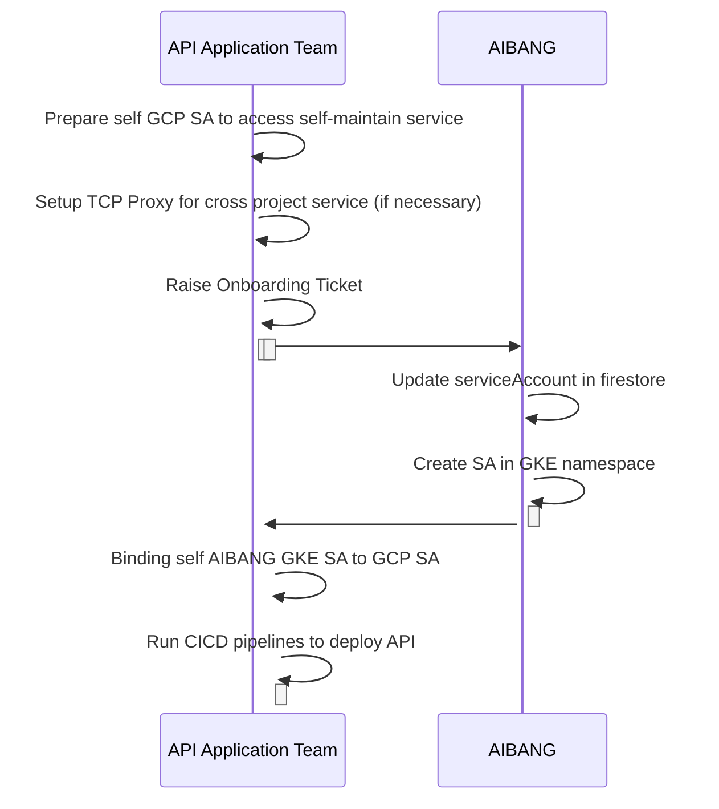
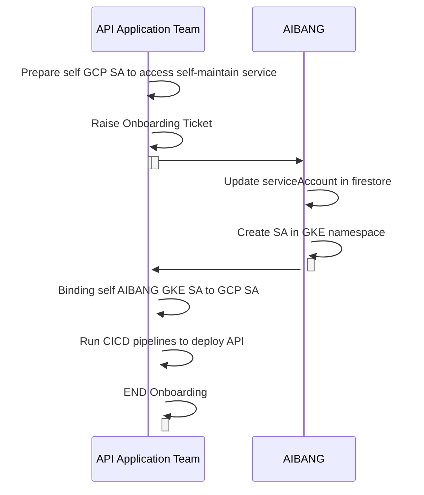

```mermaid
sequenceDiagram
    participant API Application Team
    participant AIBANG
    
    API Application Team->>+API Application Team: Prepare self GCP SA to access self-maintain service
    API Application Team->>+API Application Team: Setup TCP Proxy for cross project service (if necessary)
    API Application Team->>+API Application Team: Raise Onboarding Ticket
    activate API Application Team
    API Application Team->>-AIBANG: 
    deactivate API Application Team
    activate AIBANG
    AIBANG->>+AIBANG: Update serviceAccount in firestore
    AIBANG->>+AIBANG: Create SA in GKE namespace
    deactivate AIBANG
    AIBANG->>+API Application Team: 
    activate API Application Team
    API Application Team->>+API Application Team: Binding self AIBANG GKE SA to GCP SA
    API Application Team->>+API Application Team: Run CICD pipelines to deploy API
    deactivate API Application Team
```

```mermaid
sequenceDiagram
    participant API Application Team
    participant AIBANG
    
    API Application Team->>+API Application Team: Prepare self GCP SA to access self-maintain service
    API Application Team->>+API Application Team: Raise Onboarding Ticket
    activate API Application Team
    API Application Team->>-AIBANG: 
    deactivate API Application Team
    activate AIBANG
    AIBANG->>+AIBANG: Update serviceAccount in firestore
    AIBANG->>+AIBANG: Create SA in GKE namespace
    deactivate AIBANG
    AIBANG->>+API Application Team: 
    activate API Application Team
    API Application Team->>+API Application Team: Binding self AIBANG GKE SA to GCP SA
    API Application Team->>+API Application Team: Run CICD pipelines to deploy API
    API Application Team->>+API Application Team: END Onboarding
    deactivate API Application Team
```

