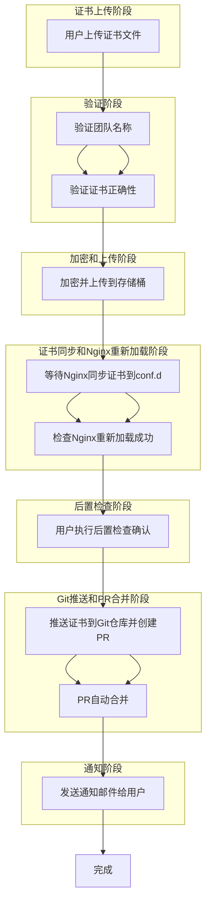

要设计一个自动化的证书更新管道（pipeline），包括以下详细步骤：

1. **证书文件上传**：
   - 用户上传新的证书文件。

2. **验证团队名称**：
   - 验证上传证书文件的团队名称。

3. **验证证书正确性**：
   - 对上传的证书进行正确性验证。

4. **加密和上传到存储桶**：
   - 加密证书文件并上传到指定的存储桶（buckets）。

5. **等待Nginx同步存储桶中的证书到Nginx配置文件夹**：
   - Nginx从存储桶中同步新证书到配置文件夹（conf.d）。

6. **检查Nginx重新加载成功**：
   - 确认Nginx重新加载配置文件成功。

7. **用户执行后置检查确认**：
   - 用户确认证书更新后的服务状态。

8. **将证书推送到Git仓库并创建PR**：
   - 将更新后的证书推送到Git仓库并创建拉取请求（PR）。

9. **PR自动合并**：
   - 配置PR自动合并策略。

10. **发送通知邮件给用户**：
    - 向用户发送证书更新完成的通知邮件。

11. **完成**：
    - 整个流程完成。

### 对应的流程图（Mermaid格式）

以上是一个完整的证书更新流程管道的设计细节和对应的流程图。每个步骤都对应一个具体的操作，确保证书能够顺利更新并应用到系统中。