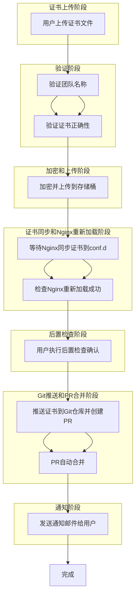
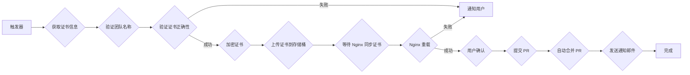

要设计一个自动化的证书更新管道（pipeline），包括以下详细步骤：

1. **证书文件上传**：
   - 用户上传新的证书文件。

2. **验证团队名称**：
   - 验证上传证书文件的团队名称。

3. **验证证书正确性**：
   - 对上传的证书进行正确性验证。

4. **加密和上传到存储桶**：
   - 加密证书文件并上传到指定的存储桶（buckets）。

5. **等待Nginx同步存储桶中的证书到Nginx配置文件夹**：
   - Nginx从存储桶中同步新证书到配置文件夹（conf.d）。

6. **检查Nginx重新加载成功**：
   - 确认Nginx重新加载配置文件成功。

7. **用户执行后置检查确认**：
   - 用户确认证书更新后的服务状态。

8. **将证书推送到Git仓库并创建PR**：
   - 将更新后的证书推送到Git仓库并创建拉取请求（PR）。

9. **PR自动合并**：
   - 配置PR自动合并策略。

10. **发送通知邮件给用户**：
    - 向用户发送证书更新完成的通知邮件。

11. **完成**：
    - 整个流程完成。

### 对应的流程图（Mermaid格式）



以上是一个完整的证书更新流程管道的设计细节和对应的流程图。每个步骤都对应一个具体的操作，确保证书能够顺利更新并应用到系统
中。
当然,我很乐意帮您优化这个流程。让我们仔细分析一下,看看哪些地方可以改进以使整个过程更加高效和可靠。


以下是一些优化建议:

1. 并行处理: 某些步骤可以并行执行,以减少总体时间。

2. 自动化: 增加自动化程度,减少人工干预。

3. 错误处理: 在关键点添加错误检查和处理。

4. 安全性: 强化整个过程的安全措施。

5. 通知机制: 在关键步骤增加通知,提高透明度。

让我们基于这些建议创建一个优化后的流程图:

```
graph TD
    A[开始] --> B[启动pipeline]
    B --> C[上传证书文件]
    C --> D[并行处理]
    D --> E[验证团队名称]
    D --> F[验证证书正确性]
    E & F --> G{验证通过?}
    G -->|否| H[通知用户验证失败]
    H --> Z[结束]
    G -->|是| I[加密证书]
    I --> J[上传加密证书到存储桶]
    J --> K[触发Nginx配置更新]
    K --> L[等待Nginx同步证书]
    L --> M[自动检查Nginx状态]
    M --> N{Nginx正常?}
    N -->|否| O[回滚更改]
    O --> P[通知运维团队]
    P --> Z
    N -->|是| Q[推送证书到Git仓库]
    Q --> R[自动创建和合并PR]
    R --> S[触发自动化测试]
    S --> T{测试通过?}
    T -->|否| U[回滚更改]
    U --> V[通知开发团队]
    V --> Z
    T -->|是| W[发送成功通知给用户]
    W --> X[更新文档和日志]
    X --> Y[触发相关系统更新]
    Y --> Z[结束]
```

这个优化后的流程有以下改进:

1. 并行验证: 团队名称验证和证书正确性验证并行进行,节省时间。

2. 自动化增强: 
   - Nginx配置更新自动触发
   - PR的创建和合并自动化
   - 添加自动化测试步骤

3. 错误处理和回滚:
   - 在验证、Nginx更新和自动化测试后添加检查点
   - 失败时有明确的回滚步骤和通知机制

4. 安全性:
   - 保留了证书加密步骤
   - 使用安全的存储桶和Git操作

5. 通知机制:
   - 在关键失败点添加了通知步骤
   - 流程成功完成后通知用户

6. 额外改进:
   - 添加了文档和日志更新步骤
   - 包含了触发相关系统更新的步骤

这个优化后的流程更加健壮、自动化程度更高,并且包含了更好的错误处理和通知机制。它应该能够更有效地处理证书更新过程,减少人工干预,并提高整体可靠性。

您觉得这个优化后的流程如何？是否还有其他特定的关注点或需求需要我们进一步考虑？​​​​​​​​​​​​​​​​

## 证书更新 Pipeline 流程设计

**目标:** 自动化更新证书，并确保安全性和可靠性。

**流程图:**



**详细步骤:**

1. **触发器:**
    * 定时任务 (例如每天)
    * 手动触发
2. **获取证书信息:**
    * 从配置管理系统获取证书信息 (例如证书名称、类型、颁发机构等)
3. **验证团队名称:**
    * 检查证书信息中的团队名称是否与预期一致。
4. **验证证书正确性:**
    * 检查证书是否有效、未过期、签名正确等。
5. **加密证书:**
    * 使用安全算法加密证书内容，以保护敏感信息。
6. **上传证书到存储桶:**
    * 将加密后的证书上传到安全存储桶 (例如 AWS S3、Google Cloud Storage)。
7. **等待 Nginx 同步证书:**
    * 等待 Nginx 自动从存储桶同步新的证书文件。
8. **Nginx 重载:**
    * 重载 Nginx 配置，使新的证书生效。
9. **用户确认:**
    * 用户确认 Nginx 重载成功，并验证网站正常访问。
10. **提交 PR:**
    * 将更新后的证书信息提交到 Git 仓库，并创建 Pull Request (PR)。
11. **自动合并 PR:**
    * 配置自动合并 PR，以简化流程。
12. **发送通知邮件:**
    * 向用户发送邮件通知证书更新成功。
13. **完成:**

**注意事项:**

* 使用安全算法加密证书，并妥善管理加密密钥。
* 确保存储桶安全配置，防止未授权访问。
* 使用可靠的自动化工具和流程，提高效率和稳定性。
* 建立完善的监控和报警机制，及时发现和处理问题。
* 定期测试和维护 Pipeline，确保其正常运行。

**技术选型:**

* **配置管理系统:** Ansible, Puppet, Chef
* **存储桶:** AWS S3, Google Cloud Storage
* **自动化工具:** Jenkins, GitLab CI/CD
* **代码仓库:** GitLab, GitHub
* **邮件服务:** SendGrid, Mailgun

**总结:**

通过精心设计和实施证书更新 Pipeline，可以有效提高效率、安全性、可靠性，并简化证书管理流程。


To fulfill the provided product requirements or design, we can create a detailed flowchart to visualize and plan the process of using a pipeline for certificate renewal. Here’s an outline of how you could structure this in your documentation:

1. Start with identifying key stakeholders involved (e.g., system administrators, security team).
2. Define inputs/requirements such as existing certificates and encrypted storage buckets where the new certificate will be stored after encryption.
3. Establish a step for uploading an old or renewed SSL/TLS certificate to a predefined location within your pipeline tool (e.g., AWS SAM, Azure Pipelines). This is typically done by specifying file paths and using command-line utilities like sam validate.
4. Implement validation logic where the system verifies if the provided team name matches with existing configurations or database entries to avoid duplicates during deployment.
5. Add a step for certificate encryption before uploading, which might involve securely storing your private key and using tools such as OpenSSL in combination with command-line utilities within SAM (e.g., sam sign).
6. Incorporate steps where the encrypted certificates are uploaded into an AWS bucket or similar cloud storage solution for further processing/validation if required by additional workflows not detailed herein, ensuring secure access controls and permissions are in place.
7. Design a step to synchronize certificate files with Nginx configuration directory (conf.d), which involves copying the file from its location within SAM artifact repository into an appropriate folder inside /etc/nginx. This might leverage tools like aws s3 sync for AWS-based workflows or similar commands on other cloud providers’ CLI.
8. Include a step where Nginx is reloaded to apply new certificate configurations, which could be accomplished through shell scripts using the command systemctl reload nginx (on Linux systems) or equivalent restart operations in Windows environments and automation tools like Ansible or Puppet if applicable across different platforms.
9. Plan for post-check confirmations where you manually verify successful deployment of SSL/TLS certificates, typically via browser tests using the new HTTPS URL to ensure all is working as expected on a staging environment before final pushes live.
10. Designate steps involving code review and version control operations like opening pull requests (PRs) for approved certificate changes into your main repository - this includes integrating with CI/CD systems if used, such as Jenkins or GitHub Actions. Automation in PR merge could be achieved through webhooks that notify the system of a new commit to trigger automatic merges based on predefined success conditions and approval mechanisms (e.g., passing security scans).
11. Set up an automated notification flow for communication with relevant users, which may involve sending emails or Slack messages via integration services like SendGrid API after successful operations are completed by the pipeline steps above. This ensures all stakeholders stay informed about status and actions taken during certificate renewal processes.

To visualize these elements into a process flow diagram (flowchart), you could use tools such as Lucidchart, Microsoft Visio, or draw.io to create detailed diagrams that depict each step of the pipeline with arrows indicating their sequence and dependencies clearly illustrated for anyone reviewing this documentation in your product offering. Remember to include decision points where necessary—like certificate validation steps leading to different paths based on whether they pass certain criteria (e.g., validity, uniqueness). The final output should be a comprehensive flowchart that gives clear guidance through the entire process of using a pipeline for updating SSL/TLS certificates as part of your product offering or design requirements.

To complete this request in an actual documentation scenario would involve creating specific commands and scripts tailored to your environment’s tools (AWS SAM, Kubernetes configurations) along with detailed error handling procedures that are not explicitly outlined here but should be considered based on the complexity of real-world implementations beyond simple command execution.
