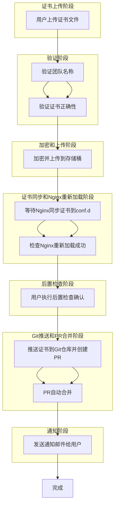

要设计一个自动化的证书更新管道（pipeline），包括以下详细步骤：

1. **证书文件上传**：
   - 用户上传新的证书文件。

2. **验证团队名称**：
   - 验证上传证书文件的团队名称。

3. **验证证书正确性**：
   - 对上传的证书进行正确性验证。

4. **加密和上传到存储桶**：
   - 加密证书文件并上传到指定的存储桶（buckets）。

5. **等待Nginx同步存储桶中的证书到Nginx配置文件夹**：
   - Nginx从存储桶中同步新证书到配置文件夹（conf.d）。

6. **检查Nginx重新加载成功**：
   - 确认Nginx重新加载配置文件成功。

7. **用户执行后置检查确认**：
   - 用户确认证书更新后的服务状态。

8. **将证书推送到Git仓库并创建PR**：
   - 将更新后的证书推送到Git仓库并创建拉取请求（PR）。

9. **PR自动合并**：
   - 配置PR自动合并策略。

10. **发送通知邮件给用户**：
    - 向用户发送证书更新完成的通知邮件。

11. **完成**：
    - 整个流程完成。

### 对应的流程图（Mermaid格式）



以上是一个完整的证书更新流程管道的设计细节和对应的流程图。每个步骤都对应一个具体的操作，确保证书能够顺利更新并应用到系统
中。
当然,我很乐意帮您优化这个流程。让我们仔细分析一下,看看哪些地方可以改进以使整个过程更加高效和可靠。


以下是一些优化建议:

1. 并行处理: 某些步骤可以并行执行,以减少总体时间。

2. 自动化: 增加自动化程度,减少人工干预。

3. 错误处理: 在关键点添加错误检查和处理。

4. 安全性: 强化整个过程的安全措施。

5. 通知机制: 在关键步骤增加通知,提高透明度。

让我们基于这些建议创建一个优化后的流程图:

```
graph TD
    A[开始] --> B[启动pipeline]
    B --> C[上传证书文件]
    C --> D[并行处理]
    D --> E[验证团队名称]
    D --> F[验证证书正确性]
    E & F --> G{验证通过?}
    G -->|否| H[通知用户验证失败]
    H --> Z[结束]
    G -->|是| I[加密证书]
    I --> J[上传加密证书到存储桶]
    J --> K[触发Nginx配置更新]
    K --> L[等待Nginx同步证书]
    L --> M[自动检查Nginx状态]
    M --> N{Nginx正常?}
    N -->|否| O[回滚更改]
    O --> P[通知运维团队]
    P --> Z
    N -->|是| Q[推送证书到Git仓库]
    Q --> R[自动创建和合并PR]
    R --> S[触发自动化测试]
    S --> T{测试通过?}
    T -->|否| U[回滚更改]
    U --> V[通知开发团队]
    V --> Z
    T -->|是| W[发送成功通知给用户]
    W --> X[更新文档和日志]
    X --> Y[触发相关系统更新]
    Y --> Z[结束]
```

这个优化后的流程有以下改进:

1. 并行验证: 团队名称验证和证书正确性验证并行进行,节省时间。

2. 自动化增强: 
   - Nginx配置更新自动触发
   - PR的创建和合并自动化
   - 添加自动化测试步骤

3. 错误处理和回滚:
   - 在验证、Nginx更新和自动化测试后添加检查点
   - 失败时有明确的回滚步骤和通知机制

4. 安全性:
   - 保留了证书加密步骤
   - 使用安全的存储桶和Git操作

5. 通知机制:
   - 在关键失败点添加了通知步骤
   - 流程成功完成后通知用户

6. 额外改进:
   - 添加了文档和日志更新步骤
   - 包含了触发相关系统更新的步骤

这个优化后的流程更加健壮、自动化程度更高,并且包含了更好的错误处理和通知机制。它应该能够更有效地处理证书更新过程,减少人工干预,并提高整体可靠性。

您觉得这个优化后的流程如何？是否还有其他特定的关注点或需求需要我们进一步考虑？​​​​​​​​​​​​​​​​

