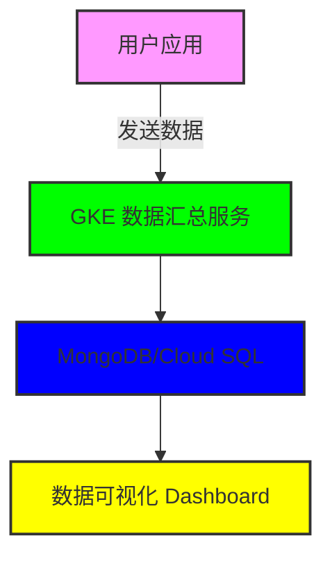

以下是关于自定义 APPD（Application Performance Data）汇总功能的 PPT 展示内容大纲，旨在向用户介绍这个功能及其在 GCP 上的实现流程。

首页

• 标题：自定义 APPD 数据汇总到用户的 Tier Name 和 Tier Node
• 子标题：提升数据监控与分析能力

幻灯片 1: 什么是 APPD？

• 定义：应用性能监控（APM）工具，用于跟踪和分析应用性能。
• 目的：实时监控应用状态，识别瓶颈，优化性能。

幻灯片 2: 自定义 APPD 汇总的功能

• 数据汇总与可视化：
	• 用户可以自定义数据汇总到自己的 Tier Name 和 Tier Node。
• 多维度监控：
	• 支持按不同指标、时间范围和自定义条件进行监控和分析。
• 用户主控：
	• 给予用户完全的控制权和灵活性，允许他们定义需要监控的特定数据。

幻灯片 3: 自定义 APPD 汇总的好处

• 提高决策能力：实时获得关键性能指标（KPI），快速做出数据驱动的决策。
• 优化用户体验：通过监控应用性能，及时发现并解决问题。
• 灵活性与可扩展性：适应用户特定需求，随时调整监控策略。

幻灯片 4: 在 GKE 中实现自定义 APPD 汇总

• 步骤 1：定义 Tier Name 和 Tier Node
	• 用户确定汇总数据的逻辑层次和节点。
• 步骤 2：数据源连接
	• 从应用程序向 GKE 中的汇总服务发送性能数据。
• 步骤 3：数据处理与存储
	• 使用 Kubernetes 组件聚合数据，并存储在数据库中进行后续分析。
• 步骤 4：数据可视化与分析
	• 提供 API 或界面，允许用户查看和分析汇总数据。

幻灯片 5: 示例架构图


幻灯片 6: 示例代码
```python
• 数据发送示例（Python）：
import requests

def send_data(tier_name, tier_node, performance_data):
    endpoint = "http://your-gke-service-endpoint/api/metrics"
    payload = {
        "tier_name": tier_name,
        "tier_node": tier_node,
        "data": performance_data
    }
    response = requests.post(endpoint, json=payload)
    return response.status_code
```

幻灯片 7: 结论

• 自定义 APPD 数据汇总功能为用户提供了更灵活的性能监控解决方案。
• 通过简单的集成步骤，用户能够自定义监控策略。

幻灯片 8: Q&A

• 感谢大家的聆听，欢迎提问！

以上就是关于自定义 APPD 数据汇总的 PPT 内容大纲。可以进一步根据具体需求增加细节、图示和示例代码，使内容更具吸引力与可读性。确保每张幻灯片简洁明了，以便更好地传达信息。
