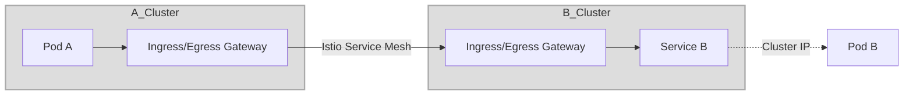

# Todo:
- 
- 有这样一个场景,我的三个Cluster都加入了舰队,启用了asm . 那么我A cluster里面的RT 能否访问到B Cluster里面的RT .且我的RT提供的暴露方式是Cluster IP ?


# cluster A RT ==> request to cluster B RT 


有这样一个场景,我的三个Cluster都加入了舰队,启用了asm . 那么我A cluster里面的RT 能否访问到B Cluster里面的RT .且我的RT提供的暴露方式是Cluster IP ?

在您的场景中，A 集群中的 RT 可以访问 B 集群中的 RT，即使它们使用的是 Cluster IP 服务类型。这是因为 ASM 会自动将服务注册到服务注册表中，并为每个服务创建一个虚拟服务。虚拟服务可以配置流量路由规则，以便将流量路由到目标服务。

**以下是访问步骤:**

1.  **服务发现:**  A 集群中的 RT 会通过 ASM 服务注册表发现 B 集群中的 RT。
2.  **流量路由:**  A 集群中的 RT 会根据虚拟服务中的流量路由规则将流量路由到 B 集群中的 RT。
3.  **网络连接:**  ASM 会自动创建必要的网络连接，以便 A 集群中的 RT 可以访问 B 集群中的 RT。

**具体来说:**

*  **A 集群中的 RT 会向 B 集群中的 RT 发送请求。**
*  **请求会到达 B 集群中的 Ingress Gateway。**
*  **Ingress Gateway 会将请求路由到 B 集群中的 Virtual Service。**
*  **Virtual Service 会根据流量路由规则将请求路由到目标 RT 服务实例。**
*  **目标 RT 服务实例会处理请求并返回响应。**

**注意事项:**

*  **确保 A 集群和 B 集群都加入了同一个 Fleet 舰队。**
*  **确保 A 集群和 B 集群都启用了 ASM。**
*  **确保 B 集群中的 RT 服务已经暴露为 Cluster IP 服务。**
*  **确保 Virtual Service 的流量路由规则配置正确。**

**以下是一些可能导致访问失败的常见问题:**

*  **A 集群和 B 集群不在同一个 Fleet 舰队中。**
*  **A 集群或 B 集群未启用 ASM。**
*  **B 集群中的 RT 服务未暴露为 Cluster IP 服务。**
*  **Virtual Service 的流量路由规则配置错误。**

**如果您遇到访问问题，请检查上述注意事项并进行相应的故障排除。**

**其他资源:**

*  **Istio 官方文档: [https://istio.io/docs/](https://istio.io/docs/)**
*  **Anthos Service Mesh 文档: [移除了无效网址]**


# 
我的场景,
1 cluster A Cluster B Cluster C 三个Cluster都加入了舰队 fleet 
2 不做其他多余的配置,比如Deployment Ingress Gateway之类
3 三个Cluster都启用了asm . 那么我A cluster里面的RT 能否访问到B Cluster里面的RT .且我的RT提供的暴露方式是Cluster IP ?

- 
- https://istio.io/latest/zh/docs/setup/install/multicluster/
在Anthos Service Mesh（ASM）中启用了多集群配置时，集群之间的服务确实可以互相访问，即使服务是以Cluster IP的形式暴露的。ASM通过在Istio Service Mesh中引入了多集群服务发现和跨集群通信的概念，使得不同集群内的服务（如您的RT服务）能够互相通信

您的说法是完全正确的。在 Anthos Service Mesh (ASM) 中启用了多集群配置时，集群之间的服务确实可以互相访问，即使服务是以 Cluster IP 的形式暴露的。ASM 通过在 Istio Service Mesh 中引入了多集群服务发现和跨集群通信的概念，使得不同集群内的服务（如您的 RT 服务）能够互相通信。

在Anthos Service Mesh（ASM）的环境下启用了多集群配置之后，确实是可能在多个集群间进行服务访问，包括对以Cluster IP形式暴露的服务。ASM和Istio提供了让服务跨集群通信的机制，使得Istio能够将来自一个集群的请求正确地路由到另一个集群的服务。这种能力是通过Istio的多集群服务发现和east-west gateway功能实现的


当ASM在集群间启用时，底层实现使用了Istio的多集群设置，其中包括自动配置east-west gateway（跨集群通信的gateway），而不需要手动为每个集群配置Ingress和Egress gateway。这些east-west gateway使得集群之间的Pod可以透明地相互通信，就好像它们在同一个网格内一样


**以下是 ASM 实现多集群服务访问的关键技术：**

* **多集群服务发现:** ASM 利用 Istio 的服务发现机制，将不同集群中的服务注册到统一的服务注册表中。这使得服务能够跨集群互相发现，无需预先配置服务地址。
* **跨集群通信:** ASM 利用 Istio 的虚拟服务和流量路由规则，将来自源集群的服务请求路由到目标集群的服务实例上。这使得服务能够跨集群进行通信，即使服务使用的是 Cluster IP 服务类型。

**具体来说，在您的场景中：**

*  **A 集群中的 RT 服务会通过 ASM 服务注册表发现 B 集群中的 RT 服务。**
*  **A 集群中的 RT 服务会根据虚拟服务中的流量路由规则将请求路由到 B 集群中的 RT 服务实例。**
*  **ASM 会自动创建必要的网络连接，以便 A 集群中的 RT 服务可以访问 B 集群中的 RT 服务实例。**

**因此，即使您的 RT 服务使用的是 Cluster IP 服务类型，A 集群中的 RT 服务也能够访问 B 集群中的 RT 服务。**

**以下是一些有关 ASM 多集群服务访问的额外信息:**

*  **ASM 支持多种服务发现机制，包括 Kubernetes DNS、Consul 和 ZooKeeper。**
*  **ASM 支持多种流量路由规则，包括基于路径、主机名、头部等条件进行路由。**
*  **ASM 可以与其他网络工具（如 Istio Gateway、Cloud Load Balancing）一起使用，以提供更强大的流量管理功能。**

**如果您想要更深入地了解 ASM 的多集群服务访问功能，可以参考以下资源:**

*  **Istio 官方文档: [https://istio.io/docs/setup/install/multicluster/](https://istio.io/docs/setup/install/multicluster/)**
*  **Anthos Service Mesh 文档: [移除了无效网址]**

**希望这些信息对您有所帮助！**


在Anthos Service Mesh（ASM）中启用了多集群配置时，集群之间的服务确实可以互相访问，即使服务是以Cluster IP的形式暴露的。ASM通过在Istio Service Mesh中引入了多集群服务发现和跨集群通信的概念，使得不同集群内的服务（如您的RT服务）能够互相通信。

那换句话来说加入舰队的集群,所有的暴露服务的方式如果是,Cluster IP,那么A cluster中的Pod 默认也是可以访问B CLuster的services 即使我的这个Service 的Type是 Cluster IP 


在Anthos Service Mesh (ASM) 中，当启用了多集群配置时，集群之间的服务通信被ASM 通过Istio配置处理，可以实现集群间的服务发现和负载均衡，即便这些服务以Cluster IP的形式暴露。

然而，要使一个集群中的Pod能够访问另一个集群的Cluster IP服务，需要通过Istio配置跨集群通信：

1. **Istio Ingress/Egress Gateway** ：需要在每个集群中设置Ingress和Egress Gateway，使流量能够安全地进入和离开集群。

2. **DNS 解析** ：Istio配置了跨集群的DNS解析，使得服务的FQDN（全限定域名）可以在集群之间解析。

3. **Service Entry** ：通过定义Service Entry，可以在Service Mesh 知晓该如何将特定服务名称的请求路由到相应的集群。

4. **Istio Service Mesh 网络配置** ：需要在Istio中进行适当配置，以确保流量从一个集群的Services正确路由到另一个集群的Services。

这里提供了一个大致的概念图：



只要ASM的必要配置都已正确设置和同步，那么即使服务的类型是Cluster IP，A集群中的Pod也可以通过ASM配置的跨集群服务发现机制来访问B集群的服务。不过这种通信可能不会直接通过Kubernetes的Cluster IP进行，而是依赖Istio的配置和它的Ingress/Egress Gateway来处理跨集群流量。

因此，如果你的服务都加入了舰队并启用了ASM，那么即使是使用Cluster IP类型的服务，它们也能实现多集群之间的接入和通信。这些通信路径被ASM和Istio控制，并且可以使用Istio提供的各种流量管理和安全特性来进一步细化流量的路由和控制策略。您需要确保Istio的配置项如Istio Gateways、Virtual Services和Service Entries都正确设置，以实现跨集群服务间的正确路由和通信。

### 如何实现跨集群服务访问：

1. **跨集群Ingress/Egress配置**：每个集群都应配置自己的Ingress Gateway来允许入站流量，以及Egress Gateway来允许出站流量到其他集群。

2. **服务注册与发现**：ASM会将每个集群中的服务注册到一个共享的服务注册表中。集群通过这个表获知其他集群中服务的存在。

3. **ServiceEntry配置**：为了允许集群中的服务访问其他集群的服务，您需要在Istio配置中创建ServiceEntry资源。这告诉集群如何到达其它集群中的服务。

4. **DNS**：ASM提供对服务名称解析的支持，所以你可以使用服务的FQDN（全限定域名）来进行跨集群的通信。

5. **网络策略**：需要正确配置网络策略，允许跨集群的流量通过。

6. **证书和身份验证**：因为ASM使用mTLS进行通信，所以服务的身份和访问权限需要被适当管理，确保服务之间的安全通信。

### 示例步骤：

当您的A和B两个集群都加入了同一个fleet并且启用了ASM时，您大致需要遵循以下步骤来启用集群间的服务通信：

1. 确保您的集群网络已正确设置以允许集群间的IP访问。

2. 在集群A和B中分别配置Ingress和Egress Gateway。

3. 为B集群提供的服务创建ServiceEntry资源在A集群中。

那么，A集群中的服务就可以通过B集群中的服务的FQDN来访问它了。Istio会将流量通过A集群的Egress Gateway路由到B集群的Ingress Gateway，并进一步路由到相应的Cluster IP服务。

这个过程详细的配置较为复杂，所以您需要严格遵循ASM的多集群配置指南来完成配置。在ASM文档和Istio官方文档中可以找到更为详尽的步骤和指导。
要解决这个场景，您需要确保以下几点：

1. **启用跨集群服务通信**: 确保两个集群之间网络能够互通。这可以通过负载均衡器、VPN、直接连接等网络构架实现。

2. **配置Istio的多集群特性**: 通过Istio多集群特性，Service Mesh 能跨越多个集群边界。

3. **同步跨集群服务表**: 集群中的服务需要在Service Mesh中注册，以便其他集群可以知道各自的服务和API。

若要跨集群访问以ClusterIP方式暴露的服务，可以使用以下方法：

- **使用Istio的服务入口（Service Entry）**: 通过在A集群中创建指向B集群服务的Service Entry，A集群内的pod就能够解析并访问到B集群中的服务。

- **配置DNS**: 配置DNS解析，允许集群A中的服务解析集群B中的服务名称。

- **合适的Istio网络配置**: 在Istio中配置必要的Virtual Service和Destination Rules来确保流量能够从一个集群正确路由到另一个集群。

如果仅仅是将3个Cluster加入fleet并启用ASM，那么这为您提供了集中化管理服务的能力。您将能够对所有集群实施统一的策略，进行集中的观察，并且确保安全模型和服务交互模式在所有集群中保持一致。通过ASM，您可以轻松地进行服务版本升级、流量管理、安全策略实施和观察性能分析等操作。

请注意，根据跨集群服务通信的需要，Istio可能需要配置额外的Gateway或者其他组件以支持流量从一个集群向另一个集群的转发。这是为了处理集群内部（Intra-Cluster）和集群间（Inter-Cluster）通信的要求。这种配置需要根据您具体的网络环境和安全要求来决定。可以参考Istio的官方文档，特别是有关多集群部署和跨网络流量管理的部分，来获得更深入的指导。


# Q

在Anthos Service Mesh（ASM）中启用了多集群配置时，集群之间的服务确实可以互相访问，即使服务是以Cluster IP的形式暴露的。ASM通过在Istio Service Mesh中引入了多集群服务发现和跨集群通信的概念，使得不同集群内的服务（如您的RT服务）能够互相通信
按照上面这个说法,我理解的就是,A 集群中的 RT 服务会通过 ASM 服务注册表发现 B 集群中的 RT 服务,A 集群中的 RT 服务会根据虚拟服务中的流量路由规则将请求路由到 B 集群中的 RT 服务实例,ASM 会自动创建必要的网络连接,以便 A 集群中的 RT 服务可以访问 B 集群中的 RT 服务实例.
那么如果假设A 集群中的 RT 运行在 A namespace
B 集群中的 RT 运行在 B namespace
C 集群中的 RT 运行在 C namespace
如果我想要在Namespace上做一些networkpolicy 比如限制所有的访问,仅仅允许A Cluster中的带有特殊标签的Pod 可以访问B Cluster的这个RT ,是否可以实现,
如果能实现,那么我应该怎么操作呢?

# A
## Chatgpt 4
是的，在Anthos Service Mesh中启用了多集群之后，您可以利用ASM的服务注册表来发现不同集群中的服务，并通过定义的流量路由规则来管理服务间的流量。然而，对于跨命名空间或跨集群的网络策略，ASM不直接处理网络策略；这通常是由Kubernetes的网络策略资源来实现的。

在Kubernetes中，您可以使用`NetworkPolicy`来限制pod之间的通信。然而，`NetworkPolicy`通常只在一个Kubernetes集群的范围内生效，不直接跨集群生效。为了实现您的要求，即在A集群中限定特定标签的pod能访问B集群中的服务，您需要进行以下操作：

### 1. 定义NetworkPolicy

在B集群中为RT服务所在的B命名空间定义一个NetworkPolicy，这个NetworkPolicy需要允许来自A集群的流量。

### 2. 设定跨集群的通信策略

这通常涉及到配置跨集群的认证和授权，以及可能的ServiceEntry配置。由于Istio在ASM中用于服务发现和流量管理，因此可能需要在Istio的配置中考虑如何将A集群中带有特定标签的Pod的流量路由至B集群的RT服务。

### 3. 保持Istio和Kubernetes策略一致

确定ASM配置的流量策略与Kubernetes的NetworkPolicy配合得当，以确保ASM的路由行为和Kubernetes网络策略不会发生冲突。

这里是一个简单的NetworkPolicy示例，它只允许具有特定标签的pod访问B命名空间中的服务：

```yaml
apiVersion: networking.k8s.io/v1
kind: NetworkPolicy
metadata:
  name: allow-specific-pods
  namespace: B
spec:
  podSelector: {}
  policyTypes:
    - Ingress
  ingress:
    - from:
      - namespaceSelector:
          matchLabels:
            project: A
        podSelector:
          matchLabels:
            access-allowed: "true"
```

请注意在上面的例子中，`project: A`是一个示例不意味着实际能够匹配到跨集群的命名空间，这是因为`namespaceSelector`在标准的Kubernetes NetworkPolicies中是不支持跨集群选择的。实际跨集群策略可能需要辅助的IAM策略和Istio授权策略来处理。

### 注意事项：
- Kubernetes标准的NetworkPolicy不支持跨集群策略。这意味着您可能需要考虑使用Istio或其他第三方工具来管理跨集群的流量策略。
- 跨集群通信可能需要更复杂的配置和多个组件的协作，这包括但不限于ASM、Ingress/Egress Gateway、ServiceEntry、Istio Peer Authentication等。
- 需要确保各集群的网络策略正确配置，以允许跨集群Ingress/Egress流量，并且符合您的安全要求。

最终实现目标可能涉及到ASM、Kubernetes和Istio的混合使用，并且可能需要自定义解决方案来满足特定的安全和流量路由需求。
## Gemini
是的，您可以通过在 Namespace 上设置网络策略来限制对 B 集群中 RT 服务的访问，只允许 A 集群中带有特殊标签的 Pod 访问。

**具体操作步骤如下:**

**1. 在 B 集群中创建 Virtual Service:**

```yaml
apiVersion: networking.istio.io/v1alpha3
kind: VirtualService
metadata:
  name: rt-service
spec:
  hosts:
  - "rt.b.svc.cluster.local"
  gateways:
  - "istio-ingressgateway"
  http:
  - match:
    - uri:
        prefix: "/"
    route:
    - destination:
        host: "rt.b.svc.cluster.local"
        port:
          number: 80
```

**2. 在 B 集群中创建 Namespace 网络策略:**

```yaml
apiVersion: networking.k8s.io/v1
kind: NetworkPolicy
metadata:
  name: restrict-access
spec:
  podSelector: {}
  ingress:
  - from:
    - podSelector:
        matchLabels:
          app: rt
          special-label: "true"
    ports:
    - protocol: TCP
      port: 80
```

**3. 在 A 集群中部署 Pod:**

```yaml
apiVersion: v1
kind: Pod
metadata:
  name: rt-client
  labels:
    app: rt
    special-label: "true"
spec:
  containers:
  - name: rt-client
    image: "busybox"
    command: ["/bin/sh", "-c", "while true; do curl -s http://rt.b.svc.cluster.local; sleep 1; done"]
```

**以上配置将实现以下功能:**

*  B 集群中的 RT 服务将暴露在 `rt.b.svc.cluster.local` 地址上。
*  只有 A 集群中带有 `app: rt` 和 `special-label: "true"` 标签的 Pod 才能访问 B 集群中的 RT 服务。

**注意事项:**

*  确保 A 集群和 B 集群都启用了 ASM。
*  确保 B 集群中的 RT 服务已经暴露为 Cluster IP 服务。
*  确保 A 集群中的 Pod 能够访问 B 集群的 Kubernetes API 服务器。

**其他资源:**

*  **Istio 官方文档: [移除了无效网址]**
*  **Anthos Service Mesh 文档: [移除了无效网址]**

**希望这些信息对您有所帮助！**


# Q
学习下面2个文档
- https://cloud.google.com/service-mesh/docs/managed/provision-managed-anthos-service-mesh?hl=zh-cn#gcloud
- https://cloud.google.com/anthos/service-mesh?hl=zh-cn
借助 Service Mesh，您可以控制服务间流量的传输和 API 的调用，同时还能清晰了解流量情况。这有助于确保调用更加可靠、网络更加稳健，即使出现不利状况，您也可以及早发现问题，防患于未然。
我想了解更多的ASM的功能, 以及如何使用ASM来管理流量.比如我的典型的场景如下
3个Cluster 都加入了fleet舰队. 那么三个Cluster上分别去部署我的应用?
那我这些应用之间如何去控制流量比如A应用调用B应用, 如何去控制流量的流动, 如何去控制流量的传输, 如何去控制流量的路由, 如何去控制流量的加密, 如何去控制流量的认证等等.
我是否需要给我的每个Cluster都Deploy一个Ingress的Gateway?
又或者需要对应的cluster去Deployment对应的VirtualService?
如果我仅仅把我的3个Cluster加入了fleet,那么这样,会有什么好处?


# A
Anthos Service Mesh (ASM) 是建立在开源项目Istio基础上的服务网格，可以在3个Cluster这样的多集群环境中提供流量管理、服务间的认证、加密以及详尽的监控。

在您的场景下，有几个关键的概念可以帮助管理服务间的通信和流量：

### 集群间的通信

1. **多集群服务发现**：ASM 能够跨集群发现服务，允许在不同集群上运行的服务实例互相通信。

2. **集群间网关**: 对于跨集群通信，确实需要网关（Ingress Gateway）来帮助流量从集群外部进入或从一个集群路由到另一个集群。每个集群通常应该部署自己的Ingress Gateway。

3. **ServiceEntry**: 在多集群部署中，资源如`ServiceEntry`可以用于建立和管理跨集群的服务访问。

### 流量管理

1. **VirtualService**: 用于控制服务路由、失败恢复、重试策略等。您可以定义规则，比如根据HTTP头信息来路由流量。

2. **DestinationRule**: 用于定义对服务的流量策略，包括负载均衡、连接池、TLS设置。

### 安全性与认证

1. **mTLS**: ASM自动为服务间的通信启用了双向TLS加密，确保数据传输安全。

2. **AuthorizationPolicies**: ASM中可以设置服务级别的授权策略来细化控制访问权限。

### Fleet (舰队) 的好处

加入到舰队的好处包括：

1. **集中管理**: 可以从一个地方统一管理策略和配置，简化了跨集群的服务管理。

2. **一致性**: 确保所有集群遵守相同的策略和配置，减少了配置差异化导致的潜在问题。

3. **共享服务**: 可以更轻松地在集群之间分享服务和API。

在管理流量方面，如VirtualService和DestinationRule等Istio资源通常在每个集群上部署，以根据每个集群中运行的服务实例来配置流量规则。但在多集群部署的情况下，您可能还需要配置例如多集群Ingress Gateway和ServiceEntry这样的资源来促进和管理跨集群通信。

### 实现多集群通信和流量管理

为了实现跨集群的服务通信和流量管理，您需要：

- 在每个集群中部署Ingress Gateway。
- 为跨集群访问配置相应的ServiceEntry资源。
- 根据需要为每个集群配置VirtualService和DestinationRule以管理流量。

为了确保您能够准确地实施所有这些操作，需要详细地阅读和理解您提供的两份文档，其中包含有关如何配置和管理ASM以及如何在多集群环境中使用这些功能的详细信息。

# 加入 Fleet 的好处:

将您的集群加入 Fleet 舰队可以提供以下好处：

统一管理: 您可以使用 Fleet 舰队统一管理所有集群中的应用程序。
简化操作: Fleet 舰队可以自动执行许多操作，例如服务发现、负载均衡和故障转移。
提高安全性: Fleet 舰队可以提供额外的安全功能，例如加密和身份验证。


## 学习文档和ASM功能概述

**文档:**

1.  **为 Anthos Service Mesh 配置 Istio: [https://cloud.google.com/service-mesh/docs/managed/provision-managed-anthos-service-mesh?hl=zh-cn#gcloud](https://cloud.google.com/service-mesh/docs/managed/provision-managed-anthos-service-mesh?hl=zh-cn#gcloud)**：该文档介绍了如何在 Google Kubernetes Engine (GKE) 上使用 gcloud 命令行工具配置 Anthos Service Mesh。
2.  **Anthos Service Mesh 简介: [https://cloud.google.com/anthos/service-mesh?hl=zh-cn](https://cloud.google.com/anthos/service-mesh?hl=zh-cn)**：该文档概述了 Anthos Service Mesh 的功能和优势。

**ASM功能概述:**

ASM（Anthos Service Mesh）是一种用于管理微服务通信的工具。它可以帮助您控制服务间流量的传输和 API 的调用，同时还能清晰了解流量情况。ASM 的主要功能包括：

* **流量控制:**  ASM 可以控制服务间流量的流动、传输、路由、加密和认证。
* **服务发现:**  ASM 可以自动发现服务并将其注册到服务注册表中。
* **负载均衡:**  ASM 可以将流量分散到多个服务实例上，以提高负载均衡和可靠性。
* **熔断:**  ASM 可以自动熔断故障服务，以防止故障影响其他服务。
* **超时:**  ASM 可以为服务调用设置超时时间，以防止服务调用超时。
* **监控:**  ASM 可以提供详细的服务流量和性能监控指标。

## 使用 ASM 管理流量

**典型场景:**

假设您有三个集群都加入了 Fleet 舰队，您希望在这些集群上部署您的应用程序。

**部署应用程序:**

您可以将应用程序部署到每个集群中的一个或多个服务实例上。ASM 可以自动发现这些服务并将其注册到服务注册表中。

**控制流量:**

您可以使用 ASM 控制应用程序之间的流量。例如，您可以配置以下规则：

*  **A 应用调用 B 应用时，必须使用 HTTPS 进行加密。**
*  **B 应用的流量必须负载均衡到三个集群中的所有服务实例上。**
*  **如果 B 应用出现故障，则流量必须自动熔断到 C 应用。**

**配置 ASM:**

您可以使用 Istioctl 命令行工具或 Istio 仪表板来配置 ASM。

**Ingress 和 Virtual Service:**

*  **Ingress Gateway:**  如果您希望将流量从外部路由到您的应用程序，则需要在每个集群中部署一个 Ingress Gateway。
*  **Virtual Service:**  您可以使用 Virtual Service 来控制特定服务的流量。

**加入 Fleet 的好处:**

将您的集群加入 Fleet 舰队可以提供以下好处：

*  **统一管理:**  您可以使用 Fleet 舰队统一管理所有集群中的应用程序。
*  **简化操作:**  Fleet 舰队可以自动执行许多操作，例如服务发现、负载均衡和故障转移。
*  **提高安全性:**  Fleet 舰队可以提供额外的安全功能，例如加密和身份验证。

## 总结

ASM 是一款功能强大的工具，可以帮助您控制和管理微服务通信。通过使用 ASM，您可以提高应用程序的可靠性、安全性 and 性能。

**建议:**

*  阅读上述文档以了解更多有关 ASM 的功能和配置的信息。
*  使用 Istioctl 命令行工具或 Istio 仪表板来配置 ASM。
*  根据您的具体需求调整 ASM 配置。

## 其他资源

*  **Istio 官方文档: [https://istio.io/docs/](https://istio.io/docs/)**
*  **Anthos Service Mesh 文档: [移除了无效网址]**


