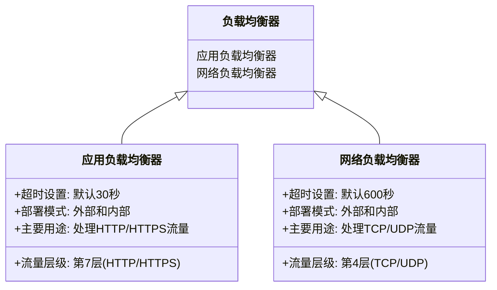

应用负载均衡器和网络负载均衡器在功能和用途上有显著区别，特别是在处理流量层级和超时设置方面。以下是它们的主要区别，以Mermaid表格的形式展示：

### **应用负载均衡器**
- **流量层级**: 第7层，主要用于处理HTTP和HTTPS流量。
- **超时设置**: 默认超时为30秒。
- **部署模式**: 可以在外部和内部进行部署。
- **主要用途**: 适用于需要高级HTTP(S)功能的应用，如基于HTTP头和URI的路由。

### **网络负载均衡器**
- **流量层级**: 第4层，主要用于处理TCP和UDP流量。
- **超时设置**: 默认超时为600秒。
- **部署模式**: 同样可以在外部和内部进行部署。
- **主要用途**: 适用于需要处理大规模TCP/UDP流量的应用，如TLS分流和UDP流量处理。

这些区别在选择适合的负载均衡器时非常关键，特别是根据应用的具体需求和流量类型来决定。

Sources
[1] Cloud Load Balancing 概览 | 负载平衡 | Google Cloud https://cloud.google.com/load-balancing/docs/load-balancing-overview?hl=zh-cn
[2] Cloud Load Balancing 概览 | 负载平衡 | Google Cloud https://cloud.google.com/load-balancing/docs/load-balancing-overview?hl=zh-cn

在 Google Cloud Platform (GCP) 中，后端服务的超时设置可能会因协议的不同而有所差异

https://cloud.google.com/load-balancing/docs/backend-service?utm_source=perplexity#timeout-setting

https://cloud.google.com/load-balancing/docs/backend-service?utm_source=perplexity&hl=zh-cn#timeout-setting

https://cloud.google.com/load-balancing/docs/backend-service?hl=zh-cn#timeout-setting

后端服务超时
大多数 Google Cloud 负载均衡器都具有后端服务超时。默认值是 30 秒。 允许的超时值的完整范围为 1 - 2,147,483,647 秒。
* 对于使用 HTTP、HTTPS 或 HTTP/2 协议的外部应用负载均衡器和内部应用负载均衡器，后端服务超时为 HTTP(S) 流量的请求和响应超时。
如需详细了解每个负载均衡器的后端服务超时，请参阅以下内容：
    * 对于 全球外部应用负载均衡器和 区域级外部应用负载均衡器，请参阅超时和重试。
    * 对于内部应用负载均衡器，请参阅超时和重试。
* 对于外部代理网络负载均衡器，超时为空闲超时。如需在删除连接之前允许更多或更少时间，请更改超时值。此空闲超时也用于 WebSocket 连接。
* 对于内部直通式网络负载均衡器和外部直通网络负载均衡器，您可以使用 gcloud 或 API 设置后端服务超时的值，但系统会忽略该值。后端服务超时对于这些直通负载均衡器没有任何意义。
* 对于 Traffic Director，无代理 gRPC 服务不支持后端服务超时字段（使用 timeoutSec 指定）。对于此类服务，请使用 maxStreamDuration 字段配置后端服务超时。这是因为 gRPC 不支持 timeoutSec 的语义，该函数指定了在发出请求后等待后端返回完整响应的时间。gRPC 的超时指定了从数据流开头直到响应完全处理的时间（包括所有重试）。

https://cloud.google.com/load-balancing/docs/l7-internal?hl=zh-cn#timeouts_and_retries
这个链接里面有详细的信息，可以参考和学习

对于内部直通式网络负载均衡器和外部直通网络负载均衡器，您可以使用 gcloud 或 API 设置后端服务超时的值，但系统会忽略该值。后端服务超时对于这些直通负载均衡器没有任何意义。

For internal passthrough Network Load Balancers and external passthrough Network Load Balancers, you can set the value of the backend service timeout using gcloud or the API, but the value is ignored. Backend service timeout has no meaning for these pass-through load balancers.

内部直通式网络负载均衡器
直通式网络负载均衡器是第 4 层区域级直通负载均衡器

直通式网络负载均衡器
直通式网络负载均衡器是第 4 层区域级直通负载均衡器。这些负载均衡器会在与负载均衡器位于同一区域的后端之间分配流量。它们是使用 Andromeda 虚拟网络和 Google Maglev 实现的。
顾名思义，这些负载均衡器不是代理。经过负载均衡的数据包由具有数据包的来源和目的地 IP 地址、协议的后端虚拟机接收，并且如果协议基于端口，则来源和目的地端口保持不变。经过负载均衡的连接会在后端终结。来自后端虚拟机的响应直接发送到客户端，而不是通过负载均衡器返回。其行业术语称为直接服务器返回 (DSR)。

https://cloud.google.com/load-balancing/docs/passthrough-network-load-balancer?hl=zh_cn

Most Google Cloud load balancers have a backend service timeout. The default value is 30 seconds. The full range of timeout values allowed is 1 - 2,147,483,647 seconds.

https://cloud.google.com/load-balancing/docs/load-balancing-overview?hl=zh_cn#types_of_load_balancers

负载均衡器的类型
Cloud Load Balancing 提供两种类型的负载均衡器：应用负载均衡器和网络负载均衡器。如果您需要为具有 HTTP(S) 流量的应用配置第 7 层负载均衡器，则需要选择应用负载均衡器。如果您需要支持 TLS 分流的第 4 层负载均衡器（使用代理负载均衡器），或者需要对 UDP、ESP 和 ICMP 等 IP 协议的支持（使用直通式负载均衡器），则可以选择网络负载均衡器。

- [ ] 应用负载均衡器
应用负载均衡器是基于代理的第 7 层负载均衡器，可让您在任播 IP 地址后面运行和扩缩服务。应用负载均衡器会将 HTTP 和 HTTPS 流量分配到各个 Google Cloud 平台（例如 Compute Engine 和 Google Kubernetes Engine [GKE]）上托管的后端，以及 Google Cloud 之外的外部后端。

- [ ] 网络负载均衡器
网络负载均衡器是第 4 层负载均衡器，可处理 TCP、UDP 或其他 IP 协议流量。这些负载均衡器可用作代理负载均衡器或直通式负载均衡器。您可以根据应用的需求及其需要处理的流量类型来选择负载均衡器。如果您要配置支持本地和其他云环境中的高级流量控制和后端的反向代理负载均衡器，请选择代理网络负载均衡器。如果您要保留客户端数据包的来源 IP 地址、希望服务器直接返回响应，或者想要处理各种 IP 协议（例如 TCP、UDP、ESP、GRE、ICMP 和 ICMPv6），请选择直通式网络负载均衡器。

### 检查其他相关设置
确保所有相关组件的超时设置都一致，包括nginx配置、GKE Pod的应用程序超时设置等。

## 参考资料
- [Backend services overview | Load Balancing - Google Cloud](https://cloud.google.com/load-balancing/docs/backend-service)[1]
- [Enable connection draining | Load Balancing - Google Cloud](https://cloud.google.com/load-balancing/docs/enabling-connection-draining)[2]
- [GCP internal http(s) load balancer timeout after 300s - Stack Overflow](https://stackoverflow.com/questions/67666685/gcp-internal-https-load-balancer-timeout-after-300s)[3]
- [google_compute_region_backend_service - Terraform Registry](https://registry.terraform.io/providers/hashicorp/google/latest/docs/resources/compute_region_backend_service)[4]

