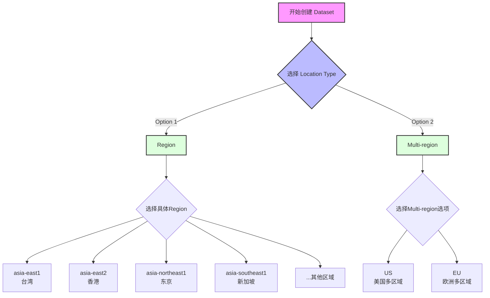

我来帮你创建一个描述BigQuery数据集位置选择流程的图表。考虑到这是一个决策树形式的流程，我觉得用flowchart会是最清晰的选择。​​​​​​​​​​​​​​​​

我使用了flowchart来展示这个决策流程，主要包含以下几个部分：

1. 起始点：开始创建Dataset
2. 第一个决策点：选择Location Type
3. 两个主要分支：
   - Region选项：展示了一些具体的区域选择，特别是亚洲地区的选项
   - Multi-region选项：显示了仅有的US和EU两个选择

我的建议是使用flowchart而不是mindmap的原因是：
1. 这个过程是一个明确的决策流程，有清晰的方向性
2. 需要显示不同选项之间的层级关系
3. flowchart能更好地展示选择的顺序性

是否需要我调整图表的某些部分？比如：
- 添加更多具体的区域选项
- 为每个选项添加更多详细信息
- 调整布局或颜色以突出某些重要信息​​​​​​​​​​​​​​​​

