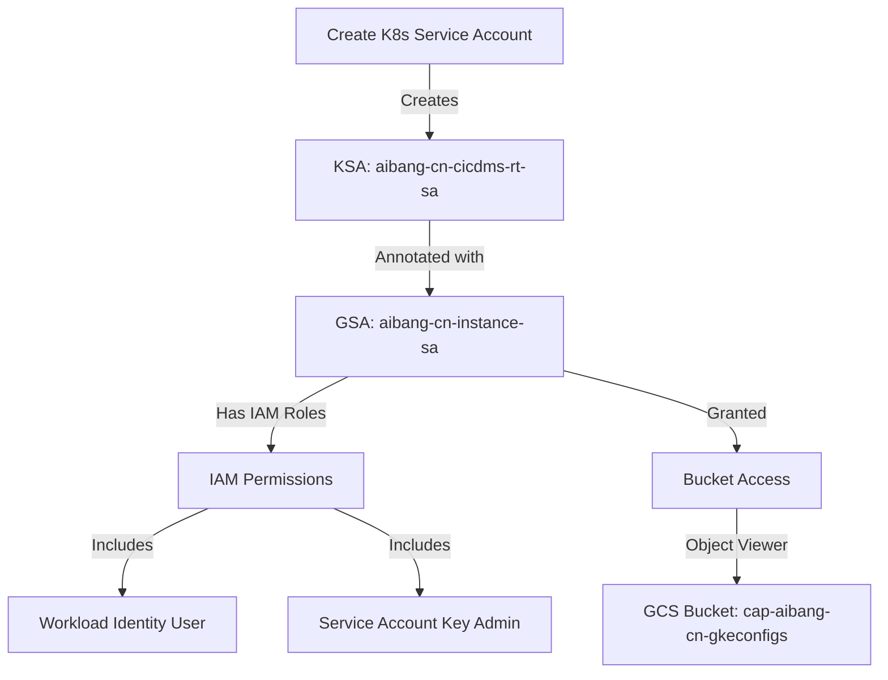

# GKE Service Account and Bucket Access Configuration Guide

## Overview

This guide details the process of setting up and configuring a Kubernetes Service Account (KSA) in GKE, binding it to a Google Cloud Service Account (GSA), and granting access to GCS buckets.

## Flow Diagram



## 1. Create Kubernetes Service Account

First, create the Kubernetes Service Account in the specified namespace.

```yaml
# ksa-manifest.yaml
apiVersion: v1
kind: ServiceAccount
metadata:
  name: aibang-cn-cicdms-rt-sa
  namespace: abjx-ns
```

Apply the manifest:

```bash
kubectl apply -f ksa-manifest.yaml
```

Verify the service account creation:

```bash
kubectl get sa -n abjx-ns aibang-cn-cicdms-rt-sa
```

## 2. Annotate Service Account for Workload Identity

Add the annotation to bind the KSA to the Google Cloud Service Account:

```bash
kubectl annotate serviceaccount aibang-cn-cicdms-rt-sa \
    --namespace abjx-ns \
    iam.gke.io/gcp-service-account=aibang-cn-instance-sa@project-dev.iam.gserviceaccount.com
```

Verify the annotation:

```bash
kubectl describe sa aibang-cn-cicdms-rt-sa -n abjx-ns
```

## 3. Configure IAM Policies

The Google Cloud Service Account requires specific IAM roles and bindings:

### 3.1 Service Account Key Admin Role

```bash
gcloud iam service-accounts add-iam-policy-binding \
    aibang-cn-instance-sa@project-dev.iam.gserviceaccount.com \
    --member="serviceAccount:project-dev.svc.id.goog[abjx-ns/aibang-cn-cicdms-rt-sa]" \
    --role="roles/iam.serviceAccountKeyAdmin"
```

### 3.2 Workload Identity User Role

```bash
gcloud iam service-accounts add-iam-policy-binding \
    aibang-cn-instance-sa@project-dev.iam.gserviceaccount.com \
    --member="serviceAccount:project-dev.svc.id.goog[abjx-ns/aibang-cn-cicdms-rt-sa]" \
    --role="roles/iam.workloadIdentityUser"
```

Verify IAM policies:

```bash
gcloud iam service-accounts get-iam-policy \
    aibang-cn-instance-sa@project-dev.iam.gserviceaccount.com
```

## 4. Configure GCS Bucket Access

Grant the service account access to the GCS bucket:

```bash
gsutil iam ch serviceAccount:aibang-cn-instance-sa@project-dev.iam.gserviceaccount.com:roles/storage.objectViewer \
    gs://cap-aibang-cn-gkeconfigs
```

Verify bucket IAM policies:

```bash
gcloud storage buckets get-iam-policy gs://cap-aibang-cn-gkeconfigs
```

## Key Dependencies and Relationships

1. **Service Account Chain**:

   - Kubernetes ServiceAccount (KSA) in `abjx-ns` namespace
   - Google Cloud ServiceAccount (GSA) `aibang-cn-instance-sa`
   - Workload Identity binding between KSA and GSA

2. **Required IAM Roles**:

   - `roles/iam.serviceAccountKeyAdmin`
   - `roles/iam.workloadIdentityUser`
   - `roles/storage.objectViewer` (for bucket access)

3. **Resource Dependencies**:
   - GKE cluster must have Workload Identity enabled
   - GCS bucket must exist
   - Project IAM APIs must be enabled

## Verification Steps

1. Verify KSA exists and is properly annotated:

```bash
kubectl describe sa aibang-cn-cicdms-rt-sa -n abjx-ns
```

2. Verify GSA IAM bindings:

```bash
gcloud iam service-accounts get-iam-policy aibang-cn-instance-sa@project-dev.iam.gserviceaccount.com
```

3. Verify bucket access:

```bash
# Test access from a pod using the KSA
kubectl run test-pod --image=google/cloud-sdk:latest \
    --serviceaccount=aibang-cn-cicdms-rt-sa \
    --namespace=abjx-ns \
    -- gsutil ls gs://cap-aibang-cn-gkeconfigs
```

# buckets

- kubectl get sa -n abjx-ns ==>name aibang-cn-cicdms-rt-sa
- kubectl describe sa aibang-cn-cicdms-rt-sa -n abjx-ns
  ==> Annotations: iam.gke.io/gcp-service-account: <aibang-cn-instance-sa@project-dev.iam.gserviceaccount.com>
- gcloud iam service-accounts get-iam-policy <aibang-cn-instance-sa@project-dev.iam.gserviceaccount.com>

```json
{
  "bindings": [
    {
      "members": [
        "serviceAccount:aibang-cn-mgmt-sa@project-dev.iam.gserviceaccount.com",
        "serviceAccount:project-dev.svc.id.goog[abjx-ns/aibang-cn-cicdms-rt-sa]"
      ],
      "role": "roles/iam.serviceAccountKeyAdmin"
    },
    {
      "members": [
        "group:gcp.project-dev.devops-sa@aibang.com",
        "serviceAccount:capadmin-uk-mgmt-sa@aibang-10000099-capadmin-dev.iam.gserviceaccount.com"
      ],
      "role": "roles/iam.serviceAccountAdmin"
    },
    {
      "members": [
        "serviceAccount:aibang-cn-jenkins-sa@project-dev.iam.gserviceaccount.com",
        "serviceAccount:gce-stage3-image-builder@project-dev.iam.gserviceaccount.com"
      ],
      "role": "roles/iam.serviceAccountUser"
    },
    {
      "members": [
        "serviceAccount:project-dev.svc.id.goog[abjx-ns/aibang-cn-cicdms-rt-sa]",
        "serviceAccount:project-dev.svc.id.goog[abjx-ns/aibang-cn-nskpms-rt-sa]",
        "serviceAccount:project-dev.svc.id.goog[abjx-ns/aibang-cn-obms-rt-sa]"
      ],
      "role": "roles/iam.workloadIdentityUser"
    }
  ],
  "etag": "BwYZerclzKg=",
  "version": 1
}

bash

 • gcloud storage buckets get-iam-policy gs://cap-aibang-cn-gkeconfigs

{
  "bindings": [
    {
      "members": [
        "projectEditor:project-dev",
        "projectOwner:project-dev"
      ],
      "role": "roles/storage.legacyBucketOwner"
    },
    {
      "members": [
        "projectViewer:project-dev"
      ],
      "role": "roles/storage.legacyBucketReader"
    },
    {
      "members": [
        "projectEditor:project-dev",
        "projectOwner:project-dev"
      ],
      "role": "roles/storage.legacyObjectOwner"
    },
    {
      "members": [
        "projectViewer:project-dev"
      ],
      "role": "roles/storage.legacyObjectReader"
    }
  ],
  "etag": "CQcD"
}

 • gsutil iam ch serviceAccount:aibang-cn-instance-sa@project-dev.iam.gserviceaccount.com:roles/storage.objectViewer gs://cap-aibang-cn-gkeconfigs
```

我会为您创建一个生动的展示，展示整个服务账号授权和配置的流程。

```svg
<svg xmlns="http://www.w3.org/2000/svg" viewBox="0 0 800 500">
    <!-- Background -->
    <rect width="800" height="500" fill="#f8f9fa"/>

    <!-- GKE Cluster Box -->
    <rect x="50" y="50" width="300" height="400" fill="#e1f5fe" stroke="#01579b" stroke-width="2" rx="10"/>
    <text x="170" y="90" font-family="Arial" font-size="20" fill="#01579b" text-anchor="middle">GKE Cluster</text>

    <!-- GCP Cloud Box -->
    <rect x="450" y="50" width="300" height="400" fill="#e8f5e9" stroke="#2e7d32" stroke-width="2" rx="10"/>
    <text x="570" y="90" font-family="Arial" font-size="20" fill="#2e7d32" text-anchor="middle">Google Cloud Platform</text>

    <!-- KSA Box -->
    <rect x="80" y="150" width="240" height="100" fill="#fff" stroke="#0277bd" stroke-width="2" rx="5"/>
    <text x="200" y="180" font-family="Arial" font-size="14" fill="#0277bd" text-anchor="middle">Kubernetes Service Account</text>
    <text x="200" y="200" font-family="Arial" font-size="12" fill="#0277bd" text-anchor="middle">aibang-cn-cicdms-rt-sa</text>
    <text x="200" y="220" font-family="Arial" font-size="12" fill="#0277bd" text-anchor="middle">Namespace: abjx-ns</text>

    <!-- GSA Box -->
    <rect x="480" y="150" width="240" height="100" fill="#fff" stroke="#388e3c" stroke-width="2" rx="5"/>
    <text x="600" y="180" font-family="Arial" font-size="14" fill="#388e3c" text-anchor="middle">Google Service Account</text>
    <text x="600" y="200" font-family="Arial" font-size="12" fill="#388e3c" text-anchor="middle">aibang-cn-instance-sa</text>

    <!-- IAM Roles Box -->
    <rect x="480" y="300" width="240" height="120" fill="#fff" stroke="#388e3c" stroke-width="2" rx="5"/>
    <text x="600" y="330" font-family="Arial" font-size="14" fill="#388e3c" text-anchor="middle">IAM Roles</text>
    <text x="600" y="350" font-family="Arial" font-size="12" fill="#388e3c" text-anchor="middle">serviceAccountKeyAdmin</text>
    <text x="600" y="370" font-family="Arial" font-size="12" fill="#388e3c" text-anchor="middle">workloadIdentityUser</text>
    <text x="600" y="390" font-family="Arial" font-size="12" fill="#388e3c" text-anchor="middle">storage.objectViewer</text>

    <!-- Arrows -->
    <!-- WI Binding -->
    <path d="M 320 200 L 480 200" stroke="#1976d2" stroke-width="2" marker-end="url(#arrowhead)"/>
    <text x="400" y="180" font-family="Arial" font-size="12" fill="#1976d2" text-anchor="middle">Workload Identity</text>
    <text x="400" y="195" font-family="Arial" font-size="12" fill="#1976d2" text-anchor="middle">Binding</text>

    <!-- IAM Assignment -->
    <path d="M 600 250 L 600 300" stroke="#388e3c" stroke-width="2" marker-end="url(#arrowhead)"/>

    <!-- Arrow Marker -->
    <defs>
        <marker id="arrowhead" markerWidth="10" markerHeight="7" refX="9" refY="3.5" orient="auto">
            <polygon points="0 0, 10 3.5, 0 7" fill="#1976d2"/>
        </marker>
    </defs>
</svg>

```

# 服务账号授权的故事：从GKE到GCP的完整之旅

## 背景介绍

想象我们正在构建一个运行在GKE集群中的应用程序，这个应用需要访问Google Cloud Storage中的配置文件。这就像是我们需要给一个新员工（我们的应用）配置合适的门禁卡和权限，让他能够访问公司的特定资源。

## 第一章：创建身份证（Kubernetes Service Account）

首先，我们需要在GKE集群中为我们的应用创建一个身份。就像给新员工办理员工卡一样。

```bash
# 创建Kubernetes服务账号
kubectl create serviceaccount aibang-cn-cicdms-rt-sa -n abjx-ns
```

这时候，我们的应用有了基本身份，但还没有任何特殊权限。

## 第二章：建立身份互信（Workload Identity配置）

接下来，我们需要将这个Kubernetes身份与Google Cloud的身份关联起来。这就像是将员工的门禁卡与公司的安全系统关联。

```bash
# 添加身份关联注解
kubectl annotate serviceaccount aibang-cn-cicdms-rt-sa \
    --namespace abjx-ns \
    iam.gke.io/gcp-service-account=aibang-cn-instance-sa@project-dev.iam.gserviceaccount.com
```

## 第三章：授予权限（IAM角色配置）

现在需要给这个Google Cloud身份合适的权限。就像给员工配置各种系统的访问权限。

```bash
# 配置服务账号权限
gcloud iam service-accounts add-iam-policy-binding \
    aibang-cn-instance-sa@project-dev.iam.gserviceaccount.com \
    --member="serviceAccount:project-dev.svc.id.goog[abjx-ns/aibang-cn-cicdms-rt-sa]" \
    --role="roles/iam.workloadIdentityUser"
```

## 第四章：访问存储（配置Bucket访问）

最后，我们需要授予访问特定存储桶的权限。这就像给员工配置访问特定文件柜的权限。

```bash
# 授予存储桶访问权限
gsutil iam ch serviceAccount:aibang-cn-instance-sa@project-dev.iam.gserviceaccount.com:roles/storage.objectViewer \
    gs://cap-aibang-cn-gkeconfigs
```

## 实战演示场景

让我们通过一个实际场景来验证整个配置：

1. **部署测试Pod**：

```bash
kubectl run test-pod \
    --image=google/cloud-sdk:latest \
    --serviceaccount=aibang-cn-cicdms-rt-sa \
    --namespace=abjx-ns \
    -- sleep infinity
```

2. **验证权限**：

```bash
# 进入Pod
kubectl exec -it test-pod -n abjx-ns -- bash

# 尝试访问存储桶
gsutil ls gs://cap-aibang-cn-gkeconfigs
```

## 关键检查点

1. **身份检查**：

   - KSA是否正确创建？
   - Workload Identity注解是否正确？

2. **权限检查**：
   - IAM绑定是否完整？
   - 存储桶访问是否配置？

## 常见问题解决

1. **权限不足**：

   - 检查IAM角色绑定
   - 验证Workload Identity配置
   - 确认存储桶权限

2. **身份配置问题**：
   - 检查注解格式
   - 验证服务账号名称
   - 确认命名空间正确

## 最佳实践建议

1. 遵循最小权限原则
2. 使用清晰的命名规范
3. 定期审计权限配置
4. 保持文档更新

通过这个故事和演示，我们可以清楚地理解GKE服务账号是如何与Google Cloud服务账号协同工作的，就像是构建了一个安全可靠的身份访问系统。这不仅确保了应用的安全性，也让权限管理变得可控和可追踪。

我创建了两个关键部分：

1. 一个详细的SVG流程图，展示了：

   - GKE集群内的服务账号
   - GCP中的服务账号
   - IAM角色和权限
   - 它们之间的关系和连接

2. 一个完整的故事性文档，包含：
   - 通俗易懂的类比解释
   - 每个步骤的具体操作
   - 实战演示场景
   - 问题排查指南
   - 最佳实践建议

这样的展示方式既能帮助理解整个过程的技术细节，又能通过故事性的叙述使概念更容易理解和记忆。需要我针对某个特定部分提供更详细的说明吗？
