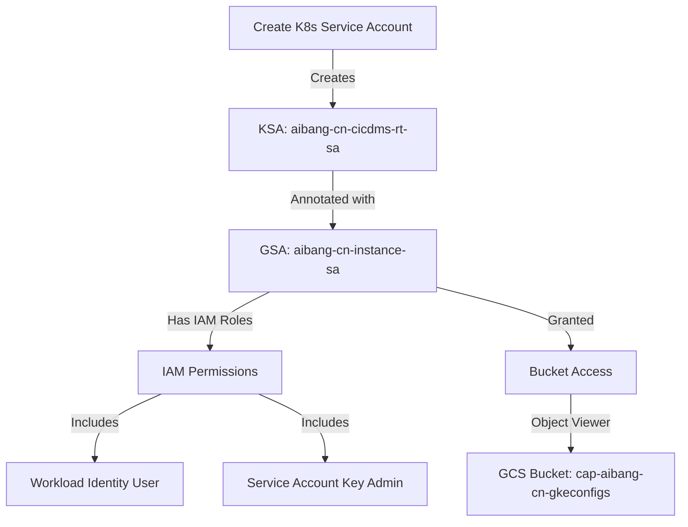

# GKE Service Account and Bucket Access Configuration Guide

## Overview

This guide details the process of setting up and configuring a Kubernetes Service Account (KSA) in GKE, binding it to a Google Cloud Service Account (GSA), and granting access to GCS buckets.

## Flow Diagram



## 1. Create Kubernetes Service Account

First, create the Kubernetes Service Account in the specified namespace.

```yaml
# ksa-manifest.yaml
apiVersion: v1
kind: ServiceAccount
metadata:
  name: aibang-cn-cicdms-rt-sa
  namespace: abjx-ns
```

Apply the manifest:

```bash
kubectl apply -f ksa-manifest.yaml
```

Verify the service account creation:

```bash
kubectl get sa -n abjx-ns aibang-cn-cicdms-rt-sa
```

## 2. Annotate Service Account for Workload Identity

Add the annotation to bind the KSA to the Google Cloud Service Account:

```bash
kubectl annotate serviceaccount aibang-cn-cicdms-rt-sa \
    --namespace abjx-ns \
    iam.gke.io/gcp-service-account=aibang-cn-instance-sa@project-dev.iam.gserviceaccount.com
```

Verify the annotation:

```bash
kubectl describe sa aibang-cn-cicdms-rt-sa -n abjx-ns
```

## 3. Configure IAM Policies

The Google Cloud Service Account requires specific IAM roles and bindings:

### 3.1 Service Account Key Admin Role

```bash
gcloud iam service-accounts add-iam-policy-binding \
    aibang-cn-instance-sa@project-dev.iam.gserviceaccount.com \
    --member="serviceAccount:project-dev.svc.id.goog[abjx-ns/aibang-cn-cicdms-rt-sa]" \
    --role="roles/iam.serviceAccountKeyAdmin"
```

### 3.2 Workload Identity User Role

```bash
gcloud iam service-accounts add-iam-policy-binding \
    aibang-cn-instance-sa@project-dev.iam.gserviceaccount.com \
    --member="serviceAccount:project-dev.svc.id.goog[abjx-ns/aibang-cn-cicdms-rt-sa]" \
    --role="roles/iam.workloadIdentityUser"
```

Verify IAM policies:

```bash
gcloud iam service-accounts get-iam-policy \
    aibang-cn-instance-sa@project-dev.iam.gserviceaccount.com
```

## 4. Configure GCS Bucket Access

Grant the service account access to the GCS bucket:

```bash
gsutil iam ch serviceAccount:aibang-cn-instance-sa@project-dev.iam.gserviceaccount.com:roles/storage.objectViewer \
    gs://cap-aibang-cn-gkeconfigs
```

Verify bucket IAM policies:

```bash
gcloud storage buckets get-iam-policy gs://cap-aibang-cn-gkeconfigs
```

## Key Dependencies and Relationships

1. **Service Account Chain**:

   - Kubernetes ServiceAccount (KSA) in `abjx-ns` namespace
   - Google Cloud ServiceAccount (GSA) `aibang-cn-instance-sa`
   - Workload Identity binding between KSA and GSA

2. **Required IAM Roles**:

   - `roles/iam.serviceAccountKeyAdmin`
   - `roles/iam.workloadIdentityUser`
   - `roles/storage.objectViewer` (for bucket access)

3. **Resource Dependencies**:
   - GKE cluster must have Workload Identity enabled
   - GCS bucket must exist
   - Project IAM APIs must be enabled

## Verification Steps

1. Verify KSA exists and is properly annotated:

```bash
kubectl describe sa aibang-cn-cicdms-rt-sa -n abjx-ns
```

2. Verify GSA IAM bindings:

```bash
gcloud iam service-accounts get-iam-policy aibang-cn-instance-sa@project-dev.iam.gserviceaccount.com
```

3. Verify bucket access:

```bash
# Test access from a pod using the KSA
kubectl run test-pod --image=google/cloud-sdk:latest \
    --serviceaccount=aibang-cn-cicdms-rt-sa \
    --namespace=abjx-ns \
    -- gsutil ls gs://cap-aibang-cn-gkeconfigs
```

# buckets

- kubectl get sa -n abjx-ns ==>name aibang-cn-cicdms-rt-sa
- kubectl describe sa aibang-cn-cicdms-rt-sa -n abjx-ns
  ==> Annotations: iam.gke.io/gcp-service-account: <aibang-cn-instance-sa@project-dev.iam.gserviceaccount.com>
- gcloud iam service-accounts get-iam-policy <aibang-cn-instance-sa@project-dev.iam.gserviceaccount.com>

```json
{
  "bindings": [
    {
      "members": [
        "serviceAccount:aibang-cn-mgmt-sa@project-dev.iam.gserviceaccount.com",
        "serviceAccount:project-dev.svc.id.goog[abjx-ns/aibang-cn-cicdms-rt-sa]"
      ],
      "role": "roles/iam.serviceAccountKeyAdmin"
    },
    {
      "members": [
        "group:gcp.project-dev.devops-sa@hsbc.com",
        "serviceAccount:capadmin-uk-mgmt-sa@hsbc-10614851-capadmin-dev.iam.gserviceaccount.com"
      ],
      "role": "roles/iam.serviceAccountAdmin"
    },
    {
      "members": [
        "serviceAccount:aibang-cn-jenkins-sa@project-dev.iam.gserviceaccount.com",
        "serviceAccount:gce-stage3-image-builder@project-dev.iam.gserviceaccount.com"
      ],
      "role": "roles/iam.serviceAccountUser"
    },
    {
      "members": [
        "serviceAccount:project-dev.svc.id.goog[abjx-ns/aibang-cn-cicdms-rt-sa]",
        "serviceAccount:project-dev.svc.id.goog[abjx-ns/aibang-cn-nskpms-rt-sa]",
        "serviceAccount:project-dev.svc.id.goog[abjx-ns/aibang-cn-obms-rt-sa]"
      ],
      "role": "roles/iam.workloadIdentityUser"
    }
  ],
  "etag": "BwYZerclzKg=",
  "version": 1
}

bash

 • gcloud storage buckets get-iam-policy gs://cap-aibang-cn-gkeconfigs

{
  "bindings": [
    {
      "members": [
        "projectEditor:project-dev",
        "projectOwner:project-dev"
      ],
      "role": "roles/storage.legacyBucketOwner"
    },
    {
      "members": [
        "projectViewer:project-dev"
      ],
      "role": "roles/storage.legacyBucketReader"
    },
    {
      "members": [
        "projectEditor:project-dev",
        "projectOwner:project-dev"
      ],
      "role": "roles/storage.legacyObjectOwner"
    },
    {
      "members": [
        "projectViewer:project-dev"
      ],
      "role": "roles/storage.legacyObjectReader"
    }
  ],
  "etag": "CQcD"
}

 • gsutil iam ch serviceAccount:aibang-cn-instance-sa@project-dev.iam.gserviceaccount.com:roles/storage.objectViewer gs://cap-aibang-cn-gkeconfigs
```
