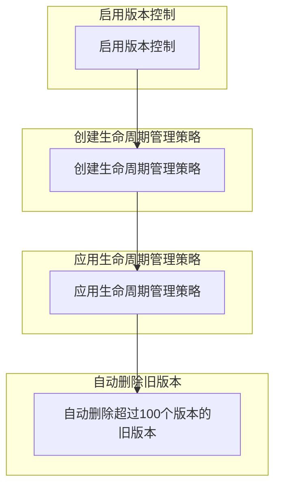

在Google Cloud Storage中启用版本控制后，所有被覆盖或删除的对象都会保留其旧版本。要控制版本的数量，例如保留最新的100个版本，可以使用生命周期管理（Lifecycle Management）策略来自动删除超出数量的旧版本。

下面是具体步骤和配置示例：

### 1. 启用版本控制

假设你已经在bucket上启用了版本控制，可以通过以下命令启用：

```bash
gsutil versioning set on gs://your-bucket-name
```

### 2. 配置生命周期管理策略

创建一个JSON文件，例如`lifecycle.json`，用于定义生命周期管理策略。以下示例展示了如何配置以保留最新的100个版本：

```json
{
  "rule": [
    {
      "action": {
        "type": "Delete"
      },
      "condition": {
        "numNewerVersions": 100
      }
    }
  ]
}
```

### 3. 应用生命周期管理策略

将上述策略应用到你的bucket：

```bash
gsutil lifecycle set lifecycle.json gs://your-bucket-name
```

### 示例流程图（Mermaid格式）



### 详细步骤

1. **启用版本控制**：
   - 确保版本控制已启用。

2. **创建生命周期管理策略**：
   - 编写一个JSON文件定义保留版本的策略。

3. **应用生命周期管理策略**：
   - 使用`gsutil lifecycle set`命令将策略应用到bucket。

4. **自动删除旧版本**：
   - 根据策略，Google Cloud Storage会自动删除超过100个版本的旧版本。

通过以上配置，你可以有效地管理和控制Google Cloud Storage中的对象版本数量，确保不会保留过多的旧版本。