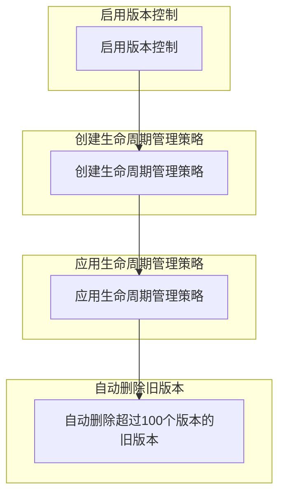

在Google Cloud Storage中启用版本控制后，所有被覆盖或删除的对象都会保留其旧版本。要控制版本的数量，例如保留最新的100个版本，可以使用生命周期管理（Lifecycle Management）策略来自动删除超出数量的旧版本。

下面是具体步骤和配置示例：

### 1. 启用版本控制

假设你已经在bucket上启用了版本控制，可以通过以下命令启用：

```bash
gsutil versioning set on gs://your-bucket-name
```

### 2. 配置生命周期管理策略

创建一个JSON文件，例如`lifecycle.json`，用于定义生命周期管理策略。以下示例展示了如何配置以保留最新的100个版本：

```json
{
  "rule": [
    {
      "action": {
        "type": "Delete"
      },
      "condition": {
        "numNewerVersions": 100
      }
    }
  ]
}
```

### 3. 应用生命周期管理策略

将上述策略应用到你的bucket：

```bash
gsutil lifecycle set lifecycle.json gs://your-bucket-name
```

### 示例流程图（Mermaid格式）



### 详细步骤

1. **启用版本控制**：
   - 确保版本控制已启用。

2. **创建生命周期管理策略**：
   - 编写一个JSON文件定义保留版本的策略。

3. **应用生命周期管理策略**：
   - 使用`gsutil lifecycle set`命令将策略应用到bucket。

4. **自动删除旧版本**：
   - 根据策略，Google Cloud Storage会自动删除超过100个版本的旧版本。

通过以上配置，你可以有效地管理和控制Google Cloud Storage中的对象版本数量，确保不会保留过多的旧版本。

如果你的GCS存储桶启用了版本控制（versioning enabled），你可以查看同名文件的历史版本。以下是具体的步骤：

### 使用Google Cloud Console

1. **打开Cloud Console**：
   打开[Google Cloud Console](https://console.cloud.google.com/).

2. **导航到你的存储桶**：
   在导航菜单中，选择`Storage > Browser`，然后点击你启用了版本控制的存储桶。

3. **查看对象版本**：
   - 找到你想查看历史版本的文件。
   - 点击文件名打开详细信息面板。
   - 在详细信息面板中，你会看到一个“Versions”标签，点击它查看该文件的所有历史版本。

### 使用gsutil工具

1. **列出对象版本**：
   使用`gsutil ls -a`命令列出对象的所有版本。具体命令格式如下：

   ```sh
   gsutil ls -a gs://your-bucket-name/your-object-name
   ```

   例如：

   ```sh
   gsutil ls -a gs://my-bucket/my-file.txt
   ```

   这将显示所有版本的文件，包括每个版本的生成时间戳和唯一版本ID。

2. **查看特定版本的内容**：
   使用`gsutil cp`命令将特定版本的文件下载到本地，或直接查看其内容。具体命令格式如下：

   ```sh
   gsutil cp gs://your-bucket-name/your-object-name#<version-id> /path/to/destination
   ```

   例如：

   ```sh
   gsutil cp gs://my-bucket/my-file.txt#1609459200000000 /tmp/my-file.txt
   ```

   这里的`1609459200000000`是对象版本ID，你可以从`gsutil ls -a`命令的输出中找到。

### 使用编程接口（例如Python）

你也可以使用Google Cloud Storage客户端库来编程查看对象的版本。下面是一个使用Python的示例：

```python
from google.cloud import storage

def list_object_versions(bucket_name, object_name):
    client = storage.Client()
    bucket = client.bucket(bucket_name)
    blobs = bucket.list_blobs(versions=True, prefix=object_name)

    for blob in blobs:
        print(f"Name: {blob.name}, Generation: {blob.generation}, Updated: {blob.updated}")

bucket_name = 'my-bucket'
object_name = 'my-file.txt'
list_object_versions(bucket_name, object_name)
```

以上代码列出指定对象的所有版本，包括每个版本的生成ID和更新时间。

### 总结

通过Google Cloud Console、`gsutil`工具或者编程接口，你都可以方便地查看启用了版本控制的存储桶中的同名文件的历史版本。选择合适的方法可以帮助你高效地管理和恢复文件的不同版本。


使用 `gcloud` 命令行工具来管理 Google Cloud Storage 存储桶时，可以查看已启用版本控制的存储桶中同名文件的历史版本。下面是如何使用 `gcloud storage` 命令来实现这一点：

### 列出对象的所有版本

首先，确保你已安装并初始化了 Google Cloud SDK。如果还没有，可以按照[安装说明](https://cloud.google.com/sdk/docs/install)进行操作。

1. **列出对象的所有版本**：

   使用以下命令列出特定存储桶中对象的所有版本：

   ```sh
   gcloud storage objects list --bucket BUCKET_NAME --versions
   ```

   替换 `BUCKET_NAME` 为你的存储桶名称。这个命令会显示存储桶中所有对象的版本，包括每个对象的版本ID、更新时间等信息。

   如果只想查看某个特定对象的版本，可以使用前缀过滤：

   ```sh
   gcloud storage objects list --bucket BUCKET_NAME --versions --prefix OBJECT_NAME
   ```

   例如：

   ```sh
   gcloud storage objects list --bucket my-bucket --versions --prefix my-file.txt
   ```

2. **查看特定版本的详细信息**：

   要查看特定版本的详细信息，可以使用以下命令：

   ```sh
   gcloud storage objects describe gs://BUCKET_NAME/OBJECT_NAME#GENERATION
   ```

   替换 `BUCKET_NAME` 为你的存储桶名称，`OBJECT_NAME` 为你的对象名称，`GENERATION` 为你要查看的对象版本的生成ID。例如：

   ```sh
   gcloud storage objects describe gs://my-bucket/my-file.txt#1609459200000000
   ```

3. **下载特定版本的对象**：

   要下载特定版本的对象到本地，可以使用以下命令：

   ```sh
   gcloud storage cp gs://BUCKET_NAME/OBJECT_NAME#GENERATION LOCAL_DESTINATION
   ```

   例如：

   ```sh
   gcloud storage cp gs://my-bucket/my-file.txt#1609459200000000 /tmp/my-file.txt
   ```

### 示例

假设你的存储桶名称为 `my-bucket`，对象名称为 `my-file.txt`，可以按以下步骤操作：

1. 列出所有版本：

   ```sh
   gcloud storage objects list --bucket my-bucket --versions --prefix my-file.txt
   ```

2. 查看特定版本详细信息：

   ```sh
   gcloud storage objects describe gs://my-bucket/my-file.txt#1609459200000000
   ```

3. 下载特定版本的对象：

   ```sh
   gcloud storage cp gs://my-bucket/my-file.txt#1609459200000000 /tmp/my-file.txt
   ```

通过这些步骤，你可以使用 `gcloud storage` 命令行工具方便地查看和管理启用了版本控制的存储桶中对象的历史版本。


