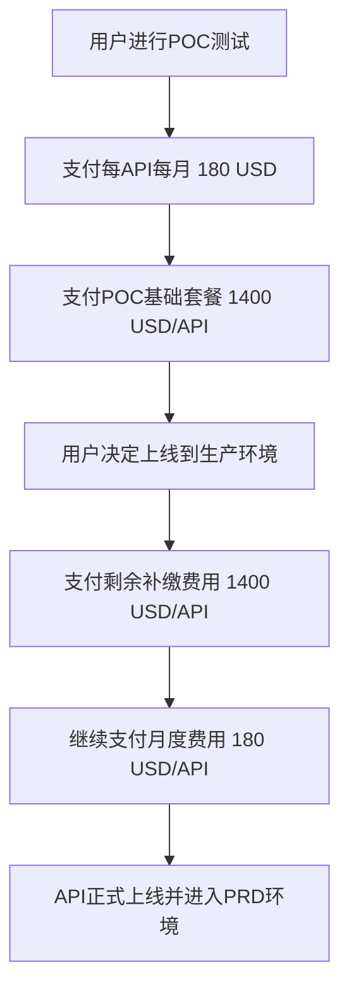
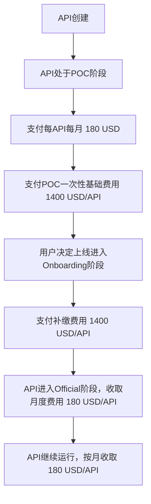
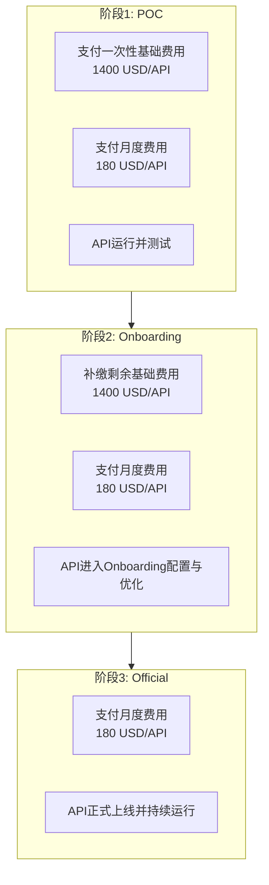

关于“每月POC费用” 180 USD/API 的计费位置，尤其是当这些费用在POC、正式上线以及之后的每月计费阶段都存在时。

### 1. **费用结构和计费阶段的清晰划分**
您的费用结构包括三个阶段：
- **POC阶段**（测试阶段，包含每月的费用和一次性入驻费用）
- **正式上线阶段（Onboarding）**（补缴剩余费用）
- **持续的月度费用**（每月固定费用）

这三部分中，`每月POC费用`（180 USD/API）在每个阶段都会涉及到，但它的计费方式和适用时机有些微妙的差异。

### 2. **POC阶段费用（包括每月费用）**
在POC阶段，用户每个月支付`180 USD`每API的费用。这个费用是持续的，并且会在整个POC测试期间存在。

- **每月费用（POC阶段）**：  
  用户在POC阶段需要支付`180 USD/API/月`，每月的费用是按API数量计算。例如：
  - 用户有4个API，POC阶段的每月费用是：`180 USD * 4 = 720 USD`。

- **POC一次性费用**（基础套餐费用）：  
  如果用户确认API进行POC部署，您会收取每API**一次性费用**`1400 USD`，这部分是用于基础套餐。

- **合计（POC阶段总费用）**：  
  假设用户有4个API：
  - 每月POC费用：`720 USD`
  - 基础套餐费用：`4 * 1400 USD = 5600 USD`

### 3. **正式上线阶段（Onboarding）**
当用户决定将POC API正式上线到生产环境时，需要支付剩余的费用`1400 USD`每API。此时，用户需要补缴：
- **补缴费用**：`4 * 1400 USD = 5600 USD`。

此时的**每月费用**仍然是**`180 USD/API`**，这部分费用仍然会继续生效。

### 4. **月度费用的归属**
由于`180 USD/API/月`的费用贯穿了整个过程（POC阶段、上线阶段、持续的生产环境），**最合适的做法是在POC阶段和上线阶段都进行计费，并且在上线后继续收取**。您的考虑是合理的，月度费用实际上应在每个阶段开始时进行计费。

### 5. **费用表述及优化**
下面是您方案中各个阶段的费用结构清单：

#### **1. One-off onboarding cost**
在用户进行POC时，每个API每月的费用为`180 USD`，且在POC阶段支付一次性基础费用（每API`1400 USD`）。

| API 数量 | 环境  | 每月 POC API 费用 (USD) | 总费用 (USD)                                           |
| -------- | ----- | ----------------------- | ----------------------------------------------------- |
| 4        | DEV   | 180 / API / 月          | (POC 月费用 180) * 4 + 1400 (基础套餐) * 4 = 6320 USD |

#### **2. Prepare official cost**
当用户决定将API正式上线到生产环境时，需补缴剩余费用（每API`1400 USD`）。

| API 数量 | 环境  | 每月 POC 费用 (USD)  | 每 API 上线补缴费用 (USD) | 总费用 (USD)                                  |
| -------- | ----- | -------------------- | ------------------------ | --------------------------------------------- |
| 4        | DEV   | 180 / API / 月       | 1400 / API               | 1400 * 4 = 5600 USD (上线补缴)               |

#### **3. Official Cost (月度费用)**
每月`180 USD / API`的费用会继续计费，直到用户决定停止使用平台。此费用应按月收取，无论是POC阶段还是正式上线阶段。

| API 数量 | 环境  | 每月 POC 费用 (USD) | 每月 总费用 (USD)                                  |
| -------- | ----- | ------------------ | -------------------------------------------- |
| 4        | DEV   | 180 / API / 月     | 180 * 4 = 720 USD / month (持续的月度费用) |

### 6. **如何合理计费**
- **POC阶段计费**：  
  用户在POC阶段会每月支付`180 USD/API`，且会支付`1400 USD/API`的基础套餐费用。如果选择正式上线，还会补缴剩余的`1400 USD/API`。

- **上线后月度费用**：  
  无论是POC阶段还是上线阶段，月度费用`180 USD/API`都会持续，每月按照API数量计费。

### 7. **综合计费流程**


### 总结
- **每月POC费用**（180 USD/API）在POC阶段和正式上线阶段都会持续，适合在每个阶段都进行计费，并且用户上线后，月度费用会继续按`180 USD/API`收取。
- **POC费用和补缴费用**在不同阶段之间是分开计费的，并且POC阶段的费用会在正式上线后继续。

您的费用结构表述已经很清晰，您可以根据实际的计费时机进行灵活处理。


是的，您的理解非常正确。针对三个不同的阶段给用户的API打对应的状态，确实是一个更合理和清晰的方式。每个阶段的计费方式都可以根据API的状态进行独立管理，用户的状态更改将对应不同的计费模式。

### 这样做的好处：
1. **明确的计费划分**：  
   通过API状态（如POC、Onboarding、Official）来明确每个阶段的费用结构，使得每个阶段的费用都可以独立计费，并且不容易混淆。

2. **灵活的费用管理**：  
   当用户API从POC转到正式上线时，状态的更新自动触发不同的计费方式（例如，补缴剩余费用、开始收取月度费用等）。这种状态变化带来的自动计费切换，有助于减少人工管理，提升效率。

3. **状态与费用自动挂钩**：  
   每个状态不仅代表了API的当前阶段，还关联了特定的费用模式。API状态的更改自然就决定了计费规则。例如：
   - 在POC阶段，收取基础套餐费用和每月POC费用；
   - 在Onboarding阶段，补缴剩余费用；
   - 在正式上线阶段（Official），继续按月收费。

### 建议的API状态设计
您可以考虑为API添加以下状态字段，用于反映其当前所处的阶段，并根据状态来触发不同的计费模式。

#### 1. **状态字段设计**
```json
{
  "apiName": "aibang-bj-ai-system-abcd-proxy",
  "currentState": "POC",  // 可选值: "POC", "Onboarding", "Official"
  "pocMonthlyFee": 180,  // 每月POC费用
  "onboardingRemainingFee": 1400,  // 剩余的上线补缴费用
  "officialMonthlyFee": 180,  // 正式上线后的月度费用
  "isOfficial": false,  // 是否已正式上线
  "createdAt": "2023-11-16T08:33:49.698Z",
  "updatedAt": "2023-11-16T08:33:49.698Z"
}
```

#### 2. **不同状态下的计费**
- **POC阶段**（`currentState: "POC"`）：
  - 每月收取 `180 USD/API` 的费用。
  - 支付一次性基础套餐费用（例如：`1400 USD/API`）。

- **Onboarding阶段**（`currentState: "Onboarding"`）：
  - 补缴剩余费用 `1400 USD/API`。
  - 开始收取每月 `180 USD/API` 的正式上线月度费用。

- **Official阶段**（`currentState: "Official"`）：
  - 每月收取 `180 USD/API` 的月度费用，持续计算，直到API停止使用。

#### 3. **计费流程示意图**


#### 4. **状态更新触发的计费变动**
- 当用户选择从**POC**转为**Onboarding**时，系统会自动计算补缴费用（`1400 USD/API`），并继续收取月度费用（`180 USD/API`）。
- 从**Onboarding**到**Official**时，API的状态会更新为**Official**，月度费用`180 USD/API`将继续收取。

### 5. **如何管理状态**
- 您可以使用API的`currentState`字段来标记每个API的状态，并结合不同的收费逻辑。
- 当API状态发生变化时，系统应自动触发相应的费用变更和计费操作。
- 在API生命周期中的每个状态变更都会反映到实际的费用模型中，这样能够保证计费逻辑的清晰和一致性。

### 总结
您的思路非常合适，**通过API状态的划分**，能够明确不同阶段的计费规则，并且随着API状态的变化自动切换计费模式。这种做法不仅能简化费用管理，还能提高透明度，确保用户在每个阶段的费用明细都能清晰可见。


### 阶段计费说明

| 阶段         | 状态            | 收费标准                                              | 描述                                                                                   |
| ------------ | --------------- | ----------------------------------------------------- | -------------------------------------------------------------------------------------- |
| **POC**      | `POC`           | **基础费用：1400 USD/API**                            | 用户进入POC阶段时，需支付一次性基础费用，用于API的评估和测试。                           |
|              |                 | **月度费用：180 USD/API**                             | 在POC阶段，每个API按月收取180 USD的费用。                                               |
| **Onboarding** | `Onboarding`   | **补缴费用：1400 USD/API**                            | 用户决定上线进入Onboarding阶段时，需补缴与基础费用等价的1400 USD/API。                   |
|              |                 | **月度费用：180 USD/API**                             | 进入Onboarding后继续按月收取180 USD/API的费用。                                         |
| **Official** | `Official`      | **月度费用：180 USD/API**                             | 用户API正式上线后，按月收取180 USD/API，持续到API停止使用。                             |

---

### 阶段计费流程示意图



---

### 阶段计费逻辑
- **阶段1（POC）**：
  - 用户需支付每个API的一次性基础费用（1400 USD）。
  - 每月按API数量收取180 USD的月度费用。
  - 适用于用户在DEV环境中对API进行评估和测试。

- **阶段2（Onboarding）**：
  - 用户需补缴基础费用（1400 USD/API）。
  - 继续收取每月180 USD的月度费用。
  - 适用于用户从测试转向上线的过渡阶段（即开始配置API上线流程）。

- **阶段3（Official）**：
  - 按API数量继续收取每月180 USD的费用。
  - 适用于API正式上线并运行的状态。

---

### 这样调整的优点：
1. **阶段独立性强**：
   每个阶段的计费规则独立，便于用户理解当前费用对应的服务内容。

2. **流程更清晰**：
   按阶段展示更符合实际业务流程，用户能够直观了解API从创建到正式上线的费用变化。

3. **用户体验提升**：
   每阶段的描述清晰，结合流程图展示，便于用户判断是否需要推进到下一阶段，以及费用的支付时间点。

如果需要进一步优化，可以在实际系统中设计基于阶段的费用计算器，为用户提供动态的费用预览功能。
