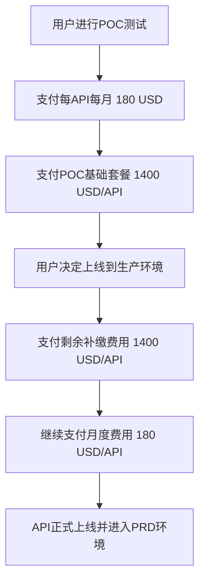
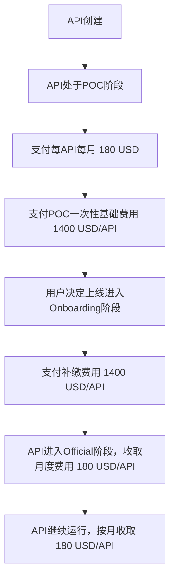
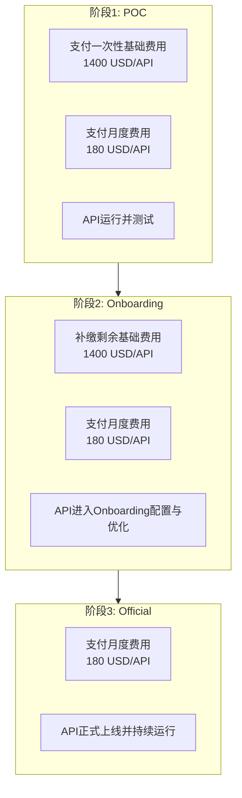
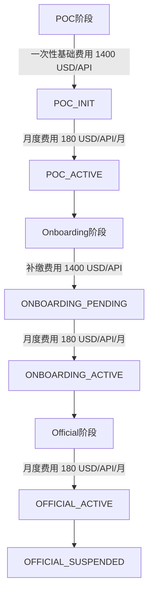
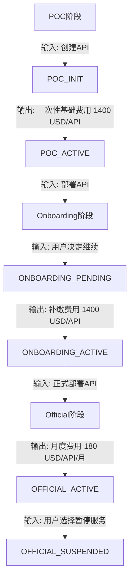
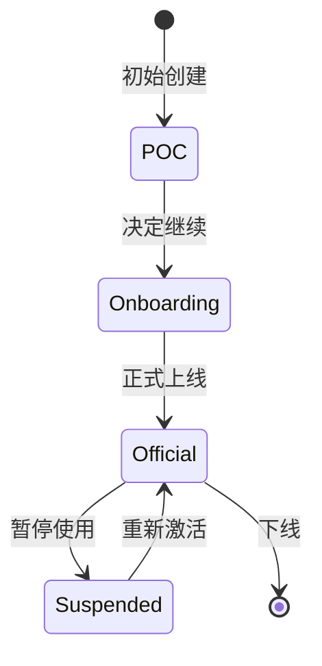
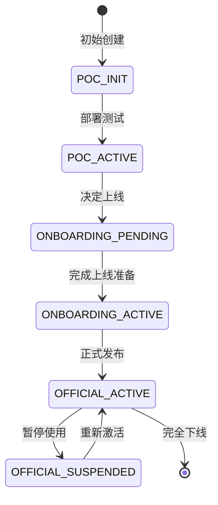
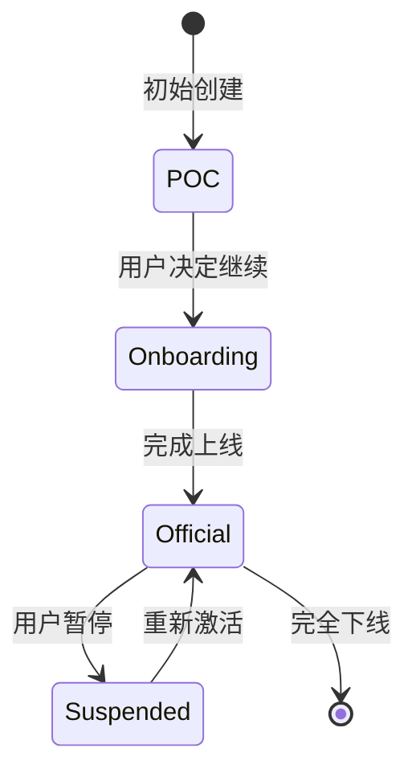
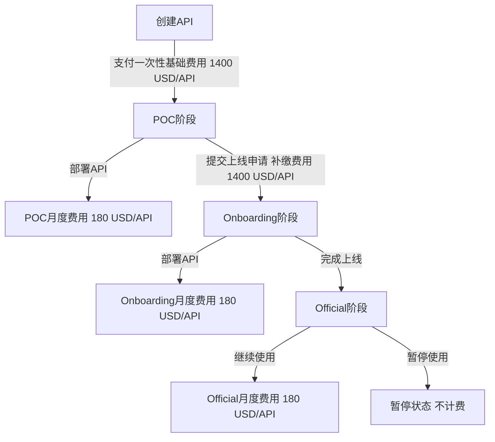

# V1 
关于“每月POC费用” 180 USD/API 的计费位置，尤其是当这些费用在POC、正式上线以及之后的每月计费阶段都存在时。

### 1. **费用结构和计费阶段的清晰划分**
您的费用结构包括三个阶段：
- **POC阶段**（测试阶段，包含每月的费用和一次性入驻费用）
- **正式上线阶段（Onboarding）**（补缴剩余费用）
- **持续的月度费用**（每月固定费用）

这三部分中，`每月POC费用`（180 USD/API）在每个阶段都会涉及到，但它的计费方式和适用时机有些微妙的差异。

### 2. **POC阶段费用（包括每月费用）**
在POC阶段，用户每个月支付`180 USD`每API的费用。这个费用是持续的，并且会在整个POC测试期间存在。

- **每月费用（POC阶段）**：  
  用户在POC阶段需要支付`180 USD/API/月`，每月的费用是按API数量计算。例如：
  - 用户有4个API，POC阶段的每月费用是：`180 USD * 4 = 720 USD`。

- **POC一次性费用**（基础套餐费用）：  
  如果用户确认API进行POC部署，您会收取每API**一次性费用**`1400 USD`，这部分是用于基础套餐。

- **合计（POC阶段总费用）**：  
  假设用户有4个API：
  - 每月POC费用：`720 USD`
  - 基础套餐费用：`4 * 1400 USD = 5600 USD`

### 3. **正式上线阶段（Onboarding）**
当用户决定将POC API正式上线到生产环境时，需要支付剩余的费用`1400 USD`每API。此时，用户需要补缴：
- **补缴费用**：`4 * 1400 USD = 5600 USD`。

此时的**每月费用**仍然是**`180 USD/API`**，这部分费用仍然会继续生效。

### 4. **月度费用的归属**
由于`180 USD/API/月`的费用贯穿了整个过程（POC阶段、上线阶段、持续的生产环境），**最合适的做法是在POC阶段和上线阶段都进行计费，并且在上线后继续收取**。您的考虑是合理的，月度费用实际上应在每个阶段开始时进行计费。

### 5. **费用表述及优化**
下面是您方案中各个阶段的费用结构清单：

#### **1. One-off onboarding cost**
在用户进行POC时，每个API每月的费用为`180 USD`，且在POC阶段支付一次性基础费用（每API`1400 USD`）。

| API 数量 | 环境  | 每月 POC API 费用 (USD) | 总费用 (USD)                                           |
| -------- | ----- | ----------------------- | ----------------------------------------------------- |
| 4        | DEV   | 180 / API / 月          | (POC 月费用 180) * 4 + 1400 (基础套餐) * 4 = 6320 USD |

#### **2. Prepare official cost**
当用户决定将API正式上线到生产环境时，需补缴剩余费用（每API`1400 USD`）。

| API 数量 | 环境  | 每月 POC 费用 (USD)  | 每 API 上线补缴费用 (USD) | 总费用 (USD)                                  |
| -------- | ----- | -------------------- | ------------------------ | --------------------------------------------- |
| 4        | DEV   | 180 / API / 月       | 1400 / API               | 1400 * 4 = 5600 USD (上线补缴)               |

#### **3. Official Cost (月度费用)**
每月`180 USD / API`的费用会继续计费，直到用户决定停止使用平台。此费用应按月收取，无论是POC阶段还是正式上线阶段。

| API 数量 | 环境  | 每月 POC 费用 (USD) | 每月 总费用 (USD)                                  |
| -------- | ----- | ------------------ | -------------------------------------------- |
| 4        | DEV   | 180 / API / 月     | 180 * 4 = 720 USD / month (持续的月度费用) |

### 6. **如何合理计费**
- **POC阶段计费**：  
  用户在POC阶段会每月支付`180 USD/API`，且会支付`1400 USD/API`的基础套餐费用。如果选择正式上线，还会补缴剩余的`1400 USD/API`。

- **上线后月度费用**：  
  无论是POC阶段还是上线阶段，月度费用`180 USD/API`都会持续，每月按照API数量计费。

### 7. **综合计费流程**


### 总结
- **每月POC费用**（180 USD/API）在POC阶段和正式上线阶段都会持续，适合在每个阶段都进行计费，并且用户上线后，月度费用会继续按`180 USD/API`收取。
- **POC费用和补缴费用**在不同阶段之间是分开计费的，并且POC阶段的费用会在正式上线后继续。

您的费用结构表述已经很清晰，您可以根据实际的计费时机进行灵活处理。


是的，您的理解非常正确。针对三个不同的阶段给用户的API打对应的状态，确实是一个更合理和清晰的方式。每个阶段的计费方式都可以根据API的状态进行独立管理，用户的状态更改将对应不同的计费模式。

### 这样做的好处：
1. **明确的计费划分**：  
   通过API状态（如POC、Onboarding、Official）来明确每个阶段的费用结构，使得每个阶段的费用都可以独立计费，并且不容易混淆。

2. **灵活的费用管理**：  
   当用户API从POC转到正式上线时，状态的更新自动触发不同的计费方式（例如，补缴剩余费用、开始收取月度费用等）。这种状态变化带来的自动计费切换，有助于减少人工管理，提升效率。

3. **状态与费用自动挂钩**：  
   每个状态不仅代表了API的当前阶段，还关联了特定的费用模式。API状态的更改自然就决定了计费规则。例如：
   - 在POC阶段，收取基础套餐费用和每月POC费用；
   - 在Onboarding阶段，补缴剩余费用；
   - 在正式上线阶段（Official），继续按月收费。

### 建议的API状态设计
您可以考虑为API添加以下状态字段，用于反映其当前所处的阶段，并根据状态来触发不同的计费模式。

#### 1. **状态字段设计**
```json
{
  "apiName": "aibang-bj-ai-system-abcd-proxy",
  "currentState": "POC",  // 可选值: "POC", "Onboarding", "Official"
  "pocMonthlyFee": 180,  // 每月POC费用
  "onboardingRemainingFee": 1400,  // 剩余的上线补缴费用
  "officialMonthlyFee": 180,  // 正式上线后的月度费用
  "isOfficial": false,  // 是否已正式上线
  "createdAt": "2023-11-16T08:33:49.698Z",
  "updatedAt": "2023-11-16T08:33:49.698Z"
}
```

#### 2. **不同状态下的计费**
- **POC阶段**（`currentState: "POC"`）：
  - 每月收取 `180 USD/API` 的费用。
  - 支付一次性基础套餐费用（例如：`1400 USD/API`）。

- **Onboarding阶段**（`currentState: "Onboarding"`）：
  - 补缴剩余费用 `1400 USD/API`。
  - 开始收取每月 `180 USD/API` 的正式上线月度费用。

- **Official阶段**（`currentState: "Official"`）：
  - 每月收取 `180 USD/API` 的月度费用，持续计算，直到API停止使用。

#### 3. **计费流程示意图**


#### 4. **状态更新触发的计费变动**
- 当用户选择从**POC**转为**Onboarding**时，系统会自动计算补缴费用（`1400 USD/API`），并继续收取月度费用（`180 USD/API`）。
- 从**Onboarding**到**Official**时，API的状态会更新为**Official**，月度费用`180 USD/API`将继续收取。

### 5. **如何管理状态**
- 您可以使用API的`currentState`字段来标记每个API的状态，并结合不同的收费逻辑。
- 当API状态发生变化时，系统应自动触发相应的费用变更和计费操作。
- 在API生命周期中的每个状态变更都会反映到实际的费用模型中，这样能够保证计费逻辑的清晰和一致性。

### 总结
您的思路非常合适，**通过API状态的划分**，能够明确不同阶段的计费规则，并且随着API状态的变化自动切换计费模式。这种做法不仅能简化费用管理，还能提高透明度，确保用户在每个阶段的费用明细都能清晰可见。


### 阶段计费说明

| 阶段         | 状态            | 收费标准                                              | 描述                                                                                   |
| ------------ | --------------- | ----------------------------------------------------- | -------------------------------------------------------------------------------------- |
| **POC**      | `POC`           | **基础费用：1400 USD/API**                            | 用户进入POC阶段时，需支付一次性基础费用，用于API的评估和测试。                           |
|              |                 | **月度费用：180 USD/API**                             | 在POC阶段，每个API按月收取180 USD的费用。                                               |
| **Onboarding** | `Onboarding`   | **补缴费用：1400 USD/API**                            | 用户决定上线进入Onboarding阶段时，需补缴与基础费用等价的1400 USD/API。                   |
|              |                 | **月度费用：180 USD/API**                             | 进入Onboarding后继续按月收取180 USD/API的费用。                                         |
| **Official** | `Official`      | **月度费用：180 USD/API**                             | 用户API正式上线后，按月收取180 USD/API，持续到API停止使用。                             |

---

### 阶段计费流程示意图



---

### 阶段计费逻辑
- **阶段1（POC）**：
  - 用户需支付每个API的一次性基础费用（1400 USD）。
  - 每月按API数量收取180 USD的月度费用。
  - 适用于用户在DEV环境中对API进行评估和测试。

- **阶段2（Onboarding）**：
  - 用户需补缴基础费用（1400 USD/API）。
  - 继续收取每月180 USD的月度费用。
  - 适用于用户从测试转向上线的过渡阶段（即开始配置API上线流程）。

- **阶段3（Official）**：
  - 按API数量继续收取每月180 USD的费用。
  - 适用于API正式上线并运行的状态。

---

### 这样调整的优点：
1. **阶段独立性强**：
   每个阶段的计费规则独立，便于用户理解当前费用对应的服务内容。

2. **流程更清晰**：
   按阶段展示更符合实际业务流程，用户能够直观了解API从创建到正式上线的费用变化。

3. **用户体验提升**：
   每阶段的描述清晰，结合流程图展示，便于用户判断是否需要推进到下一阶段，以及费用的支付时间点。

如果需要进一步优化，可以在实际系统中设计基于阶段的费用计算器，为用户提供动态的费用预览功能。


结合您的阶段计费逻辑，以下是针对 **计费设计合理性** 和 **状态管理优化** 的分析和建议：

---

## **计费设计分析与优化**

从 PMU（Profit, Management, Utilization）控制角度来看，每个阶段的计费逻辑需要兼顾以下因素：

1. **收益合理性（Profit）**：
   - 收费模式要与服务成本和价值匹配。
   - POC阶段的一次性基础费用应覆盖资源占用（如环境配置、测试支持）和初期运营成本。

2. **管理便利性（Management）**：
   - 每阶段的状态变更应清晰可控，避免重复计费或跳过阶段。
   - 状态变更可以人工审批，也可以通过GitHub文件的自动化变更触发。

3. **资源使用率（Utilization）**：
   - 计费设计需鼓励用户尽快部署API，避免长期占用资源但未产生收益的情况。
   - 在用户未完成部署的情况下，是否收费需要结合资源的实际占用情况来判断。

---

## **阶段计费与状态设计建议**

| 阶段         | 状态            | 收费标准                                              | 计费规则及建议                                                                   |
| ------------ | --------------- | ----------------------------------------------------- | -------------------------------------------------------------------------------- |
| **阶段1：POC** | `POC`           | **一次性基础费用：1400 USD/API**                      | 在用户支付基础费用后立即进入POC状态，即便未实际部署，也可视为服务启动。             |
|              |                 | **月度费用：180 USD/API**                             | 按月收取费用，建议增加一个“试用期”概念（如1个月免费），以降低初期使用门槛。          |
| **阶段2：Onboarding** | `Onboarding`   | **补缴费用：1400 USD/API**                            | 用户提交上线需求后进入Onboarding状态，补缴基础费用。可设置人工审批或GitHub变更触发。  |
|              |                 | **月度费用：180 USD/API**                             | Onboarding阶段继续按月计费，确保对API部署过程的支持与资源使用收费。                |
| **阶段3：Official** | `Official`      | **月度费用：180 USD/API**                             | 用户API正式上线后，每月固定收费。可通过API调用量、服务水平协议（SLA）增加附加收费规则。|

---

## **状态变更触发与记录的实现建议**

状态变更是计费逻辑的核心，需要确保记录准确、触发逻辑合理。以下是具体建议：

### 1. **状态变更的触发逻辑**
   - **手动触发**：
     - **POC阶段进入**：用户支付基础费用后，管理员将状态变更为`POC`。
     - **Onboarding阶段进入**：用户提交上线需求后，人工审批通过或GitHub文件变更，状态更新为`Onboarding`。
     - **Official阶段进入**：Onboarding完成后，由管理员手动更新状态。

   - **自动化触发**（推荐）：
     - **基于GitHub文件变更**：在GitHub中记录API的状态文件（如`status.yml`），状态变更由CI/CD Pipeline自动触发并记录。
     - **计费平台集成**：结合Firestore记录用户API的状态，并通过Webhook或API接口触发状态变更及通知。

---

### 2. **状态变更的记录方式**
   - **Firestore记录样例**：
     每个API的状态及相关时间戳可存储在Firestore中，便于历史追踪与计费查询。
     
     ```json
     {
       "api_id": "api-001",
       "team": "team-a",
       "status": "POC",
       "start_time": "2024-12-01T00:00:00Z",
       "last_update": "2024-12-05T12:00:00Z",
       "billing_details": {
         "onboarding_fee_paid": true,
         "monthly_fee": 180
       }
     }
     ```

   - **版本控制日志**：
     利用GitHub存储`status.yml`，记录API的状态和变更历史：
     ```yaml
     api-001:
       status: "Onboarding"
       last_updated: "2024-12-05"
       monthly_fee: 180
     ```

---

## **如何处理用户支付基础费用后未立即部署的问题**

用户支付基础费用后未部署的情况可以通过以下方式处理：

1. **收费策略调整**：
   - **按时间激活**：在用户支付基础费用后的一定时间（如1个月）自动激活POC状态并开始计费。
   - **按操作激活**：仅在用户实际部署API后开始按月计费（适合低成本初期试用）。

2. **增加激励机制**：
   - 提供“首次部署折扣”或“免费试用期”，鼓励用户尽早完成API部署。

3. **监控和提醒**：
   - 实时监控用户API状态，若长期未部署，定期发送提醒邮件，并限制POC状态的持续时长（如最长6个月）。

---

## **最终优化建议：计费与状态变更结合**

结合上文，以下是推荐的最终设计：

1. **三个阶段分离计费**：
   - 各阶段独立计费，用户可明确知道自己处于哪个阶段，并支付对应费用。

2. **状态变更驱动计费**：
   - 状态变更触发计费规则，每次变更时自动计算应缴费用。

3. **GitHub + Firestore 结合**：
   - 使用GitHub文件跟踪状态变更，并同步至Firestore数据库，确保变更记录和计费记录统一。

通过以上方法，既能满足PMU控制的要求，又能让用户理解和接受计费逻辑，同时确保状态变更的准确性和可追溯性。


# Claude summary 

| 阶段 | 状态 | 收费机制 | 计费触发条件 | 费用详情 |
|------|------|----------|--------------|----------|
| POC | `POC_INIT` | 一次性基础费用 | 首次创建API | 1400 USD/API |
| POC | `POC_ACTIVE` | 月度费用 | API实际部署并使用 | 180 USD/API/月 |
| Onboarding | `ONBOARDING_PENDING` | 补缴费用 | 用户决定继续 | 1400 USD/API |
| Onboarding | `ONBOARDING_ACTIVE` | 月度费用 | API正式部署 | 180 USD/API/月 |
| Official | `OFFICIAL_ACTIVE` | 月度费用 | API正式上线 | 180 USD/API/月 |
| Official | `OFFICIAL_SUSPENDED` | 暂停使用 | 暂停计费 |



这个Mermaid流程图展示了收费的各个阶段及其对应的费用结构。每个节点代表一个收费状态，箭头表示流程的转移和收费条件。

Sources
[1] Maintain the order of the nodes in Flowchart · Issue #815 · mermaid ... https://github.com/mermaid-js/mermaid/issues/815
[2] Mermaid User Guide https://mermaid.js.org/intro/getting-started.html
[3] Mermaid Diagrams: A Guide with Miro https://miro.com/diagramming/what-is-mermaid/
[4] Sequence diagrams | Mermaid https://mermaid.js.org/syntax/sequenceDiagram.html
[5] Flowcharts Syntax | Mermaid https://mermaid.js.org/syntax/flowchart.html
[6] Mermaid.js: A Complete Guide - Swimm https://swimm.io/learn/mermaid-js/mermaid-js-a-complete-guide


要在Mermaid中清晰地展示收费阶段的输入和输出，可以使用流程图来表示每个阶段的状态以及相应的输入和输出。以下是一个示例代码，展示了如何使用Mermaid来实现这一点：





# Claude v2

完整的API计费方案 V2.0

## 1. 计费目标
- 精确反映API生命周期
- 灵活控制计费节点
- 透明化收费机制
- 支持状态精细化管理

## 2. 状态与计费矩阵

| 阶段 | 状态 | 收费机制 | 计费触发条件 | 费用详情 |
|------|------|----------|--------------|----------|
| POC | `POC_INIT` | 一次性基础费用 | 首次创建API | 1400 USD/API |
| POC | `POC_ACTIVE` | 月度费用 | API实际部署并使用 | 180 USD/API/月 |
| Onboarding | `ONBOARDING_PENDING` | 补缴费用 | 用户决定继续 | 1400 USD/API |
| Onboarding | `ONBOARDING_ACTIVE` | 月度费用 | API正式部署 | 180 USD/API/月 |
| Official | `OFFICIAL_ACTIVE` | 月度费用 | API正式上线 | 180 USD/API/月 |
| Official | `OFFICIAL_SUSPENDED` | 暂停使用 | 暂停计费 |


### 2.1 状态定义
| 阶段 | 状态代码 | 状态描述 | 计费特征 |
|------|----------|----------|----------|
| POC | `POC_INIT` | API初始创建 | 准备阶段，无计费 |
| POC | `POC_ACTIVE` | API部署测试 | 基础费用+月度费用 |
| Onboarding | `ONBOARDING_PENDING` | 准备上线 | 补缴基础费用 |
| Onboarding | `ONBOARDING_ACTIVE` | 上线准备 | 月度费用 |
| Official | `OFFICIAL_ACTIVE` | 正式运行 | 持续月度费用 |
| Official | `OFFICIAL_SUSPENDED` | 暂停使用 | 暂停计费 |

或者如下:
您提出了一个很好的观点。让我重新梳理一下POC阶段的计费逻辑：

### POC阶段计费逻辑优化

| 状态 | 触发条件 | 费用类型 | 金额 | 说明 |
|------|----------|----------|------|------|
| `POC_INIT` | API创建 | 基础费用 | 1400 USD/API | 立即收取一次性基础费用 |
| `POC_ACTIVE` | 实际部署使用 | 月度费用 | 180 USD/API/月 | 开始按月收取使用费 |

修改后的状态变更逻辑示例：

```python
def update_api_status(api_id, new_status, operator):
    api_doc = firestore.collection('apis').document(api_id)
    
    # 记录状态变更
    api_doc.update({
        'status': new_status,
        'last_status_change': firestore.SERVER_TIMESTAMP,
        'status_change_operator': operator
    })
    
    # 计费逻辑
    if new_status == 'POC_INIT':
        charge_initial_fee(api_id, 1400)  # 创建时立即收取基础费用
    elif new_status == 'POC_ACTIVE':
        start_monthly_billing(api_id, 180)  # 激活后开始月度计费
```

关键变更：
1. 在`POC_INIT`阶段就收取1400 USD的基础费用
2. `POC_ACTIVE`状态开始按月收取180 USD的使用费
3. 确保费用收取与API实际状态紧密关联

这种设计的优势：
- 明确API创建的初始成本
- 将基础费用与API初始创建绑定
- 只有在实际激活使用后才开始月度计费

您认为这个调整是否更符合您的预期？需要我进一步解释或调整任何细节吗？

### 2.2 费用结构
1. POC阶段
   - 初始基础费用：1400 USD/API
   - 月度费用：180 USD/API/月

2. Onboarding阶段
   - 补缴费用：1400 USD/API
   - 月度费用：180 USD/API/月

3. Official阶段
   - 月度费用：180 USD/API/月

## 3. 状态流转机制

### 3.1 状态流程图


### 3.2 状态变更控制
1. 状态变更触发方式
   - GitHub配置文件
   - PMU管理平台手动审核
   - 自动化工作流

2. 状态变更代码示例
```python
def update_api_status(api_id, new_status, operator):
    api_doc = firestore.collection('apis').document(api_id)
    
    # 记录状态变更
    api_doc.update({
        'status': new_status,
        'last_status_change': firestore.SERVER_TIMESTAMP,
        'status_change_operator': operator
    })
    
    # 计费逻辑
    if new_status == 'POC_ACTIVE':
        charge_initial_fee(api_id, 1400)
        start_monthly_billing(api_id, 180)
    elif new_status == 'ONBOARDING_PENDING':
        charge_onboarding_fee(api_id, 1400)
    elif new_status == 'ONBOARDING_ACTIVE':
        start_monthly_billing(api_id, 180)
    elif new_status == 'OFFICIAL_ACTIVE':
        start_monthly_billing(api_id, 180)
    elif new_status == 'OFFICIAL_SUSPENDED':
        stop_monthly_billing(api_id)
```

## 4. 数据存储设计

### 4.1 Firestore文档结构
```json
{
  "api_id": "unique_api_identifier",
  "current_status": "POC_ACTIVE",
  "status_history": [
    {
      "status": "POC_INIT",
      "timestamp": "2024-01-01T00:00:00Z",
      "operator": "system/user"
    }
  ],
  "billing_info": {
    "initial_fee_paid": true,
    "monthly_fee_active": true,
    "last_billing_date": "2024-01-31"
  }
}
```

## 5. 计费管理建议

1. 实时状态监控
2. 自动化billing触发
3. 详细计费审计日志
4. API状态和计费仪表盘

## 6. 风险控制

1. 明确状态变更审批流程
2. 建立状态变更的回溯机制
3. 设置状态停留时间预警

## 7. 后续优化方向

- 引入更细粒度的计费指标
- 支持基于API调用量的差异化定价
- 开发计费预测和异常检测模块

这个方案提供了一个灵活、透明且可控的API计费体系。通过精细化的状态管理和明确的计费逻辑，可以帮助您更好地追踪和管理API的生命周期和相关成本。

是否需要我对某个具体部分进行更详细的解释？

## Claude v1
根据您提供的信息，我们可以设计一个更加灵活和精确的计费方案。以下是我的建议和分析：

1. 状态管理和计费关联

建议设计一个状态机制，将API的生命周期状态与计费紧密关联：



2. 状态触发机制

- 状态变更可以通过以下方式实现：
  - GitHub仓库中的配置文件
  - PMU管理平台的手动审核
  - 自动化工作流触发

3. 计费逻辑优化


| 阶段 | 状态 | 收费机制 | 计费触发条件 | 费用详情 |
|------|------|----------|--------------|----------|
| POC | `POC_INIT` | 一次性基础费用 | 首次创建API | 1400 USD/API |
| POC | `POC_ACTIVE` | 月度费用 | API实际部署并使用 | 180 USD/API/月 |
| Onboarding | `ONBOARDING_PENDING` | 补缴费用 | 用户决定继续 | 1400 USD/API |
| Onboarding | `ONBOARDING_ACTIVE` | 月度费用 | API正式部署 | 180 USD/API/月 |
| Official | `OFFICIAL_ACTIVE` | 月度费用 | API正式上线 | 180 USD/API/月 |

修改后的状态变更逻辑示例：

```python
def update_api_status(api_id, new_status, operator):
    api_doc = firestore.collection('apis').document(api_id)
    
    # 记录状态变更
    api_doc.update({
        'status': new_status,
        'last_status_change': firestore.SERVER_TIMESTAMP,
        'status_change_operator': operator
    })
    
    # 根据状态触发计费逻辑
    if new_status == 'POC_INIT':
        charge_initial_fee(api_id, 1400)  # 首次基础费用
    elif new_status == 'POC_ACTIVE':
        start_monthly_billing(api_id, 180)
    elif new_status == 'ONBOARDING_PENDING':
        charge_onboarding_fee(api_id, 1400)  # 补缴费用
    elif new_status == 'ONBOARDING_ACTIVE':
        start_monthly_billing(api_id, 180)
    elif new_status == 'OFFICIAL_ACTIVE':
        start_monthly_billing(api_id, 180)
```

关键改进点：
1. 明确了POC初始阶段的1400 USD基础费用
2. 增加了Onboarding阶段的1400 USD补缴费用
3. 每个阶段都有明确的费用触发条件

这个方案更完整地覆盖了您原始的计费需求：
- 保留了一次性基础费用
- 包含了Onboarding阶段的补缴机制
- 维持了按月收费的逻辑
- 在Firestore中为每个API创建状态追踪文档
- 添加状态变更时间戳
- 记录每次状态变更的操作人/系统

5. 状态变更示例流程

```python
def update_api_status(api_id, new_status, operator):
    api_doc = firestore.collection('apis').document(api_id)
    
    # 记录状态变更
    api_doc.update({
        'status': new_status,
        'last_status_change': firestore.SERVER_TIMESTAMP,
        'status_change_operator': operator
    })
    
    # 根据状态触发计费逻辑
    if new_status == 'POC_ACTIVE':
        start_monthly_billing(api_id, 180)
    elif new_status == 'OFFICIAL_SUSPENDED':
        stop_monthly_billing(api_id)
```

6. 计费控制点

- POC阶段初始费用1400 USD仅在API实际部署使用时收取
- 月度费用严格对应API的实际可用状态
- 提供明确的状态暂停和恢复机制

7. 额外建议

- 开发状态变更的审计日志
- 实现自动化billing触发器
- 提供API状态和计费的实时仪表盘

这个方案的优势：
- 更精确的计费控制
- 清晰的状态管理
- 灵活的计费触发机制
- 可追溯的状态变更历史

您是否需要我详细阐述某个具体的实现细节？

# 状态控制
### 2.1 状态定义
| 阶段 | 状态代码 | 状态描述 | 计费特征 |
|------|----------|----------|----------|
| POC | `POC_INIT` | API初始创建 | 准备阶段，无计费 |
| POC | `POC_ACTIVE` | API部署测试 | 基础费用+月度费用 |
| Onboarding | `ONBOARDING_PENDING` | 准备上线 | 补缴基础费用 |
| Onboarding | `ONBOARDING_ACTIVE` | 上线准备 | 月度费用 |
| Official | `OFFICIAL_ACTIVE` | 正式运行 | 持续月度费用 |
| Official | `OFFICIAL_SUSPENDED` | 暂停使用 | 暂停计费 |


简化收费流程是一个很好的优化方向，能够减少用户的理解成本并提高操作效率。以下是对您的收费机制的优化建议，将复杂的状态合并为更直观的收费阶段，同时保留现有的逻辑清晰性和费用透明性。

---

## **简化后的收费阶段**

| 阶段       | 收费类型         | 触发条件                   | 费用详情              | 说明                                   |
|------------|------------------|----------------------------|-----------------------|----------------------------------------|
| **阶段1：POC**  | 一次性基础费用     | 首次创建API               | **1400 USD/API**     | 用户支付基础费用后即可开始POC，允许测试。 |
|            | 月度费用         | API实际部署并开始使用       | **180 USD/API/月**    | 如果用户未实际部署，可设定宽限期（如1个月）。 |
| **阶段2：Onboarding** | 补缴费用         | 用户提交上线申请           | **1400 USD/API**     | 用户决定上线时补缴此费用，进入部署阶段。     |
|            | 月度费用         | API已部署并开始使用         | **180 USD/API/月**    | 持续收费，与阶段1保持一致。              |
| **阶段3：Official**  | 月度费用         | API上线正式环境            | **180 USD/API/月**    | 上线后计费逻辑与前一阶段保持一致。         |

---

## **简化后的设计逻辑**

1. **状态减少**：
   - 将状态简化为三个阶段，每阶段分别对应明确的收费类型，避免过多状态导致逻辑复杂化。
   - 去掉`POC_INIT`和`ONBOARDING_PENDING`等中间状态，直接由触发条件驱动阶段转换。

2. **计费触发规则**：
   - 所有收费动作围绕明确的触发条件展开：
     - **POC阶段**：首次创建API时收取一次性基础费用，实际部署后开始月度计费。
     - **Onboarding阶段**：用户提交上线申请并补缴费用。
     - **Official阶段**：API上线至正式环境后继续月度计费。

3. **费用一致性**：
   - 月度费用统一为**180 USD/API/月**，各阶段保持一致，降低用户混淆。
   - 补缴费用和一次性基础费用设计为对称逻辑，分别适用于不同阶段。

---

## **优化后的流程示意图**

以下是根据简化逻辑绘制的流程图：



---

## **简化后的优势**

1. **用户理解简单**：
   - 用户只需了解三个阶段及其对应费用，不需关注复杂的状态名。
   - 月度费用统一，减少重复解释和混淆。

2. **计费逻辑清晰**：
   - 每阶段有明确触发条件，无需中间状态过渡。

3. **开发与维护成本低**：
   - 状态管理逻辑简单，便于集成到现有的计费和状态管理系统中。
   - Firestore或GitHub中仅需记录三个阶段和对应触发条件。

4. **更灵活的扩展性**：
   - 后续如需增加更多收费模式（如基于API调用量的动态计费），可以直接在现有阶段内扩展，而不需要引入新的状态。

---

### **建议的Firestore记录示例**

每个API在Firestore中的记录可以进一步简化：

```json
{
  "api_id": "api-001",
  "team": "team-a",
  "stage": "Onboarding",
  "billing": {
    "one_time_fee_paid": true,
    "monthly_fee": 180,
    "additional_fee_due": 1400
  },
  "timestamps": {
    "created_at": "2024-12-01T00:00:00Z",
    "last_update": "2024-12-05T12:00:00Z"
  }
}
```

---

通过以上简化设计，您的计费逻辑变得更加直观，用户体验也将大幅提升。同时，这样的设计能够更好地支持后续的状态变更自动化和历史费用审计功能。