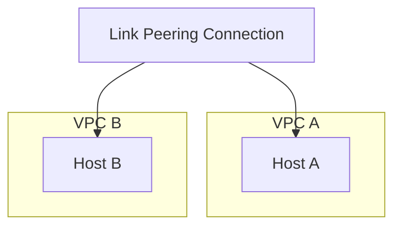
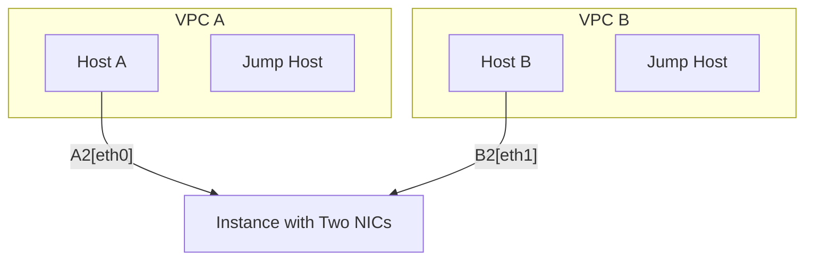

要在Google Cloud Platform (GCP)中实现跨VPC的通信，可以使用以下两种方法：

1. **VPC Peering**
2. **Shared VPC**

**方法一：VPC Peering**

VPC Peering允许两个不同的VPC网络直接相连，使它们的资源能够相互访问。以下是步骤：

### 1. 创建VPC Peering

在GCP控制台或使用gcloud命令行工具创建VPC Peering连接。

```sh
gcloud compute networks peerings create peering-between-vpc-a-and-b \
  --network=vpc-a \
  --peer-network=vpc-b
```

```sh
gcloud compute networks peerings create peering-between-vpc-b-and-a \
  --network=vpc-b \
  --peer-network=vpc-a
```

### 2. 配置路由

确保两个VPC网络中的子网能够通过peering连接进行通信。默认情况下，VPC Peering会自动创建所需的路由。

### 3. 设置防火墙规则

配置防火墙规则以允许跨VPC通信。可以基于服务账号、标签或IP地址进行配置。

**在VPC A中创建防火墙规则**

```sh
gcloud compute firewall-rules create allow-vpc-b-to-vpc-a \
  --network=vpc-a \
  --allow=tcp:80,tcp:443 \
  --source-ranges=10.0.1.0/24  # VPC B的子网范围
```

**在VPC B中创建防火墙规则**

```sh
gcloud compute firewall-rules create allow-vpc-a-to-vpc-b \
  --network=vpc-b \
  --allow=tcp:80,tcp:443 \
  --source-ranges=10.0.0.0/24  # VPC A的子网范围
```

### 4. 验证连接

验证从VPC A的主机是否能够访问VPC B的主机，以及反之亦然。

**方法二：Shared VPC**

如果你的组织中有多个项目，可以使用Shared VPC，允许多个项目中的VM实例使用一个共享的VPC网络。这种方式对于大型组织来说更加有效。

### 1. 设置Shared VPC

在Host项目中启用Shared VPC并将其附加到其他Service项目。

```sh
gcloud compute shared-vpc enable host-project-id
gcloud compute shared-vpc associated-projects add service-project-id --host-project=host-project-id
```

### 2. 分配子网

在Host项目中创建子网，并将其分配给Service项目中的资源。

### 3. 设置防火墙规则和路由

同样的，配置防火墙规则和路由以允许通信。

## 示例架构图 (Mermaid)



## 总结

使用VPC Peering是一种简单且有效的解决方案，通过配置VPC Peering连接、路由和防火墙规则，你可以在两个VPC之间实现通信。而Shared VPC适用于需要在多个项目中共享VPC资源的复杂环境。

请根据你的具体需求选择合适的方法，并按照上述步骤进行配置。

是的，你可以创建一个具有两块网卡的实例，分别连接到两个不同的VPC，从而充当桥接器或网关。这种方法也被称为"跳板实例"或"中转实例"。下面是具体的步骤：

### 1. 创建实例并添加两块网卡

在GCP控制台或使用gcloud命令行工具创建实例，并为其添加两个网络接口，每个接口连接到不同的VPC。

```sh
gcloud compute instances create instance-1 \
    --zone=us-central1-a \
    --machine-type=e2-medium \
    --subnet=subnet-a-vpc-a \
    --network-interface=subnet=subnet-b-vpc-b
```

这里的`subnet-a-vpc-a`和`subnet-b-vpc-b`分别是VPC A和VPC B中的子网。

### 2. 配置路由

需要确保从VPC A到VPC B的流量经过这个实例，以及从VPC B到VPC A的流量也经过这个实例。

**为VPC A创建路由**

```sh
gcloud compute routes create route-to-vpc-b \
    --network=vpc-a \
    --next-hop-instance=instance-1 \
    --next-hop-instance-zone=us-central1-a \
    --destination-range=10.0.1.0/24  # VPC B的子网范围
```

**为VPC B创建路由**

```sh
gcloud compute routes create route-to-vpc-a \
    --network=vpc-b \
    --next-hop-instance=instance-1 \
    --next-hop-instance-zone=us-central1-a \
    --destination-range=10.0.0.0/24  # VPC A的子网范围
```

### 3. 配置防火墙规则

确保防火墙规则允许跨VPC通信，可以基于实例标签、IP范围或服务账号进行配置。

**在VPC A中创建防火墙规则**

```sh
gcloud compute firewall-rules create allow-vpc-b-to-vpc-a \
    --network=vpc-a \
    --allow=tcp:80,tcp:443 \
    --source-ranges=10.0.1.0/24  # VPC B的子网范围
```

**在VPC B中创建防火墙规则**

```sh
gcloud compute firewall-rules create allow-vpc-a-to-vpc-b \
    --network=vpc-b \
    --allow=tcp:80,tcp:443 \
    --source-ranges=10.0.0.0/24  # VPC A的子网范围
```

### 4. 配置实例的路由和转发

在中转实例上启用IP转发，并配置iptables规则，以允许流量在两个VPC之间转发。

**启用IP转发**

在实例的启动脚本或SSH终端中执行以下命令：

```sh
sudo sysctl -w net.ipv4.ip_forward=1
```

**配置iptables规则**

```sh
sudo iptables -t nat -A POSTROUTING -o eth0 -j MASQUERADE
sudo iptables -t nat -A POSTROUTING -o eth1 -j MASQUERADE
sudo iptables -A FORWARD -i eth0 -o eth1 -j ACCEPT
sudo iptables -A FORWARD -i eth1 -o eth0 -j ACCEPT
```

这里`eth0`和`eth1`是实例的两个网络接口，根据实际情况调整。

### 总结

通过创建一个具有两块网卡的实例，并配置路由和防火墙规则，可以实现跨VPC的通信。这种方法适用于需要在不同VPC之间进行流量转发的情况，但需要注意中转实例的性能和安全性。

## 示例架构图 (Mermaid)



这个架构图展示了一个具有两块网卡的中转实例，实现了两个VPC之间的通信。

是的，通过配置实例内部的静态路由，可以实现跨VPC的通信。这样可以避免配置复杂的iptables规则。以下是详细步骤：

### 1. 创建具有两块网卡的实例

首先，创建一个具有两块网卡的实例，分别连接到VPC A和VPC B。

```sh
gcloud compute instances create instance-1 \
    --zone=us-central1-a \
    --machine-type=e2-medium \
    --network-interface subnet=subnet-a-vpc-a \
    --network-interface subnet=subnet-b-vpc-b
```

### 2. 启用IP转发

在实例上启用IP转发，以便该实例可以转发流量：

```sh
sudo sysctl -w net.ipv4.ip_forward=1
```

### 3. 配置静态路由

在实例内部配置静态路由，使其能够正确地转发流量。

假设：
- VPC A的子网范围是`10.0.0.0/24`
- VPC B的子网范围是`10.0.1.0/24`

编辑实例的路由表，以便流量可以通过该实例转发。

#### 配置静态路由到VPC A的子网

```sh
sudo ip route add 10.0.0.0/24 dev eth0
```

#### 配置静态路由到VPC B的子网

```sh
sudo ip route add 10.0.1.0/24 dev eth1
```

### 4. 配置防火墙规则

确保防火墙规则允许跨VPC通信，可以基于实例标签、IP范围或服务账号进行配置。

**在VPC A中创建防火墙规则**

```sh
gcloud compute firewall-rules create allow-vpc-b-to-vpc-a \
    --network=vpc-a \
    --allow=tcp:80,tcp:443 \
    --source-ranges=10.0.1.0/24  # VPC B的子网范围
```

**在VPC B中创建防火墙规则**

```sh
gcloud compute firewall-rules create allow-vpc-a-to-vpc-b \
    --network=vpc-b \
    --allow=tcp:80,tcp:443 \
    --source-ranges=10.0.0.0/24  # VPC A的子网范围
```

### 5. 配置VPC的路由表

在VPC的路由表中，添加静态路由，使流量能够通过该实例转发。

**为VPC A创建路由**

```sh
gcloud compute routes create route-to-vpc-b \
    --network=vpc-a \
    --next-hop-instance=instance-1 \
    --next-hop-instance-zone=us-central1-a \
    --destination-range=10.0.1.0/24  # VPC B的子网范围
```

**为VPC B创建路由**

```sh
gcloud compute routes create route-to-vpc-a \
    --network=vpc-b \
    --next-hop-instance=instance-1 \
    --next-hop-instance-zone=us-central1-a \
    --destination-range=10.0.0.0/24  # VPC A的子网范围
```

### 总结

通过在实例内部配置静态路由，并启用IP转发，可以实现跨VPC的通信。这种方法相对简单，且避免了配置复杂的iptables规则。

## 示例架构图 (Mermaid)


这个架构图展示了一个具有两块网卡的中转实例，通过配置静态路由，实现了两个VPC之间的通信。


