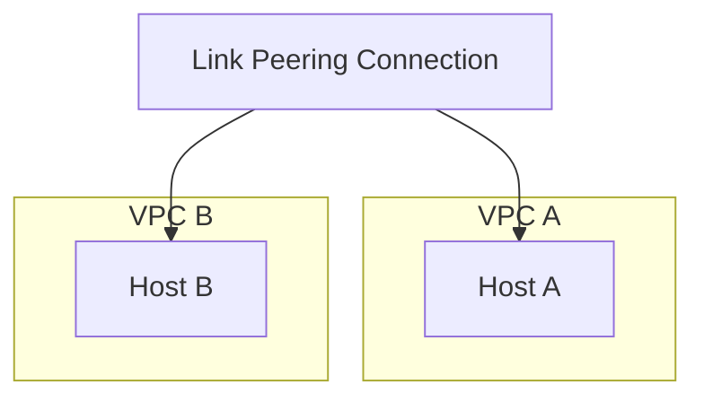
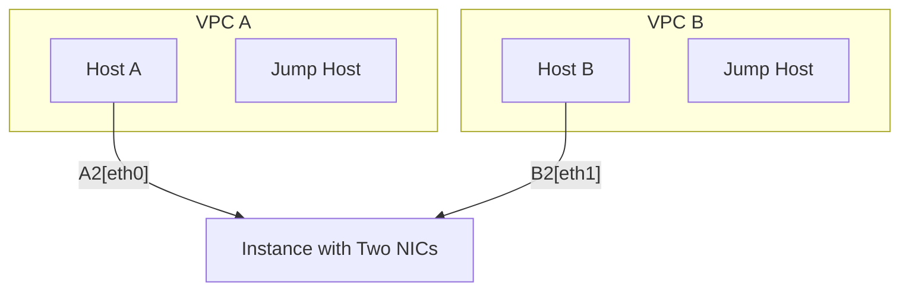

# Claude
您提出了一个关于 Google Cloud Platform (GCP) 中不同 VPC 之间网络连接的很好问题。我会分步骤为您解答，并提供几种可能的解决方案。

1. VPC 对等连接 (VPC Peering)

这是最直接的方法，不需要创建新的实例：


```bash
# 1. 在 GCP Console 中启用 VPC 对等
gcloud compute networks peerings create PEERING_NAME \
    --network=VPC_NETWORK_A \
    --peer-network=VPC_NETWORK_B \
    --auto-create-routes

# 2. 在另一个 VPC 中也创建对等连接
gcloud compute networks peerings create PEERING_NAME_REVERSE \
    --network=VPC_NETWORK_B \
    --peer-network=VPC_NETWORK_A \
    --auto-create-routes

# 3. 配置防火墙规则允许流量
gcloud compute firewall-rules create allow-vpc-a-to-b \
    --network=VPC_NETWORK_A \
    --allow tcp,udp,icmp \
    --source-ranges=[CIDR_OF_VPC_B]

gcloud compute firewall-rules create allow-vpc-b-to-a \
    --network=VPC_NETWORK_B \
    --allow tcp,udp,icmp \
    --source-ranges=[CIDR_OF_VPC_A]

# 如果使用服务账号，可以这样配置防火墙规则
gcloud compute firewall-rules create allow-sa-vpc-a-to-b \
    --network=VPC_NETWORK_A \
    --allow tcp,udp,icmp \
    --source-service-accounts=[SERVICE_ACCOUNT_EMAIL_VPC_B]

gcloud compute firewall-rules create allow-sa-vpc-b-to-a \
    --network=VPC_NETWORK_B \
    --allow tcp,udp,icmp \
    --source-service-accounts=[SERVICE_ACCOUNT_EMAIL_VPC_A]
```

这种方法不需要创建新的实例，直接在两个 VPC 之间建立对等连接。需要注意的是，您需要确保两个 VPC 的 IP 范围不重叠。

2. 共享 VPC

如果您的项目在同一个组织内，可以考虑使用共享 VPC：

1. 在主机项目中创建共享 VPC。
2. 将服务项目与主机项目关联。
3. 在共享 VPC 中创建子网，并将实例部署到这些子网中。

这样，不同项目的实例就可以在同一个 VPC 中通信。

3. VPN 或 Cloud Interconnect

对于更复杂的网络拓扑或跨区域/跨组织的情况，可以考虑使用 VPN 或 Cloud Interconnect。

4. 使用具有多个网络接口的实例

如果您决定创建一个新的实例作为网络桥接，这里是具体步骤：


```bash
# 1. 创建具有多个网络接口的实例
gcloud compute instances create INSTANCE_NAME \
    --network-interface=network=VPC_NETWORK_A,subnet=SUBNET_A \
    --network-interface=network=VPC_NETWORK_B,subnet=SUBNET_B \
    --zone=ZONE

# 2. 在实例内配置路由
# 登录到实例后，编辑 /etc/sysctl.conf 文件
echo "net.ipv4.ip_forward=1" | sudo tee -a /etc/sysctl.conf
sudo sysctl -p

# 3. 配置 iptables 规则允许转发
sudo iptables -A FORWARD -i ens4 -o ens5 -j ACCEPT
sudo iptables -A FORWARD -i ens5 -o ens4 -j ACCEPT

# 4. 在 VPC A 中添加路由
gcloud compute routes create route-to-vpc-b \
    --network=VPC_NETWORK_A \
    --destination-range=[CIDR_OF_VPC_B] \
    --next-hop-instance=INSTANCE_NAME \
    --next-hop-instance-zone=ZONE

# 5. 在 VPC B 中添加路由
gcloud compute routes create route-to-vpc-a \
    --network=VPC_NETWORK_B \
    --destination-range=[CIDR_OF_VPC_A] \
    --next-hop-instance=INSTANCE_NAME \
    --next-hop-instance-zone=ZONE
```

对于防火墙规则，您需要确保：

1. 允许从 VPC A 到桥接实例的流量
2. 允许从 VPC B 到桥接实例的流量
3. 允许桥接实例转发流量

如果使用服务账号，可以这样配置防火墙规则：

```bash
gcloud compute firewall-rules create allow-bridge-traffic \
    --network=VPC_NETWORK_A \
    --allow tcp,udp,icmp \
    --source-service-accounts=[SERVICE_ACCOUNT_EMAIL] \
    --target-service-accounts=[BRIDGE_INSTANCE_SERVICE_ACCOUNT]

# 对 VPC B 也需要类似的规则
```

总结：
1. VPC 对等连接是最简单的解决方案，适合大多数情况。
2. 共享 VPC 适合同一组织内的多个项目。
3. VPN 或 Cloud Interconnect 适合更复杂的网络需求。
4. 使用多网卡实例作为桥接是一种灵活但需要更多管理的方法。

选择哪种方法取决于您的具体需求、安全要求和网络复杂度。每种方法都有其优缺点，建议您根据实际情况选择最合适的方案。

您是否需要我对某个特定方案提供更详细的信息？​​​​​​​​​​​​​​​​

您的想法是正确的。使用具有多个网络接口的实例并在主机内添加静态路由确实是一种可行的方法。这种方法给了您更多的控制权，同时也相对简单。让我为您详细说明具体的操作步骤。


```bash
# 1. 创建具有多个网络接口的实例
gcloud compute instances create bridge-instance \
    --network-interface=network=VPC_NETWORK_A,subnet=SUBNET_A \
    --network-interface=network=VPC_NETWORK_B,subnet=SUBNET_B \
    --zone=ZONE \
    --image-family=debian-11 \
    --image-project=debian-cloud

# 2. 在桥接实例内配置 IP 转发
gcloud compute ssh bridge-instance --zone=ZONE

# 在实例内执行以下命令
sudo sysctl -w net.ipv4.ip_forward=1
echo "net.ipv4.ip_forward=1" | sudo tee -a /etc/sysctl.conf

# 3. 在 VPC A 的实例中添加静态路由
# 假设 VPC A 的实例 IP 是 10.0.1.2，VPC B 的 CIDR 是 10.0.2.0/24
# 桥接实例在 VPC A 中的 IP 是 10.0.1.10

gcloud compute ssh instance-in-vpc-a --zone=ZONE

# 在 VPC A 的实例内执行
sudo ip route add 10.0.2.0/24 via 10.0.1.10

# 4. 在 VPC B 的实例中添加静态路由
# 假设 VPC B 的实例 IP 是 10.0.2.2，VPC A 的 CIDR 是 10.0.1.0/24
# 桥接实例在 VPC B 中的 IP 是 10.0.2.10

gcloud compute ssh instance-in-vpc-b --zone=ZONE

# 在 VPC B 的实例内执行
sudo ip route add 10.0.1.0/24 via 10.0.2.10

# 5. 配置防火墙规则
gcloud compute firewall-rules create allow-vpc-a-to-bridge \
    --network=VPC_NETWORK_A \
    --allow tcp,udp,icmp \
    --source-ranges=10.0.1.0/24 \
    --target-tags=bridge-instance

gcloud compute firewall-rules create allow-vpc-b-to-bridge \
    --network=VPC_NETWORK_B \
    --allow tcp,udp,icmp \
    --source-ranges=10.0.2.0/24 \
    --target-tags=bridge-instance

# 如果使用服务账号，可以这样配置防火墙规则
gcloud compute firewall-rules create allow-sa-vpc-a-to-bridge \
    --network=VPC_NETWORK_A \
    --allow tcp,udp,icmp \
    --source-service-accounts=[SERVICE_ACCOUNT_EMAIL_VPC_A] \
    --target-service-accounts=[BRIDGE_INSTANCE_SERVICE_ACCOUNT]

gcloud compute firewall-rules create allow-sa-vpc-b-to-bridge \
    --network=VPC_NETWORK_B \
    --allow tcp,udp,icmp \
    --source-service-accounts=[SERVICE_ACCOUNT_EMAIL_VPC_B] \
    --target-service-accounts=[BRIDGE_INSTANCE_SERVICE_ACCOUNT]
```

以下是对上述步骤的详细解释：

1. 创建桥接实例：
   - 这个实例有两个网络接口，分别连接到 VPC A 和 VPC B。

2. 配置 IP 转发：
   - 在桥接实例上启用 IP 转发，允许它在两个网络之间转发数据包。

3. 在 VPC A 的实例中添加静态路由：
   - 这告诉 VPC A 的实例，要到达 VPC B 的网络，需要通过桥接实例。

4. 在 VPC B 的实例中添加静态路由：
   - 同样，这告诉 VPC B 的实例，要到达 VPC A 的网络，需要通过桥接实例。

5. 配置防火墙规则：
   - 这些规则允许流量从各个 VPC 到达桥接实例。
   - 如果您使用服务账号，可以基于服务账号来配置更精确的防火墙规则。

注意事项：
1. 请确保替换示例中的 IP 地址和 CIDR 范围为您实际环境中的值。
2. 静态路由需要在每个需要通信的实例上配置。如果有多个实例需要通信，您需要在每个实例上都添加相应的路由。
3. 这种方法需要您手动管理路由，如果网络拓扑发生变化，您需要更新所有相关实例的路由。
4. 记得定期检查和维护桥接实例，因为它成为了网络中的一个关键节点。

这种方法给了您很大的灵活性，但也需要更多的手动配置和维护。如果您的环境经常变化，或者需要大规模部署，可能需要考虑使用更自动化的解决方案，如 VPC 对等或共享 VPC。

您是否需要我对某个特定步骤提供更详细的解释？或者您是否有任何其他问题？​​​​​​​​​​​​​​​​


# ChatGPT 
要在Google Cloud Platform (GCP)中实现跨VPC的通信，可以使用以下两种方法：

1. **VPC Peering**
2. **Shared VPC**

**方法一：VPC Peering**

VPC Peering允许两个不同的VPC网络直接相连，使它们的资源能够相互访问。以下是步骤：

### 1. 创建VPC Peering

在GCP控制台或使用gcloud命令行工具创建VPC Peering连接。

```sh
gcloud compute networks peerings create peering-between-vpc-a-and-b \
  --network=vpc-a \
  --peer-network=vpc-b
```

```sh
gcloud compute networks peerings create peering-between-vpc-b-and-a \
  --network=vpc-b \
  --peer-network=vpc-a
```

### 2. 配置路由

确保两个VPC网络中的子网能够通过peering连接进行通信。默认情况下，VPC Peering会自动创建所需的路由。

### 3. 设置防火墙规则

配置防火墙规则以允许跨VPC通信。可以基于服务账号、标签或IP地址进行配置。

**在VPC A中创建防火墙规则**

```sh
gcloud compute firewall-rules create allow-vpc-b-to-vpc-a \
  --network=vpc-a \
  --allow=tcp:80,tcp:443 \
  --source-ranges=10.0.1.0/24  # VPC B的子网范围
```

**在VPC B中创建防火墙规则**

```sh
gcloud compute firewall-rules create allow-vpc-a-to-vpc-b \
  --network=vpc-b \
  --allow=tcp:80,tcp:443 \
  --source-ranges=10.0.0.0/24  # VPC A的子网范围
```

### 4. 验证连接

验证从VPC A的主机是否能够访问VPC B的主机，以及反之亦然。

**方法二：Shared VPC**

如果你的组织中有多个项目，可以使用Shared VPC，允许多个项目中的VM实例使用一个共享的VPC网络。这种方式对于大型组织来说更加有效。

### 1. 设置Shared VPC

在Host项目中启用Shared VPC并将其附加到其他Service项目。

```sh
gcloud compute shared-vpc enable host-project-id
gcloud compute shared-vpc associated-projects add service-project-id --host-project=host-project-id
```

### 2. 分配子网

在Host项目中创建子网，并将其分配给Service项目中的资源。

### 3. 设置防火墙规则和路由

同样的，配置防火墙规则和路由以允许通信。

## 示例架构图 (Mermaid)



## 总结

使用VPC Peering是一种简单且有效的解决方案，通过配置VPC Peering连接、路由和防火墙规则，你可以在两个VPC之间实现通信。而Shared VPC适用于需要在多个项目中共享VPC资源的复杂环境。

请根据你的具体需求选择合适的方法，并按照上述步骤进行配置。

是的，你可以创建一个具有两块网卡的实例，分别连接到两个不同的VPC，从而充当桥接器或网关。这种方法也被称为"跳板实例"或"中转实例"。下面是具体的步骤：

### 1. 创建实例并添加两块网卡

在GCP控制台或使用gcloud命令行工具创建实例，并为其添加两个网络接口，每个接口连接到不同的VPC。

```sh
gcloud compute instances create instance-1 \
    --zone=us-central1-a \
    --machine-type=e2-medium \
    --subnet=subnet-a-vpc-a \
    --network-interface=subnet=subnet-b-vpc-b
```

这里的`subnet-a-vpc-a`和`subnet-b-vpc-b`分别是VPC A和VPC B中的子网。

### 2. 配置路由

需要确保从VPC A到VPC B的流量经过这个实例，以及从VPC B到VPC A的流量也经过这个实例。

**为VPC A创建路由**

```sh
gcloud compute routes create route-to-vpc-b \
    --network=vpc-a \
    --next-hop-instance=instance-1 \
    --next-hop-instance-zone=us-central1-a \
    --destination-range=10.0.1.0/24  # VPC B的子网范围
```

**为VPC B创建路由**

```sh
gcloud compute routes create route-to-vpc-a \
    --network=vpc-b \
    --next-hop-instance=instance-1 \
    --next-hop-instance-zone=us-central1-a \
    --destination-range=10.0.0.0/24  # VPC A的子网范围
```

### 3. 配置防火墙规则

确保防火墙规则允许跨VPC通信，可以基于实例标签、IP范围或服务账号进行配置。

**在VPC A中创建防火墙规则**

```sh
gcloud compute firewall-rules create allow-vpc-b-to-vpc-a \
    --network=vpc-a \
    --allow=tcp:80,tcp:443 \
    --source-ranges=10.0.1.0/24  # VPC B的子网范围
```

**在VPC B中创建防火墙规则**

```sh
gcloud compute firewall-rules create allow-vpc-a-to-vpc-b \
    --network=vpc-b \
    --allow=tcp:80,tcp:443 \
    --source-ranges=10.0.0.0/24  # VPC A的子网范围
```

### 4. 配置实例的路由和转发

在中转实例上启用IP转发，并配置iptables规则，以允许流量在两个VPC之间转发。

**启用IP转发**

在实例的启动脚本或SSH终端中执行以下命令：

```sh
sudo sysctl -w net.ipv4.ip_forward=1
```

**配置iptables规则**

```sh
sudo iptables -t nat -A POSTROUTING -o eth0 -j MASQUERADE
sudo iptables -t nat -A POSTROUTING -o eth1 -j MASQUERADE
sudo iptables -A FORWARD -i eth0 -o eth1 -j ACCEPT
sudo iptables -A FORWARD -i eth1 -o eth0 -j ACCEPT
```

这里`eth0`和`eth1`是实例的两个网络接口，根据实际情况调整。

### 总结

通过创建一个具有两块网卡的实例，并配置路由和防火墙规则，可以实现跨VPC的通信。这种方法适用于需要在不同VPC之间进行流量转发的情况，但需要注意中转实例的性能和安全性。

## 示例架构图 (Mermaid)



这个架构图展示了一个具有两块网卡的中转实例，实现了两个VPC之间的通信。

是的，通过配置实例内部的静态路由，可以实现跨VPC的通信。这样可以避免配置复杂的iptables规则。以下是详细步骤：

### 1. 创建具有两块网卡的实例

首先，创建一个具有两块网卡的实例，分别连接到VPC A和VPC B。

```sh
gcloud compute instances create instance-1 \
    --zone=us-central1-a \
    --machine-type=e2-medium \
    --network-interface subnet=subnet-a-vpc-a \
    --network-interface subnet=subnet-b-vpc-b
```

### 2. 启用IP转发

在实例上启用IP转发，以便该实例可以转发流量：

```sh
sudo sysctl -w net.ipv4.ip_forward=1
```

### 3. 配置静态路由

在实例内部配置静态路由，使其能够正确地转发流量。

假设：
- VPC A的子网范围是`10.0.0.0/24`
- VPC B的子网范围是`10.0.1.0/24`

编辑实例的路由表，以便流量可以通过该实例转发。

#### 配置静态路由到VPC A的子网

```sh
sudo ip route add 10.0.0.0/24 dev eth0
```

#### 配置静态路由到VPC B的子网

```sh
sudo ip route add 10.0.1.0/24 dev eth1
```

### 4. 配置防火墙规则

确保防火墙规则允许跨VPC通信，可以基于实例标签、IP范围或服务账号进行配置。

**在VPC A中创建防火墙规则**

```sh
gcloud compute firewall-rules create allow-vpc-b-to-vpc-a \
    --network=vpc-a \
    --allow=tcp:80,tcp:443 \
    --source-ranges=10.0.1.0/24  # VPC B的子网范围
```

**在VPC B中创建防火墙规则**

```sh
gcloud compute firewall-rules create allow-vpc-a-to-vpc-b \
    --network=vpc-b \
    --allow=tcp:80,tcp:443 \
    --source-ranges=10.0.0.0/24  # VPC A的子网范围
```

### 5. 配置VPC的路由表

在VPC的路由表中，添加静态路由，使流量能够通过该实例转发。

**为VPC A创建路由**

```sh
gcloud compute routes create route-to-vpc-b \
    --network=vpc-a \
    --next-hop-instance=instance-1 \
    --next-hop-instance-zone=us-central1-a \
    --destination-range=10.0.1.0/24  # VPC B的子网范围
```

**为VPC B创建路由**

```sh
gcloud compute routes create route-to-vpc-a \
    --network=vpc-b \
    --next-hop-instance=instance-1 \
    --next-hop-instance-zone=us-central1-a \
    --destination-range=10.0.0.0/24  # VPC A的子网范围
```

### 总结

通过在实例内部配置静态路由，并启用IP转发，可以实现跨VPC的通信。这种方法相对简单，且避免了配置复杂的iptables规则。

## 示例架构图 (Mermaid)


这个架构图展示了一个具有两块网卡的中转实例，通过配置静态路由，实现了两个VPC之间的通信。

# gemini
您遇到的问题是跨 VPC 网络访问的常见问题。为了实现 A VPC 主机访问 B VPC 主机，您可以通过创建一个跨 VPC 的实例，并配置静态路由来实现。

**步骤如下：**

1. **创建跨 VPC 实例：**
   - 在 Google Cloud Console 中，选择“Compute Engine” > “VM 实例”。
   - 点击“创建”。
   - 在“网络”部分，选择“创建新的网络”。
   - 在“网络”部分，选择“创建新的子网”。
   - 在“子网”部分，选择一个子网，该子网跨越 A VPC 和 B VPC。
   - 在“网络接口”部分，添加两个网络接口，分别连接到 A VPC 和 B VPC。
   - 配置其他实例属性，例如机器类型、操作系统等。
   - 点击“创建”。

2. **配置静态路由：**
   - 在 Google Cloud Console 中，选择“虚拟私有云” > “路由”。
   - 点击“创建路由”。
   - 在“网络”部分，选择跨 VPC 的网络。
   - 在“名称”部分，输入一个路由名称。
   - 在“网络”部分，选择跨 VPC 的网络。
   - 在“目的地范围”部分，输入 B VPC 的子网 CIDR 范围。
   - 在“下一跳”部分，选择跨 VPC 实例的内部 IP 地址。
   - 点击“创建”。

3. **配置防火墙规则：**
   - 在 Google Cloud Console 中，选择“虚拟私有云” > “防火墙”。
   - 点击“创建防火墙规则”。
   - 在“名称”部分，输入一个防火墙规则名称。
   - 在“网络”部分，选择跨 VPC 的网络。
   - 在“方向”部分，选择“入站”。
   - 在“目标”部分，选择“所有实例”。
   - 在“协议和端口”部分，选择允许访问的协议和端口。
   - 在“来源”部分，选择 A VPC 的子网 CIDR 范围。
   - 点击“创建”。

**详细解释：**

* **创建跨 VPC 实例：** 创建一个拥有两个网络接口的实例，分别连接到 A VPC 和 B VPC。这使得实例可以同时访问两个 VPC 的资源。
* **配置静态路由：**  通过添加静态路由，您可以告诉实例如何将流量发送到 B VPC。当实例需要访问 B VPC 的资源时，它会检查路由表，并根据目的地范围找到相应的路由。
* **配置防火墙规则：**  防火墙规则允许 A VPC 中的实例访问 B VPC 中的实例。您需要配置允许来自 A VPC 的流量，并允许访问您需要访问的协议和端口。

**示例：**

假设您的 A VPC 子网 CIDR 范围为 `10.128.0.0/16`，B VPC 子网 CIDR 范围为 `10.64.0.0/16`，跨 VPC 实例的内部 IP 地址为 `10.128.1.10`。

**静态路由配置：**

* 目的地范围：`10.64.0.0/16`
* 下一跳：`10.128.1.10`

**防火墙规则配置：**

* 来源：`10.128.0.0/16`
* 目标：`所有实例`
* 协议和端口：`TCP:80` （假设您需要访问 B VPC 中的 Web 服务器）

**注意：**

* 确保您已在 A VPC 和 B VPC 中创建了相应的子网。
* 确保跨 VPC 实例拥有访问 B VPC 资源所需的权限。
* 您可以根据您的具体需求调整静态路由和防火墙规则的配置。

使用这种方法，您可以轻松地实现跨 VPC 网络访问，并确保 A VPC 中的实例能够访问 B VPC 中的资源。

好的，以下是使用 `gcloud` 命令实现跨 VPC 网络访问的步骤：

**1. 创建跨 VPC 实例：**

```bash
# 创建跨 VPC 网络
gcloud compute networks create cross-vpc-network \
  --project=YOUR_PROJECT_ID

# 创建跨 VPC 子网
gcloud compute networks subnets create cross-vpc-subnet \
  --network=cross-vpc-network \
  --region=YOUR_REGION \
  --range=10.100.0.0/24 \
  --project=YOUR_PROJECT_ID

# 创建跨 VPC 实例
gcloud compute instances create cross-vpc-instance \
  --network-interface network=cross-vpc-network,subnetwork=cross-vpc-subnet,network-ip=10.100.1.10 \
  --network-interface network=YOUR_A_VPC_NETWORK,subnetwork=YOUR_A_VPC_SUBNET,network-ip=10.128.1.10 \
  --machine-type=n1-standard-1 \
  --zone=YOUR_ZONE \
  --project=YOUR_PROJECT_ID
```

**解释：**

* `gcloud compute networks create cross-vpc-network`: 创建名为 `cross-vpc-network` 的网络。
* `gcloud compute networks subnets create cross-vpc-subnet`:  创建名为 `cross-vpc-subnet` 的子网，该子网属于 `cross-vpc-network` 网络，并跨越 A VPC 和 B VPC。
* `gcloud compute instances create cross-vpc-instance`: 创建名为 `cross-vpc-instance` 的实例，该实例拥有两个网络接口，分别连接到 `cross-vpc-subnet` 和 `YOUR_A_VPC_SUBNET`。

**2. 配置静态路由：**

```bash
# 创建静态路由
gcloud compute routes create cross-vpc-route \
  --network=cross-vpc-network \
  --dest-range=10.64.0.0/16 \
  --next-hop-ip=10.100.1.10 \
  --project=YOUR_PROJECT_ID
```

**解释：**

* `gcloud compute routes create cross-vpc-route`: 创建名为 `cross-vpc-route` 的静态路由。
* `--dest-range=10.64.0.0/16`: 设置路由的目标范围为 B VPC 的子网 CIDR 范围。
* `--next-hop-ip=10.100.1.10`: 设置下一跳为跨 VPC 实例的内部 IP 地址。

**3. 配置防火墙规则：**

```bash
# 创建防火墙规则
gcloud compute firewall-rules create cross-vpc-firewall \
  --network=cross-vpc-network \
  --allow=tcp:80 \
  --source-ranges=10.128.0.0/16 \
  --project=YOUR_PROJECT_ID
```

**解释：**

* `gcloud compute firewall-rules create cross-vpc-firewall`: 创建名为 `cross-vpc-firewall` 的防火墙规则。
* `--allow=tcp:80`: 允许来自 A VPC 的 TCP 端口 80 的流量。
* `--source-ranges=10.128.0.0/16`: 设置来源范围为 A VPC 的子网 CIDR 范围。

**注意：**

* 请将 `YOUR_PROJECT_ID`、`YOUR_REGION`、`YOUR_ZONE`、`YOUR_A_VPC_NETWORK`、`YOUR_A_VPC_SUBNET` 替换为您的实际值。
* 确保您已在 A VPC 和 B VPC 中创建了相应的子网。
* 确保跨 VPC 实例拥有访问 B VPC 资源所需的权限。
* 您可以根据您的具体需求调整静态路由和防火墙规则的配置。

通过以上步骤，您便可以使用 `gcloud` 命令创建跨 VPC 实例、配置静态路由和防火墙规则，从而实现 A VPC 中的实例访问 B VPC 中的资源。
