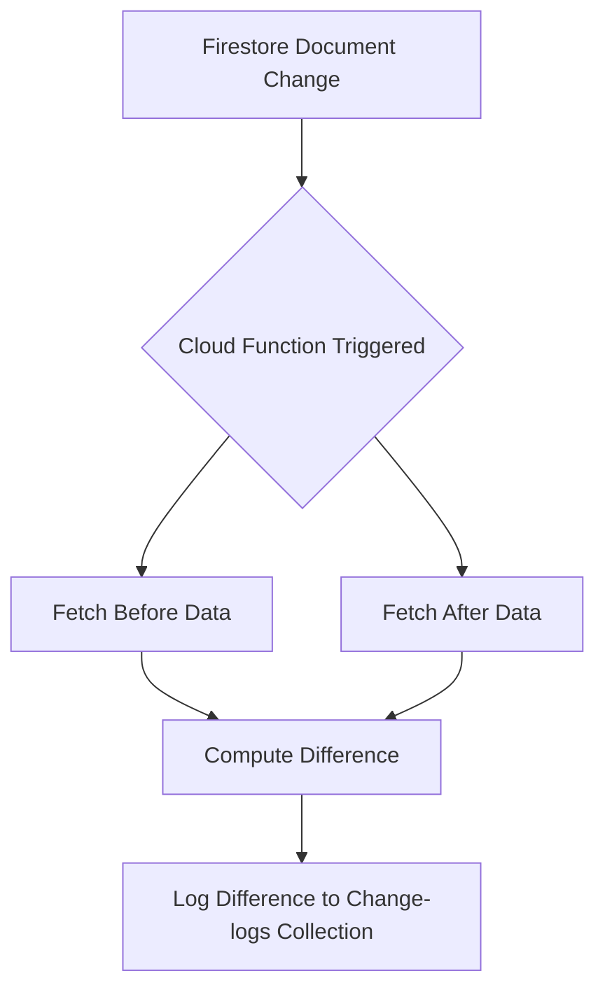

在Firestore中，你可以通过以下几种方法来比较更新前和更新后的数据差异：

1. **使用Cloud Functions进行变更监听**：你可以使用Cloud Functions来监听Firestore文档的变化。在文档更新或删除时，Cloud Function会被触发，并可以记录变更前后的数据，便于后续比较。

2. **手动记录变更日志**：在每次更新或删除操作前，手动将旧的数据备份到一个日志集合中。然后在需要比较时，取出日志中的旧数据与当前数据进行比较。

3. **Firestore内置的FieldValue.serverTimestamp**：在每次更新文档时，使用`FieldValue.serverTimestamp()`更新一个时间戳字段，这样你可以知道每次更新的时间，便于对比不同时间点的数据。

下面是每种方法的具体实现：

### 方法一：使用Cloud Functions进行变更监听

1. **创建一个Cloud Function来监听文档变化**：
```javascript
const functions = require('firebase-functions');
const admin = require('firebase-admin');
admin.initializeApp();

exports.logDocumentChanges = functions.firestore
    .document('your-collection/{docId}')
    .onWrite((change, context) => {
        const beforeData = change.before.data(); // 数据更新前的内容
        const afterData = change.after.data();   // 数据更新后的内容

        // 比较数据的差异
        const diff = getDifference(beforeData, afterData);

        // 记录变更日志
        return admin.firestore().collection('change-logs').add({
            docId: context.params.docId,
            timestamp: admin.firestore.FieldValue.serverTimestamp(),
            diff: diff
        });
    });

function getDifference(obj1, obj2) {
    let diff = {};
    for (let key in obj1) {
        if (obj2[key] !== obj1[key]) {
            diff[key] = { before: obj1[key], after: obj2[key] };
        }
    }
    for (let key in obj2) {
        if (!obj1.hasOwnProperty(key)) {
            diff[key] = { before: null, after: obj2[key] };
        }
    }
    return diff;
}
```

2. **部署Cloud Function**：
```bash
firebase deploy --only functions
```

### 方法二：手动记录变更日志

1. **在每次更新或删除操作前备份旧数据**：
```javascript
const admin = require('firebase-admin');
admin.initializeApp();
const db = admin.firestore();

async function updateDocument(docId, newData) {
    const docRef = db.collection('your-collection').doc(docId);
    const doc = await docRef.get();
    const oldData = doc.data();

    // 记录旧数据到日志集合
    await db.collection('change-logs').add({
        docId: docId,
        timestamp: admin.firestore.FieldValue.serverTimestamp(),
        oldData: oldData
    });

    // 更新文档
    await docRef.update(newData);
}
```

### 方法三：使用FieldValue.serverTimestamp记录时间戳

1. **在每次更新文档时，添加时间戳字段**：
```javascript
const admin = require('firebase-admin');
admin.initializeApp();
const db = admin.firestore();

async function updateDocumentWithTimestamp(docId, newData) {
    const docRef = db.collection('your-collection').doc(docId);

    // 更新文档并添加时间戳
    await docRef.update({
        ...newData,
        updatedAt: admin.firestore.FieldValue.serverTimestamp()
    });
}
```

2. **获取并比较不同时间点的数据**：
```javascript
async function compareDocumentVersions(docId, timestamp1, timestamp2) {
    const docRef = db.collection('your-collection').doc(docId);

    const snapshot1 = await docRef.where('updatedAt', '==', timestamp1).get();
    const snapshot2 = await docRef.where('updatedAt', '==', timestamp2).get();

    const data1 = snapshot1.docs[0]?.data();
    const data2 = snapshot2.docs[0]?.data();

    if (data1 && data2) {
        const diff = getDifference(data1, data2);
        console.log(diff);
    } else {
        console.log('No data found for the given timestamps.');
    }
}
```

### Mermaid流程图

以下是使用Cloud Functions进行变更监听的流程图：



以上方法可以帮助你比较Firestore文档更新前后的差异，选择合适的方法取决于你的具体需求和系统架构。

## 比较Firestore表中更改的几种方法

对于Firestore中的某个表，如果您更新或删除了字段，并想比较更新前后的具体差异，可以使用以下几种方法：

**1. 使用Firestore观察监听器 (Watch Listeners)**

Firestore观察监听器允许您实时监听文档或集合的更改。您可以使用观察监听器跟踪对特定字段或文档的更改，然后将新数据与旧数据进行比较以查看更改内容。

以下是如何使用观察监听器跟踪文档中字段更改的示例：

```javascript
const db = firebase.firestore();

const docRef = db.collection('users').doc('user1');

docRef.onSnapshot(docSnapshot => {
  const data = docSnapshot.data();
  console.log('Document updated:', data);

  // 比较新数据和旧数据以查看更改内容
  const oldData = docSnapshot.previousData();
  if (oldData) {
    for (const field in data) {
      if (data[field] !== oldData[field]) {
        console.log('Field updated:', field, data[field], oldData[field]);
      }
    }
  }
});
```

**2. 使用Cloud Functions**

Cloud Functions是服务器端函数，可由Firestore数据更改触发。您可以使用Cloud Function跟踪对特定字段或文档的更改，然后将更改存储在单独的集合或数据库中。

以下是如何使用Cloud Function跟踪文档中字段更改的示例：

```javascript
exports.onDocumentChange = functions.firestore.document('users/{userId}').onSnapshot(event => {
  const data = event.after.data();
  const oldData = event.before.data();

  // 比较新数据和旧数据以查看更改内容
  for (const field in data) {
    if (data[field] !== oldData[field]) {
      const change = {
        userId: event.params.userId,
        field: field,
        newValue: data[field],
        oldValue: oldData[field],
        timestamp: firebase.firestore.FieldValue.serverTimestamp()
      };

      // 将更改存储在单独的集合或数据库中
      db.collection('changes').add(change);
    }
  }
});
```

**3. 使用第三方库**

有许多可用的第三方库可以帮助您跟踪Firestore数据中的更改。这些库可以提供其他功能，例如跟踪对多个字段或文档的更改或存储更改历史记录数据的能力。

以下是一些流行的用于跟踪Firestore更改的第三方库：

* Firestore Change Data Capture [已删除无效网址]
* Firestore Audit Log [已删除无效网址]
* Firestore Watch History [已删除无效网址]

**选择跟踪Firestore表中更改的方法取决于您的特定需求和要求。** 如果您只需要跟踪几个字段或文档的更改，那么使用Firestore观察监听器可能是一个不错的选择。如果您需要跟踪大量字段或文档的更改，或者需要存储更改历史记录数据，那么使用Cloud Functions或第三方库可能是一个更好的选择。

**选择方法时需要考虑的其他一些事项：**

* **性能:** 观察监听器可能占用大量资源，因此您应该只将它们用于需要实时跟踪更改的字段或文档。
* **数据存储:** 如果您要存储更改历史记录数据，则需要考虑需要多少存储空间。
* **安全:** 确保您使用安全的方法来存储和访问更改历史记录数据。

