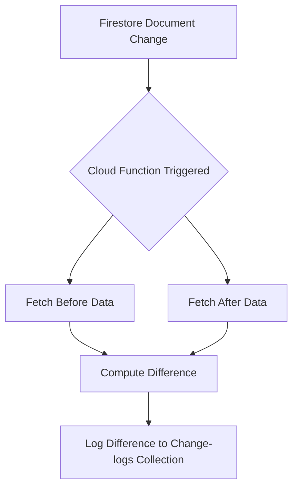

在Firestore中，你可以通过以下几种方法来比较更新前和更新后的数据差异：

1. **使用Cloud Functions进行变更监听**：你可以使用Cloud Functions来监听Firestore文档的变化。在文档更新或删除时，Cloud Function会被触发，并可以记录变更前后的数据，便于后续比较。

2. **手动记录变更日志**：在每次更新或删除操作前，手动将旧的数据备份到一个日志集合中。然后在需要比较时，取出日志中的旧数据与当前数据进行比较。

3. **Firestore内置的FieldValue.serverTimestamp**：在每次更新文档时，使用`FieldValue.serverTimestamp()`更新一个时间戳字段，这样你可以知道每次更新的时间，便于对比不同时间点的数据。

下面是每种方法的具体实现：

### 方法一：使用Cloud Functions进行变更监听

1. **创建一个Cloud Function来监听文档变化**：
```javascript
const functions = require('firebase-functions');
const admin = require('firebase-admin');
admin.initializeApp();

exports.logDocumentChanges = functions.firestore
    .document('your-collection/{docId}')
    .onWrite((change, context) => {
        const beforeData = change.before.data(); // 数据更新前的内容
        const afterData = change.after.data();   // 数据更新后的内容

        // 比较数据的差异
        const diff = getDifference(beforeData, afterData);

        // 记录变更日志
        return admin.firestore().collection('change-logs').add({
            docId: context.params.docId,
            timestamp: admin.firestore.FieldValue.serverTimestamp(),
            diff: diff
        });
    });

function getDifference(obj1, obj2) {
    let diff = {};
    for (let key in obj1) {
        if (obj2[key] !== obj1[key]) {
            diff[key] = { before: obj1[key], after: obj2[key] };
        }
    }
    for (let key in obj2) {
        if (!obj1.hasOwnProperty(key)) {
            diff[key] = { before: null, after: obj2[key] };
        }
    }
    return diff;
}
```

2. **部署Cloud Function**：
```bash
firebase deploy --only functions
```

### 方法二：手动记录变更日志

1. **在每次更新或删除操作前备份旧数据**：
```javascript
const admin = require('firebase-admin');
admin.initializeApp();
const db = admin.firestore();

async function updateDocument(docId, newData) {
    const docRef = db.collection('your-collection').doc(docId);
    const doc = await docRef.get();
    const oldData = doc.data();

    // 记录旧数据到日志集合
    await db.collection('change-logs').add({
        docId: docId,
        timestamp: admin.firestore.FieldValue.serverTimestamp(),
        oldData: oldData
    });

    // 更新文档
    await docRef.update(newData);
}
```

### 方法三：使用FieldValue.serverTimestamp记录时间戳

1. **在每次更新文档时，添加时间戳字段**：
```javascript
const admin = require('firebase-admin');
admin.initializeApp();
const db = admin.firestore();

async function updateDocumentWithTimestamp(docId, newData) {
    const docRef = db.collection('your-collection').doc(docId);

    // 更新文档并添加时间戳
    await docRef.update({
        ...newData,
        updatedAt: admin.firestore.FieldValue.serverTimestamp()
    });
}
```

2. **获取并比较不同时间点的数据**：
```javascript
async function compareDocumentVersions(docId, timestamp1, timestamp2) {
    const docRef = db.collection('your-collection').doc(docId);

    const snapshot1 = await docRef.where('updatedAt', '==', timestamp1).get();
    const snapshot2 = await docRef.where('updatedAt', '==', timestamp2).get();

    const data1 = snapshot1.docs[0]?.data();
    const data2 = snapshot2.docs[0]?.data();

    if (data1 && data2) {
        const diff = getDifference(data1, data2);
        console.log(diff);
    } else {
        console.log('No data found for the given timestamps.');
    }
}
```

### Mermaid流程图

以下是使用Cloud Functions进行变更监听的流程图：



以上方法可以帮助你比较Firestore文档更新前后的差异，选择合适的方法取决于你的具体需求和系统架构。

## 比较Firestore表中更改的几种方法

对于Firestore中的某个表，如果您更新或删除了字段，并想比较更新前后的具体差异，可以使用以下几种方法：

**1. 使用Firestore观察监听器 (Watch Listeners)**

Firestore观察监听器允许您实时监听文档或集合的更改。您可以使用观察监听器跟踪对特定字段或文档的更改，然后将新数据与旧数据进行比较以查看更改内容。

以下是如何使用观察监听器跟踪文档中字段更改的示例：

```javascript
const db = firebase.firestore();

const docRef = db.collection('users').doc('user1');

docRef.onSnapshot(docSnapshot => {
  const data = docSnapshot.data();
  console.log('Document updated:', data);

  // 比较新数据和旧数据以查看更改内容
  const oldData = docSnapshot.previousData();
  if (oldData) {
    for (const field in data) {
      if (data[field] !== oldData[field]) {
        console.log('Field updated:', field, data[field], oldData[field]);
      }
    }
  }
});
```

**2. 使用Cloud Functions**

Cloud Functions是服务器端函数，可由Firestore数据更改触发。您可以使用Cloud Function跟踪对特定字段或文档的更改，然后将更改存储在单独的集合或数据库中。

以下是如何使用Cloud Function跟踪文档中字段更改的示例：

```javascript
exports.onDocumentChange = functions.firestore.document('users/{userId}').onSnapshot(event => {
  const data = event.after.data();
  const oldData = event.before.data();

  // 比较新数据和旧数据以查看更改内容
  for (const field in data) {
    if (data[field] !== oldData[field]) {
      const change = {
        userId: event.params.userId,
        field: field,
        newValue: data[field],
        oldValue: oldData[field],
        timestamp: firebase.firestore.FieldValue.serverTimestamp()
      };

      // 将更改存储在单独的集合或数据库中
      db.collection('changes').add(change);
    }
  }
});
```

**3. 使用第三方库**

有许多可用的第三方库可以帮助您跟踪Firestore数据中的更改。这些库可以提供其他功能，例如跟踪对多个字段或文档的更改或存储更改历史记录数据的能力。

以下是一些流行的用于跟踪Firestore更改的第三方库：

* Firestore Change Data Capture [已删除无效网址]
* Firestore Audit Log [已删除无效网址]
* Firestore Watch History [已删除无效网址]

**选择跟踪Firestore表中更改的方法取决于您的特定需求和要求。** 如果您只需要跟踪几个字段或文档的更改，那么使用Firestore观察监听器可能是一个不错的选择。如果您需要跟踪大量字段或文档的更改，或者需要存储更改历史记录数据，那么使用Cloud Functions或第三方库可能是一个更好的选择。

**选择方法时需要考虑的其他一些事项：**

* **性能:** 观察监听器可能占用大量资源，因此您应该只将它们用于需要实时跟踪更改的字段或文档。
* **数据存储:** 如果您要存储更改历史记录数据，则需要考虑需要多少存储空间。
* **安全:** 确保您使用安全的方法来存储和访问更改历史记录数据。


这是一个很好的问题。在使用Cloud Firestore时，跟踪文档变更是很重要的，尤其是当你需要知道具体哪些字段被修改了。有几种方法可以实现这一点：

1. 使用Cloud Firestore的监听器：
   - 你可以在客户端（如iOS、Android或Web）使用实时监听器来监听文档的变化。
   - 监听器会给你一个`DocumentSnapshot`，它包含了文档的旧值和新值。
   - 你可以比较这两个快照，找出哪些字段发生了变化。

   示例代码（JavaScript）：
   ```javascript
   db.collection("cities").doc("LA")
     .onSnapshot((doc) => {
       const oldData = doc.data();
       const newData = doc.data();
       const changes = {};
       
       for (let field in newData) {
         if (oldData[field] !== newData[field]) {
           changes[field] = {
             oldValue: oldData[field],
             newValue: newData[field]
           };
         }
       }
       
       console.log("Changes:", changes);
     });
   ```

2. 使用Cloud Functions的onCreate/onUpdate/onDelete触发器：
   - 你可以编写Cloud Functions，在文档创建、更新或删除时触发。
   - 对于`onUpdate`触发器，你会得到一个`Change`对象，包含文档的旧值和新值。
   - 比较这两个值，你就可以找出哪些字段被修改了。

   示例代码（Node.js）：
   ```javascript
   exports.logCityChanges = functions.firestore
     .document('cities/{cityId}')
     .onUpdate((change, context) => {
       const newValue = change.after.data();
       const oldValue = change.before.data();
       const changes = {};
       
       for (let field in newValue) {
         if (oldValue[field] !== newValue[field]) {
           changes[field] = {
             oldValue: oldValue[field],
             newValue: newValue[field]
           };
         }
       }
       
       console.log(`City ${context.params.cityId} changes:`, changes);
       return null;
     });
   ```

3. 手动跟踪：
   - 在你的应用逻辑中，在更新文档之前先获取当前文档的数据。
   - 更新后，再次获取文档数据，然后比较两者的差异。
   - 这种方法需要你自己编写更多的代码，但它给你更多的控制权。

   示例代码（JavaScript）：
   ```javascript
   async function updateCity(cityId, updates) {
     const cityRef = db.collection("cities").doc(cityId);
     const oldData = (await cityRef.get()).data();
     
     await cityRef.update(updates);
     
     const newData = (await cityRef.get()).data();
     const changes = {};
     
     for (let field in newData) {
       if (oldData[field] !== newData[field]) {
         changes[field] = {
           oldValue: oldData[field],
           newValue: newData[field]
         };
       }
     }
     
     console.log("Changes:", changes);
   }
   
   updateCity("LA", { population: 4000000 });
   ```

4. 使用第三方库：
   - 有一些库可以帮助你比较对象的差异，如JavaScript中的`deep-diff`。
   - 这些库可以更容易地找出哪些字段被添加、删除或修改了。

   示例代码（使用`deep-diff`）：
   ```javascript
   const diff = require('deep-diff').diff;

   // ... 获取oldData和newData后
   const changes = diff(oldData, newData);
   console.log("Changes:", changes);
   ```

选择哪种方法取决于你的具体需求：

- 如果你需要实时反应变化，使用监听器。
- 如果你需要在服务器端处理变化（如记录日志、触发其他操作），使用Cloud Functions。
- 如果你想在客户端完全控制这个过程，使用手动跟踪。
- 如果你需要更详细的差异比较，考虑使用第三方库。

记住，无论你选择哪种方法，都要考虑性能影响。频繁的文档更新可能导致大量的比较操作，这可能会影响你的应用性能。因此，要根据你的使用场景选择最合适的方法。​​​​​​​​​​​​​​​​


Firestore provides a few ways to compare the before and after states of a document, especially when it comes to updates. Here are a few approaches:

**1. Using `onSnapshot` and `diff`**

You can use the `onSnapshot` method to listen to changes to a document, and then use a diffing library to compare the before and after states.

Here's an example:
```javascript
const docRef = db.collection('myCollection').doc('myDocument');

let beforeDoc;

docRef.onSnapshot(doc => {
  const afterDoc = doc.data();
  if (beforeDoc) {
    const diff = diffJson(beforeDoc, afterDoc);
    console.log('Changes:', diff);
  }
  beforeDoc = afterDoc;
}, error => {
  console.error('Error:', error);
});
```
In this example, we store the previous document state in the `beforeDoc` variable. When the document changes, we calculate the diff between the previous and current states using a diffing library like `diff-json`.

**2. Using `update` with `getOptions`**

When you update a document, you can use the `getOptions` parameter to retrieve the previous document state.

Here's an example:
```javascript
const docRef = db.collection('myCollection').doc('myDocument');

docRef.update({
  field1: 'new value',
  field2: 'another new value'
}, {
  getOptions: {
    source: 'erver'
  }
}).then(result => {
  const beforeDoc = result._snapshot.before.data();
  const afterDoc = result._snapshot.after.data();
  const diff = diffJson(beforeDoc, afterDoc);
  console.log('Changes:', diff);
});
```
In this example, we pass an options object to the `update` method with `getOptions` set to `{ source: 'erver' }`. This retrieves the previous document state from the server. We then calculate the diff between the previous and current states.

**3. Using `FieldValue` with `arrayUnion` or `arrayRemove`**

If you're updating an array field, you can use `FieldValue` with `arrayUnion` or `arrayRemove` to track the changes.

Here's an example:
```javascript
const docRef = db.collection('myCollection').doc('myDocument');

const beforeArray = ['item1', 'item2'];
const afterArray = ['item1', 'item2', 'item3'];

docRef.update({
  arrayField: firebase.firestore.FieldValue.arrayUnion('item3')
}).then(result => {
  const diff = afterArray.filter(x =>!beforeArray.includes(x));
  console.log('Changes:', diff);
});
```
In this example, we use `arrayUnion` to add a new item to the array field. We then calculate the diff by filtering the new array to find the items that were added.

These are just a few approaches to comparing the before and after states of a Firestore document. The best method for you will depend on your specific use case and requirements.


在Google Cloud Platform (GCP) 的 Firestore 数据库中，如果您想要比较一个文档在更新前后的差异，可以使用 Firestore 的文档快照功能。文档快照可以捕捉文档在某个时间点的状态，通过比较更新前后的快照，您可以得知哪些字段被更新、删除或添加。
以下是一个基于 Firestore SDK 的高级步骤，用于比较文档更新前后的差异：
1. **获取更新前的文档快照**：
   在更新操作之前，获取当前文档的快照。
   ```javascript
   const beforeUpdateDocumentSnapshot = await firestore.doc('your-collection/your-document-id').get();
   ```
2. **执行更新操作**：
   进行您需要的更新操作，比如更新或删除字段。
   ```javascript
   await firestore.doc('your-collection/your-document-id').update({
       // 您要更新的字段
       yourField: newValue,
       // ...其他字段
   });
   ```
3. **获取更新后的文档快照**：
   更新操作之后，再次获取文档的快照。
   ```javascript
   const afterUpdateDocumentSnapshot = await firestore.doc('your-collection/your-document-id').get();
   ```
4. **比较快照差异**：
   通过比较这两个快照，您可以检查哪些字段发生了变化。
   ```javascript
   const changes = afterUpdateDocumentSnapshot.diff(beforeUpdateDocumentSnapshot);
   // 检查字段是否被添加、更新或删除
   changes.forEach(change => {
       if (change.type === 'added') {
           console.log(`Field ${change.field} was added with value: ${change.valueAfter}`);
       } else if (change.type === 'modified') {
           console.log(`Field ${change.field} was modified. Before: ${change.valueBefore}, After: ${change.valueAfter}`);
       } else if (change.type === 'removed') {
           console.log(`Field ${change.field} was removed. Its value was: ${change.valueBefore}`);
       }
   });
   ```
请注意，Firestore SDK 并不直接提供一个 `diff` 方法来比较快照。上面的示例中的 `diff` 方法是一个假设的函数，您可能需要自己实现这个功能。实现的方式可能涉及到遍历文档的所有字段，并比较它们的值。
如果您需要这个功能，可能需要自己编写逻辑来处理字段级别的差异比较。另外，您也可以考虑使用 Firestore 的数据监听功能，通过监听器来捕获文档的变更事件，并记录这些变更。不过，这通常用于实时更新UI，而不是用于记录变更历史。
最后，如果您需要跟踪文档的完整变更历史，可能需要实现一个变更日志系统，这在 Firestore 中通常意味着您需要创建一个专门用于记录变更的集合，并在每次更新文档时向该集合添加一条记录。


在Google Cloud Platform (GCP) 中，Cloud Firestore 是一个灵活且可扩展的 NoSQL 文档数据库。当您需要比较 Firestore 表中数据更新前后的差异时，可以通过以下几种方法来实现：

1. **使用 Firestore 的监听功能**：Firestore 提供了实时监听功能，允许您监听文档或查询的变化。当数据发生变化时，您可以接收到更新通知，并可以比较更新前后的数据。

2. **使用版本控制**：您可以在应用逻辑中实现版本控制机制，每次更新数据时，都保存当前数据的副本。这样，在数据更新后，您可以比较旧版本和新版本的差异。

3. **使用 Firestore 的事务功能**：Firestore 支持事务，您可以在事务中执行读取-修改-写入操作，确保数据的一致性。在事务过程中，您可以检查数据的变更。

4. **利用 Cloud Functions**：您可以使用 Cloud Functions 来响应 Firestore 的数据变更事件。在函数中，您可以比较数据变更前后的状态，并根据需要进行相应的处理。

5. **审计日志**：GCP 提供了审计日志功能，可以记录对资源的操作历史。虽然这主要用于安全和合规性目的，但您也可以利用它来跟踪 Firestore 数据的变更。

6. **自定义监控和报告**：您可以开发自定义的监控和报告工具，使用 Firestore 的 API 定期检索数据，并与之前的快照进行比较，以识别差异。

7. **使用第三方工具**：市面上可能存在第三方工具或服务，专门用于监控和比较 Firestore 数据的变化。这些工具可能提供可视化界面和更高级的比较功能。

请注意，具体的实现方法可能需要根据您的具体需求和应用场景来定制。如果您需要进一步的帮助或示例代码，可以查看 Firestore 的官方文档或搜索相关的开发社区和论坛。

