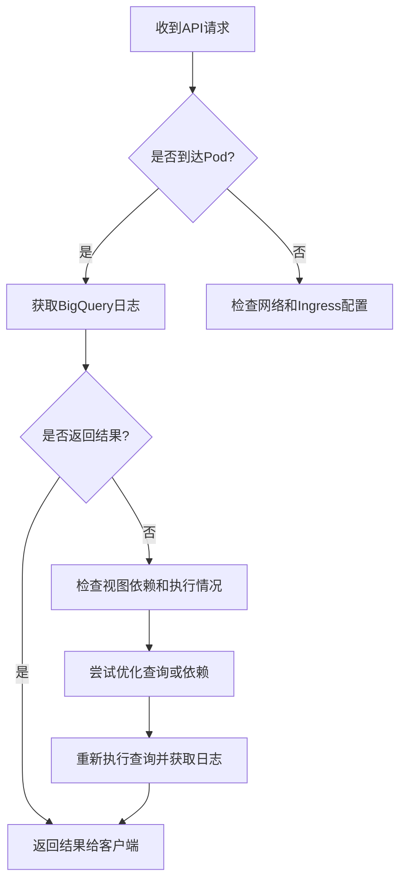
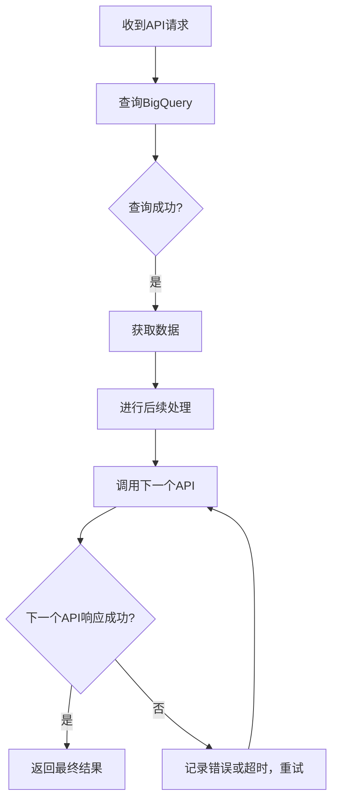

在你提供的具体请求中，以下是请求的详细内容和可能导致 `"message": "The upstream server is timing out"` 的原因分析：

### 请求分析

1. **请求结构**:
   ```bash
   curl --request POST --url https://api.ggp.aibang.com/gas-proxy/v1/bq/view/retrieval \
   --header 'Content-Type: application/json' \
   --data '{
     "projectId": "project",
     "datasetName": "VIEW_R03_DEV",
     "viewName": "EDW_WDA_MISREP_ISHS",
     "columns": "MIS_ENTRY_DTE",
     "filter": "1=1",
     "limit": "10",
     "offset": "0",
     "orderBy": "MIS_ENTRY_DTE"
   }'
   ```

2. **格式错误**:
   - 注意到 `columns`、`filter`、`limit` 和 `offset` 的键值对的格式未跟随标准JSON格式。以下是一些示例：
     - `columns "MIS_ENTRY_DTE"` 应该是 `columns": "MIS_ENTRY_DTE"`
     - `"filter": "/1=1"` 应该是 `"filter": "1=1"` （移除前面的斜杠）。
     - 在 `"offset"` 值之后，可能也缺少了一个冒号。
   - 确保JSON在传递时没有任何语法错误。

### 可能导致超时的原因

1. **SQL查询复杂性**:
   - 如果 `EDW_WDA_MISREP_ISHS` 视图或其与之关联的表包含大量数据，查询可能会变得非常复杂和耗时。

2. **后端BigQuery执行问题**:
   - 检查BigQuery是否能成功执行相应的查询，可以尝试在GCP控制台中直接运行相同的查询，看看是否能获取结果。

3. **网络延迟与负载均衡器**:
   - 如果在GKE中调用 BigQuery 的过程中，负载均衡器或API Gateway的响应时间过长，可能导致超时错误。

4. **API Gateway 超时设置**:
   - 有些API Gateway（如Google Cloud API Gateway）有默认的超时设置，通常是60秒。如果BigQuery的响应时间超过该设置，可能会触发超时错误。

5. **服务资源限制**:
   - 确保所使用的API和后端服务（如数据库、BigQuery等）有充足的资源处理请求。检查GKE中的Pod是否正常运行，并查看是否有OOM（Out Of Memory）等问题。

### 调试建议

1. **修复JSON格式**:
   - 确保JSON请求数据格式正确，特别是键和值之间的冒号和逗号。

2. **监控请求**:
   - 查看API Gateway、负载均衡器和Kubernetes的监控数据、日志，理解请求处理的时间分布。

3. **运行BigQuery调试**:
   - 直接在BigQuery控制台中运行查询，以查看其执行时间和状态。

4. **增加超时设置**:
   - 如果确定后端处理时间正常但仍然超时，可以尝试调整API Gateway或负载均衡器的超时设置。

通过这些分析和调试步骤，能够协助你更有效地定位问题并进行解决。确保请求格式正确是解决此类问题的第一步。


其实能够看到的一点是我的这post 请求 已经到达我的Pod 而且我都Pod 里面有对应的日志 Pod也会打印查询到的bigquery的日志 但是请求的这个API接口返回还是超时了 有没有可能是这个查询还依赖于其他查询？


是的，确实有可能你的查询依赖于其他查询或数据，这也会引发超时。让我们深入分析一下这个可能性以及其他相关因素。

### 可能的原因

1. **依赖查询**:
   - 如果你的视图 `EDW_WDA_MISREP_ISHS` 依赖于其他表或视图，这些基础数据可能需要很长时间才能访问和处理。例如，它可能在后台执行复杂的 JOIN 操作或从外部来源提取数据，这可能会导致延迟。

2. **运行时资源**:
   - BigQuery 在运行查询时，如果遇到资源限制（比如运行时内存不足或并发查询过多），可能会影响查询的执行时间。

3. **数据量**:
   - 如果 `EDW_WDA_MISREP_ISHS` 视图返回的数据量非常大，虽然你设置了 `limit` 和 `offset`，但底层查询仍然可能需要处理较大数据量的中间结果，导致运行时间过长。

4. **BigQuery 日志监控**:
   - 即使你的Pod有日志记录，也需要确保在BigQuery控制台中查看查询执行的详细信息。在那里你将可以查看查询的执行计划、运行时间，以及可能的错误或警告。

5. **Long Running Queries**:
   - BigQuery 查询可能会因为复杂性而被标记为长时间运行的查询，这类查询有时需要多个阶段才能完成，如果其中任何一个阶段失效或需要超时，都会导致最终请求超时。

### 调试建议

1. **检查BigQuery任务**:
   - 在Google Cloud Platform的BigQuery控制台，查看该查询的执行情况，确认是否有其他依赖的查询在运行，或者何处可能遇到瓶颈。

2. **优化查询**:
   - 如果可能，尝试优化 `EDW_WDA_MISREP_ISHS` 视图的定义，确保它尽量高效。例如，避免不必要的JOIN并使用适当的索引。

3. **查询方案**:
   - 检查是否有其他数据库连接信息和日志，以查看是否有外部依赖导致长时间查询。

4. **Retry Logic**:
   - 考虑在API处理时添加重试逻辑，识别因超时导致的失败，并重新发出请求，这可以在一定程度上帮助缓解偶尔的超时问题。

### 流程示例

以下是一个处理此类问题的简要流程：



通过这个流程，你可以更加系统地排查出可能导致超时的问题，特别是针对依赖或复杂查询方面的分析。

是的，完全有可能在你的Pod中查询到了结果并进行了后续处理，但在调用另一个API时出现超时。这种情况多半涉及到多个步骤的API交互或外部服务调用。以下是一些分析和建议，帮助你理解这一情况：

### 可能的原因

1. **后续API调用的延迟**:
   - 第一个API（BigQuery查询）可能成功获取了数据，但是在调用后续的API时，由于网络问题、服务负载、延迟或者对方API的响应时间过慢，可能会导致超时。

2. **处理逻辑复杂性**:
   - 在获取结果后，你的Pod可能进行了一些额外的处理逻辑，这些处理可能需要时间。在执行后续API调用之前，数据转换、格式化或其他处理步骤可能消耗了较多资源和时间。

3. **网络问题**:
   - 在Pod与后续API之间的网络连接可能存在不稳定的问题，导致请求超时。这可能是由于网络负载、DNS解析慢、Pod所在节点的网络带宽限制等因素造成的。

4. **API Rate Limiting**:
   - 如果后续API存在速率限制，请求被阻塞或延迟也可能导致超时错误。

5. **服务依赖性**:
   - 后续API可能依赖于其他服务或数据库访问，从而引发级联延迟。例如，如果后续的操作需要依赖另一个数据库查询，而该查询父级API返回结果延迟，也会导致超时。

### 调试建议

1. **日志分析**:
   - 检查Pod中更详细的日志，确认首个API（BigQuery）返回结果后，调用后续API的时间，以及后续调用的响应时间和状态。

2. **超时配置**:
   - 查看后续API调用是否存在超时设置，确认该设置是否符合业务需求。

3. **重试机制**:
   - 如果后续API请求有时会超时，考虑实现重试机制，以在遇到超时时重新发送请求。

4. **API Gateway或负载均衡器监控**:
   - 监控外部API（如果有API Gateway或负载均衡器前缀）中的响应时间记录。这些记录通常可以提供更详细的信息。

5. **分析依赖关系**:
   - 如果你的后续API调用依赖于其他 API 或数据库查询，请确保这些依赖服务的健康状态良好。

### 示例流程图

以下是一个进一步的流程示意图，展示了数据从BigQuery成功获取后可能会调用另一个API的场景：



通过这个流程图，可以更直观地理解在成功获取数据后，后续API调用的情况及其潜在的超时问题。这有助于你在诊断问题时进行系统化思考。

每个重要结果反馈之后打印对应的日志是一个非常好的做法。这种做法能够帮助你有效地进行断点跟踪，便于识别和定位问题。通过记录详细的日志信息，你可以获得每个步骤的状态和执行情况，从而更好地诊断问题。以下是一些建议和最佳实践：

### 日志记录建议

1. **关键步骤日志**:
   - 在每一个重要的步骤后面（如API请求、数据库查询、数据处理等）记录日志，确保捕获成功与失败的状态。例如，在执行BigQuery操作后，记录查询是否成功以及返回的数据量。

2. **错误处理和异常日志**:
   - 在捕获到任何异常时及时记录相关错误信息，包括异常类型、错误消息和堆栈跟踪。这将帮助你快速识别出现问题的具体位置。

3. **时间戳和上下文信息**:
   - 在日志中加入时间戳和相关上下文信息（如调用的API名称、请求参数等），这样可以更好地分析日志并追踪请求的执行流。

4. **结构化日志**:
   - 尽可能采用结构化日志格式（如JSON），以便进行更复杂的日志分析和聚合。结构化日志更便于机器处理，可以应用于日志分析工具。

5. **日志级别**:
   - 使用适当的日志级别（如DEBUG、INFO、WARN、ERROR），分级打印信息，便于后续分析和过滤。当出现高频率的错误或警告时，可以适时调整日志级别，增强排查能力。

6. **审计日志**:
   - 对于安全和合规要求，记录审计日志以追踪用户或系统的操作，这样可以帮助在问题发生时重建事件序列


程序是使用Java编写的。以下是针对Java程序的日志记录建议和示例代码，帮助你在关键步骤后进行有效的日志记录，以便更好地追踪和调试。

### 日志记录建议

在Java中，你通常会使用日志框架，如SLF4J、Log4j或Logback等。以下是一些相应的建议：

1. **关键步骤日志**：
   - 在每一个重要的步骤后记录日志，捕获成功和失败的状态。包括API请求、数据库操作、数据处理等。

2. **错误处理和异常日志**：
   - 在捕获到任何异常时，及时记录具体的错误信息和异常堆栈跟踪，以便于快速定位问题。

3. **时间戳**：
   - 日志框架通常自动附加时间戳，确保记录的日志能够准确反映事件发生的时间。

4. **结构化日志**：
   - 如果使用支持JSON格式日志的框架，可以生成结构化日志，以利于后续日志分析。

5. **日志级别**：
   - 使用适当的日志级别（如DEBUG、INFO、WARN、ERROR）来分级打印信息，以便于后续分析和过滤。

### 示例代码

以下是一个使用SLF4J记录日志的示例，展示了在API调用和数据处理过程中如何记录详细日志：

```java
import org.slf4j.Logger;
import org.slf4j.LoggerFactory;

public class MyApplication {
    private static final Logger logger = LoggerFactory.getLogger(MyApplication.class);

    public static void main(String[] args) {
        logger.info("程序开始执行");
        Data data = queryBigQuery();
        if (data != null) {
            logger.info("成功获取了数据: {}", data.getSize());
            ProcessedData processedData = processData(data);
            logger.info("数据处理成功");
            ApiResponse response = callNextApi(processedData);
            if (response != null) {
                logger.info("最终结果返回成功");
            } else {
                logger.error("获取最终结果失败");
            }
        } else {
            logger.error("查询BigQuery时未返回任何数据");
        }
    }

    private static Data queryBigQuery() {
        logger.info("开始查询BigQuery");
        // BigQuery查询逻辑
        try {
            // 假设使用某个BigQuery客户端
            Data result = bigQueryClient.query("SELECT * FROM table");
            return result;
        } catch (Exception e) {
            logger.error("查询BigQuery时出错: {}", e.getMessage(), e);
            return null;
        }
    }

    private static ApiResponse callNextApi(ProcessedData data) {
        logger.info("调用下一个API");
        // 调用下一个API的逻辑
        try {
            ApiResponse response = someApiClient.post("https://api.example.com/endpoint", data);
            if (response.getStatusCode() == 200) {
                return response;
            } else {
                logger.error("下一个API调用失败，状态码: {}", response.getStatusCode());
                return null;
            }
        } catch (Exception e) {
            logger.error("调用下一个API时出错: {}", e.getMessage(), e);
            return null;
        }
    }

    // 数据处理方法
    private static ProcessedData processData(Data data) {
        // 数据处理逻辑
        return new ProcessedData();
    }
}
```

### 总结

通过在每个关键步骤后记录日志，你将能够更直观地追踪程序的执行流，并能及时发现和定位问题。使用适当的日志框架，可以让你更加容易地记录和管理日志，从而提升整体的可维护性和调试效率。


我们的GKE pod 里面运行一个API 我从我的本地发送一个post请求 比如https://www.abc.com/v1/bq/view/retrival 
当然post 请求里边会传递一些参数

这个post 的最近文请求返回下面这个
"message" :"The upstream server is timing out",


那么可能的原因有哪些？ 因为我看到对应的pod 里面的日志似乎已经有了 bigquery 对应的查询结果


在GKE中，如果你的API在处理POST请求时返回了 `"message": "The upstream server is timing out"`，这通常表示在请求过程中发生了超时。尽管你的Pod日志显示BigQuery查询结果已经生成，但在请求的某个阶段发生了问题。以下是一些可能导致超时的原因：

### 可能的原因

1. **网络延迟或问题**:
   - 从你的本地发送请求到GKE集群的网络延迟可能较高，导致请求超时。尝试在GKE内部直接调用API以排除网络因素。

2. **处理时间过长**:
   - API可能在处理请求时需要较长的时间来返回结果。检查服务器处理请求的时间，确保设置的超时时间足够。

3. **Ingress/Load Balancer设置**:
   - 如果你使用了Ingress或负载均衡器，可能存在配置上的超时。例如，Google Cloud Load Balancer的默认超时可能设置为5分钟，确认Ingress或负载均衡器的超时设置。

4. **资源限制**:
   - Pod的资源限制（CPU/内存）可能影响其性能，从而导致请求超时。检查是否有资源瓶颈。

5. **后端连接问题**:
   - 如果API在处理请求时需要连接其他后端服务（如数据库或第三方API），可能这些服务的响应时间较长。确保所有后端服务的可用性和响应时间。

6. **Pod健康状况**:
   - 确保Pod处于健康状态。如果Pod因为某种原因（如OOM杀死或崩溃）处于不健康状态，可能会导致请求超时。

7. **日志和异常处理**:
   - 检查Pod的完整日志，寻找是否有异常或错误信息，这可能会提供更深入的故障原因。

### 调试建议

- **监控和日志**: 
  - 使用GKE的监控工具（如Stackdriver）查看请求的性能和资源使用情况。
  - 确保你能访问到所有相关服务的日志，以定位问题。

- **调整超时时间**:
  - 如果可能，尝试增加API的超时设置，以适应慢查询的情况。

- **调用链测试**:
  - 在GKE的容器中直接使用命令行工具（如curl或Postman）测试API，查看请求响应时间。

通过这些手段，你应该能够找到导致超时的具体原因，并采取相应措施来解决问题。


