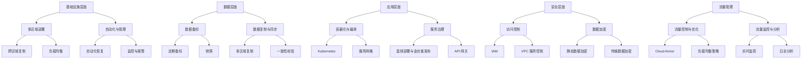

为了保障云平台服务的弹性（Resilience），需要从多个方面进行综合考虑和部署。以下是各个方面的总结：

## 1. 基础设施层面

### 多区域部署

- **跨区域复制**：在多区域间复制数据和服务，确保在某一区域发生故障时，其他区域可以无缝接管。
- **负载均衡**：使用全球负载均衡（Global Load Balancer）将流量分配到多个区域的实例，保证高可用性。

### 自动化与管理

- **自动化恢复**：使用自动化脚本和工具（如Google Cloud Deployment Manager、Terraform）进行基础设施的自动恢复和重新部署。
- **监控与报警**：配置Cloud Monitoring和Cloud Logging，对系统进行24/7监控，设置合适的报警机制，及时发现并处理问题。

## 2. 数据层面

### 数据备份

- **定期备份**：使用Google Cloud Storage进行定期数据备份，确保在数据丢失时能够快速恢复。
- **快照**：对关键数据（如BigQuery、Firestore）进行快照管理，快速恢复到特定时间点的数据状态。

### 数据复制与同步

- **多区域复制**：使用Cloud Spanner、Firestore的多区域复制特性，确保数据在多个区域的同步和高可用性。
- **一致性校验**：定期进行数据一致性校验，确保数据在复制和同步过程中的一致性。

## 3. 应用层面

### 容器化与编排

- **Kubernetes**：使用GKE进行应用容器化和编排，利用Kubernetes的自愈能力和弹性伸缩，确保应用的高可用性和快速恢复。
- **服务网格**：使用Istio等服务网格工具进行服务间的流量管理和故障隔离，提高服务的可靠性。

### 服务治理

- **蓝绿部署与金丝雀发布**：使用蓝绿部署和金丝雀发布策略，减少应用发布时的风险，确保新版本的平滑上线。
- **API 网关**：使用Kong等API网关管理和监控API流量，提供限流、重试等机制保障服务的稳定性。

## 4. 安全层面

### 访问控制

- **IAM**：使用Google Cloud IAM进行细粒度的权限管理，确保只有授权用户和服务可以访问资源。
- **VPC 服务控制**：使用VPC Service Controls保护敏感数据，防止数据泄漏。

### 数据加密

- **静态数据加密**：使用Google Cloud Key Management Service（KMS）对静态数据进行加密。
- **传输数据加密**：确保所有传输数据使用TLS进行加密，防止数据在传输过程中的泄露。

## 5. 流量管理

### 流量控制与优化

- **Cloud Armor**：使用Cloud Armor进行DDoS防护和流量过滤，保护应用免受恶意流量攻击。
- **负载均衡策略**：优化负载均衡策略，根据流量模式动态调整后端实例的分配，确保流量高峰时的服务稳定性。

### 流量监控与分析

- **实时监控**：使用Stackdriver Trace、Monitoring等工具进行实时流量监控和分析，及时发现并解决流量异常问题。
- **日志分析**：通过Cloud Logging收集和分析流量日志，识别潜在的性能瓶颈和安全威胁。

通过以上多层次、多方面的措施，可以有效保障云平台服务的弹性，提高系统的可用性和可靠性。以下是该流程的Mermaid图表表示：

To ensure the resilience of your cloud platform services, a comprehensive approach covering multiple aspects is essential. Here is a detailed summary from various perspectives:

## 1. Infrastructure Level

### Multi-Region Deployment

- **Cross-Region Replication**: Replicate data and services across multiple regions to ensure seamless failover in case of regional outages.
- **Load Balancing**: Utilize global load balancing to distribute traffic across instances in multiple regions, ensuring high availability.

### Automation and Management

- **Automated Recovery**: Use automation scripts and tools (such as Google Cloud Deployment Manager, Terraform) for automated recovery and redeployment of infrastructure.
- **Monitoring and Alerting**: Configure Cloud Monitoring and Cloud Logging for 24/7 system monitoring, and set up appropriate alert mechanisms to promptly detect and handle issues.

## 2. Data Level

### Data Backup

- **Regular Backups**: Use Google Cloud Storage for regular data backups, ensuring quick recovery in case of data loss.
- **Snapshots**: Manage snapshots for critical data (like BigQuery, Firestore) to quickly restore data to a specific point in time.

### Data Replication and Synchronization

- **Multi-Region Replication**: Utilize Cloud Spanner and Firestore's multi-region replication features to ensure data synchronization and high availability.
- **Consistency Checks**: Conduct regular data consistency checks to ensure data integrity during replication and synchronization.

## 3. Application Level

### Containerization and Orchestration

- **Kubernetes**: Use GKE for application containerization and orchestration, leveraging Kubernetes' self-healing and auto-scaling capabilities to ensure high availability and rapid recovery.
- **API Gateway**: Use Kong as the API gateway to manage and monitor API traffic, providing rate limiting, retries, and other mechanisms to ensure service stability.

### Service Management

- **Pipeline Deployment**: Implement a comprehensive deployment pipeline for complete release and validation, reducing risks during application releases and ensuring smooth rollouts.

## 4. Security Level

### Access Control

- **IAM**: Utilize Google Cloud IAM for fine-grained access control, ensuring only authorized users and services can access resources.
- **VPC Service Controls**: Use VPC Service Controls to protect sensitive data and prevent data exfiltration.

### Data Encryption

- **At-Rest Encryption**: Use Google Cloud Key Management Service (KMS) for encrypting data at rest.
- **In-Transit Encryption**: Ensure all data in transit is encrypted using TLS to prevent data breaches during transmission.

## 5. Traffic Management

### Traffic Control and Optimization

- **Cloud Armor**: Use Cloud Armor for DDoS protection and traffic filtering, safeguarding applications from malicious traffic.
- **Load Balancing Strategies**: Optimize load balancing strategies by dynamically adjusting backend instances based on traffic patterns to ensure service stability during peak times.

### Traffic Monitoring and Analysis

- **Real-Time Monitoring**: Use tools like Stackdriver Trace and Monitoring for real-time traffic monitoring and analysis, quickly identifying and resolving traffic anomalies.
- **Log Analysis**: Collect and analyze traffic logs with Cloud Logging to identify potential performance bottlenecks and security threats.

By implementing the above measures across multiple levels, you can effectively ensure the resilience of your cloud platform services, enhancing system availability and reliability. Below is the corresponding Mermaid diagram:

```mermaid
graph TD;
    A[Infrastructure Level] --> B[Multi-Region Deployment]
    A --> C[Automation and Management]
    B --> D[Cross-Region Replication]
    B --> E[Load Balancing]
    C --> F[Automated Recovery]
    C --> G[Monitoring and Alerting]

    H[Data Level] --> I[Data Backup]
    H --> J[Data Replication and Synchronization]
    I --> K[Regular Backups]
    I --> L[Snapshots]
    J --> M[Multi-Region Replication]
    J --> N[Consistency Checks]

    O[Application Level] --> P[Containerization and Orchestration]
    O --> Q[Service Management]
    P --> R[Kubernetes]
    P --> S[API Gateway]
    Q --> T[Pipeline Deployment]

    U[Security Level] --> V[Access Control]
    U --> W[Data Encryption]
    V --> X[IAM]
    V --> Y[VPC Service Controls]
    W --> Z[At-Rest Encryption]
    W --> AA[In-Transit Encryption]

    AB[Traffic Management] --> AC[Traffic Control and Optimization]
    AB --> AD[Traffic Monitoring and Analysis]
    AC --> AE[Cloud Armor]
    AC --> AF[Load Balancing Strategies]
    AD --> AG[Real-Time Monitoring]
    AD --> AH[Log Analysis]
```

# Contorl and compliance

### 1. **GKE Cluster Security Controls**

#### a. **Identity and Access Management (IAM)**

- **Role-Based Access Control (RBAC)** and **IAM** permissions control are key to GKE cluster security. We ensure that only authorized users and service accounts have access to the clusters and associated resources by assigning appropriate roles and permissions.
- In GKE, we use roles such as **GKE Cluster Admin** and **Kubernetes Admin** to manage access, minimizing unnecessary permission exposure.

#### b. **Node Pool and Automation**

- We utilize **automated node pools** with **Compute Engine** to manage the lifecycle of virtual machine instances. GKE can automatically scale node pools, ensuring the cluster automatically scales up under high load and scales down when load decreases.
- Enabling **node auto-repair** automatically detects and repairs node failures, ensuring high availability and stability of the cluster.

#### c. **Network Policies and Isolation**

- **Network policies** are configured in GKE to define traffic control rules, restricting communication between Pods for traffic isolation.
- In GKE, we use **VPC networks** and **network tags** to achieve network isolation, ensuring controlled access between sensitive applications.

#### d. **Encryption and Secure Communication**

- All data within the GKE cluster is transmitted securely via **TLS encryption**, ensuring the safety of data in transit.
- We use **Google Cloud Key Management Service (KMS)** to manage encryption keys, ensuring data is encrypted both at rest and in transit, reducing the risk of data exposure.

#### e. **Kubernetes Security Best Practices**

- We enable **Pod Security Policies (PSP)** to restrict container privileges and prevent malicious actions.
- In GKE, **encryption services** and **Open Policy Agent (OPA)** are used for security compliance checks, strengthening container security.

### 2. **GCE and Cloud Component Security Controls**

#### a. **Virtual Machine Instance Security**

- Virtual machine instances are managed through **Google Compute Engine (GCE)**, with all instances deployed within restricted **VPC networks** and protected by appropriate firewall rules to control incoming and outgoing traffic.
- We enable **OS-level encryption**, **secure boot**, and **VM isolation** to ensure that each virtual machine instance is trusted at startup and protected from potential malicious software.

#### b. **Cloud Storage Security**

- **Google Cloud Storage (GCS)** objects are encrypted, and we use **GCS Bucket ACLs (Access Control Lists)** or **Identity and Access Management (IAM)** policies to control data access permissions.
- We utilize **GCS Bucket Lifecycle Management** to automatically delete or move expired data, preventing unauthorized access to outdated information.

#### c. **BigQuery and Firestore Security Controls**

- Access to **BigQuery** is controlled through IAM roles and resource management policies, ensuring that data analysis is only performed by authorized users.
- **Firestore** data storage is protected by both client-side and server-side encryption, with **Firebase Authentication** and **IAM** for access control.
- We configure **logging and auditing** with **Audit Logging** to regularly audit BigQuery and Firestore access history, ensuring all data access adheres to company compliance requirements.

#### d. **Container Analysis Repository (GAR)**

- We use **Container Analysis Repository (GAR)** to scan container images and ensure that all images are security-scanned before deployment, preventing vulnerabilities and malicious software.
- Container images are regularly updated and maintained with the latest security patches to ensure that the base image version is secure.

#### e. **Compliance and Auditing**

- **Google Cloud Audit Logs** are enabled to record all operational logs, facilitating post-event auditing and incident response.
- Regular **security and compliance checks** are performed to ensure that all cloud components adhere to the company's security standards and comply with relevant regulatory requirements.

### 3. **Overall Security Architecture and Compliance**

- Our cloud platform follows a **Zero Trust Architecture**, meaning no user or device is inherently trusted. By default, all requests must go through authentication and authorization.
- **Multi-layered defense**: From the network to the application and data layers, multiple security measures are implemented to ensure platform integrity and data security.
- Across the platform, we apply the **principle of least privilege** to minimize potential security risks at each layer of the system, based on business needs and security best practices.

With these security controls in place, CAEP's GKE clusters and cloud components provide high availability, security, and compliance, ensuring that our internal service platform meets industry standards and regulatory requirements.
