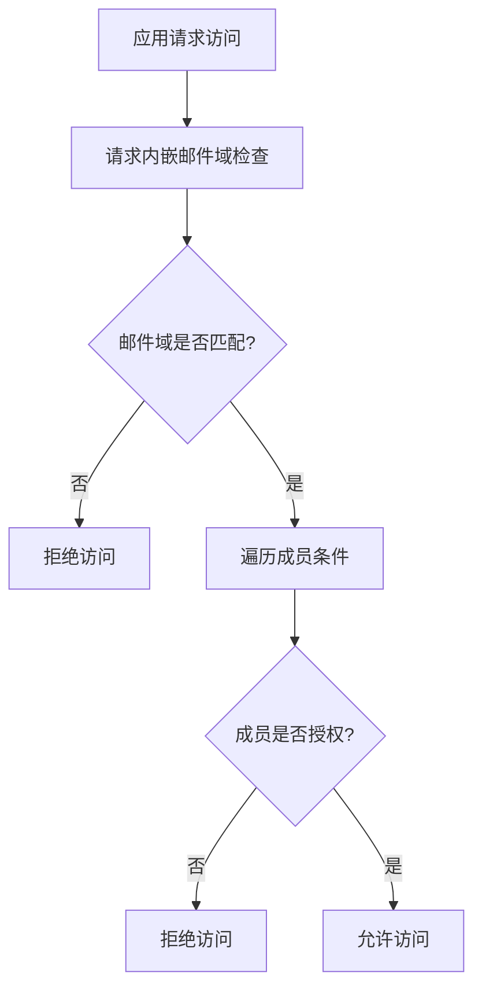

对于GCP IAM条件，确实有些特性目前在Secret Manager上并不完全受支持，比如使用电子邮件字段进行细粒度控制。因此，我们需要退一步，通过在IAM条件中使用其他支持的属性。

虽然请求中的电子邮件直接使用不总是可行，但你可以利用成员条件比较功能来实现类似效果。如下是在IAM条件中按成员属性进行控制的示例：

让我们先明确使用成员（principal）的最佳方法。假设我们要针对特定邮箱域名的用户进行权限控制，可以使用以下步骤进行：

1. **创建Custom Role（自定义角色）**：你需要一个自定义角色，只允许读取权限。
2. **添加IAM Policy Binding（添加IAM策略绑定）**：对这个自定义角色设置特定的成员和条件。

以下是如何具体操作：

### 步骤1：创建自定义角色
使用`gcloud`命令行工具创建自定义角色：

```sh
gcloud iam roles create RoleReader \
    --project=YOUR_PROJECT_ID \
    --title="Secret Reader" \
    --description="Read secrets" \
    --permissions="secretmanager.secrets.get"
```

### 步骤2：添加IAM策略绑定
利用条件规则，设置IAM策略绑定：

```sh
gcloud projects add-iam-policy-binding YOUR_PROJECT_ID \
    --member='group:your-group@example.com' \
    --role='projects/YOUR_PROJECT_ID/roles/RoleReader' \
    --condition='expression=request.time < timestamp("2030-01-01T00:00:00Z") && resource.name.startsWith("projects/YOUR_PROJECT_ID/secrets/") && resource.name == "projects/YOUR_PROJECT_ID/secrets/YOUR_SECRET_NAME",title=Expiring Secret Access,description=Temporary access for specific group'
```

### 解释：
- `YOUR_PROJECT_ID`：替换为你的GCP项目ID。
- `RoleReader`：刚才我们创建的自定义角色名称。
- `your-group@example.com`：你的IAM组成员，可以是一个GCP IAM Group。
- `expression`：表达式部分，这里分别设置了访问时间限制、资源名称前缀匹配和资源名称匹配。

### 替代邮箱条件的方法
假如你想基于不同的邮箱结尾进行限制，我们可能会用IAM Conditions的不同字段来达到更接近的结果（虽然目前为止真正动态化的条件还未完全支持）：

1. 如果你的应用层能够识别及验证这些字段，那么通过自定义Header传递条件进行处理更为合适。
2. 设置不同的Secret，基于不同组以及角色层面进行控制，而非直接成员进行细粒控制。

### 使用多个Conditions进行精细化控制
在更复杂的环境中有必要权衡使用：



遗憾的是，GCP IAM的条件，对于包含直接使用邮箱筛选精细化限制的能力，现阶段及早进行评估和使用更成熟的功能是更为妥当的策略。灵活利用不同的条件字段和策略，进一步将策略应用到业务功能内并验明条件是否完全符合是不可忽略的。
