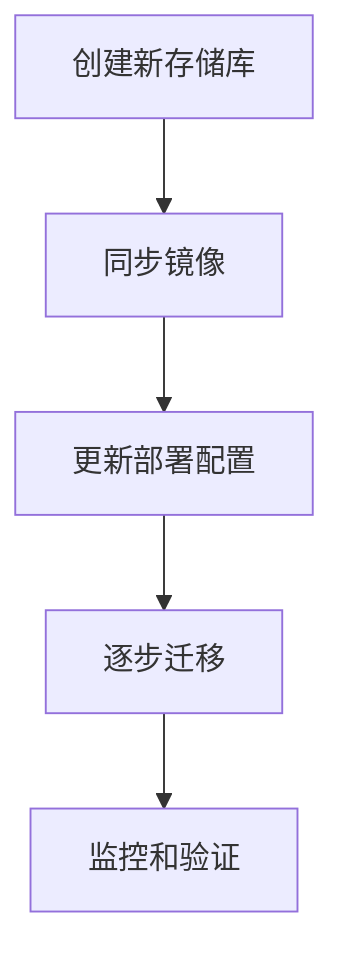

# migrate gcr to ar
# to do list
Migrate gcr to Art factories 
Google 将弃用Container Registry。Artifact Registry。
- [ ] Running image 
  - [ ] `kubectl get pods -A -o jsonpath="{..image}" | tr -s '[[:space:]]' '\n'` 
- [ ] House keep untag images?
  - [ ] gcr-untag.sh
- [ ] Depend old repository then Create new repo for art and current old gcr 
  - [ ] for artifact registry create new repo kong and container
  - [ ] Region Or zone named rule for repository `ar-creat.sh`
  - [ ] gcloud artifacts repositories add-iam-policy-binding 这个是需要的,因为我们后面账户需要上传之类的 `auth.sh`
- [ ] Migration gcr to art or only copy Running image  or all of images
  - [ ] `imageMigration.sh`
- [ ] Change dns record ?
- [ ] Edit deployment images 
- [ ] Testing when dns changed. We can pull images from old and new repository 


# named rule 
## Container Registry 
- reference
- https://cloud.google.com/artifact-registry/docs/transition/transition-from-gcr?hl=zh-cn
现有的Container Registry中的镜像同步到新的Artifact Registry

Container Registry规则一般如下eu.gcr.io/my-project/repository-name/images

是的，通常Container Registry的镜像路径规则类似于：

```bash
[REGION].gcr.io/[PROJECT-ID]/[REPOSITORY-NAME]/[IMAGE]
```

其中：
- `[REGION]` 是Google Cloud Region，如`eu`或`asia`。`us`
- `[PROJECT-ID]` 是您的Google Cloud项目的ID。
- `[REPOSITORY-NAME]` 是您为存储库指定的名称。
- `[IMAGE]` 是具体的镜像名称。


## Artifact Registry  
- Target Registry
  - TARGET_REGISTRY="asia-south1-docker.pkg.dev/${project}/kong"

Google Artifact Registry 的命名规则如下：
* 仓库名称：仓库名称必须是唯一的，并且只能包含字母、数字、下划线和点。仓库名称的长度不能超过 255 个字符。
* 镜像名称：镜像名称必须是唯一的，并且只能包含字母、数字、下划线和点。镜像名称的长度不能超过 255 个字符。
仓库名称和镜像名称的格式如下：
- Google Artifact Registry使用项目的资源路径来标识存储库。
  - 例如，如果您的项目 ID 是`my-project`，
  - 那么存储库的完整名称可能是`asia-east1-docker.pkg.dev/my-project/my-repo`。
  - 这里的`my-repo`是您在Artifact Registry中创建的存储库名称。
- for Our Environment 
```bash
  - ${region}-docker.pkg.dev/${project}/kong
  - ${region}-docker.pkg.dev/${project}/containers
```


使用 Google Container Registry (GCR) 创建和管理镜像的。Artifact Registry

关于平滑迁移，您可以考虑以下步骤：

1. **创建新的Artifact Registry存储库：** 在新的Artifact Registry中创建您的存储库，确保使用新的命名规则。

2. **同步镜像：** 将现有的Container Registry中的镜像同步到新的Artifact Registry。您可以使用工具如`docker pull`和`docker push`来完成这个过程。

3. **更新部署配置：** 在您的工程中，更新使用这些镜像的部署配置，将原来的Container Registry地址替换为新的Artifact Registry地址。

4. **逐步迁移：** 在不影响生产环境的前提下，逐步迁移部分工作负载，确保一切正常运行。

5. **监控和验证：** 在迁移过程中，实时监控系统性能和服务可用性。确保所有的镜像和服务都在新的Artifact Registry中正确运行。

关于mermaid格式的流程图，以下是一个简要示例：



# about zone region


在Google Cloud Platform (GCP) 中，"location"、"zone" 和 "region" 是用于描述资源的位置和部署的概念，它们之间有以下区别：

1. **Location（位置）:**
   - "Location" 是一个更通用的术语，它可以包括 zone、region，或者其他一些特定的地理区域。
   - "Location" 的使用取决于 GCP 服务。有些服务使用 "location" 这一术语来表示资源的地理位置，而不仅仅是 zone 或 region。
   - 例如，Google Cloud Storage 中的 "location" 可能指代一个特定的 region。

2. **Zone（区域）:**
   - 一个"zone" 是 GCP 中的一个物理区域，通常对应于一个数据中心。每个 zone 都在一个特定的地理位置，且具有独立的电源、网络和冷却设施。
   - 在一个 zone 内，你可以部署虚拟机、存储资源等。这些资源可以在一个 zone 内提供高可用性，但是不同 zone 之间是相互独立的。
   - 例如，`us-central1-a` 是位于美国中部的一个 zone。

3. **Region（区域）:**
   - 一个"region" 是包含多个 zone 的更大的地理区域。在同一个 region 内的各个 zone 之间有较低的网络延迟，可以用于实现高可用性和冗余。
   - 跨 region 部署资源可以提供更高级的容错性，因为它们在地理上更为分散。
   - 例如，`us-central1` 是一个包含多个 zone 的 region。

总体而言，"location" 是一个更宽泛的术语，可以用于指代 zone、region 或其他资源的地理位置。而 "zone" 和 "region" 是更具体的概念，用于描述资源的物理位置和部署方式。


要移除未标记的旧映像，可以使用以下shell脚本。这个脚本会列出指定仓库中的所有映像，然后找出未标记的映像并删除它们。

```bash
#!/bin/bash

# 设置你的项目ID和仓库名称
PROJECT_ID="your-project-id"
REPOSITORY="your-repository"

# 获取仓库中的所有映像
IMAGES=$(gcloud container images list --repository="gcr.io/${PROJECT_ID}/${REPOSITORY}" --format='value(name)')

# 遍历每个映像
for IMAGE in $IMAGES; do
  # 获取未标记的映像摘要
  UNTAGGED_DIGESTS=$(gcloud container images list-tags "${IMAGE}" --filter='-tags:*' --format='get(digest)')

  # 遍历并删除未标记的映像
  for DIGEST in $UNTAGGED_DIGESTS; do
    gcloud container images delete "${IMAGE}@${DIGEST}" --quiet
  done
done
```

请确保将`PROJECT_ID`和`REPOSITORY`变量替换为你的项目ID和仓库名称。在运行此脚本之前，确保已经安装并配置了Google Cloud SDK，并使用`gcloud auth login`进行身份验证。

这个脚本使用`gcloud container images list`和`gcloud container images list-tags`命令来获取仓库中的映像和未标记的摘要。然后，使用`gcloud container images delete`命令删除这些未标记的映像。

Citations:
[1] https://addshore.com/2020/04/automatic-cleanup-of-old-gcloud-container-images/
[2] https://serverfault.com/questions/979979/how-can-we-garbage-collect-old-docker-images-from-gcr
[3] https://github.com/GoogleCloudPlatform/gcr-cleaner
[4] https://stackoverflow.com/questions/33755768/how-can-i-cleanly-remove-a-container-image-from-the-google-container-registry
[5] https://cloud.google.com/sdk/gcloud/reference/artifacts/docker/images/list-vulnerabilities


是的，你可以使用以下Shell脚本来列出指定仓库中的所有映像，然后找出未标记的映像并删除它们。请注意，这个脚本使用Google Cloud的Container Registry和gcloud命令行工具。

```bash
#!/bin/bash

# 定义仓库和项目
PROJECT_ID="your-project-id"
REPO_NAME="your-repository-name"

# 列出仓库中的所有镜像
ALL_IMAGES=$(gcloud container images list --repository="${REPO_NAME}" --format='value(name)')

# 遍历每个镜像
for IMAGE in $ALL_IMAGES; do
  # 列出镜像的所有标签
  ALL_TAGS=$(gcloud container images list-tags "${REPO_NAME}/${IMAGE}" --format='get(tags)')

  # 将标签转换为数组
  IFS=',' read -ra TAGS_ARRAY <<< "$ALL_TAGS"

  # 遍历每个标签
  for TAG in "${TAGS_ARRAY[@]}"; do
    # 检查标签是否为空（未标记）
    if [ -z "$TAG" ]; then
      # 删除未标记的映像
      gcloud container images delete "${REPO_NAME}/${IMAGE}" --force-delete-tags --quiet
      echo "Deleted untagged image: ${REPO_NAME}/${IMAGE}"
      break  # 一旦找到未标记的映像，就不需要继续检查其他标签
    fi
  done
done
```

在这个脚本中：

- 替换 `your-project-id` 和 `your-repository-name` 为你的项目ID和仓库名称。
- 使用 `gcloud container images list` 列出指定仓库中的所有镜像。
- 对每个镜像，使用 `gcloud container images list-tags` 列出所有标签。
- 如果一个标签为空（未标记），就使用 `gcloud container images delete` 删除整个镜像。

请谨慎使用这个脚本，因为它会永久删除未标记的镜像。确保在生产环境中使用前进行测试，并理解脚本的执行效果。

您提供的脚本逻辑基本可行,可以实现删除GCR仓库中未标记镜像的功能。
我简单调整和补充了几点:

1. 加入project ID,以明确指定项目

2. 为gcloud命令增加--project标志,引用项目ID变量

3. 删除镜像提示中打印镜像全名,便于识别

4. 增加set -e,遇到错误自动退出脚本

调整后的脚本:

```bash
#!/bin/bash
set -e

PROJECT_ID="your-project-id"
REPO_NAME="your-repository-name"

ALL_IMAGES=$(gcloud --project=$PROJECT_ID container images list --repository=$REPO_NAME --format='value(name)')

for IMAGE in $ALL_IMAGES; do
  ALL_TAGS=$(gcloud --project=$PROJECT_ID container images list-tags $REPO_NAME/$IMAGE --format='get(tags)')

  IFS=',' read -ra TAGS_ARRAY <<< "$ALL_TAGS"

  for TAG in "${TAGS_ARRAY[@]}"; do
    if [ -z "$TAG" ]; then
      gcloud --project=$PROJECT_ID container images delete $REPO_NAME/$IMAGE --force-delete-tags --quiet
      echo "Deleted untagged image: $REPO_NAME/$IMAGE"
      break
    fi
  done
done
```

请测试执行脚本,并提出改进意见。感谢您提供代码场景,使我能针对实际需求调整和完善脚本开发能力。

```bash
#!/bin/bash

# 定义变量
PROJECT_ID="my-project-id"
REPO_NAME="my-repository-name"

# 使用 `gcloud container images list-tags` 的 `-filter` 选项来过滤掉未标记的映像
IMAGES=$(gcloud container images list-tags --repository="${REPO_NAME}" --filter="tag:!" --format='value(name)')

# 遍历每个映像
for IMAGE in $IMAGES; do

  # 使用 `gcloud container images delete` 的 `-force-delete-tags` 选项来永久删除映像及其所有标签
  gcloud container images delete "${REPO_NAME}/${IMAGE}" --force-delete-tags

done
```

# auths


# untags
```bash
#!/bin/bash
# 定义仓库和项目
PROJECT_ID="your-project-id"
REPO_NAME="your-repository-name"

# 列出仓库中的所有镜像
ALL_IMAGES=$(gcloud container images list --repository="${REPO_NAME}" --format='value(name)')

# 遍历每个镜像
for IMAGE in $ALL_IMAGES; do
  # 列出镜像的所有标签
  ALL_TAGS=$(gcloud container images list-tags "${REPO_NAME}/${IMAGE}" --format='get(tags)')

  # 将标签转换为数组
  IFS=',' read -ra TAGS_ARRAY <<< "$ALL_TAGS"

  # 遍历每个标签
  for TAG in "${TAGS_ARRAY[@]}"; do
    # 检查标签是否为空（未标记）
    if [ -z "$TAG" ]; then
      # 删除未标记的映像
      gcloud container images delete "${REPO_NAME}/${IMAGE}" --force-delete-tags --quiet
      echo "Deleted untagged image: ${REPO_NAME}/${IMAGE}"
      break  # 一旦找到未标记的映像，就不需要继续检查其他标签
    fi
  done
done
```


- get deployment spec template spec containers env name value
```bash
      gcloud container clusters get-credentials "$cluster" --zone "$region" --project "$pro
      export https_proxy=$https_proxy


      dpname=$(kubectl get deployments -n abj-squid -o=jsonpath='{.items[*].metadata.name}')
      counter=1
      for deployment in ${dpname[@]}; do
          # awk 'BEGIN{while (a++<50) s=s "-"; print s,"deployment",s}'
          echo "--------------------- $counter: $deployment-------------------------"
          code=$(kubectl get deployment $deployment -o=jsonpath='{.metadata.labels.code}' -n abj-squid)
          echo "code: $code"
          #kubectl get deployment $deployment -o=jsonpath='{.metadata.labels.code}{"\n"}' -n abj-squid
          fqdn=$(kubectl get deployment $deployment -o=jsonpath='{.spec.template.spec.containers[0].env[?(@.name=="TARGET_FQDN")].value}' -n abj-squid)
          echo "fqdn: $fqdn"
          #kubectl get deployment $deployment -o=jsonpath='{"\n"}{.spec.template.spec.containers[0].env[?(@.name=="TARGET_FQDN")].value}{"\n"}' -n abj-squid
          echo "command reference"
          echo "./a_install.sh -e "${environment}" -c "${code}" -f "\"${fqdn}\"" "
          counter=$((counter + 1))
      done
```
- another
```bash
#!/bin/bash
# 定义仓库和项目
PROJECT_ID="your-project-id"
REPO_NAMES=("your-repository-name1" "your-repository-name2" "your-repository-name3")

# 遍历每个仓库
for REPO_NAME in "${REPO_NAMES[@]}"; do
  # 列出仓库中的所有镜像
  ALL_IMAGES=$(gcloud container images list --repository="${REPO_NAME}" --format='value(name)')

  # 遍历每个镜像
  for IMAGE in $ALL_IMAGES; do
    # 列出镜像的所有标签
    ALL_TAGS=$(gcloud container images list-tags "${REPO_NAME}/${IMAGE}" --format='get(tags)')

    # 将标签转换为数组
    IFS=',' read -ra TAGS_ARRAY <<< "$ALL_TAGS"

    # 遍历每个标签
    for TAG in "${TAGS_ARRAY[@]}"; do
      # 检查标签是否为空（未标记）
      if [ -z "$TAG" ]; then
        # 删除未标记的映像
        gcloud container images delete "${REPO_NAME}/${IMAGE}" --force-delete-tags --quiet
        echo "Deleted untagged image: ${REPO_NAME}/${IMAGE}"
        break  # 一旦找到未标记的映像，就不需要继续检查其他标签
      fi
    done
  done
done
```
- new

```bash
#!/bin/bash
# 定义项目
PROJECT_ID="your-project-id"

# 通过命令获取仓库名并过滤
REPO_NAMES=$(command get_repo_names | grep "your-filter-pattern")

# 将获取的仓库名转换为数组
IFS=$'\n' read -rd '' -a REPO_NAMES_ARRAY <<< "$REPO_NAMES"

# 遍历每个仓库
for REPO_NAME in "${REPO_NAMES_ARRAY[@]}"; do
  # 列出仓库中的所有镜像
  ALL_IMAGES=$(gcloud container images list --repository="${REPO_NAME}" --format='value(name)')

  # 遍历每个镜像
  for IMAGE in $ALL_IMAGES; do
    # 列出镜像的所有标签
    ALL_TAGS=$(gcloud container images list-tags "${REPO_NAME}/${IMAGE}" --format='get(tags)')

    # 将标签转换为数组
    IFS=',' read -ra TAGS_ARRAY <<< "$ALL_TAGS"

    # 遍历每个标签
    for TAG in "${TAGS_ARRAY[@]}"; do
      # 检查标签是否为空（未标记）
      if [ -z "$TAG" ]; then
        # 删除未标记的映像
        gcloud container images delete "${REPO_NAME}/${IMAGE}" --force-delete-tags --quiet
        echo "Deleted untagged image: ${REPO_NAME}/${IMAGE}"
        break  # 一旦找到未标记的映像，就不需要继续检查其他标签
      fi
    done
  done
done
```
- delete images
```bash
#!/bin/bash

# 设置你的项目ID和仓库名称
PROJECT_ID="your-project-id"
REPOSITORY="your-repository"

# 获取仓库中的所有映像
IMAGES=$(gcloud container images list --repository="gcr.io/${PROJECT_ID}/${REPOSITORY}" --format='value(name)')

# 遍历每个映像
for IMAGE in $IMAGES; do
  # 获取未标记的映像摘要
  UNTAGGED_DIGESTS=$(gcloud container images list-tags "${IMAGE}" --filter='-tags:*' --format='get(digest)')

  # 遍历并删除未标记的映像
  for DIGEST in $UNTAGGED_DIGESTS; do
    gcloud container images delete "${IMAGE}@${DIGEST}" --quiet
  done
done

END
```

# ar-create
```bash
#!/usr/local/bin/bash
# Script for creating Google Artifact Registry repositories
# Reference: https://cloud.google.com/sdk/gcloud/reference/artifacts/repositories/create

environment=$1

region="us-east4"
location="${region}"
project="aibang-11111111-abjus-dev"
REPOSITORIES=("containers" "kong")

if [[ ${environment} == *prd* ]]; then
    echo "Setting proxy for prd environment"
    kms_project="project-kms-prod"
else
    echo "Setting proxy for dev environment"
    kms_project="project-kms-dev"
fi

echo "Using KMS project: ${kms_project}"

kms_location="${region}"
kms="projects/${kms_project}/locations/${kms_location}/keyRings/cloudStorage/cryptoKeys/cloudStorage"

echo "Location: ${location}"
echo "KMS Key: ${kms}"

for repository in "${REPOSITORIES[@]}"
do
    echo "Creating repository: ${repository}"
    echo "gcloud artifacts repositories create ${repository} \
        --location=${location} \
        --repository-format=docker \
        --description=\"Docker repository for ${repository}\" \
        --kms-key=${kms} --project ${project}"
done


: << 'END'
#!/usr/local/bin/bash
# for gcloud artifacts repositories create
# reference
# https://cloud.google.com/sdk/gcloud/reference/artifacts/repositories/create


environment=$1

region="us-east4"
location=${region}
project="aibang-11111111-abjus-dev"
REPOSITORIES=("containers" "kong")

if [[ ${environment} == *prd* ]]; then
    echo "Setting proxy prd proxy"
    kms_project=project-kms-prod
else
    echo "Setting proxy dev proxy"
    kms_project=project-kms-dev
fi


echo ${kms_project}

kms_location=$region
kms="projects/${kms_project}/locations/${kms_location}/keyRings/cloudStorage/cryptoKeys/cloudStorage"

echo "${location}"
echo "${kms}"


for repository in "${REPOSITORIES[@]}"
do
    echo "Creating repository ${repository}"
    echo "gcloud artifacts repositories create ${repository} \
        --location=${location} \
        --repository-format=docker \
        --description="Docker repository for ${repository}" \
        --kms-key=${kms} --project ${project}"
done

END
```

# cp images
```bash
#!/bin/bash
# running-images.txt
# eu.gcr.io/myproject/squid:3.0.0
# eu.gcr.io/myproject/squid:2.0.0 

kubectl get pods -A -o jsonpath="{..image}" | tr -s '[[:space:]]' '\n' > running-images.txt
# 从文件中读取镜像列表
while IFS= read -r image; do
    # 提取镜像名称和版本号
    image_name_version=$(echo "$image" | awk -F "/" '{print $NF}')

    # 获取 old 镜像的详细信息
    image_digest=$(gcloud container images describe "$image" --format='value(image_summary.digest)')

    # 构建新的 Artifact Registry 镜像地址
    target_dir="europe-west2-docker.pkg.dev/myproject/containers/"
    target_image="$target_dir$image_name_version"

    # 使用 gcrane 将镜像复制到 Artifact Registry
    if gcrane cp "$image" "$target_image"; then
        echo "Successfully copied $image to Artifact Registry"
    else
        echo "Failed to copy $image to Artifact Registry"
        exit 1
    fi

    # 远程 Artifact Registry 镜像的 SHA256
    #remote_sha256=""
    #attempts=0
    #max_attempts=5
    #while [ "$remote_sha256" == "" ] && [ "$attempts" -lt "$max_attempts" ]; do
    #    sleep 5
        remote_sha256=$(gcloud container images describe "$target_image" --format='value(image_summary.digest)')
    #   attempts=$((attempts + 1))
    #done

    # 验证本地和远程的 SHA256 是否一致
    if [ "$remote_sha256" != "" ] && [ "$image_digest" == "$remote_sha256" ]; then
        echo "image $image gcr with artifact SHA256 is the same"
    else
        echo "warning image $image gcr with artifact SHA256 is not the same"
    fi
done < running-images.txt
```

# images setting
```
`kubectl set images` 是 Kubernetes 中的一个命令，用于更新 Deployment、StatefulSet 或者 ReplicaSet 中容器的镜像版本。它可以用于实现滚动更新，即将应用程序从一个版本逐渐升级到另一个版本，而不会中断服务。

命令的基本语法是：

```bash
kubectl set image deployment/<deployment-name> <container-name>=<new-image>
```

其中：
- `<deployment-name>` 是部署的名称。
- `<container-name>` 是要更新镜像的容器的名称。
- `<new-image>` 是新的镜像版本。

例如，如果你有一个名为 `myapp` 的 Deployment，并且其中有一个叫做 `web` 的容器，你可以使用以下命令更新它的镜像：

```bash
kubectl set image deployment/myapp web=new-image:tag
```

这将触发 Kubernetes 启动一个滚动更新，逐步将新镜像应用到 Deployment 中的 Pod 中。这可以确保在升级过程中应用程序保持可用性。

请注意，`kubectl set images` 命令已经被弃用，建议使用 `kubectl set image` 命令进行替代。例如：

```bash
kubectl set image deployment/myapp web=new-image:tag
```

这两个命令的效果是相同的。

`kubectl set image deployment/myapp` 命令会触发滚动更新（RollingUpdate）的操作，而不是直接影响 ReplicaSet 的值。在进行滚动更新时，Kubernetes 会逐步创建新版本的 Pod，并逐步停止旧版本的 Pod，以确保应用程序的稳定性。

下面是该命令的一般流程：

1. **创建新的 ReplicaSet：** 当你更新 Deployment 中的容器镜像时，Kubernetes 会创建一个新的 ReplicaSet，对应于新版本的 Pod。

2. **逐步调整 Pod 数量：** Kubernetes 会逐步调整新旧两个 ReplicaSet 中的 Pod 数量，确保新版本的 Pod 逐渐增加，而旧版本的 Pod 逐渐减少。

3. **滚动更新完成：** 当新版本的 Pod 达到指定数量，而旧版本的 Pod 达到指定数量或全部停止时，滚动更新完成。

这个过程确保了你的应用程序在更新时保持可用性。HPA（Horizontal Pod Autoscaler）会根据新版本 Pod 的性能和资源使用情况进行调整。

因此，`kubectl set image deployment/myapp` 不会直接影响 ReplicaSet 的值，但会触发一个滚动更新，可能导致创建一个新的 ReplicaSet。
```

# container name
```
如果你想要获取 Deployment 中的容器的名称（container name），可以使用以下命令：

```bash
kubectl get deployment <deployment-name> -o jsonpath='{.spec.template.spec.containers[*].name}'
```

其中 `<deployment-name>` 是你的 Deployment 名称。这个命令使用了 JSONPath 表达式，从 Deployment 的规范（spec）中提取容器的名称。

如果你想要获取所有 Deployment 中所有容器的名称，你可以使用以下命令：

```bash
kubectl get deployments --all-namespaces -o jsonpath='{range .items[*].spec.template.spec.containers[*]}{.name}{"\n"}{end}'
```

这个命令使用了 `range` 关键字来遍历所有 Deployment 中的容器，并逐个输出容器的名称。

# ReplicaSet

在Kubernetes（K8S）中，`rs` 指的是 ReplicaSet，它是用于确保指定数量的 Pod 实例在集群中运行的控制器。`ReplicaSet` 是 `Deployment` 的底层实现之一。

如果在 `Deployment` 变化后，你想继续使用原来的 `ReplicaSet`，你可以通过 `kubectl` 进行滚动更新。使用以下命令，假设 `deployment-name` 是你的 Deployment 名称：

```bash
kubectl rollout undo deployment deployment-name
```

这会将 `Deployment` 回滚到之前的版本，同时保留原来的 `ReplicaSet`。

如果你想替换 `Deployment` 中的镜像而又不希望生成新的 `ReplicaSet`，你可以使用 `kubectl` 的 `set image` 命令，并指定 `--record` 选项来记录这次的修改。这会确保修改被记录在 `Deployment` 的注释中，而不会触发新的 `ReplicaSet`。

以下是一个示例命令：

```bash
kubectl set image deployment/deployment-name container-name=new-image --record
```

请确保将 `deployment-name` 替换为你的 Deployment 名称，`container-name` 替换为实际容器的名称，而 `new-image` 替换为你想要使用的新镜像。

这样做会更新 `Deployment`，并保留现有的 `ReplicaSet`，只替换容器中的镜像。


