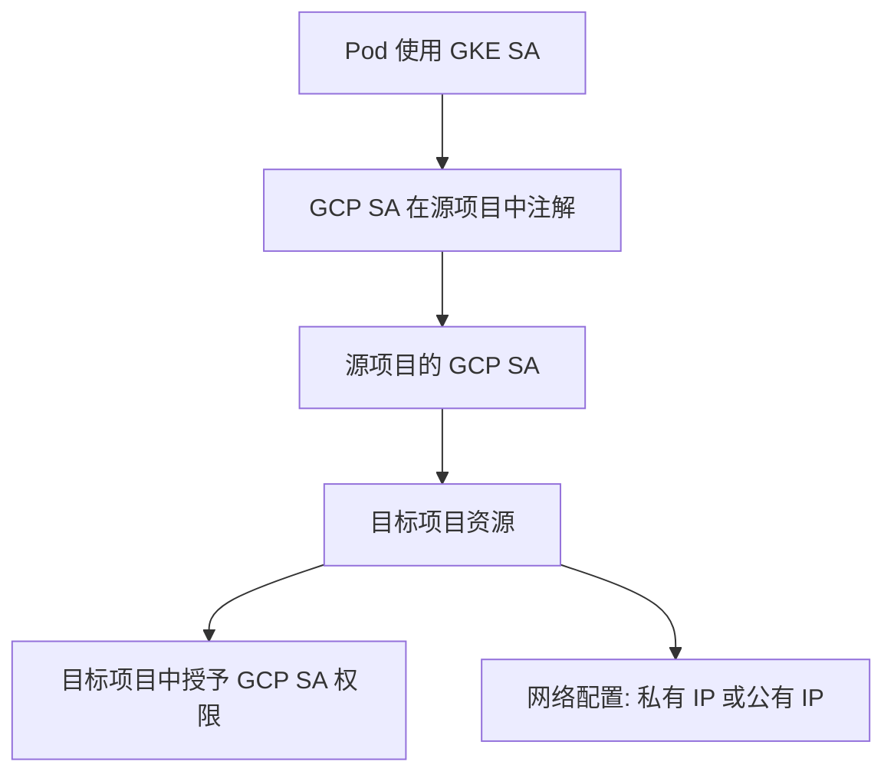

在 GKE 中，**Workload Identity** 是一种将 GKE 的服务账户（GKE SA）与 Google Cloud 的服务账户（GCP SA）关联的机制。这种机制能够让 Pod 以安全的方式访问 Google Cloud 服务，而无需在 Pod 中存储任何服务账户密钥文件。以下是一个详细的流程，说明如何配置一个 Pod 以便访问多个 Google Cloud 服务（如 Cloud SQL、Secret Manager 和 reCAPTCHA）。

### 整体流程概述

1. **创建 GCP 服务账户（GCP SA）并授予必要的 IAM 角色**。
2. **创建 GKE 服务账户（GKE SA）**。
3. **将 GKE SA 和 GCP SA 绑定**（通过 Workload Identity 注解）。
4. **配置 Kubernetes 部署中的 Pod 使用 GKE SA**。
5. **在 Pod 内通过 Google Cloud 客户端库访问服务**。

---

### 详细步骤

#### **1. 创建 GCP 服务账户并授予 IAM 角色**

首先，为了让 Pod 能够访问 Cloud SQL、Secret Manager 和 reCAPTCHA，您需要为每项服务分配相应的权限。

```bash
# 创建一个 GCP 服务账户
gcloud iam service-accounts create my-app-gcp-sa \
    --display-name "Service Account for GKE Workload Identity"

# 为该服务账户分配权限
# 授予 Cloud SQL 访问权限
gcloud projects add-iam-policy-binding [PROJECT_ID] \
    --member "serviceAccount:my-app-gcp-sa@[PROJECT_ID].iam.gserviceaccount.com" \
    --role roles/cloudsql.client

# 授予 Secret Manager 访问权限
gcloud projects add-iam-policy-binding [PROJECT_ID] \
    --member "serviceAccount:my-app-gcp-sa@[PROJECT_ID].iam.gserviceaccount.com" \
    --role roles/secretmanager.secretAccessor

# 授予 reCAPTCHA 访问权限
gcloud projects add-iam-policy-binding [PROJECT_ID] \
    --member "serviceAccount:my-app-gcp-sa@[PROJECT_ID].iam.gserviceaccount.com" \
    --role roles/recaptchaenterprise.agent
```

#### **2. 创建 GKE 服务账户**

在 Kubernetes 集群中，为您的工作负载创建一个服务账户。

```bash
# 创建一个 GKE 服务账户
kubectl create serviceaccount my-app-gke-sa
```

#### **3. 将 GKE SA 和 GCP SA 绑定**

使用 Workload Identity，将 GKE 服务账户与 GCP 服务账户绑定。

```bash
# 为 GCP 服务账户添加注解，使其与 GKE 服务账户绑定
gcloud iam service-accounts add-iam-policy-binding \
    my-app-gcp-sa@[PROJECT_ID].iam.gserviceaccount.com \
    --member "serviceAccount:[PROJECT_ID].svc.id.goog[default/my-app-gke-sa]" \
    --role roles/iam.workloadIdentityUser

# 为 GKE 服务账户添加注解
kubectl annotate serviceaccount \
    my-app-gke-sa \
    iam.gke.io/gcp-service-account=my-app-gcp-sa@[PROJECT_ID].iam.gserviceaccount.com
```

#### **4. 在 Pod 中指定 GKE SA**

在 Kubernetes 的部署配置文件中，指定 Pod 使用该 GKE 服务账户。

```yaml
apiVersion: apps/v1
kind: Deployment
metadata:
  name: my-app
spec:
  replicas: 1
  selector:
    matchLabels:
      app: my-app
  template:
    metadata:
      labels:
        app: my-app
    spec:
      serviceAccountName: my-app-gke-sa
      containers:
        - name: my-app-container
          image: gcr.io/[PROJECT_ID]/my-app:latest
```

#### **5. 在 Pod 内访问 Google Cloud 服务**

在应用中，使用 Google Cloud 客户端库访问服务。例如：

**访问 Cloud SQL**

```python
import os
import pymysql

connection_name = os.getenv("CLOUD_SQL_CONNECTION_NAME")
db_user = os.getenv("DB_USER")
db_password = os.getenv("DB_PASSWORD")
db_name = os.getenv("DB_NAME")

connection = pymysql.connect(
    unix_socket=f"/cloudsql/{connection_name}",
    user=db_user,
    password=db_password,
    database=db_name,
)
```

**访问 Secret Manager**

```python
from google.cloud import secretmanager

client = secretmanager.SecretManagerServiceClient()
name = f"projects/[PROJECT_ID]/secrets/[SECRET_ID]/versions/latest"
response = client.access_secret_version(name=name)
print(response.payload.data.decode("UTF-8"))
```

**访问 reCAPTCHA**

```python
from google.cloud import recaptchaenterprise_v1

client = recaptchaenterprise_v1.RecaptchaEnterpriseServiceClient()
project_id = "[PROJECT_ID]"
assessment = recaptchaenterprise_v1.Assessment(
    event=recaptchaenterprise_v1.Event(
        token="[RECAPTCHA_TOKEN]",
        site_key="[RECAPTCHA_SITE_KEY]",
    )
)
response = client.create_assessment(
    request={"parent": f"projects/{project_id}", "assessment": assessment}
)
print(response.token_properties.valid)
```

---

### Mermaid 流程图

以下是整个流程的简化流程图：


---

### 总结

通过 Workload Identity，将 GKE 服务账户与 GCP 服务账户绑定，Pod 可以安全地访问多个 Google Cloud 服务。整个过程的关键是正确配置 IAM 角色和 Workload Identity 绑定。

完全正确！在 GKE 的 Workload Identity 中，核心设计就是**一个 GKE SA 对应一个 GCP SA**，通过 GCP SA 来集中管理权限和角色。具体来说：

1. **GKE SA 和 GCP SA 的绑定**是单一映射关系：

   - 每个 GKE SA 只能注解到一个 GCP SA。
   - 这个 GCP SA 是实际执行权限的账户。

2. **权限分配**：

   - GCP SA 负责绑定需要的 IAM 角色，例如 `roles/cloudsql.client`、`roles/secretmanager.secretAccessor` 等。
   - 如果需要访问多种服务，只需将所需的角色绑定到这个 GCP SA，而不需要创建多个 GCP SA。

3. **流程简化**：
   - Pod -> 使用 GKE SA -> 通过 Workload Identity -> 访问 GCP SA。
   - GCP SA 管理所有权限，便于审计和权限控制。

---

### 简化命令和流程

如果要快速实现，可以按照以下步骤：

#### 1. 创建并绑定 GCP SA

```bash
# 创建 GCP 服务账户
gcloud iam service-accounts create my-app-gcp-sa \
    --display-name "GCP SA for my GKE Workload Identity"

# 绑定需要的权限（比如 Cloud SQL、Secret Manager、reCAPTCHA）
gcloud projects add-iam-policy-binding [PROJECT_ID] \
    --member "serviceAccount:my-app-gcp-sa@[PROJECT_ID].iam.gserviceaccount.com" \
    --role roles/cloudsql.client

gcloud projects add-iam-policy-binding [PROJECT_ID] \
    --member "serviceAccount:my-app-gcp-sa@[PROJECT_ID].iam.gserviceaccount.com" \
    --role roles/secretmanager.secretAccessor

gcloud projects add-iam-policy-binding [PROJECT_ID] \
    --member "serviceAccount:my-app-gcp-sa@[PROJECT_ID].iam.gserviceaccount.com" \
    --role roles/recaptchaenterprise.agent
```

#### 2. 创建 GKE SA 并注解到 GCP SA

```bash
# 创建 GKE 服务账户
kubectl create serviceaccount my-app-gke-sa

# 注解 GKE SA 到 GCP SA
kubectl annotate serviceaccount my-app-gke-sa \
    iam.gke.io/gcp-service-account=my-app-gcp-sa@[PROJECT_ID].iam.gserviceaccount.com
```

#### 3. 配置 Pod 使用 GKE SA

```yaml
apiVersion: apps/v1
kind: Deployment
metadata:
  name: my-app
spec:
  replicas: 1
  selector:
    matchLabels:
      app: my-app
  template:
    metadata:
      labels:
        app: my-app
    spec:
      serviceAccountName: my-app-gke-sa
      containers:
        - name: my-app-container
          image: gcr.io/[PROJECT_ID]/my-app:latest
```

---

### 总结简化的核心要点

- 一个 GKE SA 对应一个 GCP SA。
- 权限的分配都集中在 GCP SA 上（IAM 角色绑定）。
- 通过注解机制将 GKE SA 和 GCP SA 关联，Pod 自然继承所需的权限。

这样做的优势是**权限集中管理**和**最小权限原则**，所有访问行为都可以在 GCP SA 上追踪和审计。

你提到了一个非常关键的点！**如果 GCP SA（如 `my-app-gcp-sa@[PROJECT_ID].iam.gserviceaccount.com`）需要访问其他 Google Cloud 项目的资源（如 Cloud SQL），还需要额外的跨项目权限配置**。这是因为默认情况下，一个项目的资源只能由该项目的 IAM 成员访问。

为了让你的 GCP SA 能够访问目标项目中的资源，需要在目标项目中为这个 GCP SA 绑定相应的角色。以下是解决这个问题的详细步骤：

---

### 完整的跨项目访问配置流程

假设有两个 Google Cloud 项目：

- **源项目（Source Project）：**你运行 GKE 的项目，标识为 `[SOURCE_PROJECT_ID]`。
- **目标项目（Target Project）：**存储 Cloud SQL 等资源的项目，标识为 `[TARGET_PROJECT_ID]`。

目标是让 **`my-app-gcp-sa@[SOURCE_PROJECT_ID].iam.gserviceaccount.com`** 在目标项目中访问 Cloud SQL。

#### **1. 确认目标项目资源权限需求**

首先明确你的 Pod 在目标项目中需要的权限。例如：

- 如果是访问 Cloud SQL，通常需要 `roles/cloudsql.client`。
- 如果是访问 Secret Manager，需要 `roles/secretmanager.secretAccessor`。

#### **2. 在目标项目中授予权限**

在目标项目中为源项目的 GCP SA 授予必要的角色。

```bash
# 在目标项目中，授予 Cloud SQL 客户端角色
gcloud projects add-iam-policy-binding [TARGET_PROJECT_ID] \
    --member "serviceAccount:my-app-gcp-sa@[SOURCE_PROJECT_ID].iam.gserviceaccount.com" \
    --role roles/cloudsql.client

# 如果需要访问 Secret Manager
gcloud projects add-iam-policy-binding [TARGET_PROJECT_ID] \
    --member "serviceAccount:my-app-gcp-sa@[SOURCE_PROJECT_ID].iam.gserviceaccount.com" \
    --role roles/secretmanager.secretAccessor
```

#### **3. 确保网络可访问**

如果访问目标项目中的 Cloud SQL，需要确保以下网络配置：

1. **私有 IP 或公有 IP**：

   - 如果目标 Cloud SQL 使用的是 **私有 IP**，你需要通过 VPC 网络连接两个项目。
   - 如果使用 **公有 IP**，你需要确保防火墙规则允许源项目的流量。

2. **为 Cloud SQL 添加授权网络**（仅适用于公有 IP）：
   - 授权 GKE 节点的外部 IP 或内部 IP。

   ```bash
   gcloud sql instances patch [CLOUD_SQL_INSTANCE] \
       --authorized-networks=[GKE_NODE_EXTERNAL_IP_OR_CIDR]
   ```

---

### 示例场景：访问目标项目的 Cloud SQL

以下是一个完整示例，说明如何配置跨项目访问：

#### **源项目配置**

1. 创建 GCP SA 并注解到 GKE SA：

```bash
# 创建 GCP 服务账户
gcloud iam service-accounts create my-app-gcp-sa \
    --display-name "GCP SA for accessing resources in another project"

# 在源项目中授予 Workload Identity 的 IAM 角色
gcloud iam service-accounts add-iam-policy-binding \
    my-app-gcp-sa@[SOURCE_PROJECT_ID].iam.gserviceaccount.com \
    --member "serviceAccount:[SOURCE_PROJECT_ID].svc.id.goog[default/my-app-gke-sa]" \
    --role roles/iam.workloadIdentityUser

# 注解 GKE SA
kubectl annotate serviceaccount my-app-gke-sa \
    iam.gke.io/gcp-service-account=my-app-gcp-sa@[SOURCE_PROJECT_ID].iam.gserviceaccount.com
```

#### **目标项目配置**

2. 授予 GCP SA 必要的角色：

```bash
# 在目标项目中，授予 Cloud SQL 客户端权限
gcloud projects add-iam-policy-binding [TARGET_PROJECT_ID] \
    --member "serviceAccount:my-app-gcp-sa@[SOURCE_PROJECT_ID].iam.gserviceaccount.com" \
    --role roles/cloudsql.client
```

3. 配置网络访问：

- 如果 Cloud SQL 使用私有 IP，设置 VPC 网络对等（VPC Peering）。
- 如果使用公有 IP，更新授权网络规则以允许访问。

---

### Mermaid 流程图



---

### 总结

**跨项目访问的关键点：**

1. 在目标项目中授予源项目的 GCP SA 必要的 IAM 角色。
2. 确保网络配置支持跨项目通信（VPC Peering 或授权网络规则）。
3. 所有实际的权限控制和访问，都通过目标项目中的 IAM 和网络规则完成。

通过这种方式，你的 GKE 工作负载可以安全、规范地访问其他项目的资源。
