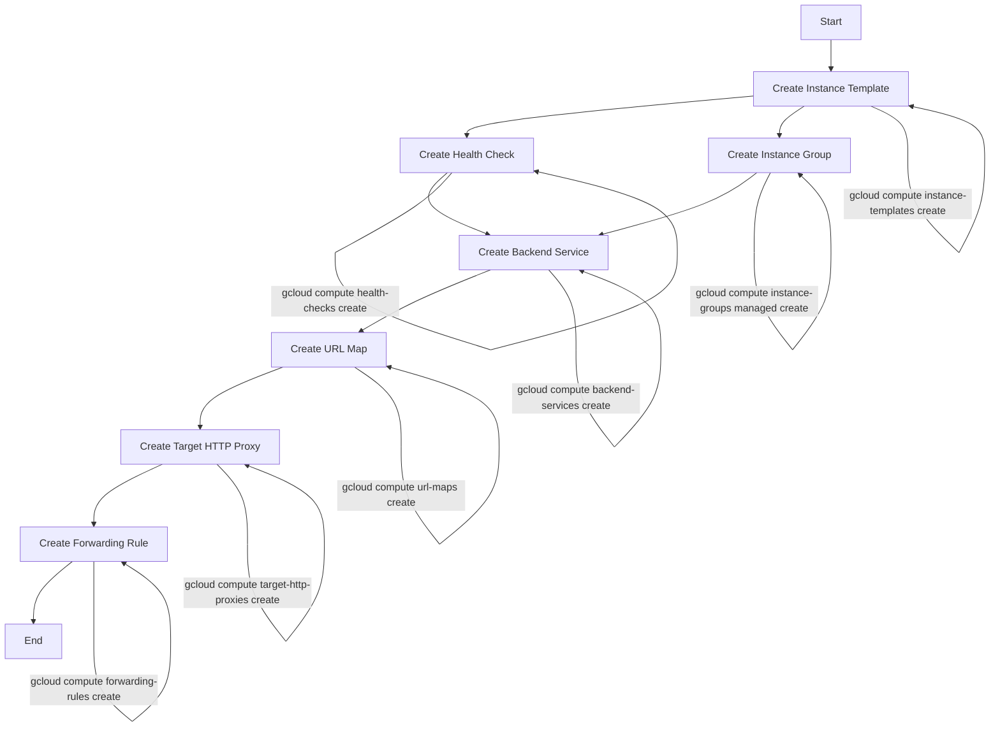
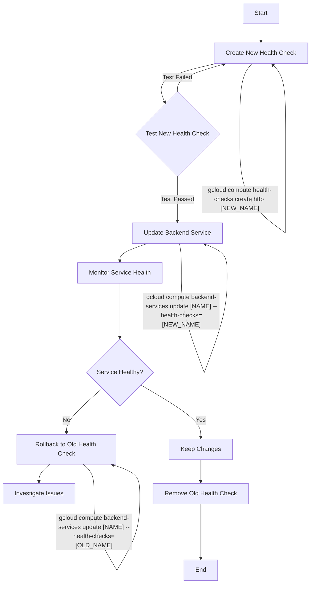

我来帮你分析 Google Cloud 负载均衡相关资源的创建顺序和健康检查更新的问题。



关于创建顺序的主要命令参考：

1. 创建实例模板:

```bash
gcloud compute instance-templates create [TEMPLATE_NAME] \
    --machine-type=[MACHINE_TYPE] \
    --image-family=[IMAGE_FAMILY] \
    --image-project=[IMAGE_PROJECT]
```

2. 创建健康检查:

```bash
gcloud compute health-checks create http [HEALTH_CHECK_NAME] \
    --check-interval=[CHECK_INTERVAL] \
    --timeout=[TIMEOUT] \
    --unhealthy-threshold=[UNHEALTHY_THRESHOLD]
```

3. 创建实例组:

```bash
gcloud compute instance-groups managed create [GROUP_NAME] \
    --template=[TEMPLATE_NAME] \
    --size=[SIZE] \
    --zone=[ZONE]
```

4. 创建后端服务:

```bash
gcloud compute backend-services create [BACKEND_SERVICE_NAME] \
    --protocol=HTTP \
    --health-checks=[HEALTH_CHECK_NAME] \
    --global
```

关于更新健康检查的问题：

1. 更新流程：
   - 只需要更新 Backend Service 即可，不需要修改其他资源
   - 使用以下命令更新：

```bash
gcloud compute backend-services update [BACKEND_SERVICE_NAME] \
    --health-checks=[NEW_HEALTH_CHECK_NAME] \
    --global
```

2. 关于停机时间（Downtime）：
   - 更新健康检查不会导致实际的服务停机
   - 更新过程中的注意事项：
     - 新的健康检查会立即开始检查实例健康状态
     - 在新的健康检查完全生效之前，后端服务会继续使用旧的健康检查结果
     - 这个过程是平滑的，不会中断现有的连接
     - 建议先创建新的健康检查，确认配置无误后再更新后端服务

最佳实践建议：

1. 在生产环境中进行更改前，建议先在测试环境验证新的健康检查配置
2. 选择流量较少的时间进行更新
3. 确保新的健康检查参数合理，避免因为过于严格的检查导致服务异常
4. 保持旧的健康检查配置一段时间，以便需要时可以快速回滚

需要我详细解释任何部分吗？

是的，你说得对！在更新健康检查的过程中，确实需要先创建新的健康检查。让我重新用流程图展示更新健康检查的完整流程：



完整的更新步骤和命令：

1. 创建新的健康检查：

```bash
gcloud compute health-checks create http [NEW_HEALTH_CHECK_NAME] \
    --check-interval=[CHECK_INTERVAL] \
    --timeout=[TIMEOUT] \
    --unhealthy-threshold=[UNHEALTHY_THRESHOLD] \
    --healthy-threshold=[HEALTHY_THRESHOLD] \
    --port=[PORT] \
    --request-path=[PATH]
```

2. 验证新健康检查配置是否正确：

   - 确认检查间隔是否合适
   - 确认超时设置是否合理
   - 确认健康/不健康阈值是否适当
   - 验证请求路径是否正确

3. 更新后端服务使用新的健康检查：

```bash
gcloud compute backend-services update [BACKEND_SERVICE_NAME] \
    --health-checks=[NEW_HEALTH_CHECK_NAME] \
    --global
```

4. 监控服务状态：

```bash
# 查看后端服务状态
gcloud compute backend-services get-health [BACKEND_SERVICE_NAME] \
    --global

# 查看健康检查日志
gcloud compute health-checks describe [NEW_HEALTH_CHECK_NAME]
```

5. 如果需要回滚：

```bash
gcloud compute backend-services update [BACKEND_SERVICE_NAME] \
    --health-checks=[OLD_HEALTH_CHECK_NAME] \
    --global
```

6. 确认一切正常后，可以删除旧的健康检查：

```bash
gcloud compute health-checks delete [OLD_HEALTH_CHECK_NAME]
```

注意事项：

1. 在创建新健康检查时，建议保持与旧健康检查相似的配置，只修改需要改变的参数
2. 更新过程中保留旧的健康检查，直到确认新的健康检查完全正常工作
3. 记录旧健康检查的所有配置，以便需要时可以快速恢复
4. 建议在更新前备份当前配置

这样的流程更完整了，包含了创建新健康检查的步骤。需要我详细解释任何部分吗？
