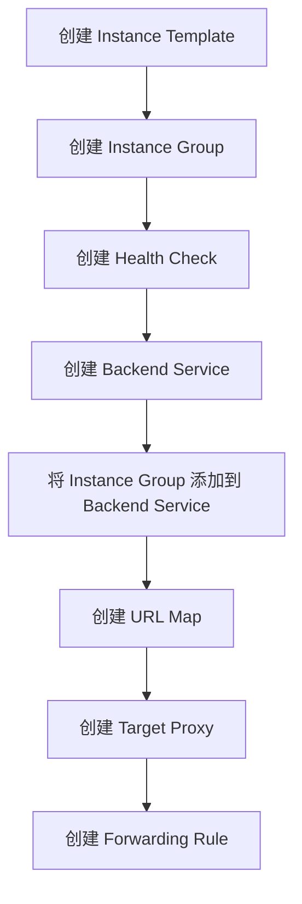
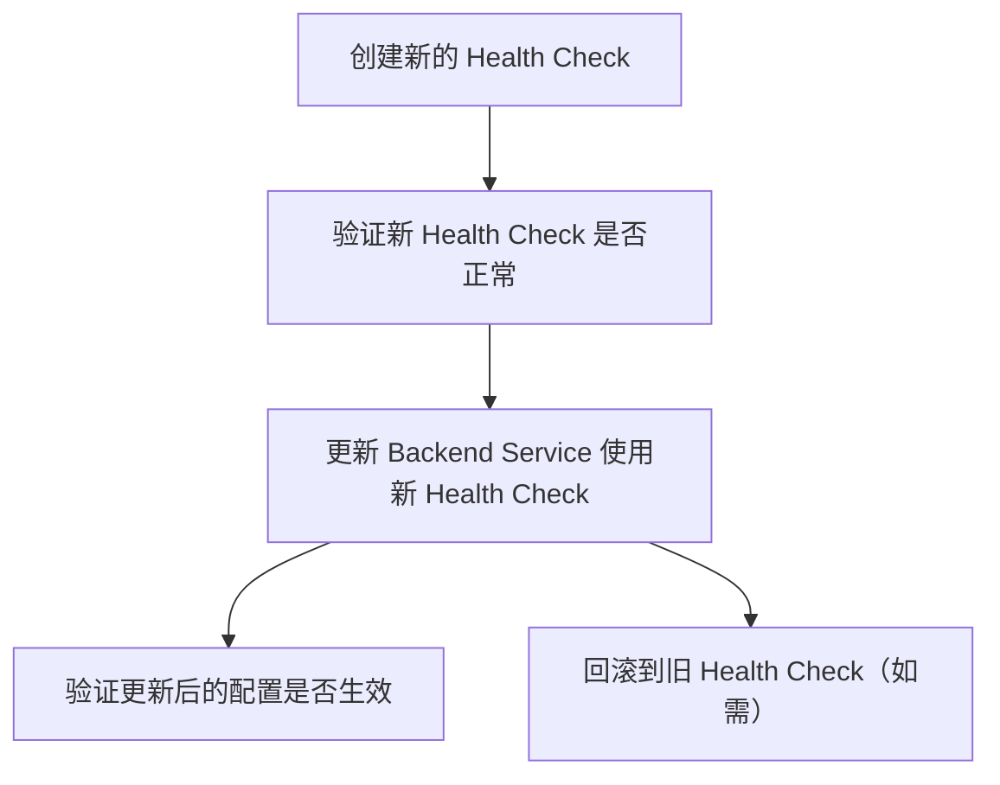
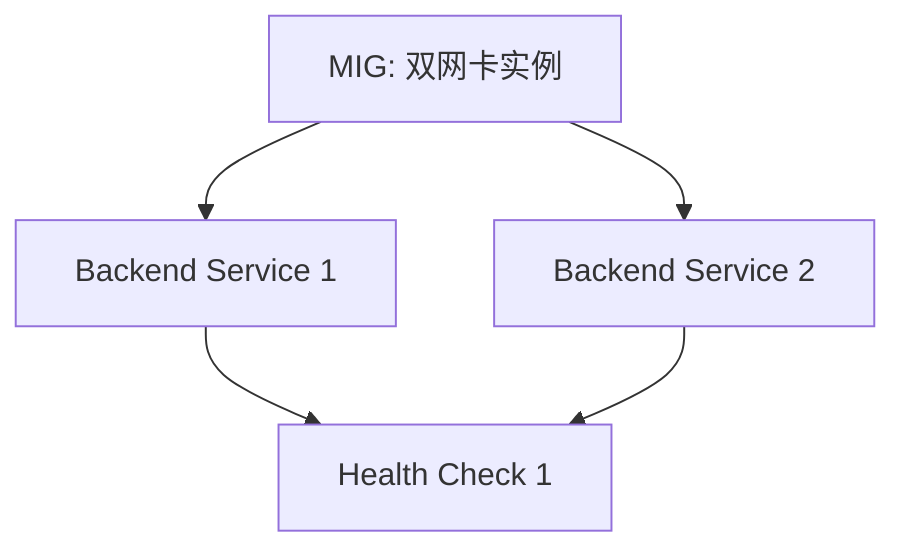
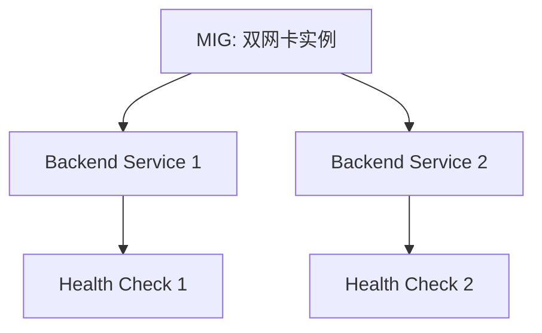

在 Google Cloud 中创建一个完整的实例组（Instance Group）并配置其前端流量（包括 Forwarding Rule、Backend Service、和 Health Check）的步骤和命令如下。顺序和依赖关系如下所示：

---

### 创建资源顺序及命令

#### 1. **创建 Instance Template** （用于管理 VM 配置）

```bash
gcloud compute instance-templates create [TEMPLATE_NAME] \
    --machine-type=[MACHINE_TYPE] \
    --image-family=[IMAGE_FAMILY] \
    --image-project=[IMAGE_PROJECT] \
    --region=[REGION] \
    --tags=[TAGS]
```

#### 2. **创建 Instance Group** （基于 Template）

```bash
gcloud compute instance-groups managed create [INSTANCE_GROUP_NAME] \
    --template=[TEMPLATE_NAME] \
    --size=[NUMBER_OF_INSTANCES] \
    --zone=[ZONE]
```

> **说明**:
>
> - Instance Group 可以是区域（Regional）或单区域（Zonal）。
> - 创建成功后会自动分配多个 VM 实例。

#### 3. **创建 Health Check** （用于后端服务健康监控）

```bash
gcloud compute health-checks create http [HEALTH_CHECK_NAME] \
    --port=[PORT] \
    --request-path=[HEALTH_CHECK_PATH]
```

> **说明**: Health Check 用于检查后端实例是否正常。如果不需要 HTTP/HTTPS 健康检查，也可以用 TCP 或 gRPC。

#### 4. **创建 Backend Service** （将 Instance Group 连接到 Backend Service）

```bash
gcloud compute backend-services create [BACKEND_SERVICE_NAME] \
    --protocol=HTTP \
    --port-name=[PORT_NAME] \
    --health-checks=[HEALTH_CHECK_NAME] \
    --global
```

> **说明**:
>
> - `--protocol` 可选值有 `HTTP`, `HTTPS`, `TCP`, `SSL`, 和 `gRPC`。
> - `--global` 表示这是一个跨区域的服务。

#### 5. **将 Instance Group 添加到 Backend Service**

```bash
gcloud compute backend-services add-backend [BACKEND_SERVICE_NAME] \
    --instance-group=[INSTANCE_GROUP_NAME] \
    --instance-group-zone=[ZONE] \
    --global
```

#### 6. **创建 URL Map** （用于路由规则）

```bash
gcloud compute url-maps create [URL_MAP_NAME] \
    --default-service=[BACKEND_SERVICE_NAME]
```

#### 7. **创建 Target Proxy** （HTTP/HTTPS 等代理）

- **HTTP Proxy:**
  ```bash
  gcloud compute target-http-proxies create [HTTP_PROXY_NAME] \
      --url-map=[URL_MAP_NAME]
  ```
- **HTTPS Proxy:**
  如果需要 HTTPS，需要先创建 SSL 证书：

  ```bash
  gcloud compute ssl-certificates create [CERTIFICATE_NAME] \
      --certificate=[PATH_TO_CERTIFICATE] \
      --private-key=[PATH_TO_PRIVATE_KEY]

  gcloud compute target-https-proxies create [HTTPS_PROXY_NAME] \
      --url-map=[URL_MAP_NAME] \
      --ssl-certificates=[CERTIFICATE_NAME]
  ```

#### 8. **创建 Forwarding Rule** （将流量指向 Proxy）

- **HTTP Forwarding Rule:**
  ```bash
  gcloud compute forwarding-rules create [FORWARDING_RULE_NAME] \
      --address=[IP_ADDRESS] \
      --global \
      --target-http-proxy=[HTTP_PROXY_NAME] \
      --ports=80
  ```
- **HTTPS Forwarding Rule:**
  ```bash
  gcloud compute forwarding-rules create [FORWARDING_RULE_NAME] \
      --address=[IP_ADDRESS] \
      --global \
      --target-https-proxy=[HTTPS_PROXY_NAME] \
      --ports=443
  ```

---

### 总结流程图

以下是 Mermaid 流程图来展示资源的创建顺序和依赖关系：



---

### 示例

假设：

- `TEMPLATE_NAME` = `web-template`
- `INSTANCE_GROUP_NAME` = `web-group`
- `HEALTH_CHECK_NAME` = `web-health-check`
- `BACKEND_SERVICE_NAME` = `web-backend-service`
- `URL_MAP_NAME` = `web-url-map`
- `HTTP_PROXY_NAME` = `web-http-proxy`
- `FORWARDING_RULE_NAME` = `web-forwarding-rule`
- 区域 = `us-central1`

命令会如下：

```bash
# 1. 创建 Instance Template
gcloud compute instance-templates create web-template \
    --machine-type=e2-medium \
    --image-family=debian-11 \
    --image-project=debian-cloud \
    --region=us-central1 \
    --tags=http-server

# 2. 创建 Instance Group
gcloud compute instance-groups managed create web-group \
    --template=web-template \
    --size=3 \
    --zone=us-central1-a

# 3. 创建 Health Check
gcloud compute health-checks create http web-health-check \
    --port=80 \
    --request-path="/health"

# 4. 创建 Backend Service
gcloud compute backend-services create web-backend-service \
    --protocol=HTTP \
    --port-name=http \
    --health-checks=web-health-check \
    --global

# 5. 添加 Instance Group 到 Backend Service
gcloud compute backend-services add-backend web-backend-service \
    --instance-group=web-group \
    --instance-group-zone=us-central1-a \
    --global

# 6. 创建 URL Map
gcloud compute url-maps create web-url-map \
    --default-service=web-backend-service

# 7. 创建 HTTP Target Proxy
gcloud compute target-http-proxies create web-http-proxy \
    --url-map=web-url-map

# 8. 创建 Forwarding Rule
gcloud compute forwarding-rules create web-forwarding-rule \
    --global \
    --target-http-proxy=web-http-proxy \
    --ports=80
```

在 Google Cloud 中，更新 Backend Service 以替换 Health Check 通常不会导致 **downtime**，因为健康检查是通过渐进式地将实例的健康状态更新到后端服务来实现的。以下是具体的调整步骤和解释。

---

### 调整步骤

1. **创建新的 Health Check**

   ```bash
   gcloud compute health-checks create http [NEW_HEALTH_CHECK_NAME] \
       --port=[PORT] \
       --request-path=[NEW_HEALTH_CHECK_PATH]
   ```

   > 注意：确保新 Health Check 的配置与预期的服务行为相匹配，并在创建完成后可以用 `gcloud compute health-checks list` 查看新规则。

2. **更新 Backend Service 的 Health Check**

   ```bash
   gcloud compute backend-services update [BACKEND_SERVICE_NAME] \
       --health-checks=[NEW_HEALTH_CHECK_NAME] \
       --global
   ```

   > 说明：

   - `--global` 参数用于全局后端服务，如果是区域性后端服务，去掉该参数。
   - 该操作会替换当前使用的 Health Check。

3. **验证更新后的配置**
   ```bash
   gcloud compute backend-services describe [BACKEND_SERVICE_NAME] --global
   ```
   查看输出是否正确关联到新 Health Check。

---

### 是否有 Downtime？

- **更新流程**：Google Cloud 在更新 Backend Service 的 Health Check 时，会对新的 Health Check 规则进行验证，确保实例组内的实例在新规则下被标记为健康，然后逐步应用新的规则。
- **影响分析**：
  - 如果新规则能快速通过所有实例（如返回 200 OK），就不会有 downtime。
  - 如果新规则配置错误，导致实例被判定为不健康，可能会短暂影响流量分发。

> **最佳实践**：
>
> - 在更新前测试新 Health Check，确保它能正确标记实例为健康。
> - 对于关键服务，使用 **多个后端服务** 的方式逐步切换以降低风险。

---

### 如果需要回滚

如果新规则导致问题，可以快速回滚到之前的 Health Check：

```bash
gcloud compute backend-services update [BACKEND_SERVICE_NAME] \
    --health-checks=[OLD_HEALTH_CHECK_NAME] \
    --global
```

---

### 流程图展示

以下是更新 Backend Service Health Check 的流程：



---

通过以上操作，你可以安全地替换 Health Check，而不会引起服务中断。

是的，更换 Health Check 规则 **只需要修改 Backend Service**，因为 Health Check 是直接关联到 Backend Service 的资源，不会影响其他配置，如 Instance Group、Forwarding Rule 或 URL Map。

---

### 资源关系分析

1. **Backend Service 和 Health Check 的关系**：

   - Backend Service 使用 Health Check 来确定其后端（Instance Group 或其他后端）的健康状态。
   - Health Check 的更改只需通过 `gcloud compute backend-services update` 命令更新到 Backend Service。

2. **其他资源的影响**：
   - **Instance Group**：仅作为 Backend Service 的后端，与 Health Check 无直接关系。
   - **Forwarding Rule / URL Map / Target Proxy**：这些资源只与流量转发和路由有关，不涉及 Health Check。

---

### 更换过程中的依赖关系

- Health Check 的作用范围仅限于 Backend Service。
- 更换新的 Health Check 不会影响与 Backend Service 相关联的其他资源。

---

### 确认修改范围

你只需执行以下步骤：

1. 创建新的 Health Check：

   ```bash
   gcloud compute health-checks create http [NEW_HEALTH_CHECK_NAME] \
       --port=[PORT] \
       --request-path=[NEW_HEALTH_CHECK_PATH]
   ```

2. 更新 Backend Service：
   ```bash
   gcloud compute backend-services update [BACKEND_SERVICE_NAME] \
       --health-checks=[NEW_HEALTH_CHECK_NAME] \
       --global
   ```

这两个步骤完成后即可生效，无需修改其他资源。

---

### 验证

你可以通过以下命令确认 Backend Service 的配置是否成功更新：

```bash
gcloud compute backend-services describe [BACKEND_SERVICE_NAME] --global
```

查看输出中的 `healthChecks` 字段是否指向新的 Health Check。

---

### 总结

> **更换 Health Check 仅需要更新 Backend Service**，不会影响其他资源。


是的，这种情况是 正常的，但可能会带来一些需要注意的细节和潜在问题。

情况分析

	1.	同一组 MIG（Instance Group）：
	•	Managed Instance Group (MIG) 的主机可以服务于多个 Backend Service。
	•	MIG 中的实例只需配置正确的负载均衡端口和网络接口，即可通过不同的 Backend Service 接受流量。
	2.	双网卡实例：
	•	如果 MIG 的实例有双网卡（多个网络接口），可以分别连接到不同的网络或流量来源。
	•	不同的 Backend Service 可以使用实例的不同端口或网卡，具体取决于你的配置。
	3.	Health Check 重用：
	•	正常情况：同一个 Health Check 可以被多个 Backend Service 重用。
	•	前提：
	•	Health Check 的目标端口或路径适用于所有关联的 Backend Service。
	•	使用的后端（如 MIG 实例）对该 Health Check 的返回一致（健康或不健康）。

是否会有问题？

这在技术上是支持的，但需要注意以下几个潜在问题：

1. Health Check 的通用性

	•	如果 Health Check 的路径（如 /health）和端口（如 80）能够正确反映所有流量路径的健康状态，那重用 Health Check 是没有问题的。
	•	但是，如果两个 Backend Service 服务的流量类型或路径不同，健康状态可能不一致，使用同一个 Health Check 可能会产生错误判断。

2. 负载分发和健康状态的关联

	•	如果其中一个 Backend Service 的流量需求与 Health Check 的配置不一致（例如需要检查不同端口或路径），可能会导致某些请求被分配到不健康的实例。

3. 实例管理复杂性

	•	对于双网卡的 MIG 实例，如果后端流量路径或端口发生变化，你需要同时调整多个 Backend Service 和 Health Check 的配置，增加了运维复杂性。

推荐实践

	1.	验证 Health Check 配置是否适用于所有 Backend Service
	•	确保健康检查的配置（端口、路径、协议）适用于关联的所有 Backend Service。
	•	通过以下命令检查 Health Check 的目标端口和路径：

gcloud compute health-checks describe [HEALTH_CHECK_NAME]


	2.	分离 Health Check（如必要）
	•	如果不同 Backend Service 的健康需求不同，建议为每个 Backend Service 配置独立的 Health Check。例如：
```bash
gcloud compute health-checks create http [HEALTH_CHECK_NAME_FOR_SERVICE1] \
    --port=8080 \
    --request-path="/service1/health"

gcloud compute health-checks create http [HEALTH_CHECK_NAME_FOR_SERVICE2] \
    --port=9090 \
    --request-path="/service2/health"
```

	3.	优化流量路由
	•	为双网卡实例明确配置流量路由规则，确保每个 Backend Service 都能正确使用对应网卡和端口。
	4.	定期测试和验证
	•	使用以下命令测试健康检查和后端服务状态：

gcloud compute backend-services get-health [BACKEND_SERVICE_NAME] --global

Mermaid 流程图示例

以下是同一个 MIG 连接到两个 Backend Service 的结构示例：

如果不同 Backend Service 的健康检查需求不同，建议分离：

总结

	•	使用同一个 Health Check 是正常的，但需要确保其配置适合所有关联的 Backend Service。
	•	如果流量需求或健康检查的要求不同，建议分离 Health Check。
	•	定期验证 Health Check 和 Backend Service 的配置状态以确保服务稳定性。

在 Google Cloud 中创建和配置资源的顺序非常重要，因为它们之间存在依赖关系。以下是一个典型的创建顺序和相应的 `gcloud` 命令：

### 1. 创建实例组（Instance Group）
实例组可以是托管实例组（Managed Instance Group）或无托管实例组（Unmanaged Instance Group）。

**托管实例组：**
```bash
gcloud compute instance-groups managed create <GROUP_NAME> \
  --base-instance-name <INSTANCE_NAME_PREFIX> \
  --size <NUMBER_OF_INSTANCES> \
  --template <INSTANCE_TEMPLATE_NAME> \
  --zone <ZONE>
```

**无托管实例组：**
```bash
gcloud compute instance-groups unmanaged create <GROUP_NAME> \
  --zone <ZONE>
```

### 2. 创建健康检查（Health Check）
健康检查用于监控实例的健康状态。

**HTTP 健康检查：**
```bash
gcloud compute health-checks create http <HEALTH_CHECK_NAME> \
  --request-path <PATH> \
  --port <PORT>
```

**HTTPS 健康检查：**
```bash
gcloud compute health-checks create https <HEALTH_CHECK_NAME> \
  --request-path <PATH> \
  --port <PORT>
```

**TCP 健康检查：**
```bash
gcloud compute health-checks create tcp <HEALTH_CHECK_NAME> \
  --port <PORT>
```

### 3. 创建后端服务（Backend Service）
后端服务将实例组与健康检查关联起来。

```bash
gcloud compute backend-services create <BACKEND_SERVICE_NAME> \
  --protocol <PROTOCOL> \
  --port <PORT> \
  --health-checks <HEALTH_CHECK_NAME> \
  --global
```

### 4. 将实例组添加到后端服务
```bash
gcloud compute backend-services add-backend <BACKEND_SERVICE_NAME> \
  --instance-group <GROUP_NAME> \
  --instance-group-zone <ZONE> \
  --global
```

### 5. 创建转发规则（Forwarding Rule）
转发规则将流量转发到后端服务。

**全球转发规则（用于 HTTP(S) 负载均衡）：**
```bash
gcloud compute forwarding-rules create <FORWARDING_RULE_NAME> \
  --global \
  --ip-address <STATIC_IP_ADDRESS> \
  --target <BACKEND_SERVICE_NAME> \
  --port-range <PORT_RANGE>
```

**区域转发规则（用于内部负载均衡等）：**
```bash
gcloud compute forwarding-rules create <FORWARDING_RULE_NAME> \
  --region <REGION> \
  --ip-address <STATIC_IP_ADDRESS> \
  --target <BACKEND_SERVICE_NAME> \
  --port-range <PORT_RANGE>
```

### 关于健康检查和后端服务的绑定

是的，一个健康检查可以绑定到多个后端服务，而这两个后端服务可以绑定到同一个实例组。这种配置是允许的，因为健康检查是独立的资源，可以被多个后端服务引用。

**示例：**

- 健康检查 `hc1` 绑定到后端服务 `bs1` 和 `bs2`。
- 后端服务 `bs1` 和 `bs2` 都绑定到实例组 `ig1`。

这种配置在某些场景下是有用的，例如你希望不同的后端服务使用相同的健康检查来监控同一个实例组的不同流量。

### 总结

1. 创建实例组。
2. 创建健康检查。
3. 创建后端服务，并将健康检查绑定到后端服务。
4. 将实例组添加到后端服务。
5. 创建转发规则，将流量转发到后端服务。

确保按照这个顺序创建资源，以避免依赖性问题。
