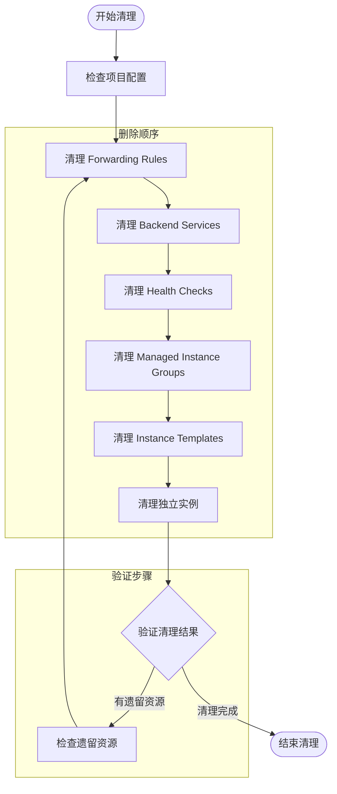

# GCP 资源清理指南

## 前置条件

- 已安装 Google Cloud SDK
- 已配置正确的项目权限
- 已设置正确的项目ID

```bash
gcloud config set project YOUR_PROJECT_ID
```

## 清理步骤

### 步骤 1: 清理 Forwarding Rules

Forwarding rules 是负载均衡配置的前端，需要首先清理。

```bash
# 列出所有相关的 forwarding rules
$ gcloud compute forwarding-rules list | grep -E "dev-cn-gateway|dev-cn-count"
NAME                    REGION       IP_ADDRESS     IP_PROTOCOL  TARGET
dev-cn-gateway-rule    us-central1  34.XXX.XXX.XXX  TCP          dev-cn-gateway-target
dev-cn-count-rule      us-central1  34.XXX.XXX.XXX  TCP          dev-cn-count-target

# 删除指定的 forwarding rule
$ gcloud compute forwarding-rules delete dev-cn-gateway-rule --region=us-central1
```

### 步骤 2: 清理 Backend Services

Backend services 定义了如何将流量分发到实例组。

```bash
# 列出所有相关的 backend services
$ gcloud compute backend-services list | grep -E "dev-cn-gateway|dev-cn-count"
NAME                     BACKENDS  PROTOCOL
dev-cn-gateway-backend   2        HTTP
dev-cn-count-backend     1        HTTP

# 删除指定的 backend service
$ gcloud compute backend-services delete dev-cn-gateway-backend --global
```

### 步骤 3: 清理 Health Checks

Health checks 用于监控实例的健康状态。

```bash
# 列出所有相关的 health checks
$ gcloud compute health-checks list | grep -E "dev-cn-gateway|dev-cn-count"
NAME                      PROTOCOL
dev-cn-gateway-health     HTTP
dev-cn-count-health       HTTP

# 删除指定的 health check
$ gcloud compute health-checks delete dev-cn-gateway-health
```

### 步骤 4: 清理 Managed Instance Groups (MIG)

MIG 管理着一组实例。

```bash
# 列出所有相关的 managed instance groups
$ gcloud compute instance-groups managed list | grep -E "dev-cn-gateway|dev-cn-count"
NAME               LOCATION       SCOPE  TEMPLATE                     SIZE
dev-cn-gateway-ig  us-central1-a  zone   dev-cn-gateway-template     2
dev-cn-count-ig    us-central1-a  zone   dev-cn-count-template       1

# 删除指定的 managed instance group
$ gcloud compute instance-groups managed delete dev-cn-gateway-ig --zone=us-central1-a
```

### 步骤 5: 清理 Instance Templates

Instance templates 定义了实例的配置。

```bash
# 列出所有相关的 instance templates
$ gcloud compute instance-templates list | grep -E "dev-cn-gateway|dev-cn-count"
NAME                      MACHINE_TYPE   PREEMPTIBLE  CREATION_TIMESTAMP
dev-cn-gateway-template   n1-standard-2              2023-01-01T10:00:00
dev-cn-count-template     n1-standard-1              2023-01-01T10:00:00

# 删除指定的 instance template
$ gcloud compute instance-templates delete dev-cn-gateway-template
```

### 步骤 6: 清理独立实例

最后清理任何未被 MIG 管理的独立实例。

```bash
# 列出所有相关的独立实例
$ gcloud compute instances list | grep -E "dev-cn-gateway|dev-cn-count"
NAME                 ZONE           MACHINE_TYPE   STATUS
dev-cn-gateway-test  us-central1-a  n1-standard-2  RUNNING

# 删除指定的实例
$ gcloud compute instances delete dev-cn-gateway-test --zone=us-central1-a
```

## 验证清理结果

在每个步骤完成后，都应该验证资源是否已被正确删除：

```bash
# 综合检查所有资源
for TYPE in "forwarding-rules" "backend-services" "health-checks" \
           "instance-groups managed" "instance-templates" "instances"; do
    echo "Checking $TYPE..."
    gcloud compute $TYPE list | grep -E "dev-cn-gateway|dev-cn-count"
done
```



这个文档提供了：

1. 详细的步骤说明
2. 每个步骤的实际命令示例
3. 预期的输出示例
4. 验证方法
5. 完整的流程图展示了资源间的依赖关系和清理顺序

流程图清晰展示了：

1. 资源清理的先后顺序
2. 验证步骤
3. 如果发现遗留资源需要重新清理的循环过程

我来帮您制定一个清理 GCP 资源的完整方案。由于这些组件之间存在依赖关系，我们需要按照特定的顺序进行删除。

```bash
#!/bin/bash

# 设置环境变量
PROJECT_ID=$(gcloud config get-value project)
FILTER_PATTERN="dev-cn-gateway|dev-cn-count"

echo "开始清理 GCP 资源..."
echo "项目ID: $PROJECT_ID"
echo "过滤模式: $FILTER_PATTERN"

# 1. 首先列出并删除 forwarding rules
echo "=== 清理 Forwarding Rules ==="
FORWARDING_RULES=$(gcloud compute forwarding-rules list --format="value(name)" | grep -E "$FILTER_PATTERN")
for rule in $FORWARDING_RULES; do
    echo "删除 forwarding rule: $rule"
    gcloud compute forwarding-rules delete $rule --quiet
done

# 2. 清理 backend services
echo "=== 清理 Backend Services ==="
BACKEND_SERVICES=$(gcloud compute backend-services list --format="value(name)" | grep -E "$FILTER_PATTERN")
for service in $BACKEND_SERVICES; do
    echo "删除 backend service: $service"
    gcloud compute backend-services delete $service --global --quiet
done

# 3. 清理 health checks
echo "=== 清理 Health Checks ==="
HEALTH_CHECKS=$(gcloud compute health-checks list --format="value(name)" | grep -E "$FILTER_PATTERN")
for check in $HEALTH_CHECKS; do
    echo "删除 health check: $check"
    gcloud compute health-checks delete $check --quiet
done

# 4. 清理 managed instance groups (MIG)
echo "=== 清理 Managed Instance Groups ==="
MIGS=$(gcloud compute instance-groups managed list --format="value(name)" | grep -E "$FILTER_PATTERN")
for mig in $MIGS; do
    ZONE=$(gcloud compute instance-groups managed list --filter="name=$mig" --format="value(zone)")
    echo "删除 managed instance group: $mig in zone $ZONE"
    gcloud compute instance-groups managed delete $mig --zone=$ZONE --quiet
done

# 5. 清理 instance templates
echo "=== 清理 Instance Templates ==="
TEMPLATES=$(gcloud compute instance-templates list --format="value(name)" | grep -E "$FILTER_PATTERN")
for template in $TEMPLATES; do
    echo "删除 instance template: $template"
    gcloud compute instance-templates delete $template --quiet
done

# 6. 清理独立运行的实例
echo "=== 清理独立实例 ==="
INSTANCES=$(gcloud compute instances list --format="value(name)" | grep -E "$FILTER_PATTERN")
for instance in $INSTANCES; do
    ZONE=$(gcloud compute instances list --filter="name=$instance" --format="value(zone)")
    echo "删除实例: $instance in zone $ZONE"
    gcloud compute instances delete $instance --zone=$ZONE --quiet
done

# 验证清理结果的函数
check_resources() {
    echo "=== 验证剩余资源 ==="
    echo "检查 Forwarding Rules:"
    gcloud compute forwarding-rules list | grep -E "$FILTER_PATTERN"

    echo "检查 Backend Services:"
    gcloud compute backend-services list | grep -E "$FILTER_PATTERN"

    echo "检查 Health Checks:"
    gcloud compute health-checks list | grep -E "$FILTER_PATTERN"

    echo "检查 Managed Instance Groups:"
    gcloud compute instance-groups managed list | grep -E "$FILTER_PATTERN"

    echo "检查 Instance Templates:"
    gcloud compute instance-templates list | grep -E "$FILTER_PATTERN"

    echo "检查独立实例:"
    gcloud compute instances list | grep -E "$FILTER_PATTERN"
}

# 执行资源检查
check_resources

echo "清理操作完成！"

```

我已经创建了一个完整的清理脚本，这个脚本会按照以下顺序处理资源：

1. 首先删除 Forwarding Rules（因为它们依赖于其他资源）
2. 删除 Backend Services
3. 删除 Health Checks
4. 删除 Managed Instance Groups (MIG)
5. 删除 Instance Templates
6. 删除任何剩余的独立实例

使用方法：

1. 将脚本保存为 `cleanup-gcp.sh`
2. 添加执行权限：

```bash
chmod +x cleanup-gcp.sh
```

3. 在运行之前，确保已经正确设置了 GCP 项目：

```bash
gcloud config set project YOUR_PROJECT_ID
```

4. 运行脚本：

```bash
./cleanup-gcp.sh
```

注意事项：

1. 脚本使用 `--quiet` 参数来跳过确认提示，请谨慎使用
2. 建议先在测试环境中运行
3. 删除操作是不可逆的，建议先进行资源备份
4. 脚本结束后会自动检查是否还有遗留资源

如果您想要在执行删除操作前先查看有哪些资源，可以注释掉删除命令，只保留列出资源的命令：

```bash
# 查看所有相关的 managed instance groups
gcloud compute instance-groups managed list | grep -E "dev-cn-gateway|dev-cn-count"

# 查看所有相关的 forwarding rules
gcloud compute forwarding-rules list | grep -E "dev-cn-gateway|dev-cn-count"

# 查看所有相关的 backend services
gcloud compute backend-services list | grep -E "dev-cn-gateway|dev-cn-count"
```

# Chatgpt

为了确保资源依赖关系的正确处理，按照依赖顺序删除相关组件：先删除 Forwarding Rules、Backend Services、Health Checks，再删除 Managed Instance Groups (MIG)、Instance Templates 以及任何剩余的独立实例。下面是按照你要求的顺序提供的操作步骤。

### 1. 删除 Forwarding Rules

首先删除 Forwarding Rules，因为它们依赖于 Backend Services 和其他资源：

```bash
# 列出并删除相关的 Forwarding Rules
gcloud compute forwarding-rules list | egrep "dev-cn-gateway|dev-cn-count"

# 删除 Forwarding Rules
gcloud compute forwarding-rules delete <FORWARDING_RULE_NAME> --region <REGION>
```

### 2. 删除 Backend Services

接下来删除与 Forwarding Rules 相关的 Backend Services：

```bash
# 列出并删除相关的 Backend Services
gcloud compute backend-services list | egrep "dev-cn-gateway|dev-cn-count"

# 删除 Backend Services
gcloud compute backend-services delete <BACKEND_SERVICE_NAME> --region <REGION>
```

### 3. 删除 Health Checks

Backend Services 通常会有健康检查 (Health Checks) 关联，接下来可以删除这些健康检查：

```bash
# 列出并删除相关的 Health Checks
gcloud compute health-checks list | egrep "dev-cn-gateway|dev-cn-count"

# 删除 Health Checks
gcloud compute health-checks delete <HEALTH_CHECK_NAME>
```

### 4. 删除 Managed Instance Groups (MIG)

删除依赖的资源后，接下来可以删除 Managed Instance Groups：

```bash
# 列出并删除相关的 Managed Instance Groups
gcloud compute instance-groups managed list | egrep "dev-cn-gateway|dev-cn-count"

# 删除 Managed Instance Groups
gcloud compute instance-groups managed delete <MIG_NAME> --region <REGION>
```

### 5. 删除 Instance Templates

Managed Instance Groups 通常依赖于 Instance Templates，因此在 MIG 删除后可以删除相应的 Instance Templates：

```bash
# 列出并删除相关的 Instance Templates
gcloud compute instance-templates list | egrep "dev-cn-gateway|dev-cn-count"

# 删除 Instance Templates
gcloud compute instance-templates delete <INSTANCE_TEMPLATE_NAME>
```

### 6. 删除剩余的独立实例

最后删除任何未包含在 MIG 中的独立实例：

```bash
# 列出并删除相关的 Instances
gcloud compute instances list | egrep "dev-cn-gateway|dev-cn-count"

# 删除匹配的 Instances
gcloud compute instances delete <INSTANCE_NAME> --zone <ZONE>
```

### 7. 最后检查是否有剩余资源

为确保所有相关资源都已清理干净，可以再次检查所有相关组件：

```bash
# 检查是否还有剩余的资源
gcloud compute forwarding-rules list | egrep "dev-cn-gateway|dev-cn-count"
gcloud compute backend-services list | egrep "dev-cn-gateway|dev-cn-count"
gcloud compute health-checks list | egrep "dev-cn-gateway|dev-cn-count"
gcloud compute instance-groups managed list | egrep "dev-cn-gateway|dev-cn-count"
gcloud compute instance-templates list | egrep "dev-cn-gateway|dev-cn-count"
gcloud compute instances list | egrep "dev-cn-gateway|dev-cn-count"
```

### 重要提示

- 删除资源时需要确保区域 (region) 和区域 (zone) 正确。
- 建议先备份相关配置，避免误删关键资源。
