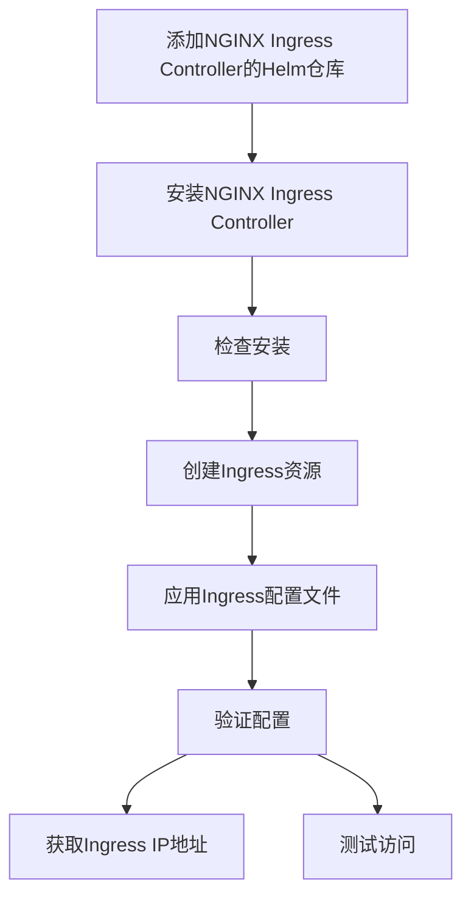
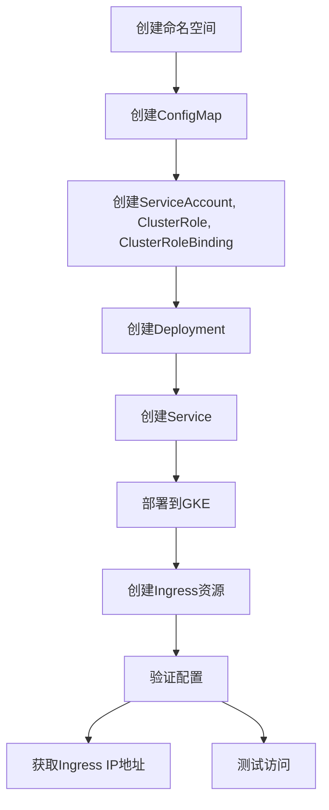

https://cloud.google.com/kubernetes-engine/docs/concepts/ingress-ilb

Internal 
https://cloud.google.com/kubernetes-engine/docs/how-to/internal-load-balance-ingress

云原生的
https://cloud.google.com/kubernetes-engine/docs/how-to/container-native-load-balancing


自定义的
https://cloud.google.com/kubernetes-engine/docs/how-to/custom-ingress-controller

This page describes how you can use a custom Ingress controller with Google Kubernetes Engine (GKE).
Caution: Google does not provide support for debugging issues with custom Ingress controllers.


Kubernetes Ingress 是一种 API 对象，它管理外部访问集群内服务的 HTTP 和 HTTPS 路由。Ingress 资源允许你定义基于请求的路由规则，例如主机名、路径等，来将外部请求路由到集群内的服务。

Ingress 控制器（Ingress Controller）是实现 Ingress 规则的组件。它通常运行在集群中，并且监听 Ingress 资源的变化，然后配置自己的负载均衡器或者反向代理来满足这些规则。

以下是关于 Kubernetes Ingress 控制器的一些关键点：

1. **集群级别**：Ingress 是集群级别的资源，意味着它可以被集群内的所有命名空间（Namespace）中的服务使用。

2. **暴露服务**：Ingress 可以暴露集群内的服务给外部网络，使得外部的客户端可以访问这些服务。

3. **配置灵活性**：Ingress 允许你定义复杂的路由规则，包括基于主机名的路由、基于路径的路由等。

4. **安全性**：Ingress 可以配置 SSL/TLS 终端，允许你为服务配置 HTTPS。

5. **单一入口点**：Ingress 可以作为集群服务的单一入口点，使得外部流量通过一个统一的地址进入集群，然后根据定义的规则分发到不同的服务。

6. **可扩展性**：不同的 Ingress 控制器实现可以提供不同的功能，例如 Nginx Ingress Controller、HAProxy Ingress Controller 等。

7. **与服务的关联**：Ingress 通过引用服务（Service）和端点（Endpoints）来实现请求的路由。

8. **资源限制**：Ingress 资源的使用可能会受到集群资源的限制，例如网络策略、配额等。

9. **监控与日志**：Ingress 控制器通常会提供监控和日志记录功能，帮助管理员了解流量模式和诊断问题。

总的来说，Ingress 控制器是 Kubernetes 集群中非常重要的组件，它允许外部流量以一种受控和安全的方式进入集群，并且可以根据需求灵活配置路由规则。


在 Kubernetes 中，Ingress Controller 通常不会直接暴露一个特殊的 IP 地址，而是通过 Kubernetes Service 来暴露。Service 是 Kubernetes 集群中的一个抽象，它定义了一种访问容器化应用的方式，无论后端 Pod 如何变化。以下是一些常见的方法来指定或获取 Service 的 IP 地址：

1. **ClusterIP**: 默认情况下，Service 会创建一个 ClusterIP，这是一个虚拟的 IP 地址，仅在集群内部可用。你不能手动指定 ClusterIP，它由 Kubernetes 动态分配。

2. **NodePort**: 如果你想要从集群外部访问 Service，可以指定 Service 类型为 NodePort。这会在每个节点上打开一个静态端口（如果你指定了端口），或者动态分配一个端口（如果未指定）。你可以使用节点的 IP 地址加上这个端口来访问 Service。

3. **LoadBalancer**: 在某些云服务提供商上，你可以将 Service 类型设置为 LoadBalancer，自动为你的 Service 分配一个外部 IP 地址，并通过云负载均衡器进行流量分发。

4. **ExternalIPs**: 你可以在 Service 定义中指定一个或多个 ExternalIPs，这些 IP 地址可以直接从外部网络访问。这些 IP 必须是由你控制的，并且可以是任何有效的 IP 地址。

5. **Ingress**: 对于 Nginx Ingress Controller，你通常会创建一个 Ingress 资源来定义外部访问的规则。Ingress 会与特定的 Ingress Controller 服务关联，该服务可以是 NodePort 或 LoadBalancer 类型。

如果你想要手动指定一个 IP 地址用于 Ingress Controller，你可以通过以下步骤：

- 创建一个 Service 资源，将类型设置为 LoadBalancer 或 NodePort。
- 如果使用 LoadBalancer，云服务提供商将为你分配一个外部 IP。
- 如果使用 NodePort，你可以在所有节点上使用节点的 IP 地址加上 NodePort 来访问。
- 在 Service 定义中添加 `externalIPs` 字段，指定一个或多个静态 IP 地址。

示例 YAML 配置如下：

```yaml
apiVersion: v1
kind: Service
metadata:
  name: my-ingress-service
spec:
  type: LoadBalancer  # 或者 NodePort
  ports:
  - port: 80
    targetPort: 80
  selector:
    app: my-app
  externalIPs:         # 指定外部 IP 地址
  - 192.168.1.100     # 假设的外部 IP
```

请注意，具体的配置可能会根据你的云服务提供商或集群环境有所不同。而且，手动指定 IP 地址的能力也取决于你的网络环境和 Kubernetes 集群的配置。


在 Google Kubernetes Engine (GKE) 中，你可以使用云原生的 Ingress 资源来暴露你的集群内服务。以下是一些基本步骤和考虑事项：

1. **创建 Ingress 资源**: 首先，你需要创建一个 Ingress 资源的 YAML 配置文件，定义如何将外部请求路由到集群内的不同服务。例如：

```yaml
apiVersion: networking.k8s.io/v1
kind: Ingress
metadata:
  name: example-ingress
  annotations:
    kubernetes.io/ingress.global-static-ip-name: "my-static-ip"  # 指定静态 IP
spec:
  rules:
  - http:
      paths:
      - path: /service1
        pathType: ImplementationSpecific
        backend:
          service:
            name: service1
            port:
              number: 80
      - path: /service2
        pathType: ImplementationSpecific
        backend:
          service:
            name: service2
            port:
              number: 80
```

2. **使用 GKE Ingress 控制器**: GKE 提供了一个内置的 Ingress 控制器，你不需要自己部署。当你创建 Ingress 资源时，GKE 会自动使用内置的 Ingress 控制器来处理。

3. **静态 IP 地址**: 如果你想要为你的 Ingress 资源分配一个静态 IP 地址，可以在 Ingress 资源的注解中指定 `kubernetes.io/ingress.global-static-ip-name`。这将确保即使 Ingress 资源被删除和重新创建，它也会保留相同的 IP 地址。

4. **配置 DNS**: 一旦你有了 Ingress 的 IP 地址或域名，你需要配置 DNS，将你的域名指向这个 IP 地址或使用 GKE 提供的默认域名。

5. **SSL/TLS 证书**: 如果你需要 HTTPS，GKE 允许你为 Ingress 资源配置 SSL/TLS 证书。你可以使用注解来指定证书。

6. **防火墙规则**: 在 GKE 中，你可能需要配置防火墙规则来允许流量进入你的集群。

7. **监控和日志**: 确保你已经设置了监控和日志记录，以便跟踪 Ingress 的使用情况和性能。

8. **更新和应用 Ingress 配置**: 使用 `kubectl apply -f your-ingress.yaml` 命令来创建或更新你的 Ingress 资源。

9. **验证**: 创建或更新 Ingress 后，使用 `kubectl get ingress` 命令来检查 Ingress 的状态，并确保它已经正确配置。

请注意，GKE 的 Ingress 功能可能随着版本和配置的不同而有所变化，因此你应该参考 GKE 的官方文档来获取最新的信息和最佳实践。此外，GKE 还提供了一些高级功能，如自动 SSL 证书管理、HTTP 到 HTTPS 的重定向等，这些都可以在你的 Ingress 配置中使用注解来启用。

在 Google Kubernetes Engine (GKE) 中，如果你想要配置一个内部 Ingress 来暴露你的集群内服务，你可以使用 GKE 的内部负载均衡器（Internal Load Balancer, ILB）。内部负载均衡器允许你将服务暴露给私有网络中的客户端，而不是公开到互联网上。以下是配置内部 Ingress 的基本步骤：

1. **创建 Ingress 资源**: 与外部 Ingress 类似，你首先需要创建一个 Ingress 资源的 YAML 文件。但是，你需要使用注解来指定使用内部负载均衡器。

```yaml
apiVersion: networking.k8s.io/v1
kind: Ingress
metadata:
  name: internal-ingress
  annotations:
    kubernetes.io/ingress.class: "gce"
    networking.gke.io/managed-certificates: "my-certificate"  # 如果需要 SSL/TLS
    networking.gke.io/internal-load-balancer: "true"  # 指定使用内部负载均衡器
spec:
  backend:
    service:
      name: my-service
      port:
        number: 80
```

2. **配置注解**: 在 Ingress 资源的注解中，使用 `networking.gke.io/internal-load-balancer: "true"` 来指定使用内部负载均衡器。

3. **SSL/TLS 支持**: 如果你需要 SSL/TLS，可以使用 `networking.gke.io/managed-certificates` 注解来指定证书名称。

4. **选择 Ingress 类型**: 确保你使用的是 GKE 支持的 Ingress 类型。在上面的例子中，`kubernetes.io/ingress.class: "gce"` 指定了使用 GKE 的默认 Ingress 控制器。

5. **配置网络**: 确保你的 GKE 集群配置了相应的 VPC 网络，并且你的服务和 Ingress 配置在正确的网络和子网中。

6. **访问控制**: 由于这是一个内部服务，你需要确保只有授权的客户端能够访问。这可能涉及到配置网络安全策略和防火墙规则。

7. **应用配置**: 使用 `kubectl apply -f your-ingress.yaml` 命令来应用你的 Ingress 配置。

8. **验证**: 应用配置后，使用 `kubectl get ingress internal-ingress` 命令来检查 Ingress 的状态，并确保它已经正确配置。

9. **访问服务**: 一旦配置完成，你的内部服务将通过内部负载均衡器暴露。你可以使用私有网络中的客户端来访问这个服务。

请注意，内部 Ingress 的确切配置可能会根据你的具体需求和 GKE 集群的配置有所不同。你应该参考 GKE 的官方文档来获取最新的信息和最佳实践。此外，GKE 可能会不断更新和改进其内部负载均衡器和 Ingress 的功能，因此请确保你使用的是最新的信息。


Google Cloud Platform (GCP) 提供了两种类型的负载均衡器：外部（External）和内部（Internal）。根据你提供的链接，它指向的是关于 GKE 的容器原生负载均衡（Container-native Load Balancing），这是一种外部负载均衡器。这种类型的负载均衡器将流量从互联网分发到你的服务。

容器原生负载均衡器的特点包括：

- **外部访问**: 它允许来自互联网的流量访问你的服务。
- **自动扩展**: 根据流量自动扩展后端服务的实例。
- **全球负载均衡**: 支持跨多个区域的负载均衡。

如果你需要的是内部负载均衡器（Internal Load Balancer, ILB），它与容器原生负载均衡器有以下不同：

- **私有网络访问**: 内部负载均衡器仅允许私有网络内的流量访问，不会从互联网接收流量。
- **不分配外部IP**: 它不分配外部IP地址，而是使用私有IP地址。
- **适用于内部服务**: 适合于需要隔离的内部服务，例如数据库或其他后端服务。

为了配置内部 Ingress，在 GKE 中，你可以按照以下步骤操作：

1. 创建一个 Ingress 资源，并在注解中指定使用内部负载均衡器。例如：

```yaml
apiVersion: networking.k8s.io/v1
kind: Ingress
metadata:
  name: internal-ingress
  annotations:
    kubernetes.io/ingress.class: "gce"  # 或 "nginx"，取决于你使用的 Ingress 控制器
    networking.gke.io/internal-load-balancer: "true"
spec:
  # 你的规则和后端配置
```

2. 确保你的集群配置正确，并且你的服务位于私有网络中。

3. 使用 `kubectl apply` 命令部署你的 Ingress 配置。

4. 验证 Ingress 是否正确创建，并且已经配置了内部负载均衡器。

请注意，具体的配置可能会根据你的 GKE 版本和网络设置有所不同。你应该参考 GKE 的官方文档来获取最新的信息和最佳实践。如果你需要进一步的帮助，可以检查 GCP 的官方文档或联系他们的支持团队。


在GCP的GKE上安装开源的Ingress Controller（例如NGINX Ingress Controller）需要以下几个步骤。以下是具体的配置文件和安装步骤：

### 前提条件

1. 你需要一个已创建的GKE集群。
2. 你需要`kubectl`命令行工具，并且它已配置为与GKE集群通信。

### 安装NGINX Ingress Controller

1. **添加NGINX Ingress Controller的Helm仓库**：
   首先，确保你已安装Helm。然后，添加NGINX Ingress Controller的Helm仓库：

    ```sh
    helm repo add ingress-nginx https://kubernetes.github.io/ingress-nginx
    helm repo update
    ```

2. **安装NGINX Ingress Controller**：
   使用以下命令安装NGINX Ingress Controller。这里指定了`controller.service.internal`为`true`以确保服务是内部的。

    ```sh
    helm install my-nginx-ingress ingress-nginx/ingress-nginx \
      --set controller.service.internal.enabled=true \
      --set controller.service.annotations."cloud\.google\.com/load-balancer-type"="Internal" \
      --namespace ingress-nginx --create-namespace
    ```

3. **检查安装**：
   确认NGINX Ingress Controller已正确安装并运行：

    ```sh
    kubectl get pods -n ingress-nginx
    ```

### 创建Ingress资源

以下是一个示例的Ingress资源配置文件，它将流量引导到内部服务。

```yaml
apiVersion: networking.k8s.io/v1
kind: Ingress
metadata:
  name: example-ingress
  namespace: default
  annotations:
    nginx.ingress.kubernetes.io/rewrite-target: /
spec:
  ingressClassName: nginx
  rules:
    - host: example.internal
      http:
        paths:
          - path: /
            pathType: Prefix
            backend:
              service:
                name: example-service
                port:
                  number: 80
```

### 应用Ingress配置文件

将上述Ingress配置文件保存为`ingress.yaml`，并应用到GKE集群：

```sh
kubectl apply -f ingress.yaml
```

### 验证配置

确保服务已正确部署，并且Ingress Controller已将流量引导到目标服务。

1. **获取Ingress IP地址**：

    ```sh
    kubectl get ingress example-ingress -o jsonpath='{.status.loadBalancer.ingress[0].ip}'
    ```

2. **测试访问**：
   你可以通过集群内部的方式访问`example.internal`，确保它解析到上述IP地址。

### 总结

以上步骤概述了如何在GCP的GKE上安装一个NGINX Ingress Controller，并配置一个示例的Ingress资源。通过这些步骤，你应该能够将流量引导到内部服务。

如果你有任何特定的需求或遇到问题，请随时告诉我。

---

**Mermaid Flowchart**:



好的，下面是如何使用普通的YAML文件来在GKE上安装NGINX Ingress Controller的步骤和对应的配置文件。

### 1. 创建命名空间

首先，创建一个命名空间来放置NGINX Ingress Controller的资源：

```sh
kubectl create namespace ingress-nginx
```

### 2. 创建ConfigMap

创建一个ConfigMap，用于NGINX Ingress Controller的配置：

```yaml
apiVersion: v1
kind: ConfigMap
metadata:
  name: nginx-configuration
  namespace: ingress-nginx
  labels:
    app.kubernetes.io/name: ingress-nginx
    app.kubernetes.io/part-of: ingress-nginx
```

### 3. 创建ServiceAccount、ClusterRole和ClusterRoleBinding

创建ServiceAccount、ClusterRole和ClusterRoleBinding：

```yaml
apiVersion: v1
kind: ServiceAccount
metadata:
  name: nginx-ingress-serviceaccount
  namespace: ingress-nginx

---
apiVersion: rbac.authorization.k8s.io/v1
kind: ClusterRole
metadata:
  name: nginx-ingress-clusterrole
rules:
  - apiGroups:
      - ""
    resources:
      - configmaps
      - endpoints
      - nodes
      - pods
      - secrets
      - services
    verbs:
      - list
      - watch
  - apiGroups:
      - ""
    resources:
      - nodes
    verbs:
      - get
  - apiGroups:
      - extensions
      - networking.k8s.io
    resources:
      - ingresses
      - ingresses/status
      - ingresses/classes
    verbs:
      - get
      - list
      - watch
  - apiGroups:
      - extensions
      - networking.k8s.io
    resources:
      - ingresses
    verbs:
      - create
      - update
      - patch
      - delete

---
apiVersion: rbac.authorization.k8s.io/v1
kind: ClusterRoleBinding
metadata:
  name: nginx-ingress-clusterrole-nisa-binding
roleRef:
  apiGroup: rbac.authorization.k8s.io
  kind: ClusterRole
  name: nginx-ingress-clusterrole
subjects:
  - kind: ServiceAccount
    name: nginx-ingress-serviceaccount
    namespace: ingress-nginx
```

### 4. 创建Deployment

创建NGINX Ingress Controller的Deployment：

```yaml
apiVersion: apps/v1
kind: Deployment
metadata:
  name: nginx-ingress-controller
  namespace: ingress-nginx
  labels:
    app.kubernetes.io/name: ingress-nginx
spec:
  replicas: 2
  selector:
    matchLabels:
      app.kubernetes.io/name: ingress-nginx
  template:
    metadata:
      labels:
        app.kubernetes.io/name: ingress-nginx
    spec:
      serviceAccountName: nginx-ingress-serviceaccount
      containers:
        - name: nginx-ingress-controller
          image: quay.io/kubernetes-ingress-controller/nginx-ingress-controller:0.44.0
          args:
            - /nginx-ingress-controller
            - --configmap=$(POD_NAMESPACE)/nginx-configuration
            - --tcp-services-configmap=$(POD_NAMESPACE)/tcp-services
            - --udp-services-configmap=$(POD_NAMESPACE)/udp-services
            - --publish-service=$(POD_NAMESPACE)/ingress-nginx
          env:
            - name: POD_NAME
              valueFrom:
                fieldRef:
                  fieldPath: metadata.name
            - name: POD_NAMESPACE
              valueFrom:
                fieldRef:
                  fieldPath: metadata.namespace
          ports:
            - name: http
              containerPort: 80
            - name: https
              containerPort: 443
          livenessProbe:
            httpGet:
              path: /healthz
              port: 10254
              scheme: HTTP
            initialDelaySeconds: 10
            timeoutSeconds: 1
            periodSeconds: 10
            successThreshold: 1
            failureThreshold: 3
          readinessProbe:
            httpGet:
              path: /healthz
              port: 10254
              scheme: HTTP
            initialDelaySeconds: 10
            timeoutSeconds: 1
            periodSeconds: 10
            successThreshold: 1
            failureThreshold: 3
```

### 5. 创建Service

创建一个内部类型的Service来暴露NGINX Ingress Controller：

```yaml
apiVersion: v1
kind: Service
metadata:
  name: ingress-nginx
  namespace: ingress-nginx
  annotations:
    cloud.google.com/load-balancer-type: "Internal"
spec:
  type: LoadBalancer
  loadBalancerIP: <your-internal-ip>
  ports:
    - name: http
      port: 80
      targetPort: 80
    - name: https
      port: 443
      targetPort: 443
  selector:
    app.kubernetes.io/name: ingress-nginx
```

### 6. 部署到GKE

将以上所有配置文件保存为`.yaml`文件，然后依次应用它们：

```sh
kubectl apply -f namespace.yaml
kubectl apply -f configmap.yaml
kubectl apply -f rbac.yaml
kubectl apply -f deployment.yaml
kubectl apply -f service.yaml
```

### 7. 创建Ingress资源

创建一个示例的Ingress资源文件：

```yaml
apiVersion: networking.k8s.io/v1
kind: Ingress
metadata:
  name: example-ingress
  namespace: default
  annotations:
    nginx.ingress.kubernetes.io/rewrite-target: /
spec:
  ingressClassName: nginx
  rules:
    - host: example.internal
      http:
        paths:
          - path: /
            pathType: Prefix
            backend:
              service:
                name: example-service
                port:
                  number: 80
```

将上述Ingress配置文件保存为`ingress.yaml`，并应用到GKE集群：

```sh
kubectl apply -f ingress.yaml
```

### 8. 验证配置

1. **获取Ingress IP地址**：

    ```sh
    kubectl get ingress example-ingress -o jsonpath='{.status.loadBalancer.ingress[0].ip}'
    ```

2. **测试访问**：
   通过集群内部的方式访问`example.internal`，确保它解析到上述IP地址。

### 总结

以上步骤和配置文件描述了如何使用普通的YAML文件在GKE上安装和配置一个NGINX Ingress Controller，以及如何配置一个示例的Ingress资源。

---

**Mermaid Flowchart**:


如何在GCP的GKE 上安装一个类似开源的ingress controller 我想在我的GKE internal 使用 请给出我具体的配置文件和安装步骤 我如果不想通过helm 安装 只是通过普通的yaml 来进行所有的安装 给出我对应的配置文件和具体步骤

我理解您想在 GKE 内部集群上安装一个开源的 Ingress Controller,并且希望通过 YAML 文件而不是 Helm 来进行安装。我会为您提供使用 NGINX Ingress Controller 的安装步骤和相关配置文件。NGINX Ingress Controller 是一个流行的开源选项,适合在 GKE 上使用。

以下是安装步骤和所需的 YAML 配置文件:


```yaml
---
# 1. 创建命名空间
apiVersion: v1
kind: Namespace
metadata:
  name: ingress-nginx

---
# 2. 创建服务账号
apiVersion: v1
kind: ServiceAccount
metadata:
  name: nginx-ingress-serviceaccount
  namespace: ingress-nginx

---
# 3. 创建 ClusterRole
apiVersion: rbac.authorization.k8s.io/v1
kind: ClusterRole
metadata:
  name: nginx-ingress-clusterrole
rules:
  - apiGroups: [""]
    resources: ["configmaps", "endpoints", "nodes", "pods", "secrets"]
    verbs: ["list", "watch"]
  - apiGroups: [""]
    resources: ["nodes"]
    verbs: ["get"]
  - apiGroups: [""]
    resources: ["services"]
    verbs: ["get", "list", "watch"]
  - apiGroups: ["extensions", "networking.k8s.io"]
    resources: ["ingresses"]
    verbs: ["get", "list", "watch"]
  - apiGroups: [""]
    resources: ["events"]
    verbs: ["create", "patch"]
  - apiGroups: ["extensions", "networking.k8s.io"]
    resources: ["ingresses/status"]
    verbs: ["update"]

---
# 4. 创建 ClusterRoleBinding
apiVersion: rbac.authorization.k8s.io/v1
kind: ClusterRoleBinding
metadata:
  name: nginx-ingress-clusterrole-binding
roleRef:
  apiGroup: rbac.authorization.k8s.io
  kind: ClusterRole
  name: nginx-ingress-clusterrole
subjects:
  - kind: ServiceAccount
    name: nginx-ingress-serviceaccount
    namespace: ingress-nginx

---
# 5. 部署 NGINX Ingress Controller
apiVersion: apps/v1
kind: Deployment
metadata:
  name: nginx-ingress-controller
  namespace: ingress-nginx
spec:
  replicas: 1
  selector:
    matchLabels:
      app: nginx-ingress
  template:
    metadata:
      labels:
        app: nginx-ingress
    spec:
      serviceAccountName: nginx-ingress-serviceaccount
      containers:
        - name: nginx-ingress-controller
          image: k8s.gcr.io/ingress-nginx/controller:v1.2.0
          args:
            - /nginx-ingress-controller
            - --publish-service=$(POD_NAMESPACE)/ingress-nginx-controller
            - --election-id=ingress-controller-leader
            - --ingress-class=nginx
            - --configmap=$(POD_NAMESPACE)/nginx-configuration
            - --tcp-services-configmap=$(POD_NAMESPACE)/tcp-services
            - --udp-services-configmap=$(POD_NAMESPACE)/udp-services
          env:
            - name: POD_NAME
              valueFrom:
                fieldRef:
                  fieldPath: metadata.name
            - name: POD_NAMESPACE
              valueFrom:
                fieldRef:
                  fieldPath: metadata.namespace
          ports:
            - name: http
              containerPort: 80
            - name: https
              containerPort: 443

---
# 6. 创建 ConfigMap
apiVersion: v1
kind: ConfigMap
metadata:
  name: nginx-configuration
  namespace: ingress-nginx

---
# 7. 创建内部 LoadBalancer 服务
apiVersion: v1
kind: Service
metadata:
  name: ingress-nginx-controller
  namespace: ingress-nginx
  annotations:
    networking.gke.io/load-balancer-type: "Internal"
spec:
  type: LoadBalancer
  ports:
    - port: 80
      targetPort: 80
      protocol: TCP
      name: http
    - port: 443
      targetPort: 443
      protocol: TCP
      name: https
  selector:
    app: nginx-ingress
```

现在,让我为您解释安装步骤:

1. 将上述 YAML 内容保存为一个文件,例如 `nginx-ingress-controller.yaml`。

2. 使用以下命令应用配置:

   ```
   kubectl apply -f nginx-ingress-controller.yaml
   ```

3. 等待所有资源创建完成。您可以使用以下命令检查状态:

   ```
   kubectl get all -n ingress-nginx
   ```

4. 一旦 LoadBalancer 服务获得了内部 IP 地址,您就可以使用该 IP 来配置您的内部 DNS 或直接在应用中使用。

这个配置会创建一个内部的 LoadBalancer,只能在 GKE 集群内部访问。如果您需要从外部访问,可以移除 Service 中的 `networking.gke.io/load-balancer-type: "Internal"` 注解。

请注意,这个配置使用的是 NGINX Ingress Controller v1.2.0。您可能需要根据您的具体需求调整版本或其他参数。

安装完成后,您可以创建 Ingress 资源来定义路由规则。例如:

```yaml
apiVersion: networking.k8s.io/v1
kind: Ingress
metadata:
  name: example-ingress
  annotations:
    kubernetes.io/ingress.class: nginx
spec:
  rules:
  - host: your-domain.com
    http:
      paths:
      - path: /
        pathType: Prefix
        backend:
          service:
            name: your-service
            port: 
              number: 80
```

这个配置将为 `your-domain.com` 设置一个简单的路由规则。

如果您需要进一步的帮助或有任何问题,请随时询问。​​​​​​​​​​​​​​​​

好的,我来为您介绍如何在GCP的GKE上安装一个开源的内部ingress controller,并给出具体的配置文件和安装步骤,不使用Helm而是通过普通的YAML文件进行安装。

以下是安装NGINX Ingress Controller的步骤:

1. 首先,创建一个命名空间用于安装Ingress Controller:

```yaml
apiVersion: v1
kind: Namespace
metadata:
  name: ingress-nginx
  labels:
    app.kubernetes.io/name: ingress-nginx
    app.kubernetes.io/instance: ingress-nginx
```

将此内容保存为`namespace.yaml`,然后执行:

```
kubectl apply -f namespace.yaml
```

2. 接下来,创建RBAC相关的资源:

```yaml
apiVersion: v1
kind: ServiceAccount
metadata:
  name: ingress-nginx
  namespace: ingress-nginx
  labels:
    app.kubernetes.io/name: ingress-nginx
    app.kubernetes.io/instance: ingress-nginx

---
apiVersion: rbac.authorization.k8s.io/v1
kind: ClusterRole
metadata:
  name: ingress-nginx
  labels:
    app.kubernetes.io/name: ingress-nginx
    app.kubernetes.io/instance: ingress-nginx
rules:
  - apiGroups:
      - ""
    resources:
      - configmaps
      - endpoints
      - nodes
      - pods
      - secrets
    verbs:
      - list
      - watch
  - apiGroups:
      - ""
    resources:
      - nodes
    verbs:
      - get
  - apiGroups:
      - ""
    resources:
      - services
    verbs:
      - get
      - list
      - watch
  - apiGroups:
      - extensions
      - networking.k8s.io
    resources:
      - ingresses
    verbs:
      - get
      - list
      - watch
  - apiGroups:
      - ""
    resources:
      - events
    verbs:
      - create
      - patch
  - apiGroups:
      - extensions
      - networking.k8s.io
    resources:
      - ingresses/status
    verbs:
      - update

---
apiVersion: rbac.authorization.k8s.io/v1
kind: ClusterRoleBinding
metadata:
  name: ingress-nginx
  labels:
    app.kubernetes.io/name: ingress-nginx
    app.kubernetes.io/instance: ingress-nginx
roleRef:
  apiGroup: rbac.authorization.k8s.io
  kind: ClusterRole
  name: ingress-nginx
subjects:
  - kind: ServiceAccount
    name: ingress-nginx
    namespace: ingress-nginx
```

将此内容保存为`rbac.yaml`,然后执行:

```
kubectl apply -f rbac.yaml
```

3. 创建ConfigMap:

```yaml
apiVersion: v1
kind: ConfigMap
metadata:
  name: ingress-nginx-controller
  namespace: ingress-nginx
  labels:
    app.kubernetes.io/name: ingress-nginx
    app.kubernetes.io/instance: ingress-nginx
```

将此内容保存为`configmap.yaml`,然后执行:

```
kubectl apply -f configmap.yaml
```

4. 创建Deployment:

```yaml
apiVersion: apps/v1
kind: Deployment
metadata:
  name: ingress-nginx-controller
  namespace: ingress-nginx
  labels:
    app.kubernetes.io/name: ingress-nginx
    app.kubernetes.io/instance: ingress-nginx
spec:
  replicas: 1
  selector:
    matchLabels:
      app.kubernetes.io/name: ingress-nginx
      app.kubernetes.io/instance: ingress-nginx
  template:
    metadata:
      labels:
        app.kubernetes.io/name: ingress-nginx
        app.kubernetes.io/instance: ingress-nginx
    spec:
      serviceAccountName: ingress-nginx
      containers:
        - name: controller
          image: k8s.gcr.io/ingress-nginx/controller:v1.2.0
          args:
            - /nginx-ingress-controller
            - --publish-service=$(POD_NAMESPACE)/ingress-nginx-controller
            - --election-id=ingress-controller-leader
            - --ingress-class=nginx
            - --configmap=$(POD_NAMESPACE)/ingress-nginx-controller
          securityContext:
            runAsUser: 101
            allowPrivilegeEscalation: true
          env:
            - name: POD_NAME
              valueFrom:
                fieldRef:
                  fieldPath: metadata.name
            - name: POD_NAMESPACE
              valueFrom:
                fieldRef:
                  fieldPath: metadata.namespace
          ports:
            - name: http
              containerPort: 80
            - name: https
              containerPort: 443
```

将此内容保存为`deployment.yaml`,然后执行:

```
kubectl apply -f deployment.yaml
```

5. 最后,创建Service:

```yaml
apiVersion: v1
kind: Service
metadata:
  name: ingress-nginx-controller
  namespace: ingress-nginx
  labels:
    app.kubernetes.io/name: ingress-nginx
    app.kubernetes.io/instance: ingress-nginx
spec:
  type: ClusterIP
  ports:
    - name: http
      port: 80
      targetPort: 80
      protocol: TCP
    - name: https
      port: 443
      targetPort: 443
      protocol: TCP
  selector:
    app.kubernetes.io/name: ingress-nginx
    app.kubernetes.io/instance: ingress-nginx
```

将此内容保存为`service.yaml`,然后执行:

```
kubectl apply -f service.yaml
```

完成以上步骤后,您就成功在GKE上安装了NGINX Ingress Controller。这个Ingress Controller是内部的,因为我们使用了`ClusterIP`类型的Service。

要使用这个Ingress Controller,您需要在创建Ingress资源时指定`kubernetes.io/ingress.class: nginx`注解。例如:

```yaml
apiVersion: networking.k8s.io/v1
kind: Ingress
metadata:
  name: example-ingress
  annotations:
    kubernetes.io/ingress.class: nginx
spec:
  rules:
  - http:
      paths:
      - path: /
        pathType: Prefix
        backend:
          service:
            name: example-service
            port: 
              number: 80
```

请注意,这些配置文件可能需要根据您的具体需求进行调整。例如,您可能需要修改镜像版本、副本数量等。此外,由于GKE环境的特殊性,您可能还需要配置网络策略或防火墙规则以允许流量进入您的集群[1][2][3][4]。

Sources
[1] Create kubernetes nginx ingress without GCP load-balancer https://stackoverflow.com/questions/43189487/create-kubernetes-nginx-ingress-without-gcp-load-balancer
[2] nginx ingress controller installation : r/kubernetes - Reddit https://www.reddit.com/r/kubernetes/comments/18c3af8/nginx_ingress_controller_installation/
[3] GKE Ingress for Application Load Balancers - Google Cloud https://cloud.google.com/kubernetes-engine/docs/concepts/ingress
[4] Use a custom Ingress controller | Google Kubernetes Engine (GKE) https://cloud.google.com/kubernetes-engine/docs/how-to/custom-ingress-controller
[5] Deploying Public & Private Nginx Ingress Controllers with HTTP(S ... https://blog.thecloudside.com/deploying-public-private-nginx-ingress-controllers-with-http-s-loadbalancer-in-gke-dcf894197fb7?gi=eeb182533b2f
[6] GKE: can't get things to work when ingress: enabled: true #62 - GitHub https://github.com/verdaccio/charts/issues/62
[7] ingress-nginx on autopilot cluster - Google Cloud Community https://www.googlecloudcommunity.com/gc/Google-Kubernetes-Engine-GKE/ingress-nginx-on-autopilot-cluster/td-p/414448/jump-to/first-unread-message
[8] GKE Ingress controller ignoring ingress.class annotation #476 https://github.com/kubernetes/ingress-gce/issues/476
[9] kubernetes/ingress-gce: Ingress controller for Google Cloud - GitHub https://github.com/kubernetes/ingress-gce
[10] Ingress configuration on Google Cloud | Google Kubernetes Engine ... https://cloud.google.com/kubernetes-engine/docs/how-to/ingress-configuration
[11] ngrok Kubernetes Ingress Controller on GKE https://ngrok.com/docs/integrations/google-gke/google-kubernetes-engine/
[12] GKE - Kong Ingress Controller https://docs.konghq.com/kubernetes-ingress-controller/latest/install/cloud/gke/
[13] community/archived/nginx-ingress-gke/index.md at master - GitHub https://github.com/GoogleCloudPlatform/community/blob/master/archived/nginx-ingress-gke/index.md
[14] A Guide to Choosing an Ingress Controller, Part 3: Open Source vs ... https://www.f5.com/company/blog/nginx/guide-to-choosing-ingress-controller-part-3-open-source-default-commercial
[15] Google Kubernetes Engine Ingress configuration for production ... https://engineering.sada.com/google-kubernetes-engine-ingress-configuration-for-production-environments-9677a303166a?gi=34c08b08cfc9
[16] how to setup yaml ingress in google cloud with redirect https://stackoverflow.com/questions/67971793/how-to-setup-yaml-ingress-in-google-cloud-with-redirect
[17] Configuring the NGINX Ingress Controller on GKE - Pluralsight https://www.pluralsight.com/cloud-guru/labs/gcp/configuring-the-nginx-ingress-controller-on-gke
[18] How To Setup Ingress On GKE Using GKE Ingress Controller https://devopscube.com/setup-ingress-gke-ingress-controller/
[19] How to define global load balancer in ingress.yaml instead of ... https://stackoverflow.com/questions/73303562/how-to-define-global-load-balancer-in-ingress-yaml-instead-of-defaulting-to-clas


在GKE上获取并配置静态IP以便使用Ingress Controller的步骤如下：

### 1. 预留静态IP地址

首先，您需要在GCP中预留一个静态IP地址。可以使用以下命令：

```bash
gcloud compute addresses create web-static-ip --global
```

### 2. 获取预留的静态IP地址

您可以使用以下命令查看预留的静态IP地址：

```bash
gcloud compute addresses describe web-static-ip --global
```

输出示例：

```plaintext
address: 203.0.113.32
...
```

### 3. 配置Ingress资源使用静态IP

创建一个Ingress资源，并在其注解中指定预留的静态IP地址。以下是一个示例配置文件：

```yaml
apiVersion: networking.k8s.io/v1
kind: Ingress
metadata:
  name: web-ingress
  annotations:
    kubernetes.io/ingress.global-static-ip-name: "web-static-ip"
spec:
  rules:
  - http:
      paths:
      - path: /
        pathType: Prefix
        backend:
          service:
            name: web-service
            port:
              number: 80
```

将此内容保存为`ingress.yaml`，然后执行以下命令应用配置：

```bash
kubectl apply -f ingress.yaml
```

### 4. 验证配置

您可以使用以下命令查看Ingress资源的外部IP地址：

```bash
kubectl get ingress web-ingress
```

输出示例：

```plaintext
NAME          HOSTS   ADDRESS         PORTS   AGE
web-ingress   *       203.0.113.32    80      4m
```

### 5. 配置服务

确保您的服务配置正确，例如：

```yaml
apiVersion: v1
kind: Service
metadata:
  name: web-service
spec:
  selector:
    app: web
  ports:
  - protocol: TCP
    port: 80
    targetPort: 8080
  type: NodePort
```

将此内容保存为`service.yaml`，然后执行以下命令应用配置：

```bash
kubectl apply -f service.yaml
```

### 总结

通过以上步骤，您可以在GKE上获取并配置静态IP以便使用Ingress Controller。请确保在创建Ingress资源时正确指定静态IP地址的名称，并验证配置是否正确。这样，您的应用程序将使用预留的静态IP地址进行外部访问。

Sources
[1] Set up an external Application Load Balancer with Ingress https://cloud.google.com/kubernetes-engine/docs/tutorials/http-balancer
[2] 静的 IP アドレスを使用してドメイン名を構成する | Kubernetes Engine https://cloud.google.com/kubernetes-engine/docs/tutorials/configuring-domain-name-static-ip?hl=ja
[3] Creating a Kubernetes Ingress Resource with a Static IP Address on ... https://github.com/kelseyhightower/ingress-with-static-ip
[4] Google Cloud Kubernetes Ingress Static IP address not reflected ... https://stackoverflow.com/questions/63253485/google-cloud-kubernetes-ingress-static-ip-address-not-reflected-and-different-fr
[5] Admission controller and static IP for GKE - Google Cloud Community https://www.googlecloudcommunity.com/gc/Google-Kubernetes-Engine-GKE/Admission-controller-and-static-IP-for-GKE/m-p/497065
[6] Ingressにstatic-ipを指定してやった on GKE and GCE - Qiita https://qiita.com/tinjyuu/items/fd7a97b0b81963dcc7f2
[7] Nginx ingress, GKE and static IP · Issue #1281 - GitHub https://github.com/kubernetes/ingress-nginx/issues/1281
[8] ingress-nginx, GCE, and static IP - google cloud platform - Server Fault https://serverfault.com/questions/1053305/ingress-nginx-gce-and-static-ip
[9] Configure domain names with static IP addresses | Kubernetes Engine https://cloud.google.com/kubernetes-engine/docs/tutorials/configuring-domain-name-static-ip
[10] gke-assigning-static-ip-address.md - dewitt/knative-docs - GitHub https://github.com/dewitt/knative-docs/blob/master/serving/gke-assigning-static-ip-address.md
[11] Google Kubernetes Engine Ingress configuration for production ... https://engineering.sada.com/google-kubernetes-engine-ingress-configuration-for-production-environments-9677a303166a?gi=34c08b08cfc9


I see you've done your research! 😊

To install an open-source ingress controller on GKE without Helm, I'll provide you with a step-by-step guide using YAML files.

**Ingress Controller:** NGINX Ingress Controller

**Prerequisites:**

1. You have a GKE cluster set up with a private IP range.
2. You have kubectl installed and configured to connect to your GKE cluster.

**Step 1: Create a namespace for the ingress controller**
```yaml
apiVersion: v1
kind: Namespace
metadata:
  name: ingress-nginx
```
Save this file as `namespace.yaml` and apply it to your cluster:
```
kubectl apply -f namespace.yaml
```
**Step 2: Create a deployment for the ingress controller**
```yaml
apiVersion: apps/v1
kind: Deployment
metadata:
  name: ingress-nginx-controller
  namespace: ingress-nginx
spec:
  replicas: 1
  selector:
    matchLabels:
      app: ingress-nginx
  template:
    metadata:
      labels:
        app: ingress-nginx
    spec:
      containers:
      - name: ingress-nginx
        image: nginx/nginx-ingress-controller:2.11.1
        args:
        - /nginx-ingress-controller
        - --default-ssl-certificate=$(POD_NAMESPACE)/default-ssl-certificate
        - --election-id=ingress-controller-leader
        - --ingress-class=nginx
        - --configmap=$(POD_NAMESPACE)/ingress-nginx-controller
        ports:
        - containerPort: 80
        - containerPort: 443
```
Save this file as `deployment.yaml` and apply it to your cluster:
```
kubectl apply -f deployment.yaml
```
**Step 3: Create a service for the ingress controller**
```yaml
apiVersion: v1
kind: Service
metadata:
  name: ingress-nginx
  namespace: ingress-nginx
spec:
  selector:
    app: ingress-nginx
  ports:
  - name: http
    port: 80
    targetPort: 80
  - name: https
    port: 443
    targetPort: 443
  type: LoadBalancer
```
Save this file as `service.yaml` and apply it to your cluster:
```
kubectl apply -f service.yaml
```
**Step 4: Create a configmap for the ingress controller**
```yaml
apiVersion: v1
kind: ConfigMap
metadata:
  name: ingress-nginx-controller
  namespace: ingress-nginx
data:
  nginx.conf: |
    worker_processes 1;
    events {
        worker_connections 1024;
    }
    http {
        upstream backend {
            server localhost:8080;
        }
        server {
            listen 80;
            location / {
                proxy_pass http://backend;
                proxy_set_header Host $host;
                proxy_set_header X-Real-IP $remote_addr;
            }
        }
    }
```
Save this file as `configmap.yaml` and apply it to your cluster:
```
kubectl apply -f configmap.yaml
```
**Step 5: Verify the ingress controller installation**
```
kubectl get deployments -n ingress-nginx
kubectl get svc -n ingress-nginx
```
You should see the ingress controller deployment and service running.

That's it! You've successfully installed an open-source NGINX ingress controller on your GKE cluster without using Helm. 🎉


在 GCP 的 GKE 上安装一个开源的 Ingress Controller，如 nginx-ingress，可以通过手动应用 YAML 文件来完成。以下是使用 kubectl 命令安装 Internal Ingress Nginx Controller 的具体步骤：

1. **下载所需的配置文件**

   首先，您需要下载由 Kubernetes Ingress Nginx 维护的配置文件。您可以前往 [ingress-nginx的 GitHub 仓库](https://github.com/kubernetes/ingress-nginx)找到最新的部署 YAML 文件。这里我们使用官方提供的文件为基础:

   
sh
   wget https://raw.githubusercontent.com/kubernetes/ingress-nginx/main/deploy/static/provider/cloud/deploy.yaml
   


2. **修改 Service 为 Internal**

   由于您想使用 Internal Ingress，需要修改下载的 YAML 文件中的 Service 定义，将其设置为 Internal 类型。打开 deploy.yaml 文件，并找到 Service 的定义部分，然后你需要添加 http://cloud.google.com/load-balancer-type: "Internal" 注解：

   
yaml
   apiVersion: v1
   kind: Service
   metadata:
     name: ingress-nginx-controller
     namespace: ingress-nginx
     annotations:
       http://cloud.google.com/load-balancer-type: "Internal"
     ...
   spec:
     type: LoadBalancer
     ...
   


3. **应用配置文件**

   保存文件后，在您的 GKE 集群上应用这个修改过后的 YAML 文件。

   
sh
   kubectl apply -f deploy.yaml
   


   这个命令将部署 Ingress Nginx 控制器和相关资源（如 RBAC 角色，ServiceAccount 等）到您的 GKE 集群中。

4. **验证 Ingress Controller 的安装**

   检查 ingress-nginx 命名空间里的 pod 是否正在运行：

   
sh
   kubectl get pods -n ingress-nginx
   


   查看并验证自动创建的 LoadBalancer Service 是否设置为内部：

   
sh
   kubectl get service -n ingress-nginx
   


   确认看到的 LoadBalancer 的 EXTERNAL-IP 应该是一个私有 IP 地址。

现在，您有一个内部的 Ingress Nginx 控制器部署在 GKE 上。您可以开始创建 Ingress 资源来路由至您的服务。

**注意**：这是一个基本的安装指南，根据您具体的需求，可能需要对配置文件进行额外的自定义。如果需要额外的功能，比如自定义的错误页或认证，可能需要增加其他的配置资源。

安装过程完成后，Ingress Nginx 控制器将只对集群内部的请求作出响应，不会有公网 IP 地址。这对于需要保护的内部服务是十分理想的选择。

如果我要使用helm 来完成我的安装 那么有没有什么好的推荐或者给出我完整的安装过程或者网上对应的分支？​​​​​​​​​​​​​​​​

使用 Helm 来安装 NGINX Ingress Controller 确实是一种更简便的方法。这种方式可以更轻松地管理和更新您的 Ingress Controller。我会为您提供使用 Helm 安装 NGINX Ingress Controller 的完整步骤。


```bash
# 1. 安装 Helm（如果尚未安装）
# 在 Linux 上：
curl https://raw.githubusercontent.com/helm/helm/master/scripts/get-helm-3 | bash

# 2. 添加 NGINX Ingress Controller 的 Helm 仓库
helm repo add ingress-nginx https://kubernetes.github.io/ingress-nginx
helm repo update

# 3. 创建命名空间（如果尚未创建）
kubectl create namespace ingress-nginx

# 4. 安装 NGINX Ingress Controller
# 对于内部负载均衡器，使用以下命令：
helm install nginx-ingress ingress-nginx/ingress-nginx \
  --namespace ingress-nginx \
  --set controller.service.type=LoadBalancer \
  --set controller.service.annotations."cloud\.google\.com/load-balancer-type"=Internal

# 5. 验证安装
kubectl get services -n ingress-nginx

# 6. 获取负载均衡器 IP（可能需要等待几分钟）
kubectl get services -n ingress-nginx -o wide -w nginx-ingress-ingress-nginx-controller

# 7. （可选）如果您想要卸载
# helm uninstall nginx-ingress -n ingress-nginx
```

现在，让我为您解释这些步骤：

1. 首先，确保您已经安装了 Helm。如果没有，可以使用提供的命令安装。

2. 添加 NGINX Ingress Controller 的 Helm 仓库。这样您就可以访问最新的 chart。

3. 创建一个专门的命名空间来安装 Ingress Controller。这有助于资源管理。

4. 使用 Helm 安装 NGINX Ingress Controller。这里的配置设置了内部负载均衡器。如果您需要外部访问，可以移除 `controller.service.annotations` 部分。

5. 验证安装是否成功。

6. 获取负载均衡器的 IP 地址。这可能需要几分钟的时间。

7. 如果将来需要卸载，可以使用提供的命令。

使用 Helm 的优势：

1. 简化安装过程：一个命令就可以完成所有配置。
2. 易于升级：使用 Helm 可以轻松升级到新版本。
3. 配置灵活：可以通过 values 文件或命令行参数轻松自定义配置。
4. 版本控制：可以轻松回滚到之前的版本。

如果您想要进一步自定义安装，可以创建一个 values.yaml 文件：

```yaml
controller:
  service:
    type: LoadBalancer
    annotations:
      cloud.google.com/load-balancer-type: Internal
  replicaCount: 2
  config:
    use-forwarded-headers: "true"
```

然后使用这个文件进行安装：

```bash
helm install nginx-ingress ingress-nginx/ingress-nginx -f values.yaml -n ingress-nginx
```

这种方法允许您更细粒度地控制配置，并且可以将配置保存在版本控制系统中。

安装完成后，您可以像之前一样创建 Ingress 资源来定义路由规则。

如果您有任何其他问题或需要进一步的解释，请随时告诉我。​​​​​​​​​​​​​​​​

好的,我理解您想使用Helm来安装NGINX Ingress Controller。使用Helm确实是一种更简单和推荐的方法。以下是使用Helm在GKE上安装NGINX Ingress Controller的完整步骤:

1. 首先确保您已经安装了Helm 3.0+版本。

2. 添加NGINX Ingress Controller的Helm仓库:

```bash
helm repo add ingress-nginx https://kubernetes.github.io/ingress-nginx
helm repo update
```

3. 创建一个名为`values.yaml`的文件,用于自定义安装配置:

```yaml
controller:
  service:
    type: LoadBalancer
    externalTrafficPolicy: Local
  ingressClassResource:
    name: nginx
    enabled: true
    default: true
  publishService:
    enabled: true
```

4. 使用以下命令安装NGINX Ingress Controller:

```bash
helm install nginx-ingress ingress-nginx/ingress-nginx \
  --namespace ingress-nginx \
  --create-namespace \
  -f values.yaml
```

5. 等待几分钟,然后检查安装状态:

```bash
kubectl get pods -n ingress-nginx
kubectl get services -n ingress-nginx
```

6. 获取分配给Ingress Controller的外部IP地址:

```bash
kubectl get services -n ingress-nginx nginx-ingress-ingress-nginx-controller -o jsonpath='{.status.loadBalancer.ingress[0].ip}'
```

7. 创建一个简单的Ingress资源来测试:

```yaml
apiVersion: networking.k8s.io/v1
kind: Ingress
metadata:
  name: example-ingress
  annotations:
    kubernetes.io/ingress.class: nginx
spec:
  rules:
  - http:
      paths:
      - path: /
        pathType: Prefix
        backend:
          service:
            name: example-service
            port: 
              number: 80
```

将此内容保存为`ingress.yaml`,然后应用:

```bash
kubectl apply -f ingress.yaml
```

这个过程使用Helm简化了安装步骤,并自动处理了大部分配置。您可以根据需要进一步自定义`values.yaml`文件来调整NGINX Ingress Controller的配置。

请注意,在GKE上,这将创建一个外部负载均衡器。如果您需要内部负载均衡器,可以在`values.yaml`中添加以下配置:

```yaml
controller:
  service:
    internal:
      enabled: true
```

使用Helm安装可以大大简化过程,并且便于后续的升级和管理。如果您有任何特定的需求或遇到问题,可以随时调整配置或查阅Helm chart的文档。

Sources
[1] Installation with Helm | NGINX Ingress Controller https://docs.nginx.com/nginx-ingress-controller/installation/installing-nic/installation-with-helm/
[2] NGINX Ingress Controller in GKE - Ian Brown https://ianbrown.id.au/nginx_ingress_controller/
[3] How to deploy NGINX Ingress Controller on Kubernetes using Helm https://platform9.com/learn/v1.0/tutorials/nginix-controller-helm
[4] 2 Set up Helm and NGINX Ingress on GKE - YouTube https://www.youtube.com/watch?v=vrULnFYI_cY
[5] community/archived/nginx-ingress-gke/index.md at master - GitHub https://github.com/GoogleCloudPlatform/community/blob/master/archived/nginx-ingress-gke/index.md
[6] nginx ingress controller installation : r/kubernetes - Reddit https://www.reddit.com/r/kubernetes/comments/18c3af8/nginx_ingress_controller_installation/
[7] Deploying Public & Private Nginx Ingress Controllers with HTTP(S ... https://blog.thecloudside.com/deploying-public-private-nginx-ingress-controllers-with-http-s-loadbalancer-in-gke-dcf894197fb7?gi=eeb182533b2f
[8] GKEにHelmでnginx-ingress, cert-managerを導入しアプリの ... - Qiita https://qiita.com/fukuyama012/items/a15c4ca7b4a1d45ad69b

I'd be happy to help you with that! 😊

To install an open-source ingress controller on GCP's GKE, I'll provide you with a step-by-step guide using Helm.

**Prerequisites:**

1. You have a GKE cluster set up.
2. You have Helm installed on your machine.
3. You have a basic understanding of Kubernetes and Helm.

**Step 1: Add the NGINX Ingress Controller Helm repository**

Run the following command to add the NGINX Ingress Controller Helm repository:
```
helm repo add nginx-stable https://helm.nginx.com/stable
```
**Step 2: Install the NGINX Ingress Controller using Helm**

Create a values file (`values.yaml`) with the following content:
```yaml
controller:
  kind: deployment
  nginxplus: false
  image:
    pullPolicy: Always
  serviceNameOverride: "nginx-ingress-nginx-ingress"
  name: ""
  fullnameOverride: "nginx-ingress-nginx-ingress"

networking:
  gke:
    loadBalancerType: Internal
```
This configuration file sets up an internal load balancer on GKE.

Run the following command to install the NGINX Ingress Controller using Helm:
```
helm upgrade --install nginx-ingress nginx-stable/nginx-ingress --version 4.4.0 --set controller.kind=deployment --set controller.nginxplus=false --set controller.image.pullPolicy=Always --set serviceNameOverride="nginx-ingress-nginx-ingress" --set controller.name="" --set fullnameOverride="nginx-ingress-nginx-ingress" -f values.yaml
```
**Step 3: Verify the installation**

Run the following command to verify that the NGINX Ingress Controller is installed and running:
```
kubectl get pods -n nginx-ingress
```
You should see the NGINX Ingress Controller pod running.

**Step 4: Create an Ingress resource**

Create a YAML file (`ingress.yaml`) with the following content:
```yaml
apiVersion: networking.k8s.io/v1
kind: Ingress
metadata:
  name: example-ingress
  annotations:
    networking.gke.io/load-balancer-type: Internal
spec:
  rules:
  - host: example.com
    http:
      paths:
      - path: /
        backend:
          serviceName: example-service
          servicePort: 80
```
This Ingress resource routes traffic from `example.com` to a service named `example-service`.

Apply the Ingress resource using the following command:
```
kubectl apply -f ingress.yaml
```
That's it! You should now have an open-source ingress controller installed on your GKE cluster using Helm. 🎉

If you have any issues or questions, feel free to ask! 😊

如果您想在 GCP 的 GKE 上使用 Helm 来安装开源的 Ingress Controller，并且您想要它在内部网络上工作，那么接下来我将为您提供一个使用的例子，以 nginx-ingress 为例。

首先，确保您已经安装了 Helm，这是一个 Kubernetes 的包管理工具。

接下来，按照以下步骤操作：

1. **添加 Helm 仓库**

   首先，需要添加官方的 ingress-nginx Helm 仓库：

   
sh
   helm repo add ingress-nginx https://kubernetes.github.io/ingress-nginx
   helm repo update
   


2. **创建一个配置文件**

   创建一个名为 values-internal.yaml 的 Helm 配置文件，以便配置 Ingress Controller 以内部方式工作：

   
yaml
   controller:
     service:
       annotations:
         http://cloud.google.com/load-balancer-type: "Internal"
     kind: DaemonSet
     hostNetwork: true
   


   这里设置 kind: DaemonSet 和 hostNetwork: true 是可选的，这取决于您是否希望每个节点上都运行一个 Ingress 控制器 pod，并且是否要使用它们的主机网络。

3. **使用 Helm 安装 Ingress 控制器**

   使用以下命令安装 nginx-ingress 控制器，同时指定之前创建的配置文件 values-internal.yaml：

   
sh
   helm install nginx-ingress ingress-nginx/ingress-nginx --namespace ingress-nginx --create-namespace --values values-internal.yaml
   


   这将在命名空间 ingress-nginx 中安装 Ingress Controller，并根据您的配置文件进行配置。如果命名空间不存在，上述命令会创建一个。

4. **验证 Ingress Controller 的部署**

   请运行以下命令来确认 Ingress Controller 的 pods 已经成功启动：

   
sh
   kubectl get pods -n ingress-nginx
   


   查看 Service 是否已经创建，并且是否配置为内部类型的 LoadBalancer：

   
sh
   kubectl get svc -n ingress-nginx
   


   默认的 LoadBalancer Service 应该显示一个私有 IP 地址作为它的 EXTERNAL-IP。

通过上述步骤，您现在应该已经在 GKE 上使用 Helm 安装了一个作为内部服务运行的 Ingress Controller。接下来，您可以通过创建 Ingress 资源来配置特定的路由规则到您的应用程序服务。


