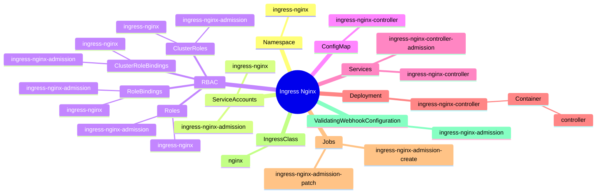
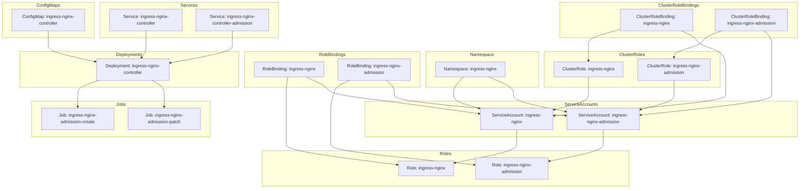

根据您提供的YAML文件内容，我为您创建了一个Mermaid思维导图，展示了Ingress Nginx Controller的主要部署资源及其关系。这个图表概括了部署中的关键组件和它们的层次结构。

这个思维导图展示了Ingress Nginx Controller部署中的主要资源类型和它们的层次关系。以下是对图表的简要说明：

1. 根节点是Ingress Nginx，代表整个部署。
2. 主要的资源类型包括Namespace、ServiceAccounts、RBAC资源、ConfigMap、Services、Deployment、Jobs、IngressClass和ValidatingWebhookConfiguration。
3. RBAC资源进一步细分为Roles、ClusterRoles、RoleBindings和ClusterRoleBindings。
4. Deployment包含一个ingress-nginx-controller，其中有一个名为controller的容器。
5. 有两个Job资源用于admission webhook的创建和修补。

这个思维导图提供了部署结构的高层次视图。如果您需要更详细的信息或者想要关注某个特定的部分，我可以为您创建更具体的图表或提供更深入的解释。您对这个思维导图有什么看法吗？是否有任何部分您想要我进一步解释或展开？​​​​​​​​​​​​​​​​

根据你提供的`deploy.yaml`文件，以下是相应的Mermaid流程图：

这个Mermaid图描述了`deploy.yaml`文件中定义的Kubernetes对象及其相互关系。可以看到Namespace包含了各种ServiceAccount、Role、ClusterRole、RoleBinding、ClusterRoleBinding、ConfigMap、Service、Deployment和Job对象。

