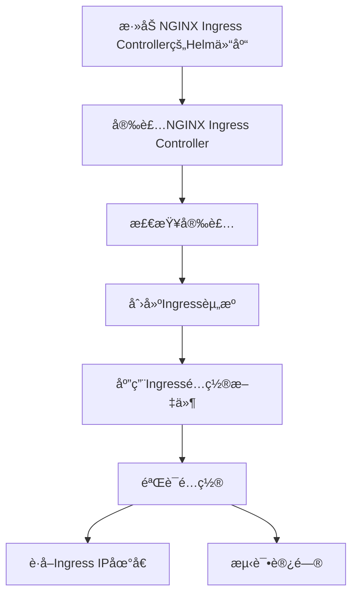
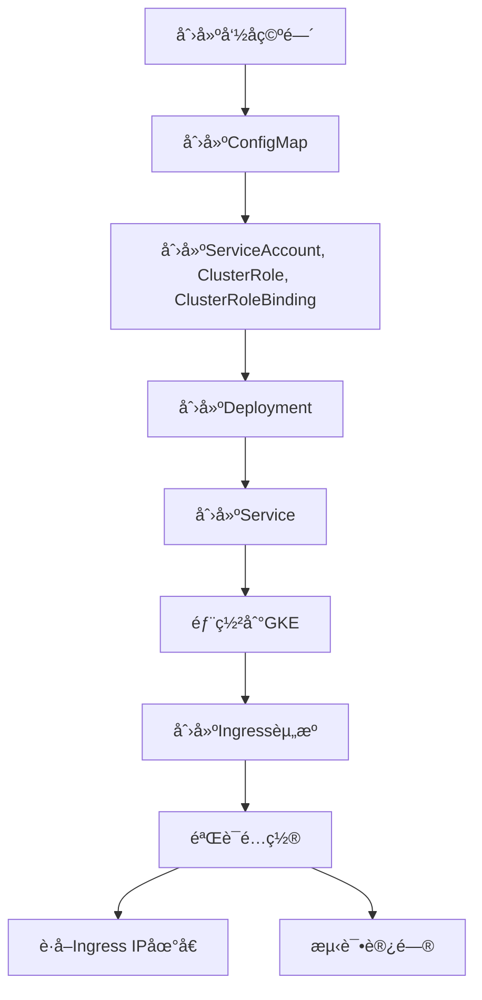

https://cloud.google.com/kubernetes-engine/docs/concepts/ingress-ilb

Internal 
https://cloud.google.com/kubernetes-engine/docs/how-to/internal-load-balance-ingress

云åŸç”Ÿçš„
https://cloud.google.com/kubernetes-engine/docs/how-to/container-native-load-balancing


自定义的
https://cloud.google.com/kubernetes-engine/docs/how-to/custom-ingress-controller

This page describes how you can use a custom Ingress controller with Google Kubernetes Engine (GKE).
Caution: Google does not provide support for debugging issues with custom Ingress controllers.


Kubernetes Ingress æ˜¯ä¸€ç§ API 对象，它管ç†å¤–部访问集群内æœåŠ¡çš„ HTTP å’Œ HTTPS 路由。Ingress 资æºå…许你定义基äºè¯·æ±‚的路由规则，例如主机åã€è·¯å¾„等，æ¥å°†å¤–部请求路由到集群内的æœåŠ¡ã€‚

Ingress æ§åˆ¶å™¨ï¼ˆIngress Controller）是å®ç° Ingress 规则的组件。它通常è¿è¡Œåœ¨é›†ç¾¤ä¸­ï¼Œå¹¶ä¸”ç›‘å¬ Ingress 资æºçš„å˜åŒ–，然åé…置自己的负载å‡è¡¡å™¨æˆ–者åå‘代ç†æ¥æ»¡è¶³è¿™äº›è§„则。

ä»¥ä¸‹æ˜¯å…³äº Kubernetes Ingress æ§åˆ¶å™¨çš„一些关键点：

1. **集群级别**：Ingress 是集群级别的资æºï¼Œæ„味ç€å®ƒå¯ä»¥è¢«é›†ç¾¤å†…的所有命å空间（Namespace）中的æœåŠ¡ä½¿ç”¨ã€‚

2. **暴露æœåŠ¡**：Ingress å¯ä»¥æš´éœ²é›†ç¾¤å†…çš„æœåŠ¡ç»™å¤–部网络，使得外部的客户端å¯ä»¥è®¿é—®è¿™äº›æœåŠ¡ã€‚

3. **é…ç½®çµæ´»æ€§**：Ingress å…许你定义å¤æ‚的路由规则，包括基äºä¸»æœºå的路由ã€åŸºäºè·¯å¾„的路由等。

4. **安全性**：Ingress å¯ä»¥é…ç½® SSL/TLS 终端，å…许你为æœåŠ¡é…ç½® HTTPS。

5. **å•ä¸€å…¥å£ç‚¹**：Ingress å¯ä»¥ä½œä¸ºé›†ç¾¤æœåŠ¡çš„å•ä¸€å…¥å£ç‚¹ï¼Œä½¿å¾—外部æµé‡é€šè¿‡ä¸€ä¸ªç»Ÿä¸€çš„地å€è¿›å…¥é›†ç¾¤ï¼Œç„¶åæ ¹æ®å®šä¹‰çš„规则分å‘到ä¸åŒçš„æœåŠ¡ã€‚

6. **å¯æ‰©å±•æ€§**：ä¸åŒçš„ Ingress æ§åˆ¶å™¨å®ç°å¯ä»¥æä¾›ä¸åŒçš„功能，例如 Nginx Ingress Controllerã€HAProxy Ingress Controller 等。

7. **ä¸æœåŠ¡çš„å…³è”**：Ingress 通过引用æœåŠ¡ï¼ˆService）和端点（Endpoints）æ¥å®ç°è¯·æ±‚的路由。

8. **资æºé™åˆ¶**：Ingress 资æºçš„使用å¯èƒ½ä¼šå—到集群资æºçš„é™åˆ¶ï¼Œä¾‹å¦‚网络策略ã€é…é¢ç­‰ã€‚

9. **监æ§ä¸æ—¥å¿—**：Ingress æ§åˆ¶å™¨é€šå¸¸ä¼šæ供监æ§å’Œæ—¥å¿—记录功能，帮助管ç†å‘˜äº†è§£æµé‡æ¨¡å¼å’Œè¯Šæ–­é—®é¢˜ã€‚

总的æ¥è¯´ï¼ŒIngress æ§åˆ¶å™¨æ˜¯ Kubernetes 集群中é常é‡è¦çš„组件，它å…许外部æµé‡ä»¥ä¸€ç§å—æ§å’Œå®‰å…¨çš„æ–¹å¼è¿›å…¥é›†ç¾¤ï¼Œå¹¶ä¸”å¯ä»¥æ ¹æ®éœ€æ±‚çµæ´»é…置路由规则。


在 Kubernetes 中，Ingress Controller 通常ä¸ä¼šç›´æ¥æš´éœ²ä¸€ä¸ªç‰¹æ®Šçš„ IP 地å€ï¼Œè€Œæ˜¯é€šè¿‡ Kubernetes Service æ¥æš´éœ²ã€‚Service 是 Kubernetes 集群中的一个抽象，它定义了一ç§è®¿é—®å®¹å™¨åŒ–应用的方å¼ï¼Œæ— è®ºå端 Pod 如何å˜åŒ–。以下是一些常è§çš„方法æ¥æŒ‡å®šæˆ–è·å– Service çš„ IP 地å€ï¼š

1. **ClusterIP**: 默认情况下，Service 会创建一个 ClusterIP，这是一个虚拟的 IP 地å€ï¼Œä»…在集群内部å¯ç”¨ã€‚ä½ ä¸èƒ½æ‰‹åŠ¨æŒ‡å®š ClusterIP，它由 Kubernetes 动æ€åˆ†é…。

2. **NodePort**: 如æœä½ æƒ³è¦ä»é›†ç¾¤å¤–部访问 Service，å¯ä»¥æŒ‡å®š Service ç±»å‹ä¸º NodePort。这会在æ¯ä¸ªèŠ‚点上打开一个é™æ€ç«¯å£ï¼ˆå¦‚æœä½ æŒ‡å®šäº†ç«¯å£ï¼‰ï¼Œæˆ–者动æ€åˆ†é…一个端å£ï¼ˆå¦‚æœæœªæŒ‡å®šï¼‰ã€‚ä½ å¯ä»¥ä½¿ç”¨èŠ‚点的 IP 地å€åŠ ä¸Šè¿™ä¸ªç«¯å£æ¥è®¿é—® Service。

3. **LoadBalancer**: 在æŸäº›äº‘æœåŠ¡æ供商上，你å¯ä»¥å°† Service ç±»å‹è®¾ç½®ä¸º LoadBalancer，自动为你的 Service 分é…一个外部 IP 地å€ï¼Œå¹¶é€šè¿‡äº‘è´Ÿè½½å‡è¡¡å™¨è¿›è¡Œæµé‡åˆ†å‘。

4. **ExternalIPs**: ä½ å¯ä»¥åœ¨ Service 定义中指定一个或多个 ExternalIPs，这些 IP 地å€å¯ä»¥ç›´æ¥ä»å¤–部网络访问。这些 IP 必须是由你æ§åˆ¶çš„，并且å¯ä»¥æ˜¯ä»»ä½•æœ‰æ•ˆçš„ IP 地å€ã€‚

5. **Ingress**: å¯¹äº Nginx Ingress Controller，你通常会创建一个 Ingress 资æºæ¥å®šä¹‰å¤–部访问的规则。Ingress 会ä¸ç‰¹å®šçš„ Ingress Controller æœåŠ¡å…³è”，该æœåŠ¡å¯ä»¥æ˜¯ NodePort 或 LoadBalancer ç±»å‹ã€‚

如æœä½ æƒ³è¦æ‰‹åŠ¨æŒ‡å®šä¸€ä¸ª IP 地å€ç”¨äº Ingress Controller，你å¯ä»¥é€šè¿‡ä»¥ä¸‹æ­¥éª¤ï¼š

- 创建一个 Service 资æºï¼Œå°†ç±»å‹è®¾ç½®ä¸º LoadBalancer 或 NodePort。
- 如æœä½¿ç”¨ LoadBalancer，云æœåŠ¡æ供商将为你分é…一个外部 IP。
- 如æœä½¿ç”¨ NodePort，你å¯ä»¥åœ¨æ‰€æœ‰èŠ‚点上使用节点的 IP 地å€åŠ ä¸Š NodePort æ¥è®¿é—®ã€‚
- 在 Service 定义中添加 `externalIPs` 字段，指定一个或多个é™æ€ IP 地å€ã€‚

示例 YAML é…置如下：

```yaml
apiVersion: v1
kind: Service
metadata:
  name: my-ingress-service
spec:
  type: LoadBalancer  # 或者 NodePort
  ports:
  - port: 80
    targetPort: 80
  selector:
    app: my-app
  externalIPs:         # 指定外部 IP 地å€
  - 192.168.1.100     # å‡è®¾çš„外部 IP
```

请注æ„，具体的é…ç½®å¯èƒ½ä¼šæ ¹æ®ä½ çš„云æœåŠ¡æ供商或集群ç¯å¢ƒæœ‰æ‰€ä¸åŒã€‚而且，手动指定 IP 地å€çš„能力也å–决äºä½ çš„网络ç¯å¢ƒå’Œ Kubernetes 集群的é…置。


在 Google Kubernetes Engine (GKE) 中，你å¯ä»¥ä½¿ç”¨äº‘åŸç”Ÿçš„ Ingress 资æºæ¥æš´éœ²ä½ çš„集群内æœåŠ¡ã€‚以下是一些基本步骤和考虑事项：

1. **创建 Ingress 资æº**: 首先，你需è¦åˆ›å»ºä¸€ä¸ª Ingress 资æºçš„ YAML é…置文件，定义如何将外部请求路由到集群内的ä¸åŒæœåŠ¡ã€‚例如：

```yaml
apiVersion: networking.k8s.io/v1
kind: Ingress
metadata:
  name: example-ingress
  annotations:
    kubernetes.io/ingress.global-static-ip-name: "my-static-ip"  # 指定é™æ€ IP
spec:
  rules:
  - http:
      paths:
      - path: /service1
        pathType: ImplementationSpecific
        backend:
          service:
            name: service1
            port:
              number: 80
      - path: /service2
        pathType: ImplementationSpecific
        backend:
          service:
            name: service2
            port:
              number: 80
```

2. **使用 GKE Ingress æ§åˆ¶å™¨**: GKE æ供了一个内置的 Ingress æ§åˆ¶å™¨ï¼Œä½ ä¸éœ€è¦è‡ªå·±éƒ¨ç½²ã€‚当你创建 Ingress 资æºæ—¶ï¼ŒGKE 会自动使用内置的 Ingress æ§åˆ¶å™¨æ¥å¤„ç†ã€‚

3. **é™æ€ IP 地å€**: 如æœä½ æƒ³è¦ä¸ºä½ çš„ Ingress 资æºåˆ†é…一个é™æ€ IP 地å€ï¼Œå¯ä»¥åœ¨ Ingress 资æºçš„注解中指定 `kubernetes.io/ingress.global-static-ip-name`。这将确ä¿å³ä½¿ Ingress 资æºè¢«åˆ é™¤å’Œé‡æ–°åˆ›å»ºï¼Œå®ƒä¹Ÿä¼šä¿ç•™ç›¸åŒçš„ IP 地å€ã€‚

4. **é…ç½® DNS**: 一旦你有了 Ingress çš„ IP 地å€æˆ–域å，你需è¦é…ç½® DNS，将你的域å指å‘这个 IP 地å€æˆ–使用 GKE æ供的默认域å。

5. **SSL/TLS è¯ä¹¦**: 如æœä½ éœ€è¦ HTTPS，GKE å…许你为 Ingress 资æºé…ç½® SSL/TLS è¯ä¹¦ã€‚ä½ å¯ä»¥ä½¿ç”¨æ³¨è§£æ¥æŒ‡å®šè¯ä¹¦ã€‚

6. **防ç«å¢™è§„则**: 在 GKE 中，你å¯èƒ½éœ€è¦é…置防ç«å¢™è§„则æ¥å…许æµé‡è¿›å…¥ä½ çš„集群。

7. **监æ§å’Œæ—¥å¿—**: ç¡®ä¿ä½ å·²ç»è®¾ç½®äº†ç›‘æ§å’Œæ—¥å¿—记录，以便跟踪 Ingress 的使用情况和性能。

8. **更新和应用 Ingress é…ç½®**: 使用 `kubectl apply -f your-ingress.yaml` 命令æ¥åˆ›å»ºæˆ–æ›´æ–°ä½ çš„ Ingress 资æºã€‚

9. **验è¯**: 创建或更新 Ingress å，使用 `kubectl get ingress` 命令æ¥æ£€æŸ¥ Ingress 的状æ€ï¼Œå¹¶ç¡®ä¿å®ƒå·²ç»æ­£ç¡®é…置。

请注æ„，GKE çš„ Ingress 功能å¯èƒ½éšç€ç‰ˆæœ¬å’Œé…置的ä¸åŒè€Œæœ‰æ‰€å˜åŒ–，因此你应该å‚考 GKE 的官方文档æ¥è·å–最新的信æ¯å’Œæœ€ä½³å®è·µã€‚此外，GKE 还æ供了一些高级功能，如自动 SSL è¯ä¹¦ç®¡ç†ã€HTTP 到 HTTPS çš„é‡å®šå‘等，这些都å¯ä»¥åœ¨ä½ çš„ Ingress é…置中使用注解æ¥å¯ç”¨ã€‚

在 Google Kubernetes Engine (GKE) 中，如æœä½ æƒ³è¦é…置一个内部 Ingress æ¥æš´éœ²ä½ çš„集群内æœåŠ¡ï¼Œä½ å¯ä»¥ä½¿ç”¨ GKE 的内部负载å‡è¡¡å™¨ï¼ˆInternal Load Balancer, ILB）。内部负载å‡è¡¡å™¨å…许你将æœåŠ¡æš´éœ²ç»™ç§æœ‰ç½‘络中的客户端，而ä¸æ˜¯å…¬å¼€åˆ°äº’è”网上。以下是é…置内部 Ingress 的基本步骤：

1. **创建 Ingress 资æº**: ä¸å¤–部 Ingress 类似，你首先需è¦åˆ›å»ºä¸€ä¸ª Ingress 资æºçš„ YAML 文件。但是，你需è¦ä½¿ç”¨æ³¨è§£æ¥æŒ‡å®šä½¿ç”¨å†…部负载å‡è¡¡å™¨ã€‚

```yaml
apiVersion: networking.k8s.io/v1
kind: Ingress
metadata:
  name: internal-ingress
  annotations:
    kubernetes.io/ingress.class: "gce"
    networking.gke.io/managed-certificates: "my-certificate"  # 如æœéœ€è¦ SSL/TLS
    networking.gke.io/internal-load-balancer: "true"  # 指定使用内部负载å‡è¡¡å™¨
spec:
  backend:
    service:
      name: my-service
      port:
        number: 80
```

2. **é…置注解**: 在 Ingress 资æºçš„注解中，使用 `networking.gke.io/internal-load-balancer: "true"` æ¥æŒ‡å®šä½¿ç”¨å†…部负载å‡è¡¡å™¨ã€‚

3. **SSL/TLS 支æŒ**: 如æœä½ éœ€è¦ SSL/TLS，å¯ä»¥ä½¿ç”¨ `networking.gke.io/managed-certificates` 注解æ¥æŒ‡å®šè¯ä¹¦å称。

4. **选择 Ingress ç±»å‹**: ç¡®ä¿ä½ ä½¿ç”¨çš„是 GKE 支æŒçš„ Ingress ç±»å‹ã€‚在上é¢çš„例å­ä¸­ï¼Œ`kubernetes.io/ingress.class: "gce"` 指定了使用 GKE 的默认 Ingress æ§åˆ¶å™¨ã€‚

5. **é…置网络**: ç¡®ä¿ä½ çš„ GKE 集群é…置了相应的 VPC 网络，并且你的æœåŠ¡å’Œ Ingress é…置在正确的网络和å­ç½‘中。

6. **访问æ§åˆ¶**: ç”±äºè¿™æ˜¯ä¸€ä¸ªå†…部æœåŠ¡ï¼Œä½ éœ€è¦ç¡®ä¿åªæœ‰æˆæƒçš„客户端能够访问。这å¯èƒ½æ¶‰åŠåˆ°é…置网络安全策略和防ç«å¢™è§„则。

7. **应用é…ç½®**: 使用 `kubectl apply -f your-ingress.yaml` 命令æ¥åº”用你的 Ingress é…置。

8. **验è¯**: 应用é…ç½®å，使用 `kubectl get ingress internal-ingress` 命令æ¥æ£€æŸ¥ Ingress 的状æ€ï¼Œå¹¶ç¡®ä¿å®ƒå·²ç»æ­£ç¡®é…置。

9. **访问æœåŠ¡**: 一旦é…置完æˆï¼Œä½ çš„内部æœåŠ¡å°†é€šè¿‡å†…部负载å‡è¡¡å™¨æš´éœ²ã€‚ä½ å¯ä»¥ä½¿ç”¨ç§æœ‰ç½‘络中的客户端æ¥è®¿é—®è¿™ä¸ªæœåŠ¡ã€‚

请注æ„，内部 Ingress 的确切é…ç½®å¯èƒ½ä¼šæ ¹æ®ä½ çš„具体需求和 GKE 集群的é…置有所ä¸åŒã€‚你应该å‚考 GKE 的官方文档æ¥è·å–最新的信æ¯å’Œæœ€ä½³å®è·µã€‚此外，GKE å¯èƒ½ä¼šä¸æ–­æ›´æ–°å’Œæ”¹è¿›å…¶å†…部负载å‡è¡¡å™¨å’Œ Ingress 的功能，因此请确ä¿ä½ ä½¿ç”¨çš„是最新的信æ¯ã€‚


Google Cloud Platform (GCP) æ供了两ç§ç±»å‹çš„è´Ÿè½½å‡è¡¡å™¨ï¼šå¤–部（External）和内部（Internal）。根æ®ä½ æ供的链æ¥ï¼Œå®ƒæŒ‡å‘çš„æ˜¯å…³äº GKE 的容器åŸç”Ÿè´Ÿè½½å‡è¡¡ï¼ˆContainer-native Load Balancing），这是一ç§å¤–部负载å‡è¡¡å™¨ã€‚è¿™ç§ç±»å‹çš„è´Ÿè½½å‡è¡¡å™¨å°†æµé‡ä»äº’è”网分å‘到你的æœåŠ¡ã€‚

容器åŸç”Ÿè´Ÿè½½å‡è¡¡å™¨çš„特点包括：

- **外部访问**: 它å…许æ¥è‡ªäº’è”网的æµé‡è®¿é—®ä½ çš„æœåŠ¡ã€‚
- **自动扩展**: æ ¹æ®æµé‡è‡ªåŠ¨æ‰©å±•å端æœåŠ¡çš„å®ä¾‹ã€‚
- **å…¨çƒè´Ÿè½½å‡è¡¡**: 支æŒè·¨å¤šä¸ªåŒºåŸŸçš„è´Ÿè½½å‡è¡¡ã€‚

如æœä½ éœ€è¦çš„是内部负载å‡è¡¡å™¨ï¼ˆInternal Load Balancer, ILB），它ä¸å®¹å™¨åŸç”Ÿè´Ÿè½½å‡è¡¡å™¨æœ‰ä»¥ä¸‹ä¸åŒï¼š

- **ç§æœ‰ç½‘络访问**: 内部负载å‡è¡¡å™¨ä»…å…许ç§æœ‰ç½‘络内的æµé‡è®¿é—®ï¼Œä¸ä¼šä»äº’è”网æ¥æ”¶æµé‡ã€‚
- **ä¸åˆ†é…外部IP**: 它ä¸åˆ†é…外部IP地å€ï¼Œè€Œæ˜¯ä½¿ç”¨ç§æœ‰IP地å€ã€‚
- **适用äºå†…部æœåŠ¡**: 适åˆäºéœ€è¦éš”离的内部æœåŠ¡ï¼Œä¾‹å¦‚æ•°æ®åº“或其他å端æœåŠ¡ã€‚

为了é…置内部 Ingress，在 GKE 中，你å¯ä»¥æŒ‰ç…§ä»¥ä¸‹æ­¥éª¤æ“作：

1. 创建一个 Ingress 资æºï¼Œå¹¶åœ¨æ³¨è§£ä¸­æŒ‡å®šä½¿ç”¨å†…部负载å‡è¡¡å™¨ã€‚例如：

```yaml
apiVersion: networking.k8s.io/v1
kind: Ingress
metadata:
  name: internal-ingress
  annotations:
    kubernetes.io/ingress.class: "gce"  # 或 "nginx"，å–决äºä½ ä½¿ç”¨çš„ Ingress æ§åˆ¶å™¨
    networking.gke.io/internal-load-balancer: "true"
spec:
  # 你的规则和å端é…ç½®
```

2. ç¡®ä¿ä½ çš„集群é…置正确，并且你的æœåŠ¡ä½äºç§æœ‰ç½‘络中。

3. 使用 `kubectl apply` 命令部署你的 Ingress é…置。

4. éªŒè¯ Ingress 是å¦æ­£ç¡®åˆ›å»ºï¼Œå¹¶ä¸”å·²ç»é…置了内部负载å‡è¡¡å™¨ã€‚

请注æ„，具体的é…ç½®å¯èƒ½ä¼šæ ¹æ®ä½ çš„ GKE 版本和网络设置有所ä¸åŒã€‚你应该å‚考 GKE 的官方文档æ¥è·å–最新的信æ¯å’Œæœ€ä½³å®è·µã€‚如æœä½ éœ€è¦è¿›ä¸€æ­¥çš„帮助，å¯ä»¥æ£€æŸ¥ GCP 的官方文档或è”系他们的支æŒå›¢é˜Ÿã€‚


在GCPçš„GKE上安装开æºçš„Ingress Controller（例如NGINX Ingress Controller）需è¦ä»¥ä¸‹å‡ ä¸ªæ­¥éª¤ã€‚以下是具体的é…置文件和安装步骤：

### å‰ææ¡ä»¶

1. 你需è¦ä¸€ä¸ªå·²åˆ›å»ºçš„GKE集群。
2. 你需è¦`kubectl`命令行工具，并且它已é…置为ä¸GKE集群通信。

### 安装NGINX Ingress Controller

1. **添加NGINX Ingress Controller的Helm仓库**：
   首先，确ä¿ä½ å·²å®‰è£…Helm。然å，添加NGINX Ingress Controllerçš„Helm仓库：

    ```sh
    helm repo add ingress-nginx https://kubernetes.github.io/ingress-nginx
    helm repo update
    ```

2. **安装NGINX Ingress Controller**：
   使用以下命令安装NGINX Ingress Controller。这里指定了`controller.service.internal`为`true`以确ä¿æœåŠ¡æ˜¯å†…部的。

    ```sh
    helm install my-nginx-ingress ingress-nginx/ingress-nginx \
      --set controller.service.internal.enabled=true \
      --set controller.service.annotations."cloud\.google\.com/load-balancer-type"="Internal" \
      --namespace ingress-nginx --create-namespace
    ```

3. **检查安装**：
   确认NGINX Ingress Controller已正确安装并è¿è¡Œï¼š

    ```sh
    kubectl get pods -n ingress-nginx
    ```

### 创建Ingress资æº

以下是一个示例的Ingress资æºé…置文件，它将æµé‡å¼•å¯¼åˆ°å†…部æœåŠ¡ã€‚

```yaml
apiVersion: networking.k8s.io/v1
kind: Ingress
metadata:
  name: example-ingress
  namespace: default
  annotations:
    nginx.ingress.kubernetes.io/rewrite-target: /
spec:
  ingressClassName: nginx
  rules:
    - host: example.internal
      http:
        paths:
          - path: /
            pathType: Prefix
            backend:
              service:
                name: example-service
                port:
                  number: 80
```

### 应用Ingressé…置文件

将上述Ingressé…置文件ä¿å­˜ä¸º`ingress.yaml`，并应用到GKE集群：

```sh
kubectl apply -f ingress.yaml
```

### 验è¯é…ç½®

ç¡®ä¿æœåŠ¡å·²æ­£ç¡®éƒ¨ç½²ï¼Œå¹¶ä¸”Ingress Controller已将æµé‡å¼•å¯¼åˆ°ç›®æ ‡æœåŠ¡ã€‚

1. **è·å–Ingress IP地å€**：

    ```sh
    kubectl get ingress example-ingress -o jsonpath='{.status.loadBalancer.ingress[0].ip}'
    ```

2. **测试访问**：
   ä½ å¯ä»¥é€šè¿‡é›†ç¾¤å†…部的方å¼è®¿é—®`example.internal`，确ä¿å®ƒè§£æ到上述IP地å€ã€‚

### 总结

以上步骤概述了如何在GCPçš„GKE上安装一个NGINX Ingress Controller，并é…置一个示例的Ingress资æºã€‚通过这些步骤，你应该能够将æµé‡å¼•å¯¼åˆ°å†…部æœåŠ¡ã€‚

如æœä½ æœ‰ä»»ä½•ç‰¹å®šçš„需求或é‡åˆ°é—®é¢˜ï¼Œè¯·éšæ—¶å‘Šè¯‰æˆ‘。

---

**Mermaid Flowchart**:



好的，下é¢æ˜¯å¦‚何使用普通的YAML文件æ¥åœ¨GKE上安装NGINX Ingress Controller的步骤和对应的é…置文件。

### 1. 创建命å空间

首先，创建一个命å空间æ¥æ”¾ç½®NGINX Ingress Controller的资æºï¼š

```sh
kubectl create namespace ingress-nginx
```

### 2. 创建ConfigMap

创建一个ConfigMap，用äºNGINX Ingress Controllerçš„é…置：

```yaml
apiVersion: v1
kind: ConfigMap
metadata:
  name: nginx-configuration
  namespace: ingress-nginx
  labels:
    app.kubernetes.io/name: ingress-nginx
    app.kubernetes.io/part-of: ingress-nginx
```

### 3. 创建ServiceAccountã€ClusterRoleå’ŒClusterRoleBinding

创建ServiceAccountã€ClusterRoleå’ŒClusterRoleBinding：

```yaml
apiVersion: v1
kind: ServiceAccount
metadata:
  name: nginx-ingress-serviceaccount
  namespace: ingress-nginx

---
apiVersion: rbac.authorization.k8s.io/v1
kind: ClusterRole
metadata:
  name: nginx-ingress-clusterrole
rules:
  - apiGroups:
      - ""
    resources:
      - configmaps
      - endpoints
      - nodes
      - pods
      - secrets
      - services
    verbs:
      - list
      - watch
  - apiGroups:
      - ""
    resources:
      - nodes
    verbs:
      - get
  - apiGroups:
      - extensions
      - networking.k8s.io
    resources:
      - ingresses
      - ingresses/status
      - ingresses/classes
    verbs:
      - get
      - list
      - watch
  - apiGroups:
      - extensions
      - networking.k8s.io
    resources:
      - ingresses
    verbs:
      - create
      - update
      - patch
      - delete

---
apiVersion: rbac.authorization.k8s.io/v1
kind: ClusterRoleBinding
metadata:
  name: nginx-ingress-clusterrole-nisa-binding
roleRef:
  apiGroup: rbac.authorization.k8s.io
  kind: ClusterRole
  name: nginx-ingress-clusterrole
subjects:
  - kind: ServiceAccount
    name: nginx-ingress-serviceaccount
    namespace: ingress-nginx
```

### 4. 创建Deployment

创建NGINX Ingress Controller的Deployment：

```yaml
apiVersion: apps/v1
kind: Deployment
metadata:
  name: nginx-ingress-controller
  namespace: ingress-nginx
  labels:
    app.kubernetes.io/name: ingress-nginx
spec:
  replicas: 2
  selector:
    matchLabels:
      app.kubernetes.io/name: ingress-nginx
  template:
    metadata:
      labels:
        app.kubernetes.io/name: ingress-nginx
    spec:
      serviceAccountName: nginx-ingress-serviceaccount
      containers:
        - name: nginx-ingress-controller
          image: quay.io/kubernetes-ingress-controller/nginx-ingress-controller:0.44.0
          args:
            - /nginx-ingress-controller
            - --configmap=$(POD_NAMESPACE)/nginx-configuration
            - --tcp-services-configmap=$(POD_NAMESPACE)/tcp-services
            - --udp-services-configmap=$(POD_NAMESPACE)/udp-services
            - --publish-service=$(POD_NAMESPACE)/ingress-nginx
          env:
            - name: POD_NAME
              valueFrom:
                fieldRef:
                  fieldPath: metadata.name
            - name: POD_NAMESPACE
              valueFrom:
                fieldRef:
                  fieldPath: metadata.namespace
          ports:
            - name: http
              containerPort: 80
            - name: https
              containerPort: 443
          livenessProbe:
            httpGet:
              path: /healthz
              port: 10254
              scheme: HTTP
            initialDelaySeconds: 10
            timeoutSeconds: 1
            periodSeconds: 10
            successThreshold: 1
            failureThreshold: 3
          readinessProbe:
            httpGet:
              path: /healthz
              port: 10254
              scheme: HTTP
            initialDelaySeconds: 10
            timeoutSeconds: 1
            periodSeconds: 10
            successThreshold: 1
            failureThreshold: 3
```

### 5. 创建Service

创建一个内部类å‹çš„Serviceæ¥æš´éœ²NGINX Ingress Controller：

```yaml
apiVersion: v1
kind: Service
metadata:
  name: ingress-nginx
  namespace: ingress-nginx
  annotations:
    cloud.google.com/load-balancer-type: "Internal"
spec:
  type: LoadBalancer
  loadBalancerIP: <your-internal-ip>
  ports:
    - name: http
      port: 80
      targetPort: 80
    - name: https
      port: 443
      targetPort: 443
  selector:
    app.kubernetes.io/name: ingress-nginx
```

### 6. 部署到GKE

将以上所有é…置文件ä¿å­˜ä¸º`.yaml`文件，然åä¾æ¬¡åº”用它们：

```sh
kubectl apply -f namespace.yaml
kubectl apply -f configmap.yaml
kubectl apply -f rbac.yaml
kubectl apply -f deployment.yaml
kubectl apply -f service.yaml
```

### 7. 创建Ingress资æº

创建一个示例的Ingress资æºæ–‡ä»¶ï¼š

```yaml
apiVersion: networking.k8s.io/v1
kind: Ingress
metadata:
  name: example-ingress
  namespace: default
  annotations:
    nginx.ingress.kubernetes.io/rewrite-target: /
spec:
  ingressClassName: nginx
  rules:
    - host: example.internal
      http:
        paths:
          - path: /
            pathType: Prefix
            backend:
              service:
                name: example-service
                port:
                  number: 80
```

将上述Ingressé…置文件ä¿å­˜ä¸º`ingress.yaml`，并应用到GKE集群：

```sh
kubectl apply -f ingress.yaml
```

### 8. 验è¯é…ç½®

1. **è·å–Ingress IP地å€**：

    ```sh
    kubectl get ingress example-ingress -o jsonpath='{.status.loadBalancer.ingress[0].ip}'
    ```

2. **测试访问**：
   通过集群内部的方å¼è®¿é—®`example.internal`，确ä¿å®ƒè§£æ到上述IP地å€ã€‚

### 总结

以上步骤和é…置文件æ述了如何使用普通的YAML文件在GKE上安装和é…置一个NGINX Ingress Controller，以åŠå¦‚何é…置一个示例的Ingress资æºã€‚

---

**Mermaid Flowchart**:


如何在GCPçš„GKE 上安装一个类似开æºçš„ingress controller 我想在我的GKE internal 使用 请给出我具体的é…置文件和安装步骤 我如æœä¸æƒ³é€šè¿‡helm 安装 åªæ˜¯é€šè¿‡æ™®é€šçš„yaml æ¥è¿›è¡Œæ‰€æœ‰çš„安装 给出我对应的é…置文件和具体步骤

我ç†è§£æ‚¨æƒ³åœ¨ GKE 内部集群上安装一个开æºçš„ Ingress Controller,并且希望通过 YAML 文件而ä¸æ˜¯ Helm æ¥è¿›è¡Œå®‰è£…。我会为您æ供使用 NGINX Ingress Controller 的安装步骤和相关é…置文件。NGINX Ingress Controller 是一个æµè¡Œçš„å¼€æºé€‰é¡¹,适åˆåœ¨ GKE 上使用。

以下是安装步骤和所需的 YAML é…置文件:


```yaml
---
# 1. 创建命å空间
apiVersion: v1
kind: Namespace
metadata:
  name: ingress-nginx

---
# 2. 创建æœåŠ¡è´¦å·
apiVersion: v1
kind: ServiceAccount
metadata:
  name: nginx-ingress-serviceaccount
  namespace: ingress-nginx

---
# 3. 创建 ClusterRole
apiVersion: rbac.authorization.k8s.io/v1
kind: ClusterRole
metadata:
  name: nginx-ingress-clusterrole
rules:
  - apiGroups: [""]
    resources: ["configmaps", "endpoints", "nodes", "pods", "secrets"]
    verbs: ["list", "watch"]
  - apiGroups: [""]
    resources: ["nodes"]
    verbs: ["get"]
  - apiGroups: [""]
    resources: ["services"]
    verbs: ["get", "list", "watch"]
  - apiGroups: ["extensions", "networking.k8s.io"]
    resources: ["ingresses"]
    verbs: ["get", "list", "watch"]
  - apiGroups: [""]
    resources: ["events"]
    verbs: ["create", "patch"]
  - apiGroups: ["extensions", "networking.k8s.io"]
    resources: ["ingresses/status"]
    verbs: ["update"]

---
# 4. 创建 ClusterRoleBinding
apiVersion: rbac.authorization.k8s.io/v1
kind: ClusterRoleBinding
metadata:
  name: nginx-ingress-clusterrole-binding
roleRef:
  apiGroup: rbac.authorization.k8s.io
  kind: ClusterRole
  name: nginx-ingress-clusterrole
subjects:
  - kind: ServiceAccount
    name: nginx-ingress-serviceaccount
    namespace: ingress-nginx

---
# 5. 部署 NGINX Ingress Controller
apiVersion: apps/v1
kind: Deployment
metadata:
  name: nginx-ingress-controller
  namespace: ingress-nginx
spec:
  replicas: 1
  selector:
    matchLabels:
      app: nginx-ingress
  template:
    metadata:
      labels:
        app: nginx-ingress
    spec:
      serviceAccountName: nginx-ingress-serviceaccount
      containers:
        - name: nginx-ingress-controller
          image: k8s.gcr.io/ingress-nginx/controller:v1.2.0
          args:
            - /nginx-ingress-controller
            - --publish-service=$(POD_NAMESPACE)/ingress-nginx-controller
            - --election-id=ingress-controller-leader
            - --ingress-class=nginx
            - --configmap=$(POD_NAMESPACE)/nginx-configuration
            - --tcp-services-configmap=$(POD_NAMESPACE)/tcp-services
            - --udp-services-configmap=$(POD_NAMESPACE)/udp-services
          env:
            - name: POD_NAME
              valueFrom:
                fieldRef:
                  fieldPath: metadata.name
            - name: POD_NAMESPACE
              valueFrom:
                fieldRef:
                  fieldPath: metadata.namespace
          ports:
            - name: http
              containerPort: 80
            - name: https
              containerPort: 443

---
# 6. 创建 ConfigMap
apiVersion: v1
kind: ConfigMap
metadata:
  name: nginx-configuration
  namespace: ingress-nginx

---
# 7. 创建内部 LoadBalancer æœåŠ¡
apiVersion: v1
kind: Service
metadata:
  name: ingress-nginx-controller
  namespace: ingress-nginx
  annotations:
    networking.gke.io/load-balancer-type: "Internal"
spec:
  type: LoadBalancer
  ports:
    - port: 80
      targetPort: 80
      protocol: TCP
      name: http
    - port: 443
      targetPort: 443
      protocol: TCP
      name: https
  selector:
    app: nginx-ingress
```

ç°åœ¨,让我为您解释安装步骤:

1. 将上述 YAML 内容ä¿å­˜ä¸ºä¸€ä¸ªæ–‡ä»¶,例如 `nginx-ingress-controller.yaml`。

2. 使用以下命令应用é…ç½®:

   ```
   kubectl apply -f nginx-ingress-controller.yaml
   ```

3. 等待所有资æºåˆ›å»ºå®Œæˆã€‚您å¯ä»¥ä½¿ç”¨ä»¥ä¸‹å‘½ä»¤æ£€æŸ¥çŠ¶æ€:

   ```
   kubectl get all -n ingress-nginx
   ```

4. 一旦 LoadBalancer æœåŠ¡è·å¾—了内部 IP 地å€,您就å¯ä»¥ä½¿ç”¨è¯¥ IP æ¥é…置您的内部 DNS 或直æ¥åœ¨åº”用中使用。

这个é…置会创建一个内部的 LoadBalancer,åªèƒ½åœ¨ GKE 集群内部访问。如æœæ‚¨éœ€è¦ä»å¤–部访问,å¯ä»¥ç§»é™¤ Service 中的 `networking.gke.io/load-balancer-type: "Internal"` 注解。

请注æ„,这个é…置使用的是 NGINX Ingress Controller v1.2.0。您å¯èƒ½éœ€è¦æ ¹æ®æ‚¨çš„具体需求调整版本或其他å‚数。

安装完æˆå,您å¯ä»¥åˆ›å»º Ingress 资æºæ¥å®šä¹‰è·¯ç”±è§„则。例如:

```yaml
apiVersion: networking.k8s.io/v1
kind: Ingress
metadata:
  name: example-ingress
  annotations:
    kubernetes.io/ingress.class: nginx
spec:
  rules:
  - host: your-domain.com
    http:
      paths:
      - path: /
        pathType: Prefix
        backend:
          service:
            name: your-service
            port: 
              number: 80
```

这个é…置将为 `your-domain.com` 设置一个简å•çš„路由规则。

如æœæ‚¨éœ€è¦è¿›ä¸€æ­¥çš„帮助或有任何问题,请éšæ—¶è¯¢é—®ã€‚​​​​​​​​​​​​​​​​

好的,我æ¥ä¸ºæ‚¨ä»‹ç»å¦‚何在GCPçš„GKE上安装一个开æºçš„内部ingress controller,并给出具体的é…置文件和安装步骤,ä¸ä½¿ç”¨Helm而是通过普通的YAML文件进行安装。

以下是安装NGINX Ingress Controller的步骤:

1. 首先,创建一个命å空间用äºå®‰è£…Ingress Controller:

```yaml
apiVersion: v1
kind: Namespace
metadata:
  name: ingress-nginx
  labels:
    app.kubernetes.io/name: ingress-nginx
    app.kubernetes.io/instance: ingress-nginx
```

将此内容ä¿å­˜ä¸º`namespace.yaml`,然å执行:

```
kubectl apply -f namespace.yaml
```

2. æ¥ä¸‹æ¥,创建RBAC相关的资æº:

```yaml
apiVersion: v1
kind: ServiceAccount
metadata:
  name: ingress-nginx
  namespace: ingress-nginx
  labels:
    app.kubernetes.io/name: ingress-nginx
    app.kubernetes.io/instance: ingress-nginx

---
apiVersion: rbac.authorization.k8s.io/v1
kind: ClusterRole
metadata:
  name: ingress-nginx
  labels:
    app.kubernetes.io/name: ingress-nginx
    app.kubernetes.io/instance: ingress-nginx
rules:
  - apiGroups:
      - ""
    resources:
      - configmaps
      - endpoints
      - nodes
      - pods
      - secrets
    verbs:
      - list
      - watch
  - apiGroups:
      - ""
    resources:
      - nodes
    verbs:
      - get
  - apiGroups:
      - ""
    resources:
      - services
    verbs:
      - get
      - list
      - watch
  - apiGroups:
      - extensions
      - networking.k8s.io
    resources:
      - ingresses
    verbs:
      - get
      - list
      - watch
  - apiGroups:
      - ""
    resources:
      - events
    verbs:
      - create
      - patch
  - apiGroups:
      - extensions
      - networking.k8s.io
    resources:
      - ingresses/status
    verbs:
      - update

---
apiVersion: rbac.authorization.k8s.io/v1
kind: ClusterRoleBinding
metadata:
  name: ingress-nginx
  labels:
    app.kubernetes.io/name: ingress-nginx
    app.kubernetes.io/instance: ingress-nginx
roleRef:
  apiGroup: rbac.authorization.k8s.io
  kind: ClusterRole
  name: ingress-nginx
subjects:
  - kind: ServiceAccount
    name: ingress-nginx
    namespace: ingress-nginx
```

将此内容ä¿å­˜ä¸º`rbac.yaml`,然å执行:

```
kubectl apply -f rbac.yaml
```

3. 创建ConfigMap:

```yaml
apiVersion: v1
kind: ConfigMap
metadata:
  name: ingress-nginx-controller
  namespace: ingress-nginx
  labels:
    app.kubernetes.io/name: ingress-nginx
    app.kubernetes.io/instance: ingress-nginx
```

将此内容ä¿å­˜ä¸º`configmap.yaml`,然å执行:

```
kubectl apply -f configmap.yaml
```

4. 创建Deployment:

```yaml
apiVersion: apps/v1
kind: Deployment
metadata:
  name: ingress-nginx-controller
  namespace: ingress-nginx
  labels:
    app.kubernetes.io/name: ingress-nginx
    app.kubernetes.io/instance: ingress-nginx
spec:
  replicas: 1
  selector:
    matchLabels:
      app.kubernetes.io/name: ingress-nginx
      app.kubernetes.io/instance: ingress-nginx
  template:
    metadata:
      labels:
        app.kubernetes.io/name: ingress-nginx
        app.kubernetes.io/instance: ingress-nginx
    spec:
      serviceAccountName: ingress-nginx
      containers:
        - name: controller
          image: k8s.gcr.io/ingress-nginx/controller:v1.2.0
          args:
            - /nginx-ingress-controller
            - --publish-service=$(POD_NAMESPACE)/ingress-nginx-controller
            - --election-id=ingress-controller-leader
            - --ingress-class=nginx
            - --configmap=$(POD_NAMESPACE)/ingress-nginx-controller
          securityContext:
            runAsUser: 101
            allowPrivilegeEscalation: true
          env:
            - name: POD_NAME
              valueFrom:
                fieldRef:
                  fieldPath: metadata.name
            - name: POD_NAMESPACE
              valueFrom:
                fieldRef:
                  fieldPath: metadata.namespace
          ports:
            - name: http
              containerPort: 80
            - name: https
              containerPort: 443
```

将此内容ä¿å­˜ä¸º`deployment.yaml`,然å执行:

```
kubectl apply -f deployment.yaml
```

5. 最å,创建Service:

```yaml
apiVersion: v1
kind: Service
metadata:
  name: ingress-nginx-controller
  namespace: ingress-nginx
  labels:
    app.kubernetes.io/name: ingress-nginx
    app.kubernetes.io/instance: ingress-nginx
spec:
  type: ClusterIP
  ports:
    - name: http
      port: 80
      targetPort: 80
      protocol: TCP
    - name: https
      port: 443
      targetPort: 443
      protocol: TCP
  selector:
    app.kubernetes.io/name: ingress-nginx
    app.kubernetes.io/instance: ingress-nginx
```

将此内容ä¿å­˜ä¸º`service.yaml`,然å执行:

```
kubectl apply -f service.yaml
```

完æˆä»¥ä¸Šæ­¥éª¤å,您就æˆåŠŸåœ¨GKE上安装了NGINX Ingress Controller。这个Ingress Controller是内部的,因为我们使用了`ClusterIP`ç±»å‹çš„Service。

è¦ä½¿ç”¨è¿™ä¸ªIngress Controller,您需è¦åœ¨åˆ›å»ºIngress资æºæ—¶æŒ‡å®š`kubernetes.io/ingress.class: nginx`注解。例如:

```yaml
apiVersion: networking.k8s.io/v1
kind: Ingress
metadata:
  name: example-ingress
  annotations:
    kubernetes.io/ingress.class: nginx
spec:
  rules:
  - http:
      paths:
      - path: /
        pathType: Prefix
        backend:
          service:
            name: example-service
            port: 
              number: 80
```

请注æ„,这些é…置文件å¯èƒ½éœ€è¦æ ¹æ®æ‚¨çš„具体需求进行调整。例如,您å¯èƒ½éœ€è¦ä¿®æ”¹é•œåƒç‰ˆæœ¬ã€å‰¯æœ¬æ•°é‡ç­‰ã€‚此外,ç”±äºGKEç¯å¢ƒçš„特殊性,您å¯èƒ½è¿˜éœ€è¦é…置网络策略或防ç«å¢™è§„则以å…许æµé‡è¿›å…¥æ‚¨çš„集群[1][2][3][4]。

Sources
[1] Create kubernetes nginx ingress without GCP load-balancer https://stackoverflow.com/questions/43189487/create-kubernetes-nginx-ingress-without-gcp-load-balancer
[2] nginx ingress controller installation : r/kubernetes - Reddit https://www.reddit.com/r/kubernetes/comments/18c3af8/nginx_ingress_controller_installation/
[3] GKE Ingress for Application Load Balancers - Google Cloud https://cloud.google.com/kubernetes-engine/docs/concepts/ingress
[4] Use a custom Ingress controller | Google Kubernetes Engine (GKE) https://cloud.google.com/kubernetes-engine/docs/how-to/custom-ingress-controller
[5] Deploying Public & Private Nginx Ingress Controllers with HTTP(S ... https://blog.thecloudside.com/deploying-public-private-nginx-ingress-controllers-with-http-s-loadbalancer-in-gke-dcf894197fb7?gi=eeb182533b2f
[6] GKE: can't get things to work when ingress: enabled: true #62 - GitHub https://github.com/verdaccio/charts/issues/62
[7] ingress-nginx on autopilot cluster - Google Cloud Community https://www.googlecloudcommunity.com/gc/Google-Kubernetes-Engine-GKE/ingress-nginx-on-autopilot-cluster/td-p/414448/jump-to/first-unread-message
[8] GKE Ingress controller ignoring ingress.class annotation #476 https://github.com/kubernetes/ingress-gce/issues/476
[9] kubernetes/ingress-gce: Ingress controller for Google Cloud - GitHub https://github.com/kubernetes/ingress-gce
[10] Ingress configuration on Google Cloud | Google Kubernetes Engine ... https://cloud.google.com/kubernetes-engine/docs/how-to/ingress-configuration
[11] ngrok Kubernetes Ingress Controller on GKE https://ngrok.com/docs/integrations/google-gke/google-kubernetes-engine/
[12] GKE - Kong Ingress Controller https://docs.konghq.com/kubernetes-ingress-controller/latest/install/cloud/gke/
[13] community/archived/nginx-ingress-gke/index.md at master - GitHub https://github.com/GoogleCloudPlatform/community/blob/master/archived/nginx-ingress-gke/index.md
[14] A Guide to Choosing an Ingress Controller, Part 3: Open Source vs ... https://www.f5.com/company/blog/nginx/guide-to-choosing-ingress-controller-part-3-open-source-default-commercial
[15] Google Kubernetes Engine Ingress configuration for production ... https://engineering.sada.com/google-kubernetes-engine-ingress-configuration-for-production-environments-9677a303166a?gi=34c08b08cfc9
[16] how to setup yaml ingress in google cloud with redirect https://stackoverflow.com/questions/67971793/how-to-setup-yaml-ingress-in-google-cloud-with-redirect
[17] Configuring the NGINX Ingress Controller on GKE - Pluralsight https://www.pluralsight.com/cloud-guru/labs/gcp/configuring-the-nginx-ingress-controller-on-gke
[18] How To Setup Ingress On GKE Using GKE Ingress Controller https://devopscube.com/setup-ingress-gke-ingress-controller/
[19] How to define global load balancer in ingress.yaml instead of ... https://stackoverflow.com/questions/73303562/how-to-define-global-load-balancer-in-ingress-yaml-instead-of-defaulting-to-clas


在GKE上è·å–并é…ç½®é™æ€IP以便使用Ingress Controller的步骤如下：

### 1. 预留é™æ€IP地å€

首先，您需è¦åœ¨GCP中预留一个é™æ€IP地å€ã€‚å¯ä»¥ä½¿ç”¨ä»¥ä¸‹å‘½ä»¤ï¼š

```bash
gcloud compute addresses create web-static-ip --global
```

### 2. è·å–预留的é™æ€IP地å€

您å¯ä»¥ä½¿ç”¨ä»¥ä¸‹å‘½ä»¤æŸ¥çœ‹é¢„留的é™æ€IP地å€ï¼š

```bash
gcloud compute addresses describe web-static-ip --global
```

输出示例：

```plaintext
address: 203.0.113.32
...
```

### 3. é…ç½®Ingress资æºä½¿ç”¨é™æ€IP

创建一个Ingress资æºï¼Œå¹¶åœ¨å…¶æ³¨è§£ä¸­æŒ‡å®šé¢„留的é™æ€IP地å€ã€‚以下是一个示例é…置文件：

```yaml
apiVersion: networking.k8s.io/v1
kind: Ingress
metadata:
  name: web-ingress
  annotations:
    kubernetes.io/ingress.global-static-ip-name: "web-static-ip"
spec:
  rules:
  - http:
      paths:
      - path: /
        pathType: Prefix
        backend:
          service:
            name: web-service
            port:
              number: 80
```

将此内容ä¿å­˜ä¸º`ingress.yaml`，然å执行以下命令应用é…置：

```bash
kubectl apply -f ingress.yaml
```

### 4. 验è¯é…ç½®

您å¯ä»¥ä½¿ç”¨ä»¥ä¸‹å‘½ä»¤æŸ¥çœ‹Ingress资æºçš„外部IP地å€ï¼š

```bash
kubectl get ingress web-ingress
```

输出示例：

```plaintext
NAME          HOSTS   ADDRESS         PORTS   AGE
web-ingress   *       203.0.113.32    80      4m
```

### 5. é…ç½®æœåŠ¡

ç¡®ä¿æ‚¨çš„æœåŠ¡é…置正确，例如：

```yaml
apiVersion: v1
kind: Service
metadata:
  name: web-service
spec:
  selector:
    app: web
  ports:
  - protocol: TCP
    port: 80
    targetPort: 8080
  type: NodePort
```

将此内容ä¿å­˜ä¸º`service.yaml`，然å执行以下命令应用é…置：

```bash
kubectl apply -f service.yaml
```

### 总结

通过以上步骤，您å¯ä»¥åœ¨GKE上è·å–并é…ç½®é™æ€IP以便使用Ingress Controller。请确ä¿åœ¨åˆ›å»ºIngress资æºæ—¶æ­£ç¡®æŒ‡å®šé™æ€IP地å€çš„å称，并验è¯é…置是å¦æ­£ç¡®ã€‚这样，您的应用程åºå°†ä½¿ç”¨é¢„留的é™æ€IP地å€è¿›è¡Œå¤–部访问。

Sources
[1] Set up an external Application Load Balancer with Ingress https://cloud.google.com/kubernetes-engine/docs/tutorials/http-balancer
[2] é™çš„ IP アドレスを使用ã—ã¦ãƒ‰ãƒ¡ã‚¤ãƒ³åを構æˆã™ã‚‹ | Kubernetes Engine https://cloud.google.com/kubernetes-engine/docs/tutorials/configuring-domain-name-static-ip?hl=ja
[3] Creating a Kubernetes Ingress Resource with a Static IP Address on ... https://github.com/kelseyhightower/ingress-with-static-ip
[4] Google Cloud Kubernetes Ingress Static IP address not reflected ... https://stackoverflow.com/questions/63253485/google-cloud-kubernetes-ingress-static-ip-address-not-reflected-and-different-fr
[5] Admission controller and static IP for GKE - Google Cloud Community https://www.googlecloudcommunity.com/gc/Google-Kubernetes-Engine-GKE/Admission-controller-and-static-IP-for-GKE/m-p/497065
[6] Ingressã«static-ipを指定ã—ã¦ã‚„ã£ãŸ on GKE and GCE - Qiita https://qiita.com/tinjyuu/items/fd7a97b0b81963dcc7f2
[7] Nginx ingress, GKE and static IP · Issue #1281 - GitHub https://github.com/kubernetes/ingress-nginx/issues/1281
[8] ingress-nginx, GCE, and static IP - google cloud platform - Server Fault https://serverfault.com/questions/1053305/ingress-nginx-gce-and-static-ip
[9] Configure domain names with static IP addresses | Kubernetes Engine https://cloud.google.com/kubernetes-engine/docs/tutorials/configuring-domain-name-static-ip
[10] gke-assigning-static-ip-address.md - dewitt/knative-docs - GitHub https://github.com/dewitt/knative-docs/blob/master/serving/gke-assigning-static-ip-address.md
[11] Google Kubernetes Engine Ingress configuration for production ... https://engineering.sada.com/google-kubernetes-engine-ingress-configuration-for-production-environments-9677a303166a?gi=34c08b08cfc9


I see you've done your research! 😊

To install an open-source ingress controller on GKE without Helm, I'll provide you with a step-by-step guide using YAML files.

**Ingress Controller:** NGINX Ingress Controller

**Prerequisites:**

1. You have a GKE cluster set up with a private IP range.
2. You have kubectl installed and configured to connect to your GKE cluster.

**Step 1: Create a namespace for the ingress controller**
```yaml
apiVersion: v1
kind: Namespace
metadata:
  name: ingress-nginx
```
Save this file as `namespace.yaml` and apply it to your cluster:
```
kubectl apply -f namespace.yaml
```
**Step 2: Create a deployment for the ingress controller**
```yaml
apiVersion: apps/v1
kind: Deployment
metadata:
  name: ingress-nginx-controller
  namespace: ingress-nginx
spec:
  replicas: 1
  selector:
    matchLabels:
      app: ingress-nginx
  template:
    metadata:
      labels:
        app: ingress-nginx
    spec:
      containers:
      - name: ingress-nginx
        image: nginx/nginx-ingress-controller:2.11.1
        args:
        - /nginx-ingress-controller
        - --default-ssl-certificate=$(POD_NAMESPACE)/default-ssl-certificate
        - --election-id=ingress-controller-leader
        - --ingress-class=nginx
        - --configmap=$(POD_NAMESPACE)/ingress-nginx-controller
        ports:
        - containerPort: 80
        - containerPort: 443
```
Save this file as `deployment.yaml` and apply it to your cluster:
```
kubectl apply -f deployment.yaml
```
**Step 3: Create a service for the ingress controller**
```yaml
apiVersion: v1
kind: Service
metadata:
  name: ingress-nginx
  namespace: ingress-nginx
spec:
  selector:
    app: ingress-nginx
  ports:
  - name: http
    port: 80
    targetPort: 80
  - name: https
    port: 443
    targetPort: 443
  type: LoadBalancer
```
Save this file as `service.yaml` and apply it to your cluster:
```
kubectl apply -f service.yaml
```
**Step 4: Create a configmap for the ingress controller**
```yaml
apiVersion: v1
kind: ConfigMap
metadata:
  name: ingress-nginx-controller
  namespace: ingress-nginx
data:
  nginx.conf: |
    worker_processes 1;
    events {
        worker_connections 1024;
    }
    http {
        upstream backend {
            server localhost:8080;
        }
        server {
            listen 80;
            location / {
                proxy_pass http://backend;
                proxy_set_header Host $host;
                proxy_set_header X-Real-IP $remote_addr;
            }
        }
    }
```
Save this file as `configmap.yaml` and apply it to your cluster:
```
kubectl apply -f configmap.yaml
```
**Step 5: Verify the ingress controller installation**
```
kubectl get deployments -n ingress-nginx
kubectl get svc -n ingress-nginx
```
You should see the ingress controller deployment and service running.

That's it! You've successfully installed an open-source NGINX ingress controller on your GKE cluster without using Helm. ğŸ‰


在 GCP çš„ GKE 上安装一个开æºçš„ Ingress Controller，如 nginx-ingress，å¯ä»¥é€šè¿‡æ‰‹åŠ¨åº”用 YAML 文件æ¥å®Œæˆã€‚以下是使用 kubectl 命令安装 Internal Ingress Nginx Controller 的具体步骤：

1. **下载所需的é…置文件**

   首先，您需è¦ä¸‹è½½ç”± Kubernetes Ingress Nginx 维护的é…置文件。您å¯ä»¥å‰å¾€ [ingress-nginxçš„ GitHub 仓库](https://github.com/kubernetes/ingress-nginx)找到最新的部署 YAML 文件。这里我们使用官方æ供的文件为基础:

   
sh
   wget https://raw.githubusercontent.com/kubernetes/ingress-nginx/main/deploy/static/provider/cloud/deploy.yaml
   


2. **修改 Service 为 Internal**

   ç”±äºæ‚¨æƒ³ä½¿ç”¨ Internal Ingress，需è¦ä¿®æ”¹ä¸‹è½½çš„ YAML 文件中的 Service 定义，将其设置为 Internal ç±»å‹ã€‚打开 deploy.yaml 文件，并找到 Service 的定义部分，然å你需è¦æ·»åŠ  http://cloud.google.com/load-balancer-type: "Internal" 注解：

   
yaml
   apiVersion: v1
   kind: Service
   metadata:
     name: ingress-nginx-controller
     namespace: ingress-nginx
     annotations:
       http://cloud.google.com/load-balancer-type: "Internal"
     ...
   spec:
     type: LoadBalancer
     ...
   


3. **应用é…置文件**

   ä¿å­˜æ–‡ä»¶å，在您的 GKE 集群上应用这个修改过åçš„ YAML 文件。

   
sh
   kubectl apply -f deploy.yaml
   


   这个命令将部署 Ingress Nginx æ§åˆ¶å™¨å’Œç›¸å…³èµ„æºï¼ˆå¦‚ RBAC 角色，ServiceAccount 等）到您的 GKE 集群中。

4. **éªŒè¯ Ingress Controller 的安装**

   检查 ingress-nginx 命å空间里的 pod 是å¦æ­£åœ¨è¿è¡Œï¼š

   
sh
   kubectl get pods -n ingress-nginx
   


   查看并验è¯è‡ªåŠ¨åˆ›å»ºçš„ LoadBalancer Service 是å¦è®¾ç½®ä¸ºå†…部：

   
sh
   kubectl get service -n ingress-nginx
   


   确认看到的 LoadBalancer çš„ EXTERNAL-IP 应该是一个ç§æœ‰ IP 地å€ã€‚

ç°åœ¨ï¼Œæ‚¨æœ‰ä¸€ä¸ªå†…部的 Ingress Nginx æ§åˆ¶å™¨éƒ¨ç½²åœ¨ GKE 上。您å¯ä»¥å¼€å§‹åˆ›å»º Ingress 资æºæ¥è·¯ç”±è‡³æ‚¨çš„æœåŠ¡ã€‚

**注æ„**：这是一个基本的安装指å—，根æ®æ‚¨å…·ä½“的需求，å¯èƒ½éœ€è¦å¯¹é…置文件进行é¢å¤–的自定义。如æœéœ€è¦é¢å¤–的功能，比如自定义的错误页或认è¯ï¼Œå¯èƒ½éœ€è¦å¢åŠ å…¶ä»–çš„é…置资æºã€‚

安装过程完æˆå，Ingress Nginx æ§åˆ¶å™¨å°†åªå¯¹é›†ç¾¤å†…部的请求作出å“应，ä¸ä¼šæœ‰å…¬ç½‘ IP 地å€ã€‚这对äºéœ€è¦ä¿æŠ¤çš„内部æœåŠ¡æ˜¯å分ç†æƒ³çš„选择。

如æœæˆ‘è¦ä½¿ç”¨helm æ¥å®Œæˆæˆ‘的安装 那么有没有什么好的æ¨è或者给出我完整的安装过程或者网上对应的分支？​​​​​​​​​​​​​​​​

使用 Helm æ¥å®‰è£… NGINX Ingress Controller ç¡®å®æ˜¯ä¸€ç§æ›´ç®€ä¾¿çš„方法。这ç§æ–¹å¼å¯ä»¥æ›´è½»æ¾åœ°ç®¡ç†å’Œæ›´æ–°æ‚¨çš„ Ingress Controller。我会为您æ供使用 Helm 安装 NGINX Ingress Controller 的完整步骤。


```bash
# 1. 安装 Helm（如æœå°šæœªå®‰è£…）
# 在 Linux 上：
curl https://raw.githubusercontent.com/helm/helm/master/scripts/get-helm-3 | bash

# 2. 添加 NGINX Ingress Controller 的 Helm 仓库
helm repo add ingress-nginx https://kubernetes.github.io/ingress-nginx
helm repo update

# 3. 创建命å空间（如æœå°šæœªåˆ›å»ºï¼‰
kubectl create namespace ingress-nginx

# 4. 安装 NGINX Ingress Controller
# 对äºå†…部负载å‡è¡¡å™¨ï¼Œä½¿ç”¨ä»¥ä¸‹å‘½ä»¤ï¼š
helm install nginx-ingress ingress-nginx/ingress-nginx \
  --namespace ingress-nginx \
  --set controller.service.type=LoadBalancer \
  --set controller.service.annotations."cloud\.google\.com/load-balancer-type"=Internal

# 5. 验è¯å®‰è£…
kubectl get services -n ingress-nginx

# 6. è·å–è´Ÿè½½å‡è¡¡å™¨ IP（å¯èƒ½éœ€è¦ç­‰å¾…几分钟）
kubectl get services -n ingress-nginx -o wide -w nginx-ingress-ingress-nginx-controller

# 7. （å¯é€‰ï¼‰å¦‚æœæ‚¨æƒ³è¦å¸è½½
# helm uninstall nginx-ingress -n ingress-nginx
```

ç°åœ¨ï¼Œè®©æˆ‘为您解释这些步骤：

1. 首先，确ä¿æ‚¨å·²ç»å®‰è£…了 Helm。如æœæ²¡æœ‰ï¼Œå¯ä»¥ä½¿ç”¨æ供的命令安装。

2. 添加 NGINX Ingress Controller çš„ Helm 仓库。这样您就å¯ä»¥è®¿é—®æœ€æ–°çš„ chart。

3. 创建一个专门的命å空间æ¥å®‰è£… Ingress Controller。这有助äºèµ„æºç®¡ç†ã€‚

4. 使用 Helm 安装 NGINX Ingress Controller。这里的é…置设置了内部负载å‡è¡¡å™¨ã€‚如æœæ‚¨éœ€è¦å¤–部访问，å¯ä»¥ç§»é™¤ `controller.service.annotations` 部分。

5. 验è¯å®‰è£…是å¦æˆåŠŸã€‚

6. è·å–è´Ÿè½½å‡è¡¡å™¨çš„ IP 地å€ã€‚è¿™å¯èƒ½éœ€è¦å‡ åˆ†é’Ÿçš„时间。

7. 如æœå°†æ¥éœ€è¦å¸è½½ï¼Œå¯ä»¥ä½¿ç”¨æ供的命令。

使用 Helm 的优势：

1. 简化安装过程：一个命令就å¯ä»¥å®Œæˆæ‰€æœ‰é…置。
2. 易äºå‡çº§ï¼šä½¿ç”¨ Helm å¯ä»¥è½»æ¾å‡çº§åˆ°æ–°ç‰ˆæœ¬ã€‚
3. é…ç½®çµæ´»ï¼šå¯ä»¥é€šè¿‡ values 文件或命令行å‚æ•°è½»æ¾è‡ªå®šä¹‰é…置。
4. 版本æ§åˆ¶ï¼šå¯ä»¥è½»æ¾å›æ»šåˆ°ä¹‹å‰çš„版本。

如æœæ‚¨æƒ³è¦è¿›ä¸€æ­¥è‡ªå®šä¹‰å®‰è£…，å¯ä»¥åˆ›å»ºä¸€ä¸ª values.yaml 文件：

```yaml
controller:
  service:
    type: LoadBalancer
    annotations:
      cloud.google.com/load-balancer-type: Internal
  replicaCount: 2
  config:
    use-forwarded-headers: "true"
```

然å使用这个文件进行安装：

```bash
helm install nginx-ingress ingress-nginx/ingress-nginx -f values.yaml -n ingress-nginx
```

è¿™ç§æ–¹æ³•å…许您更细粒度地æ§åˆ¶é…置，并且å¯ä»¥å°†é…ç½®ä¿å­˜åœ¨ç‰ˆæœ¬æ§åˆ¶ç³»ç»Ÿä¸­ã€‚

安装完æˆå，您å¯ä»¥åƒä¹‹å‰ä¸€æ ·åˆ›å»º Ingress 资æºæ¥å®šä¹‰è·¯ç”±è§„则。

如æœæ‚¨æœ‰ä»»ä½•å…¶ä»–问题或需è¦è¿›ä¸€æ­¥çš„解释，请éšæ—¶å‘Šè¯‰æˆ‘。​​​​​​​​​​​​​​​​

好的,我ç†è§£æ‚¨æƒ³ä½¿ç”¨Helmæ¥å®‰è£…NGINX Ingress Controller。使用Helmç¡®å®æ˜¯ä¸€ç§æ›´ç®€å•å’Œæ¨è的方法。以下是使用Helm在GKE上安装NGINX Ingress Controller的完整步骤:

1. 首先确ä¿æ‚¨å·²ç»å®‰è£…了Helm 3.0+版本。

2. 添加NGINX Ingress Controller的Helm仓库:

```bash
helm repo add ingress-nginx https://kubernetes.github.io/ingress-nginx
helm repo update
```

3. 创建一个å为`values.yaml`的文件,用äºè‡ªå®šä¹‰å®‰è£…é…ç½®:

```yaml
controller:
  service:
    type: LoadBalancer
    externalTrafficPolicy: Local
  ingressClassResource:
    name: nginx
    enabled: true
    default: true
  publishService:
    enabled: true
```

4. 使用以下命令安装NGINX Ingress Controller:

```bash
helm install nginx-ingress ingress-nginx/ingress-nginx \
  --namespace ingress-nginx \
  --create-namespace \
  -f values.yaml
```

5. 等待几分钟,然å检查安装状æ€:

```bash
kubectl get pods -n ingress-nginx
kubectl get services -n ingress-nginx
```

6. è·å–分é…ç»™Ingress Controller的外部IP地å€:

```bash
kubectl get services -n ingress-nginx nginx-ingress-ingress-nginx-controller -o jsonpath='{.status.loadBalancer.ingress[0].ip}'
```

7. 创建一个简å•çš„Ingress资æºæ¥æµ‹è¯•:

```yaml
apiVersion: networking.k8s.io/v1
kind: Ingress
metadata:
  name: example-ingress
  annotations:
    kubernetes.io/ingress.class: nginx
spec:
  rules:
  - http:
      paths:
      - path: /
        pathType: Prefix
        backend:
          service:
            name: example-service
            port: 
              number: 80
```

将此内容ä¿å­˜ä¸º`ingress.yaml`,然å应用:

```bash
kubectl apply -f ingress.yaml
```

这个过程使用Helm简化了安装步骤,并自动处ç†äº†å¤§éƒ¨åˆ†é…置。您å¯ä»¥æ ¹æ®éœ€è¦è¿›ä¸€æ­¥è‡ªå®šä¹‰`values.yaml`文件æ¥è°ƒæ•´NGINX Ingress Controllerçš„é…置。

请注æ„,在GKE上,这将创建一个外部负载å‡è¡¡å™¨ã€‚如æœæ‚¨éœ€è¦å†…部负载å‡è¡¡å™¨,å¯ä»¥åœ¨`values.yaml`中添加以下é…ç½®:

```yaml
controller:
  service:
    internal:
      enabled: true
```

使用Helm安装å¯ä»¥å¤§å¤§ç®€åŒ–过程,并且便äºåç»­çš„å‡çº§å’Œç®¡ç†ã€‚如æœæ‚¨æœ‰ä»»ä½•ç‰¹å®šçš„需求或é‡åˆ°é—®é¢˜,å¯ä»¥éšæ—¶è°ƒæ•´é…置或查阅Helm chart的文档。

Sources
[1] Installation with Helm | NGINX Ingress Controller https://docs.nginx.com/nginx-ingress-controller/installation/installing-nic/installation-with-helm/
[2] NGINX Ingress Controller in GKE - Ian Brown https://ianbrown.id.au/nginx_ingress_controller/
[3] How to deploy NGINX Ingress Controller on Kubernetes using Helm https://platform9.com/learn/v1.0/tutorials/nginix-controller-helm
[4] 2 Set up Helm and NGINX Ingress on GKE - YouTube https://www.youtube.com/watch?v=vrULnFYI_cY
[5] community/archived/nginx-ingress-gke/index.md at master - GitHub https://github.com/GoogleCloudPlatform/community/blob/master/archived/nginx-ingress-gke/index.md
[6] nginx ingress controller installation : r/kubernetes - Reddit https://www.reddit.com/r/kubernetes/comments/18c3af8/nginx_ingress_controller_installation/
[7] Deploying Public & Private Nginx Ingress Controllers with HTTP(S ... https://blog.thecloudside.com/deploying-public-private-nginx-ingress-controllers-with-http-s-loadbalancer-in-gke-dcf894197fb7?gi=eeb182533b2f
[8] GKEã«Helmã§nginx-ingress, cert-managerã‚’å°å…¥ã—アプリ㮠... - Qiita https://qiita.com/fukuyama012/items/a15c4ca7b4a1d45ad69b

I'd be happy to help you with that! 😊

To install an open-source ingress controller on GCP's GKE, I'll provide you with a step-by-step guide using Helm.

**Prerequisites:**

1. You have a GKE cluster set up.
2. You have Helm installed on your machine.
3. You have a basic understanding of Kubernetes and Helm.

**Step 1: Add the NGINX Ingress Controller Helm repository**

Run the following command to add the NGINX Ingress Controller Helm repository:
```
helm repo add nginx-stable https://helm.nginx.com/stable
```
**Step 2: Install the NGINX Ingress Controller using Helm**

Create a values file (`values.yaml`) with the following content:
```yaml
controller:
  kind: deployment
  nginxplus: false
  image:
    pullPolicy: Always
  serviceNameOverride: "nginx-ingress-nginx-ingress"
  name: ""
  fullnameOverride: "nginx-ingress-nginx-ingress"

networking:
  gke:
    loadBalancerType: Internal
```
This configuration file sets up an internal load balancer on GKE.

Run the following command to install the NGINX Ingress Controller using Helm:
```
helm upgrade --install nginx-ingress nginx-stable/nginx-ingress --version 4.4.0 --set controller.kind=deployment --set controller.nginxplus=false --set controller.image.pullPolicy=Always --set serviceNameOverride="nginx-ingress-nginx-ingress" --set controller.name="" --set fullnameOverride="nginx-ingress-nginx-ingress" -f values.yaml
```
**Step 3: Verify the installation**

Run the following command to verify that the NGINX Ingress Controller is installed and running:
```
kubectl get pods -n nginx-ingress
```
You should see the NGINX Ingress Controller pod running.

**Step 4: Create an Ingress resource**

Create a YAML file (`ingress.yaml`) with the following content:
```yaml
apiVersion: networking.k8s.io/v1
kind: Ingress
metadata:
  name: example-ingress
  annotations:
    networking.gke.io/load-balancer-type: Internal
spec:
  rules:
  - host: example.com
    http:
      paths:
      - path: /
        backend:
          serviceName: example-service
          servicePort: 80
```
This Ingress resource routes traffic from `example.com` to a service named `example-service`.

Apply the Ingress resource using the following command:
```
kubectl apply -f ingress.yaml
```
That's it! You should now have an open-source ingress controller installed on your GKE cluster using Helm. ğŸ‰

If you have any issues or questions, feel free to ask! 😊

如æœæ‚¨æƒ³åœ¨ GCP çš„ GKE 上使用 Helm æ¥å®‰è£…å¼€æºçš„ Ingress Controller，并且您想è¦å®ƒåœ¨å†…部网络上工作，那么æ¥ä¸‹æ¥æˆ‘将为您æ供一个使用的例å­ï¼Œä»¥ nginx-ingress 为例。

首先，确ä¿æ‚¨å·²ç»å®‰è£…了 Helm，这是一个 Kubernetes 的包管ç†å·¥å…·ã€‚

æ¥ä¸‹æ¥ï¼ŒæŒ‰ç…§ä»¥ä¸‹æ­¥éª¤æ“作：

1. **添加 Helm 仓库**

   首先，需è¦æ·»åŠ å®˜æ–¹çš„ ingress-nginx Helm 仓库：

   
sh
   helm repo add ingress-nginx https://kubernetes.github.io/ingress-nginx
   helm repo update
   


2. **创建一个é…置文件**

   创建一个å为 values-internal.yaml çš„ Helm é…置文件，以便é…ç½® Ingress Controller 以内部方å¼å·¥ä½œï¼š

   
yaml
   controller:
     service:
       annotations:
         http://cloud.google.com/load-balancer-type: "Internal"
     kind: DaemonSet
     hostNetwork: true
   


   这里设置 kind: DaemonSet å’Œ hostNetwork: true 是å¯é€‰çš„，这å–决äºæ‚¨æ˜¯å¦å¸Œæœ›æ¯ä¸ªèŠ‚点上都è¿è¡Œä¸€ä¸ª Ingress æ§åˆ¶å™¨ pod，并且是å¦è¦ä½¿ç”¨å®ƒä»¬çš„主机网络。

3. **使用 Helm 安装 Ingress æ§åˆ¶å™¨**

   使用以下命令安装 nginx-ingress æ§åˆ¶å™¨ï¼ŒåŒæ—¶æŒ‡å®šä¹‹å‰åˆ›å»ºçš„é…置文件 values-internal.yaml：

   
sh
   helm install nginx-ingress ingress-nginx/ingress-nginx --namespace ingress-nginx --create-namespace --values values-internal.yaml
   


   这将在命å空间 ingress-nginx 中安装 Ingress Controller，并根æ®æ‚¨çš„é…置文件进行é…置。如æœå‘½å空间ä¸å­˜åœ¨ï¼Œä¸Šè¿°å‘½ä»¤ä¼šåˆ›å»ºä¸€ä¸ªã€‚

4. **éªŒè¯ Ingress Controller 的部署**

   请è¿è¡Œä»¥ä¸‹å‘½ä»¤æ¥ç¡®è®¤ Ingress Controller çš„ pods å·²ç»æˆåŠŸå¯åŠ¨ï¼š

   
sh
   kubectl get pods -n ingress-nginx
   


   查看 Service 是å¦å·²ç»åˆ›å»ºï¼Œå¹¶ä¸”是å¦é…置为内部类å‹çš„ LoadBalancer：

   
sh
   kubectl get svc -n ingress-nginx
   


   默认的 LoadBalancer Service 应该显示一个ç§æœ‰ IP 地å€ä½œä¸ºå®ƒçš„ EXTERNAL-IP。

通过上述步骤，您ç°åœ¨åº”该已ç»åœ¨ GKE 上使用 Helm 安装了一个作为内部æœåŠ¡è¿è¡Œçš„ Ingress Controller。æ¥ä¸‹æ¥ï¼Œæ‚¨å¯ä»¥é€šè¿‡åˆ›å»º Ingress 资æºæ¥é…置特定的路由规则到您的应用程åºæœåŠ¡ã€‚


