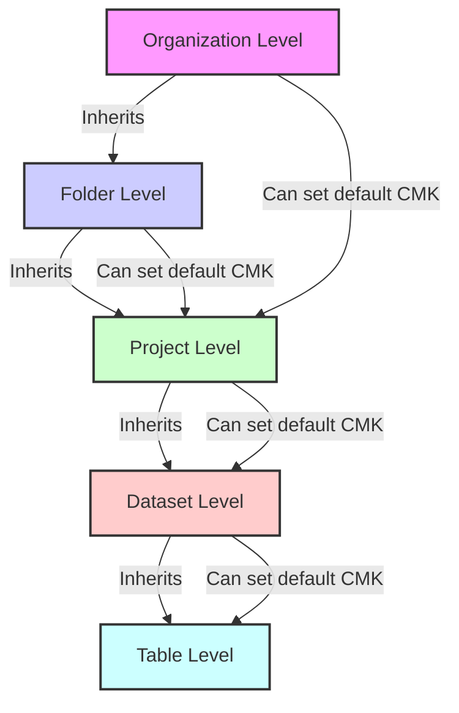

<https://cloud.google.com/bigquery/docs/customer-managed-encryption?hl=zh>

<https://cloud.google.com/bigquery/docs/customer-managed-encryption?hl=zh-cn#project_default_key>
设置项目默认密钥

除非指定其他 Cloud KMS 密钥，否则您可以设置项目范围的默认 Cloud KMS 密钥，此默认密钥将应用于该位置的项目中所有查询结果和新创建的表。默认密钥不会应用到现有的表。如果更改默认密钥，则系统不会修改现有的任何表，并且更改后的密钥只会应用到更改默认密钥后创建的新表。

要确认您的 Google Cloud 项目是否已经设置了默认的工程级别密钥，您可以通过 Cloud Console 或使用 `gcloud` CLI 来检查项目的加密设置。下面是具体的步骤。

### 1. 通过 Google Cloud Console 检查项目级别的默认密钥

1. **进入 Cloud Console**：
   - 打开 [Google Cloud Console](https://console.cloud.google.com/)。
2. **选择您的项目**：

   - 确保您已经选择了正确的项目，查看项目选择器菜单并选择目标项目。

3. **导航到 BigQuery**：
   - 在导航菜单中选择 **BigQuery**。
4. **查看加密设置**：
   - 转到 **Settings（设置）**。
   - 在 **Customer-managed encryption** 部分，您可以看到默认的 Cloud KMS 密钥信息。如果已设置默认密钥，会显示密钥的详细信息（如密钥名称、密钥环等）。

### 2. 使用 `gcloud` 命令行工具检查项目级别的默认密钥

您也可以使用 `gcloud` 命令来查看是否已设置默认密钥。

1. **查看项目范围的默认 KMS 密钥**：
   您可以使用以下命令查看您的项目是否设置了默认密钥：

   ```bash
   gcloud kms keys list --location=your-location --keyring=your-keyring --project=your-project-id
   ```

   这会列出项目在指定位置（location）和密钥环（keyring）中的所有 Cloud KMS 密钥。如果项目已经设置了默认的加密密钥，您可以在 BigQuery 中的查询结果或新表设置中看到使用的默认密钥。

### 3. 组织级别的密钥

Google Cloud 的组织级别加密策略目前不允许在组织范围内设置默认 Cloud KMS 密钥。您需要在项目范围内单独设置默认密钥。因此，所有的加密管理都在项目级别处理，无法直接在组织级别统一配置默认加密密钥。

总结：可以通过 Cloud Console 检查 BigQuery 设置，也可以通过 `gcloud` 命令行查看项目的 Cloud KMS 密钥配置情况。目前，默认的 Cloud KMS 密钥设置是项目级别的，无法直接为组织级别设置。

您提出了一些关于Google Cloud Platform (GCP) 中BigQuery加密的重要问题。我来逐一为您解答:

1. 关于工程级别的默认客户管理加密密钥(CMEK)设置:

在GCP中,工程级别的默认CMEK加密通常在项目设置中配置。您可以通过以下步骤查看或设置:

a) 打开Google Cloud Console
b) 选择您的项目
c) 在左侧菜单中,选择"IAM & Admin" > "Encryption keys"

如果您在Google Cloud Console的"IAM & Admin"下没有看到"Encryption keys"选项，这可能有几个原因：

1. UI更新：
   Google Cloud Console的界面可能已经更新，选项的位置可能已经改变。

2. 权限问题：
   您可能没有查看或管理加密密钥的必要权限。

3. 服务未启用：
   Cloud Key Management Service (KMS) 可能尚未在您的项目中启用。

考虑到这些可能性，让我们尝试几种方法来查看和设置项目级别的默认加密：

1. 检查 BigQuery 设置：

   - 在 Google Cloud Console 中，转到 BigQuery
   - 点击项目名称旁边的三个点 (...)
   - 选择 "Project settings"
   - 查看 "Default table encryption" 部分

2. 使用 gcloud 命令：
   您可以使用 gcloud 命令行工具来查看项目的加密设置：

   ```
   gcloud projects get-iam-policy YOUR_PROJECT_ID
   ```

   查找包含 "cloudkms.cryptoKeys.setIamPolicy" 的部分。

3. 启用 Cloud KMS：
   如果您想使用客户管理的加密密钥（CMEK），需要确保 Cloud KMS 已启用：

   - 在 Cloud Console 中，转到 "APIs & Services" > "Dashboard"
   - 搜索 "Cloud Key Management Service API"
   - 如果未启用，点击 "Enable"

4. 检查 BigQuery 数据集加密：
   对于特定的数据集，您可以使用以下命令：

   ```
   bq show --format=prettyjson PROJECT_ID:DATASET_ID | jq '.defaultEncryptionConfiguration'
   ```

5. 设置默认加密：
   如果您想为新的数据集设置默认加密，可以在创建数据集时指定：

   ```
   bq mk --default_kms_key=projects/[KEY_PROJECT_ID]/locations/[LOCATION]/keyRings/[KEYRING]/cryptoKeys/[KEY] [PROJECT_ID]:[DATASET]
   ```

6. 查看项目级别的设置：
   您可以使用以下命令查看项目级别的设置：

   ```
   gcloud alpha bq projects describe YOUR_PROJECT_ID
   ```

   注意：这个命令可能需要 gcloud 的 alpha 组件。

如果您仍然无法找到或设置加密选项，建议您联系 Google Cloud 支持或检查您的项目权限。有时，某些设置可能受到组织策略的限制或需要特定的 IAM 角色。

您的观察非常敏锐。确实，如果您的项目是在一个更大的组织结构下，很可能是组织级别的策略在起作用。这种情况下，某些设置和权限可能是由组织管理员集中控制的。让我为您详细解释一下这种情况：

1. 组织策略控制：
   在大型企业或组织中，通常会实施集中化的控制策略。这意味着某些设置，包括加密策略，可能是在组织级别定义的，而不是在单个项目级别。

2. 继承的策略：
   项目可能从组织或文件夹级别继承了某些策略，包括加密设置。这些继承的策略可能会覆盖或限制项目级别的设置。

3. 有限的可见性：
   作为项目成员或甚至项目所有者，您可能没有查看某些组织级别设置的权限。这解释了为什么您可能看不到某些加密相关的选项。

4. 统一的安全标准：
   组织可能实施了统一的安全标准，包括标准化的加密策略，以确保所有项目都符合特定的安全要求。

在这种情况下，您可以尝试以下步骤：

1. 咨询组织管理员：
   联系您的组织或公司的 IT 管理员或云管理团队。他们应该能够提供关于组织级加密策略的信息。

2. 检查组织级策略：
   如果您有适当的权限，可以尝试查看组织级策略：

   ```
   gcloud organizations get-iam-policy ORGANIZATION_ID
   ```

   注意：您需要组织查看者或更高级别的权限才能执行此操作。

3. 查看继承的约束：
   您可以尝试查看项目继承的约束：

   ```
   gcloud alpha resource-manager org-policies list --project=YOUR_PROJECT_ID
   ```

4. 检查 BigQuery 作业配置：
   运行一个 BigQuery 作业，然后检查其配置，可能会显示应用的加密设置：

   ```
   bq show -j JOB_ID
   ```

5. 审核日志：
   如果您有权限，可以查看 Cloud Audit Logs，可能会提供有关加密设置的信息。

总结来说，您的推测很可能是正确的。在组织管理的环境中，个别项目的某些设置可能是由上层策略控制的。这种做法有助于维护一致的安全标准，但也可能导致项目级别的可见性和控制受限。

建议您与您的组织管理员或 IT 团队沟通，以获取更多关于您项目中应用的具体加密策略和设置的信息。他们应该能够提供更详细的说明，并解答您可能遇到的任何特定问题或担忧。

d) 在此页面,您可以查看当前的加密设置,或者设置新的默认加密密钥

另外,您也可以使用gcloud命令行工具来查看或设置:

```
gcloud projects get-iam-policy YOUR_PROJECT_ID
```

这个命令会显示项目的IAM策略,其中包括加密相关的设置。

2. 关于加密配置的优先级:

您提到了两种不同的加密密钥配置:

- 共享的KMS项目密钥: `project/kms-project/locations/europe-west2/bigQuery/cryptoKeys/HSMbqSharedKey`
- 项目自己的密钥: `project/kms-project/locations/global/keyRings/myproject/keyptokeys/privatebigQuery/`

加密配置的优先级通常是这样的:

1. 表级别的加密设置
2. 数据集级别的加密设置
3. 项目级别的默认加密设置

当您创建一个新的数据集时,如果没有特别指定加密设置,它会使用项目级别的默认加密设置。如果项目级别也没有设置,那么它会使用Google管理的默认加密密钥。

要确定新创建的数据集会使用哪种加密类型,您可以:

1. 检查项目的默认加密设置
2. 在创建数据集时指定所需的加密密钥

您可以使用以下命令来查看特定数据集的加密配置:

```
bq show --format=prettyjson PROJECT_ID:DATASET_ID | jq '.defaultEncryptionConfiguration'
```

这将显示数据集的默认加密配置。

总的来说,为了确保一致性和安全性,建议您在项目级别设置默认的CMEK加密密钥,并在需要特殊处理的情况下在数据集或表级别进行覆盖。

如果您需要更详细的信息或有任何其他问题,请随时告诉我。

您的观察和推理非常准确。这种情况确实表明在更高级别（可能是项目级别或组织级别）设置了默认的客户管理密钥（Customer-Managed Key, CMK）。让我们深入分析一下这种情况：



根据您的描述，我们可以得出以下结论：

1. 项目级别的默认加密：
   很可能在项目级别设置了默认的客户管理密钥（CMK）。这就是为什么在创建表时会自动应用 KMS 密钥，即使在创建数据集时没有明确指定。

2. 加密继承机制：
   在 GCP 中，加密设置遵循一个继承机制，如上图所示。如果没有在较低级别指定加密设置，它会从上一级继承设置。

3. 验证项目级设置：
   要确认这一点，您可以尝试以下命令：

   ```
   bq show --format=prettyjson PROJECT_ID | jq '.defaultEncryptionConfiguration'
   ```

   这可能会显示项目级别的默认加密配置。

4. 组织策略影响：
   如果项目级别没有显示默认加密配置，那么很可能是组织级别或文件夹级别的策略在起作用。

5. 行为解释：

   - 当您创建数据集而不指定 CMK 时，数据集本身不会显示默认的 CMK。
   - 但当您在该数据集中创建表时，会应用项目级别（或更高级别）的默认 CMK。

6. 建议的下一步：

   - 与您的组织管理员或云管理团队确认组织的加密策略。
   - 检查项目的 IAM 策略，寻找与 KMS 相关的设置。
   - 如果有权限，查看组织级别的策略设置。

7. 灵活性：
   即使存在默认的 CMK，您仍然可以在创建特定数据集或表时覆盖这些设置，前提是您有适当的权限。

8. 安全性考虑：
   这种设置方式通常是为了确保组织内所有资源的一致性和安全性，即使个别用户在创建资源时忘记指定加密设置。

总的来说，您的推测很可能是正确的。这种行为表明在更高级别（可能是项目级或组织级）确实设置了默认的 KMS 密钥。这是一种常见且推荐的做法，可以确保所有数据都得到适当的加密保护。

如果您需要更详细地了解这些设置或者需要进行任何更改，我建议您与您的 IT 或云管理团队合作，他们应该能够提供更多关于您组织特定加密策略的信息。
