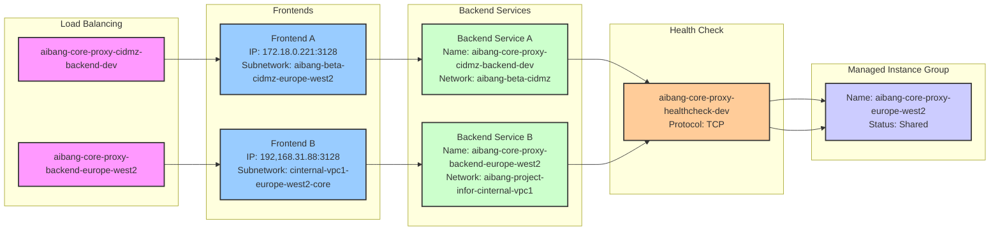
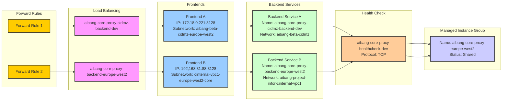
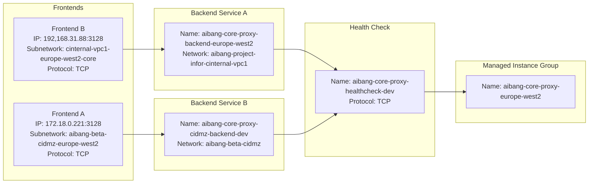
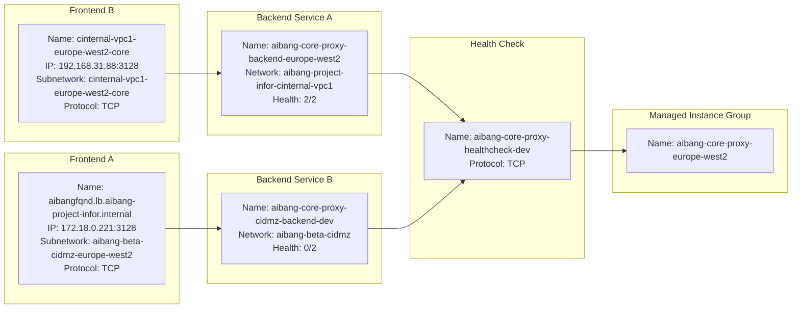
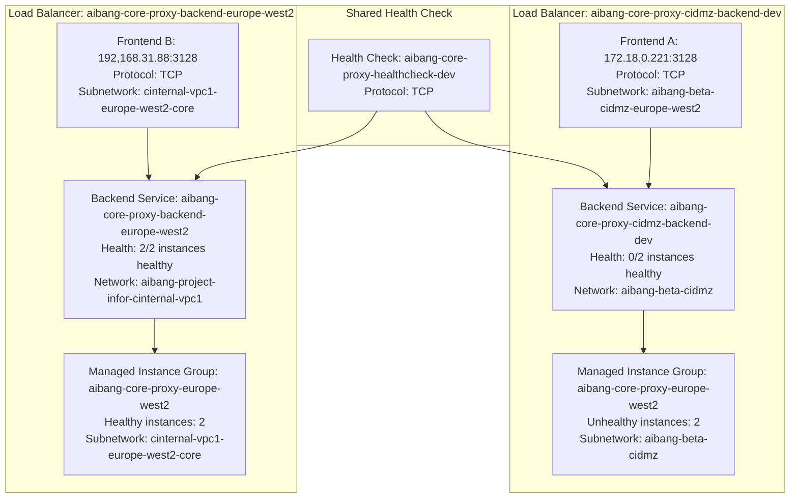
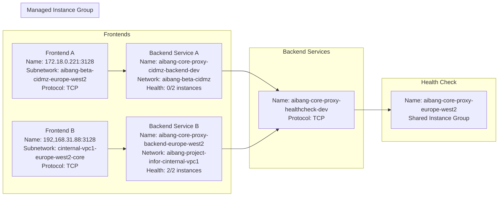
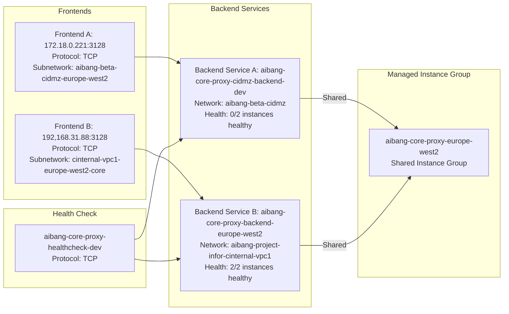
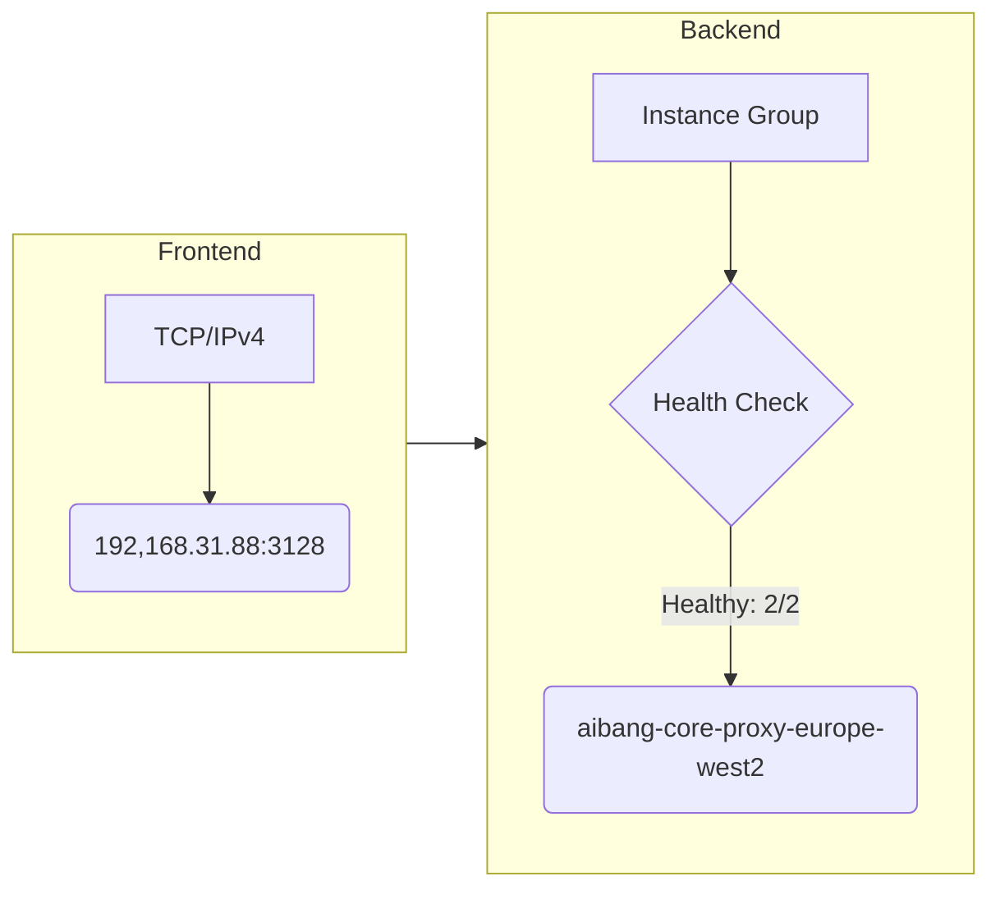
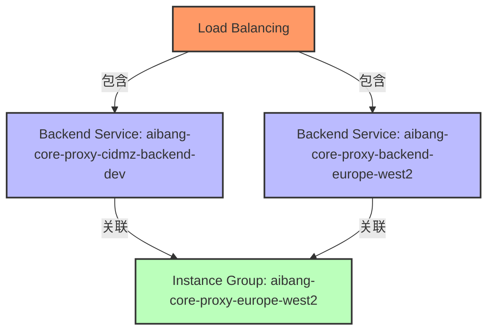

- [flow diagram](#flow-diagram)
- [Q  about delete MIG binding](#q--about-delete-mig-binding)
- [A](#a)
    - [**步骤：解除 MIG 和 Backend Service 的绑定**](#步骤解除-mig-和-backend-service-的绑定)
    - [**保留 Forwarding Rule 的服务能力**](#保留-forwarding-rule-的服务能力)
    - [**Forwarding Rule 如何转发流量？**](#forwarding-rule-如何转发流量)
    - [**如果 MIG 被移除，IP 是否还能用？**](#如果-mig-被移除ip-是否还能用)
    - [**总结建议**](#总结建议)
- [Other](#other)
    - [描述：](#描述)
    - [优点：](#优点)
    - [调整说明：](#调整说明)
    - [解析：](#解析)
    - [说明：](#说明)
    - [关键点：](#关键点)
    - [调整重点：](#调整重点)
    - [关键特点：](#关键特点)
- [flow](#flow)

# flow diagram

以下是按照两个完整流程绘制的流程图：


- add forward rule
- 在这里有个很重要的东西就是LoadBalancing其实就是backend service 

# Q  about delete MIG binding
对于我这个架构来说,我想了解下 因为其实aibang-core-proxy-cidmz-backend-dev后面的MIG的状态并不正常,我如何删除这个MIG的绑定关系,仅仅保留Frontend的部分
那么我的IP: 172.18.0.221:3128这个是否还能提供服务?
因为这个IP: 172.18.0.221:3128其实是我的一个Forward rule规则
那么我的这个Forward rule又怎么把请求转发到后面的MIG?
# A 
在您的架构中，`IP: 172.18.0.221:3128` 是由 Forwarding Rule（转发规则）绑定到 `aibang-core-proxy-cidmz-backend-dev` 的 Frontend 部分的。如果要解除 MIG 和 Backend Service 的绑定，同时保留 Frontend 和 Forwarding Rule，那么需要了解以下几个关键点：

---

### **步骤：解除 MIG 和 Backend Service 的绑定**
1. **在 GCP 控制台操作**：
   - 打开 **Load Balancer** 页面。
   - 找到关联 `aibang-core-proxy-cidmz-backend-dev` 的 Backend Service。
   - 编辑该 Backend Service，移除绑定的 MIG 配置。
   - 保存配置后，该 Backend Service 将不再将流量转发到任何 MIG。

2. **使用 gcloud 命令行**：
   如果您更喜欢使用命令行：
   ```bash
   gcloud compute backend-services update aibang-core-proxy-cidmz-backend-dev \
       --region europe-west2 \
       --no-backends
   ```
   - 这个命令会将 `aibang-core-proxy-cidmz-backend-dev` 的后端列表清空，但其他配置（如健康检查、超时设置等）仍会保留。

---

### **保留 Forwarding Rule 的服务能力**
1. **Frontend 和 Forwarding Rule 是否还能服务？**
   - Forwarding Rule 本质上是通过指定的 IP 地址和端口监听流量，并将流量转发到对应的 Frontend。
   - 如果 `Frontend A` 没有对应的 Backend Service 或其 Backend Service 没有健康的后端（MIG），流量会被丢弃。

2. **解决方案**：
   - 保留 `Frontend A` 和 `Forwarding Rule` 。
   - 如果 MIG 被移除后还需要提供服务，您可以：
     - 添加另一个健康的 Backend Service 或替代的后端（如 Cloud Run、Cloud Functions、或其他 MIG）。
     - 临时将 Backend Service 的行为更改为丢弃请求，防止客户端遇到超时：
       ```bash
       gcloud compute backend-services update aibang-core-proxy-cidmz-backend-dev \
           --region europe-west2 \
           --no-backends
       ```

---

### **Forwarding Rule 如何转发流量？**
1. **基本逻辑**：
   - Forwarding Rule 将所有流量转发到与之关联的 Target Proxy。
   - Target Proxy 使用对应的 Frontend IP 和配置，将流量路由到指定的 Backend Service。
   - Backend Service 再通过其后端（如 MIG）提供服务。

2. **流量路径**：
   - 请求从客户端到 IP: 172.18.0.221:3128。
   - Forwarding Rule 接收到请求，并转发到 Frontend。
   - Frontend 根据配置将流量发送到 Backend Service。
   - Backend Service 会根据绑定的后端列表（MIG）和健康检查选择目标后端实例。

---

### **如果 MIG 被移除，IP 是否还能用？**
- **可以继续使用**：
  - 只要 Forwarding Rule 和 Frontend 存在，IP 地址仍然有效。
  - 但流量没有后端实例可以处理时，会出现：
    - 客户端请求被丢弃。
    - GCP 日志中记录未被路由的请求。

- **推荐解决方案**：
  - 如果需要保留服务能力，可以将 Backend Service 指向一个新的或健康的后端（如另一个 MIG）。
  - 如果短期内没有其他后端可用，可以设置一个默认的响应策略（如 HTTP 重定向到另一个服务）。

---

### **总结建议**
- 确保 Forwarding Rule 和 Frontend 的配置不被删除，IP 可以继续有效。
- 如果 MIG 被解除绑定，Frontend 不会有后端处理流量，建议：
  1. 添加一个替代的后端。
  2. 确保 Backend Service 中有至少一个健康的后端实例，否则会丢弃流量。
- 持续监控流量转发和健康检查结果，通过日志确认服务行为是否正常。

# Other 

### 描述：
1. **Load Balancing**：
   - 两个独立的负载均衡器 `aibang-core-proxy-cidmz-backend-dev` 和 `aibang-core-proxy-backend-europe-west2` 分别对应两条路径。

2. **Frontends**：
   - **Frontend A**：与 `aibang-core-proxy-cidmz-backend-dev` 相连。
   - **Frontend B**：与 `aibang-core-proxy-backend-europe-west2` 相连。

3. **Backend Services**：
   - **Backend Service A**：对应 `aibang-core-proxy-cidmz-backend-dev`。
   - **Backend Service B**：对应 `aibang-core-proxy-backend-europe-west2`。

4. **Health Check**：
   - 共享的健康检查 `aibang-core-proxy-healthcheck-dev`。

5. **Instance Group**：
   - 共享的实例组 `aibang-core-proxy-europe-west2`。

### 优点：
- 每个资源模块分组展示。
- 共享资源（如 Health Check 和 Instance Group）清晰标注为公用。
- 各部分的独立性和关系用不同颜色区分，便于快速理解。

如果需要进一步调整颜色或补充细节，请告诉我！


以下是以 **Backend Service A** 和 **Backend Service B** 为独立节点的流程图，它们分别展示从 **Frontend** 到 **Health Check** 再到 **Instance Group** 的完整路径，复用共享资源：




以下是拆分后的流程图，每个 **Backend Service** 对应自己的 **Frontend**，并独立连接到相关资源，确保资源关系一目了然：



### 调整说明：
1. **Frontend 与 Backend Service 对应关系**：
   - **Frontend A** 仅连接 **Backend Service B**（`aibang-core-proxy-cidmz-backend-dev`）。
   - **Frontend B** 仅连接 **Backend Service A**（`aibang-core-proxy-backend-europe-west2`）。

2. **独立 Backend Service 展示**：
   - 每个 **Backend Service** 被独立展示，并清楚地显示与其相关的资源路径。

3. **复用共享资源**：
   - **Health Check** 和 **Managed Instance Group** 作为共享资源，位于图表下方，由两个 **Backend Service** 分别连接。

4. **结构清晰**：
   - 每个资源模块（Frontend、Backend Service、Health Check、Instance Group）分组显示，层级关系更直观。

如果需要在此基础上进一步优化或添加更多信息，请告诉我！

### 解析：

1. **独立展示 Backend Service**：
   - **Backend Service A**（`aibang-core-proxy-backend-europe-west2`）和 **Backend Service B**（`aibang-core-proxy-cidmz-backend-dev`）被拆分为独立的节点，分开展示。
   - 它们之间的区别主要体现在 **Frontend** 和 **Network** 配置。

2. **明确 Frontend 和 Backend 对应关系**：
   - **Frontend A**（`172.18.0.221:3128`）连接到 **Backend Service B**。
   - **Frontend B**（`192,168.31.88:3128`）连接到 **Backend Service A**。

3. **复用共享资源**：
   - **Health Check** 和 **Managed Instance Group** 是两个 Backend Services 的共享资源，用连接线统一指向。

4. **可读性增强**：
   - 每条路径从 **Frontend** 到 **Backend Service**，再到 **Health Check** 和 **Instance Group**，清晰且独立。

如果需要进一步添加更多细节，如 **Health Check 的协议、检查频率** 或 **实例组的配置信息**，请随时告知！

### 说明：
1. **每个 Backend Service 的独立路径**：
   - **Backend Service A**（`aibang-core-proxy-backend-europe-west2`）和 **Backend Service B**（`aibang-core-proxy-cidmz-backend-dev`）分别从对应的 **Frontend** 开始，明确展示两条独立的流量路径。
   
2. **复用的组件明确**：
   - 两个 Backend Service 共用一个 **Health Check** 和同一个 **Instance Group**。
   - **Health Check** 和 **Instance Group** 在图中单独绘制，通过共享路径连接到两个 Backend Service。

3. **从左到右的流程**：
   - 流程从 Frontend 开始，经过 Backend Service，再到 Health Check，最后到达共享的 Managed Instance Group，逻辑顺畅且清晰。

4. **复用节点减少冗余**：
   - 公用组件仅绘制一次，减少重复信息，同时用连接线表明共享关系。

如果需要进一步修改，或者增加更多细节（如协议配置、超时设置等），请随时告知！


下面是根据您提供的详细环境信息绘制的流程图，它展示了两个 Backend Service 在负载均衡器中的工作流程，以及它们的关联组件和网络配置。



### 关键点：
1. **两个负载均衡器的前端：**
   - **LB_A** 使用 `172.18.0.221:3128`，网络为 `aibang-beta-cidmz-europe-west2`。
   - **LB_B** 使用 `192,168.31.88:3128`，网络为 `cinternal-vpc1-europe-west2-core`。

2. **两个 Backend Service：**
   - **aibang-core-proxy-cidmz-backend-dev**:
     - 关联 `aibang-beta-cidmz` 网络。
     - 后端实例组 `aibang-core-proxy-europe-west2` 全部实例状态异常。
   - **aibang-core-proxy-backend-europe-west2**:
     - 关联 `aibang-project-infor-cinternal-vpc1` 网络。
     - 后端实例组 `aibang-core-proxy-europe-west2` 状态健康。

3. **共享的健康检查：**
   - **Health Check:** `aibang-core-proxy-healthcheck-dev`。
   - 同时应用于两个 Backend Service。

4. **实例组：**
   - **aibang-core-proxy-europe-west2** 实例组被两个 Backend Service 复用，但因为不同的网络配置，导致在 LB_A 中不可用，在 LB_B 中正常工作。

---

以下是更清晰展示 **Backend Service 与 Frontend、Health Check、Instance Group** 的关系的流程图，从左到右明确映射：



### 调整重点：
1. **明确映射关系**：
   - 每个 **Frontend** 显式指向对应的 **Backend Service**。
   - 每个 **Backend Service** 明确与 **Health Check** 和 **Instance Group** 的关系。

2. **组件信息突出**：
   - **Frontend** 包含其名称、IP、Subnetwork 和协议。
   - **Backend Service** 强调其名称、网络、健康状态及其他核心属性。
   - **Health Check** 作为独立节点，显示其名称和协议。
   - **Instance Group** 标明是共享组。

3. **从左到右流程**：
   - 前端流量清晰地流向对应的后端服务，再通过健康检查与实例组关联，逻辑顺畅。

如需进一步扩展细节，比如添加负载均衡策略或连接超时配置等，请告知！

以下是基于您的要求，调整为从左到右的流程方式，以更清晰地展示两个 Backend Service 的流量处理路径和关联组件。



### 关键特点：
1. **从左到右流程展示**：
   - **前端 Frontends** 在最左边，分别展示两个负载均衡器的入口。
   - **中间部分** 是两个 Backend Service，描述了它们的健康状态和网络属性。
   - **后端实例组** 统一展示实例组是共享的，但因网络配置不同导致健康状态的差异。
   - **健康检查** 在顶部，显示它是如何应用到两个 Backend Service 的。

2. **组件关系和状态**：
   - 清晰标注了流量从 Frontend 到 Backend Service，再到共享的实例组的路径。
   - 健康检查与 Backend Service 的联系通过独立的箭头标明。

3. **左右分区**：
   - 左边是网络的入口，右边是最终的实例组，强调从请求入口到服务的完整路径。


- 下面是我环境里面的两个backend-services 这两个都使用了同一组mig 

```bash
$ gcloud compute backend-services list|grep aibang-core-proxy 

aibang-core-proxy-backend-europe-west2   europe-west2/instanceGroups/aibang-core-proxy-europe-west2  TCP

aibang-core-proxy-cidmz-backend-dev europe-west2/instanceGroups/aibang-core-proxy-europe-west2      TCP
```
- 下面是两个backend services 的详情
- 可以看到他们使用了同一个health check 
```bash
aibang-core-proxy-healthcheck-dev

\```text

Backend Service 1: aibang-core-proxy-cidmz-backend-dev


\* Region: europe-west2

\* Protocol: TCP

\* Balancing Mode: CONNECTION

\* Group: https://www.googleapis.com/compute/v1/projects/aibang-project-infor/regions/europe-west2/instanceGroups/aibang-core-proxy-europe-west2

\* Connection Draining: 0

\* Creation Timestamp: 2022-02-09T18:17:52.169-08:00"

\* Fingerprint: jsZeezKTCDw=

\* Health Checks:

  \* https://www.googleapis.com/compute/v1/projects/aibang-project-infor/global/healthChecks/aibang-core-proxy-healthcheck-dev

  \* id: 8655905297126771519

  \* kind: compute#backendService

\* Load Balancing Scheme: INTERNAL

\* Name: aibang-core-proxy-cidmz-backend-dev

\* Network: https://www.googleapis.com/compute/v1/projects/aibang-project-infor/global/networks/aibang-beta-cidmz

\* Self Link: https://www.googleapis.com/compute/v1/projects/aibang-project-infor/regions/europe-west2/backendServices/aibang-core-proxy-cidmz-backend-dev

\* Session Affinity: NONE

\* Timeout Sec: 30


Backend Service 2: aibang-core-proxy-backend-europe-west2 

\* Region: europe-west2

\* Protocol: TCP

\* Balancing Mode: CONNECTION

\* Description: aibang Core Proxy Backend on aibang-beta-cidmz-europe-west2

\* Group: https://www.googleapis.com/compute/v1/projects/aibang-project-infor/regions/europe-west2/instanceGroups/aibang-core-proxy-europe-west2

\* Connection Draining: 0

\* Creation Timestamp: 2022-02-08T06:56:13.785-08:00"

\* Description: aibang Core Proxy Backend Service on aibang-beta-cidmz-europe-west2

\* Fingerprint: EdL_HDYLN9k=

\* Health Checks:

  \* https://www.googleapis.com/compute/v1/projects/aibang-project-infor/global/healthChecks/aibang-core-proxy-healthcheck-dev

  \* id: 7305819857053760098

  \* kind: compute#backendService

\* Load Balancing Scheme: INTERNAL

\* Name: aibang-core-proxy-backend-europe-west2

\* Self Link: https://www.googleapis.com/compute/v1/projects/aibang-project-infor/regions/europe-west2/backendServices/aibang-core-proxy-backend-europe-west2

\* Session Affinity: NONE

\* Timeout Sec: 30

\```

load balance  aibang-core-proxy-cidmz-backend-dev

The load balancer `aibang-core-proxy-cidmz-backend-dev` has the following configuration:


**Frontend:**

\* **Name:** `aibangfqnd.lb.aibang-project-infor.internal`

\* **IP:Port:** `172.18.0.221:3128`

\* **Protocol:** `TCP`

\* **IP Version:** `IPv4`

\* **Scope:** `europe-west2`

\* **Subnetwork:** `aibang-beta-cidmz-europe-west2`


**Backend:**

\* **Instance Group:** `aibang-core-proxy-europe-west2` (appears unhealthy - 0 of 2 instances healthy)

\* **Region:** `europe-west2`

\* **Network:** `aibang-beta-cidmz`

\* **Endpoint protocol:** `TCP`

\* **Session affinity:** `None`

\* **Health check:** `aibang-core-proxy-healthcheck-dev`

\* **Logging:** `Disabled`

\* **Auto-scaling:** `No configuration`

\* **Use as failover:** `No`

\* **Scope:** `europe-west2`

\* **Healthy:** 0 of 2 instances. This indicates a problem with the backend instance group.


**Load Balancer Name:** aibang-core-proxy-backend-europe-west2

**Frontend Configuration:**

* **Protocol:** TCP
* **IP Version:** IPv4
* **Scope:** europe-west2
* **Subnetwork:** cinternal-vpc1-europe-west2-core
* **IP:Ports:** 192,168.31.88:3128


**Backend Configuration:**

* **Region:** europe-west2
* **Network:** aibang-project-infor-cinternal-vpc1
* **Endpoint protocol:** TCP
* **Session affinity:** None
* **Health check:** aibang-core-proxy-healthcheck-dev
* **Logging:** Disabled

**Instance Group:**

* **Name:** aibang-core-proxy-europe-west2
* **Type:** Instance group
* **Scope:** europe-west2
* **Healthy:** 2 of 2
* **Auto-scaling:** No configuration
* **Use as failover group:** No


**Mermaid Diagram (Simplified):**
```




以下是使用中文的资源关系和依赖关系解释：**

****概念依赖关系和解释：****


1. ****前端：******这是客户端访问您的应用程序的入口点。**


  \* **DNS **名称：******用于访问负载均衡器的可读地址。它会解析为负载均衡器的** IP **地址。**

  \* **IP:**端口：******负载均衡器监听的外部** IP **地址和端口。**


2. ****负载均衡器** (aibang-core-proxy-cidmz-backend-dev)**：******它在后端实例组的健康实例之间分配流量。它充当反向代理，接收客户端请求并将它们转发到后端实例。它被配置为*****内部直通网络负载均衡器*****，这意味着它转发流量而不修改它，并且在您的** VPC **网络内运行。**


3. ****后端（目标服务器）：******这是您的应用程序实例运行的地方。**


  \* ****实例组** (aibang-core-proxy-europe-west2)**：******虚拟机** (VM) **实例的集合。负载均衡器将流量分配到该组中的健康实例之间。**

  \* ****虚拟机：******运行您的应用程序代码的各个虚拟机。它们是实例组的一部分。**


4. ****健康检查** (aibang-core-proxy-healthcheck-dev)**：******负载均衡器使用它来确定后端实例组中实例的健康状态。如果实例未通过健康检查，负载均衡器将停止向其发送流量。这对于确保高可用性至关重要。在您的情况下，**0/2 **健康状态表示健康检查配置或后端实例本身存在问题。**

# flow

**这个流程图展示了你环境中的组件及其相互关系，帮助你更好地理解问题的根源。**


在 Google Cloud Platform (GCP) 中，使用命令行工具（如 gcloud）查询 Backend Services 的信息时，实际上是在获取与 Load Balancing 相关的配置和状态。

总结信息

	•	在控制台中，您需要导航到 Network Services → Load balancing 部分，以查看和管理负载均衡器的配置。
	•	后端服务（Backend Services）定义了如何与后端实例（如虚拟机实例或托管实例组）进行流量路由。
	•	通过命令行查询后端服务信息的命令（如 gcloud compute backend-services list）显示的是与负载均衡器关联的所有后端服务。

示例

在控制台中，您可以找到的相关信息：

	1.	Backend Services：这些服务处理流量到后端实例。
	2.	Load Balancers：通过配置，您可以看到关联的前端（Frontend）和后端（Backend）设置。
	3.	Health Checks：查看健康检查配置，以确保后端实例的健康状况是适当的。

Mermaid 流程图表示组件关系

为了进一步说明这些关系，您可以视图化，并将其呈现为以下 Mermaid 流程图：

结论

通过这种方式，您可以清晰地看到从命令行获取的后端服务实际上是在控制台中负载均衡服务的一部分。对于 debugging 和资源管理非常有帮助。