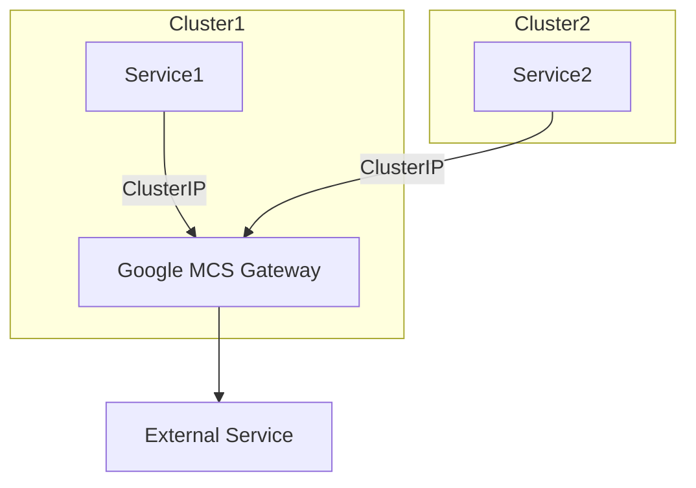
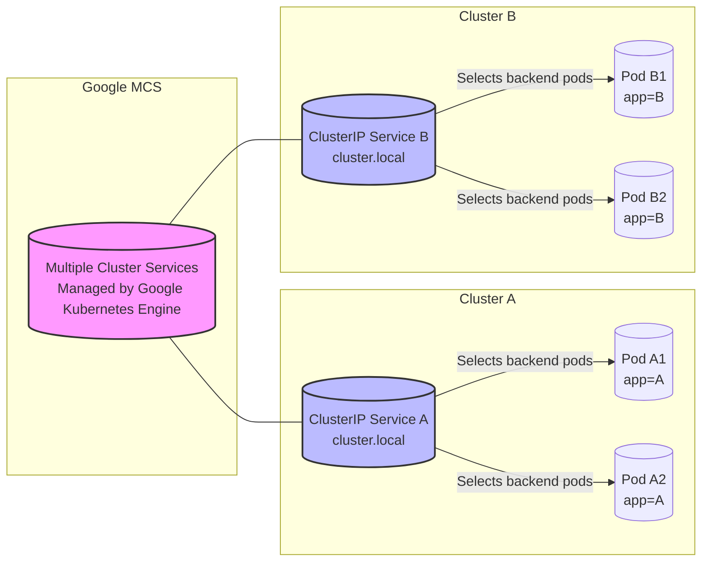

- [summary](#summary)
  - [Pricing](#pricing)
- [Architecture](#architecture)
- [reference:](#reference)
- [Reference:](#reference-1)
  - [排查 GKE Multi-Cluster Services Endpoints 未创建问题](#排查-gke-multi-cluster-services-endpoints-未创建问题)

# summary 
## Pricing 
```
多集群服务包含在 GKE 集群管理费用中，不会产生额外的使用费用。您必须启用 Traffic Director API，但 MCS 不会产生任何 Traffic Director 端点费用。不需要 GKE Enterprise 许可即可使用 MCS
```

# Architecture
下面是一个用Mermaid格式绘制的架构图，展示了通过ClusterIP连接两个集群的Google MCS（Multiple Cluster Services）架构：



在这个架构中，Cluster1和Cluster2分别有一个服务（Service1和Service2），它们通过ClusterIP连接到Google MCS网关（Google MCS Gateway）。Google MCS网关充当中间层，允许来自两个集群的服务相互访问。此外，Google MCS网关还可以连接到外部服务（External Service）。


此Mermaid图表示了一个通过Google Kubernetes Engine（GKE）管理的Google MCS来连接两个集群的示例架构。在这个架构中，Cluster A和Cluster B都有各自内部的ClusterIP服务，它们用来在各自集群内部选择后端Pods。通过Google MCS（在图中表现为连接两个ClusterIP服务的组件），两个集群之间可以相互通信和跨集群提供服务。

```bash
graph LR
  subgraph "Cluster A"
    CR1[("ClusterIP Service A\ncluster.local")] -- "Selects backend pods" --> PODA1[("Pod A1\napp=A")]
    CR1 -- "Selects backend pods" --> PODA2[("Pod A2\napp=A")]
  end
  subgraph "Cluster B"
    CR2[("ClusterIP Service B\ncluster.local")] -- "Selects backend pods" --> PODB1[("Pod B1\napp=B")]
    CR2 -- "Selects backend pods" --> PODB2[("Pod B2\napp=B")]
  end
  subgraph "Google MCS"
    MCS[("Multiple Cluster Services\nManaged by Google Kubernetes Engine")]
  end
  MCS --- CR1 & CR2
  style MCS fill:#f9f,stroke:#333,stroke-width:2px
  style CR1 fill:#bbf,stroke:#333,stroke-width:2px
  style CR2 fill:#bbf,stroke:#333,stroke-width:2px

```

# reference:
- https://cloud.google.com/kubernetes-engine/docs/how-to/multi-cluster-services
- https://cloud.google.com/kubernetes-engine/docs/how-to/multi-cluster-services?hl=zh-cn#using-mcs
- https://github.com/GoogleCloudPlatform/gke-networking-recipes/tree/main/services/multi-cluster/mcs-basic

https://cloud.google.com/kubernetes-engine/docs/how-to/multi-cluster-services?hl=zh-cn

注册 Service 以导出到舰队中的其他集群

创建 ServiceExport 资源 成功

MCS 会在将 Service 导入集群的过程中创建一个 Endpoints 对象

查找 Endpoints 对象以检查 MCS 是否已将端点传播到导入集群。Endpoints 对象在与 ServiceImport 对象相同的命名空间中创建，其名称存储在 net.gke.io/derived-service 注解中。例如

`kubectl get endpoints DERIVED_SERVICE_NAME -n lextest`

# Reference:
https://github.com/GoogleCloudPlatform/gke-networking-recipes/tree/main/services/multi-cluster/mcs-basic
- app.yaml
- export.yaml
- 
在使用 GKE 多集群服务功能时，根据您所提供的步骤和信息，这里有一些需要注意的事项：

1. 对于`SERVICE_EXPORT_NAME`，这个名称应该是您希望从当前集群导出到舰队中其他集群的具体服务（Service）的名称。此名称必须与您希望导出的 Service 对象的名称相匹配，并且存在于 ServiceExport 与之关联的命名空间中。

```yaml
kind: ServiceExport
apiVersion: net.gke.io/v1
metadata:
  namespace: lextest
  name: my-service # 这里的SERVICE_EXPORT_NAME应该与您要导出的Service名称一致
```

2. 如果您已经创建了`ServiceExport`资源并且执行成功了，按照您描述的，确实应该会有对应的`Endpoints`对象创建出来。

如果您没有找到期望的`Endpoints`对象，这里有一些可能的问题需要检查：

- **确认 Service 是否存在**：确保您想要导出的 Service 对象实际上是在命名空间`lextest`中存在的。

- **检查 Service 是否适用于导出**：并非所有的 Service 都能成功导出，比如指向 ExternalName 类型服务的 ServiceExport 就不会成功。

- **检查 ServiceExport 状态**：检查`ServiceExport`的状态，确保没有错误信息。运行`kubectl describe serviceexport your-service-export-name -n lextest`查看详情。

- **权限和配额**：确保您的账户具有足够的权限来创建 Endpoints，并且集群没有超出任何相关的资源配额。

- **网络策略**：检查网络策略是否阻止了正确的 Endpoints 的创建和传播。

- **Cluster Propagation**：确保多集群服务控制器已经在您的集群上启用，并且所有集群都集成到了同一个舰队中。

- **日志**：检查与 ServiceExport 和多集群服务相关的控制器日志，了解可能的错误或警告信息。

- **版本兼容性**：确保您的 GKE 集群版本以及所有相关的 API 版本都支持多集群服务功能。

对于以上提到的点，您要对具体集群和资源进行逐一检查，以识别问题所在。如果确认所有配置都是正确的，并且还是不能解决问题，您也可以考虑查看 Google Cloud 的支持资源或论坛，以获取更进一步的帮助。


对于`SERVICE_EXPORT_NAME`的要求通常与如何在 ServiceExport 资源中使用它有关。这里是一些基本的要求和最佳实践：

1. **匹配服务名称**：`SERVICE_EXPORT_NAME` 必须与您打算导出的 Kubernetes Service 对象的名称相匹配。ServiceExport 资源是服务发现机制的一部分，用于识别应该在多个集群间共享的 Service。

2. **唯一性**：在同一个命名空间内，`SERVICE_EXPORT_NAME` 应该是唯一的，以便可以正确地引用特定的 Service。

3. **遵循 DNS 标准**：名称应遵循 DNS 子域名规范，这是因为 Service 名称会用作 DNS 查询的一部分。这通常意味着名称应为小写字母，并且可以包含数字和短划线('-')，但不能以短划线开头或结尾，也不能包含下划线('_')。

4. **长度限制**：Service 名称通常限制为 63 个字符或更少。

实际上，您应该使用要导出的 Kubernetes Service 的确切名称作为`SERVICE_EXPORT_NAME`。当您在 ServiceExport 资源中指定名称时，它将告诉 GKE 将该 Service 导出到与当前集群相连接的其他集群。例如：

```yaml
apiVersion: net.gke.io/v1
kind: ServiceExport
metadata:
  name: my-service # 这里应该与您要导出的 Service 名称相同
  namespace: lextest
```

在本例中，`my-service` 应该引用一个在 `lextest` 命名空间中实际存在的 Kubernetes Service 对象。如果 Service 名称正确，且 ServiceExport 资源被正确创建，就应该能够触发 endpoints 的创建和相应的跨集群服务发现。

在使用 GKE 多集群服务 (Multi-cluster Services, MCS) 功能时，您只需要在导出服务的集群上创建 `ServiceExport` 资源。一旦创建，GKE 的 MCS 控制平面将自动在您的舰队中已注册并与导出集群连接的其他集群中创建对应的 `ServiceImport` 资源。

请按照以下步骤操作：

1. 在提供服务的集群上创建 `ServiceExport` 资源：这标记了希望跨集群共享的服务。示例如下：

```yaml
apiVersion: net.gke.io/v1
kind: ServiceExport
metadata:
  namespace: lextest
  name: my-service
```

2. 验证 `ServiceImport` 资源：在其他集群中，您应该会看到为每个导入的服务自动创建了 `ServiceImport` 资源。您无需手动在每个集群中创建这些资源。这些资源是由 GKE 的 MCS 控制平面自动管理和维护的。

3. 验证跨集群连接：确保各个集群都已连接到舰队，并且配置了适当的权限和网络设置，以便能够实现多集群服务之间的通信。

如果`ServiceImport`资源在其他集群中没有自动创建，或者创建了但服务不可用，可能需要查看以下方面：

- **舰队配置**：确保所有集群都注册到了同一个舰队中，并且有适当的权限。
- **舰队成员身份**：确认每个集群都加入了舰队并且是活跃的。
- **网络连接**：确保集群之间的网络配置允许它们安全地通信，例如正确设置了 VPN 或 VPC 之间的对等连接。
- **服务发现日志**：检查相关的控制器日志，了解集群间服务发现过程中的状态和错误。

当一切设置正确后，您的服务将自动通过 MCS 在多个集群间共享，而无需您在每个集群中重复创建相同的资源。

如果您的 `ServiceExport` 已经成功创建，但您在运行 `kubectl get endpoints DERIVED_SERVICE_NAME -n lextest` 时没有找到与 `DERIVED_SERVICE_NAME` 对应的 IP 地址，这表明可能没有端点被正确创建或者传播。这里有一些可能的原因和解决步骤：

1. **确认 Service 状态**：
   - 确保原始 Service 是活动的，并且后端 Pods 正常运行。
   - 检查 Service 是否有分配的 Cluster IP（对于 ClusterIP 类型的服务）。

2. **检查 ServiceExport 和 ServiceImport 状态**：
   - 使用 `kubectl describe` 命令来检查 `ServiceExport` 资源的状态以及任何相关的事件。
   - 同样检查其他集群中 `ServiceImport` 的状态，以确认它已经被创建且没有发现任何问题。

3. **检查 EndpointSlice 资源**：
   - GKE 的多集群服务可能使用 `EndpointSlice` 对象而不是传统的 `Endpoints` 对象。
   - 使用命令 `kubectl get endpointslice -n lextest` 来查看是否已正确创建了 EndpointSlice。

4. **网络问题**：
   - 检查是否有网络策略阻止了端点的创建。
   - 确保在集群之间的网络连接设置允许端点同步。

5. **检查相关的日志**：
   - 查看多集群服务控制器的日志，了解有无关于端点创建或同步的错误。
   - 查询 API 服务器和控制平面组件的日志。

6. **权限问题**：
   - 确保您的 Kubernetes 账户具有创建和查看 `Endpoints` 和 `EndpointSlice` 资源的权限。

7. **等待传播**：
   - 在一些情况下，端点传播可能会有延时。等待几分钟，然后再次检查。

8. **联系支持**：
   - 如果在执行所有检查之后问题仍然存在，可能需要联系 Google Cloud 支持部门以获取进一步的帮助。

进行这些检查可以帮助您诊断为什么端点没有正常出现，并指导您采取适当的行动来解决问题。


您可以使用 `kubectl` 命令来检查 `EndpointSlice` 资源是否被正确创建。`EndpointSlice` 是 Kubernetes 网络终端的一个新的 API 对象，它提供了一种更可扩展的方式来跟踪网络端点，这在大型集群中特别有用。

运行以下命令来检查特定命名空间下的 `EndpointSlice` 资源：

```bash
kubectl get endpointslice -n lextest
```

这将列出 `lextest` 命名空间下的所有 `EndpointSlice` 对象。要查看某个 `EndpointSlice` 的详细信息，您可以使用以下命令：

```bash
kubectl describe endpointslice <endpointslice-name> -n lextest
```

替换 `<endpointslice-name>` 为您想要检查的 `EndpointSlice` 的名称。

查看 `EndpointSlice` 中的信息，您应该会看到以下关键字段：

- **AddressType**：指出地址类型，通常是 "IPv4" 或 "IPv6"。
- **Endpoints**：包含 endpoint 的地址，以及关联的条件状态，如是否就绪（`ready`）。
- **Ports**：表明哪些端口被此 slice 使用，以及使用的协议。

您还可以检查 `ownerReferences` 字段来确定该 `EndpointSlice` 是由哪个 Service 生成的，或者确认它是否与您的 `ServiceExport` 对应。

如果查看 `EndpointSlice` 时发现没有相关的 `Endpoints` 或者它们的状态不是期望的，您可能需要检查底层 Pod 状态是否健康，或者是否存在一些配置问题。如果 `Service` 没有关联的活跃 Pod，或者 Pod 没有匹配到 `Service` 的选择器，那么可能不会创建对应的 `Endpoints`，从而导致 `EndpointSlice` 为空。


在多集群服务 (Multi-cluster Services, MCS) 环境下，术语"传播"通常指的是服务发现信息（包括服务端点）在多个集群间的自动同步和更新。当您创建一个 `ServiceExport` 资源时，期望该服务的信息会从服务所在的导出集群"传播"到其他集群中。

这里的具体步骤通常包括：

1. **导出服务端点**：在原始或主集群创建 `ServiceExport` 资源，这样服务就被标记为需要跨集群共享。

2. **服务同步**：一个控制平面组件会检测到 `ServiceExport` 资源的创建，并将此信息同步到连接的集群中。这可能涉及将服务和它的端点信息同步到一个中央位置，比如说 Google Cloud 的服务注册表。

3. **创建服务端点**：在其他集群中，基于同步的服务信息，会自动创建 `ServiceImport` 资源和相应的端点（通常表示为 `EndpointSlice`），这使得服务可以在这些集群中被发现和访问。

4. **更新端点信息**：当服务后端（比如，Pods）变化时（例如新的 Pod 被添加或现有的 Pod 被删除），这些变化也会被同步并更新到所有相关的集群端点信息中。

如果在期望服务端点在其他集群里通过 `ServiceImport` 被"传播"之后，却没有看到这些端点信息，就说明可能存在同步或更新问题。通常这可能是由网络配置问题、权限问题、或其他集群状态问题造成的。解决方法可能包括检查网络连接，确认集群间的集群注册和权限设置，以及检查相关的 Kubernetes 控制器日志。

如果您的 `ServiceImport` 已经成功创建但没有相应的端点出现，这可能是由以下几种情况导致的：

1. **后端 Pods 状态**：
   检查与原始服务关联的 Pods 是否健康且在运行。如果 Pods 出现故障或者不满足就绪探针的要求，它们可能不会被作为端点添加。

2. **选择器匹配问题**：
   服务定义中的选择器(selector)可能没有匹配到任何 Pods。请核对 Service 的选择器设置和 Pods 的标签确保它们能够匹配。

3. **网络策略**：
   网络策略可能阻止了端点的发现。确保没有网络策略限制了集群间的通信或阻止了控制平面组件访问端点信息。

4. **同步延迟**：
   在某些情况下，服务端点的发现和同步可能会有延迟。等待一段时间再次检查端点是否已正确创建。

5. **控制平面组件问题**：
   负责同步 `ServiceImport` 对象和 `Endpoint` 对象的控制平面组件可能遇到问题。检查与服务发现和同步相关的组件的日志以查看是否有错误信息。

6. **权限限制**：
   运行同步操作的 Kubernetes 服务账户可能缺少必要的权限。确保它有足够权限来创建和更新端点资源。

7. **集群间通信问题**：
   集群间通信故障（如 API 服务器不可达）可能阻止了端点信息的正确同步。

8. **配置错误**：
   `ServiceImport` 配置错误，如指定了错误的端点切片名称或端点切片不可用。

为了进一步诊断问题，您可以：

- 检查 Pod 日志和事件来确定它们的状态和任何潜在问题。
- 使用 `kubectl describe service <service-name>` 来检查服务的 Endpoint 和选择器配置。
- 查看相关的网络策略来确认是否存在可能的访问限制。
- 查看控制平面日志以诊断可能的集群间同步问题。
- 确认 Kubernetes RBAC 配置允许端点的同步和创建。


当 `ServiceImport` 已经创建，但相应的 `Endpoints` 没有生成时，可能的原因包括：

1. **Pods 不满足选择器条件**：
   请检查原始 `Service` 的选择器(spec.selector)与后端 Pod 的标签是否匹配。如果标签不匹配，就不会创建对应的 `Endpoints`。

2. **Pods 不健康**：
   如果后端 Pods 处于 `Failed`, `Unknown`, 或 `CrashLoopBackOff` 状态，或者没有通过就绪探针检查，它们就不会被视为可用端点。

3. **连接性问题**：
   集群间的网络连接问题可能阻碍了端点信息的正确传输。这可能涉及防火墙规则、路由问题或其他网络配置问题。

4. **控制器或操作员故障**：
   负责将 `ServiceExport` 转换为 `Endpoints` 的控制器可能出现故障或配置错误。检查控制器日志，找出可能的问题。

5. **RBAC 权限配置问题**：
   确认运行服务发现控制器的 Kubernetes 服务账户是否具有创建和管理 `Endpoints` 的权限。

6. **资源配额限制**：
   如果达到了命名空间的资源配额限制，可能会阻止新的 `Endpoints` 被创建。

7. **服务类型不支持**：
   `Endpoints` 通常与 `ClusterIP` 类型的服务关联。如果您尝试导出一个不支持的服务类型，比如 `ExternalName`，这可能导致无法创建 `Endpoints`。

8. **同步延迟**：
   在多集群环境中，服务端点信息可能需要一些时间来同步。可能需要耐心等待同步过程完成。

9. **同步策略问题**：
   如果正在使用的服务发现和同步系统包含策略或配置，那么不符合这些策略的服务就不会被同步。

10. **API 版本不兼容**：
    确保在所有参与的集群中使用的 Kubernetes 或相关联的多集群服务解决方案的版本兼容。

为了排查问题，可以采取以下步骤：

- 使用 `kubectl get pods -n <namespace>` 和 `kubectl describe pod <pod-name> -n <namespace>` 来检查 Pod 状态和事件。
- 使用 `kubectl get svc -n <namespace>` 来确认服务配置，包括选择器与 Pod 的标签匹配情况。
- 确认集群间网络连接和相关防火墙规则配置正确。
- 检查相关控制器或操作员的日志找出错误信息。
- 通过 `kubectl get role,rolebinding,clusterrole,clusterrolebinding --all-namespaces` 检查 RBAC 角色和绑定的配置。
- 使用 `kubectl describe namespace <namespace>` 查看是否存在资源配额问题。
- 确保服务类型是支持的，并且 `ServiceExport` 的配置正确无误。
- 如果一切看起来都配置正确，请稍等一段时间看端点是否最终同步过来。
- 可能需要查看相关的多集群服务文档或社区支持资源以获取进一步帮助。


通过上述步骤，您应该能够进一步缩小问题的范围并确定导致端点未能创建的原因。如果问题仍然无法解决，您可能需要搜索相关文档或联系技术支持获取帮助。

为 MCS 导入工具授予所需的 Identity and Access Management (IAM) 权限：
```bash
gcloud projects add-iam-policy-binding PROJECT_ID \
    --member "serviceAccount:PROJECT_ID.svc.id.goog[gke-mcs/gke-mcs-importer]" \
    --role "roles/compute.networkViewer"
```
在使用 Google Kubernetes Engine (GKE) 的 Multi-Cluster Services (MCS) 功能时，如果 Endpoint 没有获取到对应的 IP 地址，可以通过以下步骤进行排查：

1. **检查 MCS 和 GKEHub 服务账号权限**：确保 MCS 和 GKEHub 服务账号在拥有所有必要权限的舰队宿主项目中已自动创建。可以通过运行 `gcloud projects get-iam-policy PROJECT_ID | grep gcp-sa-mcsd` 和 `gcloud projects get-iam-policy PROJECT_ID | grep gcp-sa-gkehub` 来验证服务账号是否存在[2]。

2. **检查 VPC 网络配置**：如果集群位于不同的 VPC 中，这些 VPC 必须进行对等互连，以便 MCS 能够正确连接。检查是否已完成 VPC 网络对等互连设置[2]。

3. **跨项目集群配置**：如果集群跨项目部署，需要完成额外的设置步骤。确保已按照跨项目设置的指南完成配置[2]。

4. **检查 GKE 元数据服务器配置**：确保在运行应用的节点池上已配置 GKE 元数据服务器。可以通过运行 `gcloud container node-pools describe NODEPOOL_NAME --cluster=CLUSTER_NAME --format="value(config.workloadMetadataConfig."` 来检查配置[1]。

5. **检查 Kubernetes 服务账号注解**：确认 Kubernetes 服务账号已正确注解。可以通过运行 `kubectl describe serviceaccount --namespace NAMESPACE KSA_NAME` 来检查注解[1]。

6. **检查 IAM 服务账号配置**：确保 IAM 服务账号配置正确，并具有 `roles/iam.workloadIdentityUser` 角色。可以通过运行 `gcloud iam service-accounts get-iam-policy GSA_NAME@GSA_PROJECT.iam.gserviceaccount.com` 来检查[1]。

7. **检查 GKE Dataplane V2**：如果使用 GKE Dataplane V2，确保集群版本支持并已正确配置。Dataplane V2 使用 eBPF 优化 Kubernetes 网络，提供更高效的数据包处理[3]。

8. **检查多集群 Ingress (MCI) 配置**：如果使用 MCI，确保 NEG (NetworkEndpointGroup) 已正确创建。NEG 未正确创建可能是导致 Endpoint 未获取 IP 地址的原因之一[4]。

通过以上步骤，您应该能够诊断和解决 Endpoint 未获取到对应 IP 地址的问题。如果问题仍然存在，建议详细检查相关的 Kubernetes 和 GKE 文档，或联系 Google Cloud 支持获取进一步帮助。

- Sources
- [1] 排查GKE 身份验证问题 - Google Cloud https://cloud.google.com/kubernetes-engine/docs/troubleshooting/authentication?hl=zh-cn
- [2] 配置多集群Service | Google Kubernetes Engine (GKE) https://cloud.google.com/kubernetes-engine/docs/how-to/multi-cluster-services?hl=zh-cn
- [3] GKE Dataplane V2 | Google Kubernetes Engine (GKE) https://cloud.google.com/kubernetes-engine/docs/concepts/dataplane-v2?hl=zh-cn
- [4] 多集群Ingress 的问题排查和操作| Google Kubernetes Engine (GKE) https://cloud.google.com/kubernetes-engine/docs/how-to/troubleshooting-and-ops?hl=zh-cn
- [5] 使用Google Kubernetes Engine (GKE) Autopilot 和Standard 集群迁移到多集群网络 https://cloud.google.com/kubernetes-engine/docs/how-to/migrate-gke-multi-cluster?hl=zh-cn
- [6] [PDF] Docker开发指南 - 天籁教育云系统升级成功公告 http://crm.tianlaijiaoyu.com:2237/tianlaibbs/0tianlai_workbench/assets/book/Docker%E5%BC%80%E5%8F%91%E6%8C%87%E5%8D%97.pdf
- [7] 在GCP 中部署EMQX - EMQ Technologies https://docs.emqx.com/zh/emqx-operator/2.2.0/deployment/on-gcp-gke.html
- [8] 使用节点自动预配功能| Google Kubernetes Engine (GKE) https://www.web-bci.com/?_=%2Fkubernetes-engine%2Fdocs%2Fhow-to%2Fnode-auto-provisioning%23cueErMT%2FvVvj%2BLk830MWgjBhlUBpjyLL&hl=zh-cn
- [9] 在GKE 上部署高可用性PostgreSQL 数据库 | Google Cloud https://checksprocessing.com/?_=%2Fkubernetes-engine%2Fdocs%2Ftutorials%2Fstateful-workloads%2Fpostgresql%23p0spOJvYDKaNU8doRvTBdHv8VcQNjQ2e&hl=zh-cn
- [10] 自动升级节点| Google Kubernetes Engine (GKE) https://wirtschaftjetzt.com/?_=%2Fkubernetes-engine%2Fdocs%2Fhow-to%2Fnode-auto-upgrades%23KJWqMdlUlBnoJ%2BIAVFPniITydIQuGFCs&hl=zh-cn
- [11] Full text of "IT计算机精选合集" - Internet Archive https://archive.org/stream/ittushu-1500/PDF/Docker%E5%BC%80%E5%8F%91%E6%8C%87%E5%8D%97_djvu.txt
- [12] 节点自动预配简介| Google Kubernetes Engine (GKE) https://www.web-bci.com/?_=%2Fkubernetes-engine%2Fdocs%2Fconcepts%2Fnode-auto-provisioning%23cueErMT%2FvVvj%2BLk830MWgjBhlUBpjyLL&hl=zh-cn
- [13] 视频转码器破解版- OSCHINA - 中文开源技术交流社区 - 开源中国 https://www.oschina.net/informat/%E8%A7%86%E9%A2%91%E8%BD%AC%E7%A0%81%E5%99%A8%E7%A0%B4%E8%A7%A3%E7%89%88


学习这个文章
https://cloud.google.com/kubernetes-engine/docs/how-to/multi-cluster-services
我去创建msc
我现在遇到的问题gke-msc-controller 并没有创建出对应的endpoints
对应的SVC是创建出来了.SVC后面需要是endpoint但是并没有生成endpoint
这种问题如何去排查?


## 排查 GKE Multi-Cluster Services Endpoints 未创建问题

根据您提供的文章和描述，您在创建 GKE Multi-Cluster Services (MCS) 时遇到了 Endpoints 未创建的问题，但 SVC 已经创建成功。以下是排查此问题的步骤：

**1. 检查 MCS 配置:**

* 确保您的 MCS 配置文件正确无误，特别是 `spec.endpoints` 部分。
* 检查 `spec.endpoints` 中的 `serviceName` 是否与您创建的 SVC 名称一致。
* 检查 `spec.endpoints` 中的 `ports` 是否与您想要公开的端口一致。

**2. 检查 GKE 日志:**

* 查看 GKE 控制器日志 (`kubectl logs -n kube-system gke-msc-controller`)，是否有任何错误信息或警告。
* 搜索与 Endpoints 创建相关的日志条目，例如 `Failed to create endpoint` 或 `Endpoint creation failed`。

**3. 检查 Kubernetes 事件:**

* 查看 Kubernetes 事件 (`kubectl get events -n kube-system`), 是否有任何与 Endpoints 创建相关的事件。
* 搜索与 `endpoints` 或 `gke-msc-controller` 相关的事件，例如 `Failed to create endpoints for service` 或 `Error creating endpoint for service`。

**4. 检查网络配置:**

* 确保您的集群之间能够相互通信。
* 确保您的防火墙规则允许 MCS 流量通过。

**5. 使用调试工具:**

* 使用 `kubectl describe endpoint` 命令查看 Endpoints 的详细信息。
* 使用 `kubectl debug` 命令进入 GKE 控制器 Pod 并进行调试。

**其他资源:**

* GKE Multi-Cluster Services 文档: [https://cloud.google.com/kubernetes-engine/docs/how-to/multi-cluster-services](https://cloud.google.com/kubernetes-engine/docs/how-to/multi-cluster-services)
* Kubernetes Endpoints 文档: [移除了无效网址]
* Kubernetes Troubleshooting Guide: [移除了无效网址]

如果您仍然无法解决问题，建议您向 Google Cloud 支持团队寻求帮助。

**以下是一些可能导致 Endpoints 未创建的具体原因:**

* MCS 配置错误，例如 `serviceName` 或 `ports` 配置不正确。
* GKE 控制器 Pod 遇到错误，无法创建 Endpoints。
* 集群之间无法相互通信。
* 防火墙规则阻止了 MCS 流量。

**解决方法:**

* 检查并修正 MCS 配置。
* 检查 GKE 日志和事件，并解决任何错误或问题。
* 检查网络配置，并确保集群之间能够相互通信。
* 配置防火墙规则允许 MCS 流量通过。

希望以上信息能帮助您解决问题。


