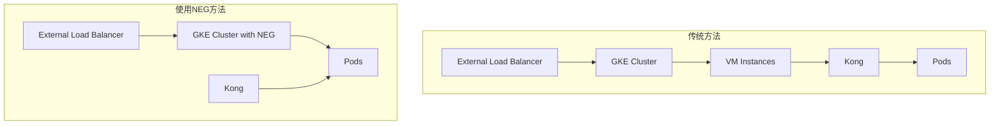

使用网络端点组（Network Endpoint Group，NEG）实现容器原生负载均衡相较于直接使用GKE External Load Balancer有几个显著的优点：

### 优点

1. **更细粒度的流量控制**
   - **NEG**允许将流量直接发送到特定的容器实例，而不仅仅是虚拟机实例。这使得流量分发更精确，可以更好地利用容器化应用的灵活性和扩展能力。

2. **直接集成服务发现**
   - **NEG**与GKE深度集成，可以自动发现和管理Pod的生命周期。它可以确保负载均衡器始终知道哪些容器正在运行，哪些已经终止，避免将流量发送到无效的容器。

3. **支持多端点类型**
   - **NEG**支持多种类型的端点，包括GCE虚拟机实例、GKE容器、服务器集群等。这使得它在多种场景下都能灵活应用，满足复杂的流量分发需求。

4. **简化的运维**
   - 使用**NEG**后，运维人员不再需要手动更新负载均衡器配置来反映后端的变化。GKE和NEG会自动同步Pod的健康状况和IP地址变化，简化了运维工作。

5. **优化的性能**
   - **NEG**通过直接将流量路由到容器级别，减少了中间层的流量处理和延迟，从而提升了应用的响应速度和性能。

6. **更好的健康检查**
   - **NEG**支持更细粒度的健康检查，能够针对每个Pod进行独立的健康监测。这确保了只有健康的实例会接收流量，提高了应用的可用性。

### 图示说明

以下是使用NEG与GKE External Load Balancer的架构对比示意图：

```mermaid
graph TD
  subgraph GKE External Load Balancer
    A[External Load Balancer]
    B[GKE Cluster]
    C[VM Instances]
    A --> B
    B --> C
  end
  
  subgraph Container-Native Load Balancing with NEG
    D[External Load Balancer]
    E[GKE Cluster with NEG]
    F[Containers (Pods)]
    D --> E
    E --> F
  end
```

### 总结

使用网络端点组（NEG）进行容器原生负载均衡能够更好地利用GKE的容器化特性，提供更细粒度的流量控制、更好的性能以及简化的运维体验，是相较于传统的GKE External Load Balancer更为先进和灵活的
选择。

使用网络端点组（NEG）后，观察到Kong Data Plane（DP）对应的CPU压力减少，这确实可能符合预期，原因如下：

### 1. **更高效的流量路由**

NEG允许流量直接路由到具体的容器实例，而不是先经过虚拟机。这减少了流量处理的中间层，从而降低了CPU负载。Kong作为一个API网关和负载均衡器，处理的流量量级较大时，如果减少了中间的转发和处理步骤，自然会减轻其负载。

### 2. **减少了不必要的网络开销**

使用NEG可以更高效地进行负载均衡，直接将流量分配到Pod级别。传统的负载均衡方式可能需要更多的网络转发和处理步骤，这些步骤会增加Kong的CPU开销。NEG的直接流量分发方式减少了不必要的网络开销，降低了CPU使用率。

### 3. **更精准的健康检查**

NEG提供更细粒度的健康检查能力，可以针对每个Pod进行独立的健康检查。这意味着Kong不需要再执行额外的健康检查操作，从而减少了CPU消耗。

### 4. **更好的资源分配和管理**

通过NEG，GKE能够更高效地管理和分配资源，确保流量分配更加合理和优化。这减少了Kong处理负载不均衡情况时的压力。

### 图示说明

以下是使用NEG和传统方法在流量处理路径上的对比：



### 结论

使用NEG后，流量路由更加直接、高效，减少了中间步骤和不必要的网络开销，从而降低了Kong DP的CPU压力。这种改进符合预期，并且是由于NEG优化了流量处理路径和资源管理。

