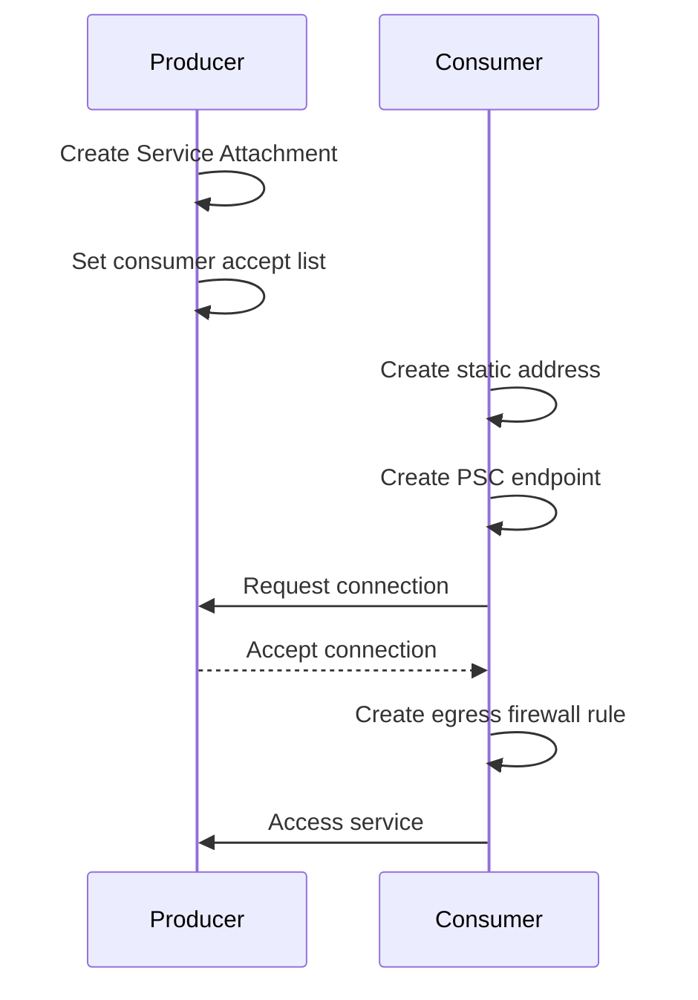

参考这个文档:
https://cloud.google.com/sql/docs/mysql/configure-private-service-connect#create-psc-endpoint

我想要理清楚consumer 和 producer 之间的关系
并帮我罗列下面一些具体的命令
- Create service Attachment in Producer Project,需要有参数
    --consumer-accept-list=${ACCEPT_LIST} \ 
    --connection-preference=ACCEPT MANUAL
- Create static address in consumer project
- create endpoint in consumer project 需要有参数
  - target-service-attachment 
  - allow-psc-global-access
- Create Egress Firewall Rule in Consumer project

最好有一个Flow的mermaid sequenceDiagram 能让我更好的理解这个过程
参考的命令可以参考附件

Certainly! I'll help you understand the relationship between the consumer and producer in the context of Private Service Connect (PSC), and then provide the specific commands you've requested. Let's start with an overview and then dive into the details.


First, let's clarify the relationship between the consumer and producer:

1. Producer: This is the project that hosts the service you want to make available through Private Service Connect. It creates a service attachment that allows controlled access to its service.

2. Consumer: This is the project that wants to access the producer's service. It creates an endpoint to connect to the producer's service attachment.

首先，让我们理清消费者和生产者之间的关系：

1. 生产者：这是托管您希望通过 "私有服务连接 "提供的服务的项目。它创建了一个服务附件，允许受控访问其服务。
2. 消费者：这是希望访问生产者服务的项目。它创建一个端点，用于连接到生产者的服务附件

Now, let's visualize this process with a sequence diagram:



This diagram illustrates the high-level flow of setting up Private Service Connect between a producer and consumer.

Now, let's go through the specific commands you requested:

1. Create Service Attachment in Producer Project:

```bash
gcloud compute service-attachments create ${SERVICE_ATTACHMENT_NAME} \
--project=${PRODUCER_PROJECT_ID} \
--region=${REGION} \
--nat-subnets=${NAT_SUBNETS} \
--producer-forwarding-rule=${FWD_RULE} \
--consumer-accept-list=${ACCEPT_LIST} \
--connection-preference=ACCEPT_MANUAL
```

Note: The `--consumer-accept-list` parameter should be in the format `PROJECT_ID=CONNECTION_LIMIT`, e.g., `my-project-id=10`.

2. Create static address in Consumer project:

```bash
gcloud compute addresses create ${ADDR_NAME} \
--project=${CONSUMER_PROJECT_ID} \
--region=${REGION} \
--subnet=${SUBNET}
```

3. Create endpoint in Consumer project:

```bash
gcloud compute forwarding-rules create ${FWD_RULE_NAME} \
--project=${CONSUMER_PROJECT_ID} \
--region=${REGION} \
--network=${NETWORK} \
--target-service-attachment=${TARGET_SERVICE_ATTACHMENT} \
--address=${ADDR_NAME} \
--allow-psc-global-access
```

Note: The `--target-service-attachment` parameter should be in the format `projects/${PRODUCER_PROJECT_ID}/regions/${REGION}/serviceAttachments/${SERVICE_ATTACHMENT_NAME}`.

4. Create Egress Firewall Rule in Consumer project:

```bash
gcloud compute firewall-rules create ${FIREWALL_RULE_NAME} \
--project=${CONSUMER_PROJECT_ID} \
--network=${NETWORK} \
--direction=EGRESS \
--destination-ranges=${PSC_ENDPOINT_IP} \
--action=ALLOW \
--rules=tcp:${PORT}
```

Replace `${PSC_ENDPOINT_IP}` with the IP address of your PSC endpoint, and `${PORT}` with the port your service uses (e.g., 443 for HTTPS).

These commands follow the flow described in the sequence diagram. The producer sets up the service attachment and specifies which consumers are allowed to connect. The consumer then creates a static address and an endpoint to connect to the producer's service. Finally, the consumer sets up a firewall rule to allow egress traffic to the PSC endpoint.

Remember to replace all placeholders (like `${PRODUCER_PROJECT_ID}`, `${CONSUMER_PROJECT_ID}`, `${REGION}`, etc.) with your actual values when running these commands.

# verify 

当然可以。我会用中文为您分析这个过程，并提供一些验证整个流程是否正常工作的方法和步骤。

首先，您的理解是正确的。为了使 consumer 成功连接到 producer，确实需要 producer 进行特殊设置和允许，同时 consumer 也需要设置防火墙规则允许流出流量。让我们详细分析这个过程，并提供一些验证步骤。


# Private Service Connect 验证检查列表

## Producer 端验证
1. [ ] 服务附件创建成功
2. [ ] Consumer 项目已添加到接受列表
3. [ ] 连接偏好设置为手动接受
4. [ ] 网络负载均衡器正常运行

## Consumer 端验证
1. [ ] 静态 IP 地址创建成功
2. [ ] PSC 端点创建成功
3. [ ] 出站防火墙规则创建成功
4. [ ] 能够解析 PSC 端点的 DNS 名称

## 连接测试
1. [ ] 从 Consumer 虚拟机 ping PSC 端点 IP
2. [ ] 使用 telnet 或 nc 测试特定端口连接
3. [ ] 使用 curl 或其他工具测试 HTTP/HTTPS 连接（如适用）
4. [ ] 检查 Producer 端的连接日志

## 故障排除
1. [ ] 检查 VPC 网络配置
2. [ ] 验证 IAM 权限
3. [ ] 检查 Google Cloud Console 中的错误消息
4. [ ] 查看相关的 Stackdriver 日志


现在，让我为您详细解释验证过程和一些可能的故障排除步骤：

1. Producer 端设置验证：
   - 确认服务附件已成功创建。您可以在 Google Cloud Console 的 "网络服务 > Private Service Connect > 已发布的服务" 中查看。
   - 验证 consumer 项目已被添加到接受列表中。检查服务附件的详细信息，确保 consumer 项目 ID 在列表中。
   - 确认连接偏好设置为 "手动接受"。这可以在服务附件的详细信息中查看。
   - 检查与服务附件关联的网络负载均衡器是否正常运行。

2. Consumer 端设置验证：
   - 确认静态 IP 地址已成功创建。可以在 "VPC 网络 > IP 地址" 中查看。
   - 验证 PSC 端点（转发规则）已成功创建。检查 "网络服务 > Private Service Connect > PSC 端点"。
   - 确认出站防火墙规则已正确创建，允许到 PSC 端点 IP 的流量。

3. 连接测试：
   - 在 consumer 项目中创建一个测试虚拟机。
   - 尝试从测试虚拟机 ping PSC 端点的 IP 地址。
   - 使用 telnet 或 nc 命令测试特定端口的连接。
   - 如果服务是 HTTP/HTTPS，可以使用 curl 命令测试连接。

4. 故障排除：
   - 如果连接失败，首先检查 VPC 网络配置，确保路由设置正确。
   - 验证 IAM 权限，确保 consumer 有足够的权限访问 producer 的服务。
   - 在 Google Cloud Console 中检查是否有任何错误消息。
   - 查看相关的 Stackdriver 日志，寻找可能的错误原因。

5. DNS 验证：
   - PSC 会自动在服务目录中注册端点。确认可以解析端点的 DNS 名称。

6. Producer 端日志检查：
   - 在 producer 端检查连接日志，确认是否看到来自 consumer 的连接尝试。

通过系统地执行这些步骤，您应该能够验证整个 Private Service Connect 设置是否正常工作。如果在任何步骤中遇到问题，您可以针对性地进行故障排除。

记住，Private Service Connect 的设置涉及多个组件，因此耐心和系统化的方法对于成功验证和故障排除至关重要。

# other reference

Sample Case
This is an example that producer publish service from aibang-default-network where:
• PSC subnets are created automatically in default VPC aibang-default-network with subnet naming convention=psc-<region>, e.g. psc-asia-east2
• VM MUST include network tag "fwtag-psc-ingress" in order to allow ingress traffic from PSC subnet to MIG
• Create a MIG and Network Load Balancer


Create Service Attachment in Producer project
Mandatory Setup - Produced MUST use only accept manual and put project to accept list.


Create service Attachment in Producer Project 
- create public server
```bash
export PROJECT_ID=<producer project>
export SERVICE_ ATTACHMENT_NAME=lex-mig # Must be a match of regex ' (?: [a-z] (?: [-a-z0-9] (0, 61) [a-z0-9]) ?) ' 
export REGION=asia-east2
export NAT_SUBNETS=psc-$(REGION) # this is pre-defined PSC subnet in aibang-default-network. Application need to change for self service
export FWD_RULE=<Forward Rule which create when set up network load balancer> 
export ACCEPT_LIST=<project-id>=10, <project-id2>=10 # this is accept list of project
gcloud compute service-attachments create $(SERVICE_ATTACHMENT_ NAME} \
--project=${PROJECT_ID} \
--region=${REGION} \
--nat-subnets=${NAT_SUBNETS} \
--producer-forwarding-rule=${FWD_RULE} \
--consumer-accept-list=${ACCEPT_LIST} \ 
--connection-preference=ACCEPT MANUAL
```

Note: Parameter DOMAIN_NAME should not use as this require public domain.
Application can go to console Network>Private Service Connect > Published Services to check if creation succeed.

- gcp ==> console ==> private service connect ==> published services 
