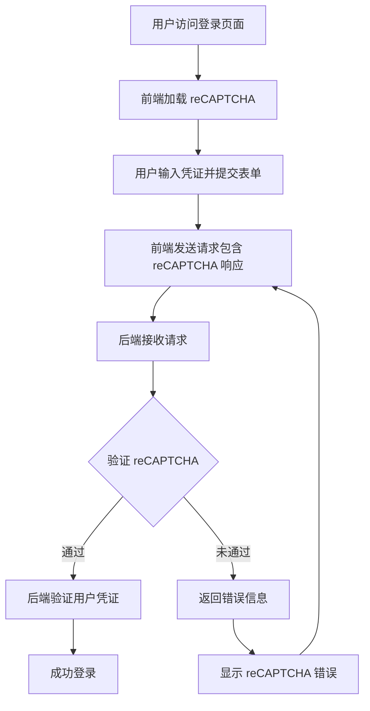
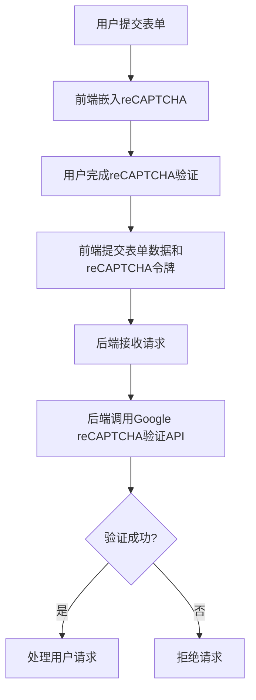
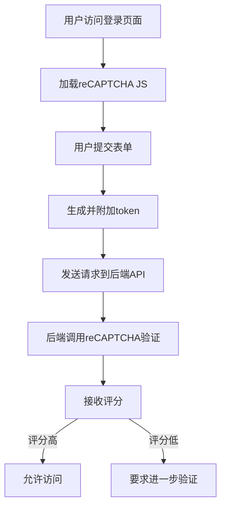

Google Recaptcha 是一种用于网站的安全机制，主要有以下作用和功能：

1. **防止自动化攻击**：它可以检测和阻止机器人或自动化程序对网站进行恶意操作，如表单提交、投票等。
2. **用户身份验证**：帮助确认用户是真实的人类，而不是自动化工具。
3. **保护网站免受垃圾信息**：减少垃圾邮件、恶意软件和其他不良内容在网站上的出现。
4. **增强用户信任**：让用户知道网站采取了措施来保护他们的信息和安全，增加用户对网站的信任。

Recaptcha 通常以两种形式出现：

1. **reCAPTCHA v2**：简单的复选框形式，用户需要证明他们是人类。
2. **reCAPTCHA v3**：更先进的隐形模式，它在用户不知情的情况下进行验证，不会干扰用户体验。

当用户访问包含 Recaptcha 的页面时，Google 的服务器会分析用户的行为和交互，以确定其是否为人类。如果被判定为人类，用户可以继续正常访问网站；如果被判定为机器人或自动化程序，可能会被要求完成额外的验证步骤或被阻止访问。

总的来说，Google Recaptcha 有助于保护网站和用户的安全，减少恶意活动和欺诈行为的发生。


要将 reCAPTCHA 与在 Google GCP 平台上结合 GKE 部署的 API 结合起来，可以考虑以下步骤：

1. **获取 reCAPTCHA 密钥**：首先，你需要在 Google reCAPTCHA 控制台创建一个项目，并获取相应的密钥（Site Key 和 Secret Key）。
2. **集成 reCAPTCHA 到前端**：将 reCAPTCHA 脚本集成到你的 API 前端应用中。你可以使用官方的 reCAPTCHA JavaScript 库来实现。在用户交互页面上显示 reCAPTCHA 小部件，并确保在用户提交表单或执行敏感操作之前进行验证。
3. **在后端验证 reCAPTCHA 响应**：当用户完成 reCAPTCHA 验证后，将响应发送到你的 API 后端。后端应用需要使用 Secret Key 来验证 reCAPTCHA 响应的有效性。如果验证成功，你可以继续处理用户的请求；如果验证失败，你可以采取适当的措施，如要求用户重新验证或拒绝请求。
4. **处理错误情况**：在集成过程中，确保处理可能出现的错误情况，如网络问题、reCAPTCHA 验证失败等。提供清晰的错误消息给用户，并记录相关的错误信息以便进行故障排除和监控。

典型的应用场景包括但不限于以下几个方面：

1. **保护用户注册和登录**：确保只有真实用户能够注册和登录到你的 API 服务。
2. **防止恶意表单提交**：防止用户提交虚假或恶意的表单数据，如评论、订单等。
3. **保护敏感操作**：例如，在进行资金交易、修改用户信息等敏感操作时，要求用户进行 reCAPTCHA 验证。
4. **防止机器人攻击**：减少机器人对 API 的滥用和攻击，保护你的服务的可用性和安全性。

通过将 reCAPTCHA 与你的 API 结合起来，你可以增加一层额外的安全防护，提高用户体验，并保护你的应用免受恶意行为的影响。
以下是一个简单的 Mermaid 流程图，展示将 reCAPTCHA 与 API 结合的过程。这幅图简要说明了用户操作和 API 验证的步骤。

流程图解释

1. 用户访问登录页面：用户打开包含登录表单的页面。
2. 前端加载 reCAPTCHA：页面中加载 reCAPTCHA 小部件，供用户识别。
3. 用户输入凭证并提交表单：用户输入用户名和密码，提交表单。
4. 前端发送请求包含 reCAPTCHA 响应：表单提交的请求中包含 reCAPTCHA 的响应信息。
5. 后端接收请求：后端接受到用户的请求。
6. 验证 reCAPTCHA：后端验证 reCAPTCHA 响应是否有效。
7. 通过：如果验证通过，后端进行用户凭证的验证。
8. 未通过：如果验证未通过，返回错误信息给前端。
9. 成功登录：如果用户凭证验证通过，用户成功登录。
10. 显示 reCAPTCHA 错误：如果 reCAPTCHA 验证失败，则显示错误提示。

这个流程图清晰地展示了在 API 登录过程中，reCAPTCHA 的集成和作用。


请注意，具体的实现细节可能会因你的技术栈和 API 架构而有所不同。你可能需要根据你的实际情况进行适当的调整和扩展。此外，确保遵守 Google reCAPTCHA 的使用条款和规定，并妥善处理用户数据的隐私和安全。


将 reCAPTCHA 与部署在 Google Kubernetes Engine (GKE) 上的 API 结合起来，可以增强应用的安全性，防止自动化的滥用。reCAPTCHA 是 Google 提供的一项服务，用户需要通过一些验证步骤来证明自己是人类，而不是机器人。以下是如何在 GKE 中使用 reCAPTCHA 的方法及典型应用场景。

使用 reCAPTCHA 的步骤

1. 注册 reCAPTCHA：
	• 访问 Google reCAPTCHA 官方网站。
	• 注册您的网站并获得 site key 和 secret key。
2. 前端集成：
	• 在你的前端代码中（如 React、Angular 或原生 HTML），通过在页面中添加 reCAPTCHA 的 JavaScript API 来加载 reCAPTCHA。
	• 将 site key 嵌入到适当的位置：
```js
<script src="https://www.google.com/recaptcha/api.js" async defer></script>
<form action="/your-api-endpoint" method="POST">
  <div class="g-recaptcha" data-sitekey="your_site_key"></div>
  <button type="submit">Submit</button>
</form>
```
3. 后端验证：
	• 在你的 Java API 中（Spring Boot 或其他框架），在处理表单提交时，验证用户的 reCAPTCHA 响应。在接收到的 POST 请求中，你将获取一个名为 g-recaptcha-response 的字段。
	• 使用 secret key 通过 Google 的 API 验证这个响应：
```java
import org.springframework.web.client.RestTemplate;
import org.springframework.web.util.UriComponentsBuilder;

// 验证 reCAPTCHA 的方法
public boolean verifyRecaptcha(String response) {
    String secretKey = "your_secret_key";
    String url = "https://www.google.com/recaptcha/api/siteverify";

    RestTemplate restTemplate = new RestTemplate();
    String verifyUrl = UriComponentsBuilder.fromHttpUrl(url)
            .queryParam("secret", secretKey)
            .queryParam("response", response)
            .toUriString();

    String result = restTemplate.getForObject(verifyUrl, String.class);
    // 解析 JSON 结果以检查是否通过验证
    // 这里使用 JSON 解析库（如 Jackson 或 Gson）来检查 result 内容
    return result.contains("\"success\": true");
}
```

典型应用场景

1. 表单提交：在任何需要用户提交数据的表单中加入 reCAPTCHA，比如注册、登录、评论等，以防止恶意脚本提交。
2. API 保护：对于一些重要的 API 请求，比如发送电子邮件、创建账户等，添加 reCAPTCHA 以确保请求是来自人类用户。
3. 防止暴力攻击：在 API 中实施 reCAPTCHA，以限制请求的频率。比如在尝试登录的时候，只有人类用户可以通过验证，从而减少密码猜测的风险。
4. 支付或敏感操作：在涉及支付或其他重要操作（例如设置密码、修改账户信息）时实施 reCAPTCHA，以增加安全性。

注意

• 用户体验：在集成 reCAPTCHA 的时候，务必考虑其对用户体验的影响。尽量让 reCAPTCHA 的验证过程尽可能平滑。
• 性能：确保对 reCAPTCHA 的验证（尤其是在高流量时段）不会拖慢用户请求的响应速度。

通过以上步骤，您可以有效地将 reCAPTCHA 集成到 GKE 上运行的 Java API 中，为你的产品增加一层安全保障。


# effect

增加 reCAPTCHA 确实会在用户登录过程中引入一个手动验证的步骤，这对于一些自动化调用 API 的场景可能会带来一些影响。以下是关于这一点的详细解释与应对策略：

对自动化调用 API 的影响

1. 手动验证阻碍自动化：
	• 当用户需要手动完成 reCAPTCHA 验证时，自动化脚本或机器人将无法绕过这一验证步骤，因此会导致无法正常调用 API。
2. API 测试与集成：
	• 在开发和测试自动化流程时，如果依赖于 reCAPTCHA，自动化测试工具可能会因为无法与 reCAPTCHA 交互而失败，这会影响到测试的稳定性和可靠性。

应对策略

1. 适用场景选择：
	• 只在关键的操作场景下使用 reCAPTCHA，例如注册、登录、敏感操作等，而对于大多数正常的 API 调用，可以不强制使用 reCAPTCHA，这样可以避免自动化调用受到影响。
2. 使用 CAPTCHA 的时机：
	• 根据用户的行为判断是否需要触发 reCAPTCHA，例如用户在短时间内进行了多次失败的登录尝试或者请求速度过快时才显示 reCAPTCHA。
	• 这种方法可以减少对正常用户的干扰，同时有效地阻止恶意的自动化攻击。
3. 服务账户与 OAuth：
	• 对于需要进行自动化调用的服务（如后台服务、CI/CD 流程等），可以通过使用 Google 的 OAuth 2.0 或服务账户认证的方式，而不需要用户手动验证。这将允许统计程序或服务顺利调用 API，而不需要 reCAPTCHA 验证。
4. 降级处理：
	• 若 reCAPTCHA 验证失败，可以设计系统以降级并允许 API 调用（如临时限制某些功能），同时记录未通过验证的请求以便后续审查。
5. 可选验证：
	• 对于某些 API，可以选择在系统检测到来自未身份验证用户或是异常行为时再实施 reCAPTCHA，而不是在所有请求中都强制执行。

总结

尽管添加 reCAPTCHA 增加了安全性，但在自动化调用和用户体验之间要找到一个平衡。通过选择合适的场景、时机和用户认证策略，可以减小对自动化调用 API 的影响，同时保持安全性。通过设计良好的验证策略，能够有效防止恶意行为，同时让合法用户和自动化服务顺利运作。


# Q 
关于Google的recaptcha 我想知道其作用和功能是什么?帮我简单介绍下?是在用户登陆的时候做验证的东西?是吗?如果我们是在Google的GCP平台结合GKE 部署一些API的话,也就是GKE里面运行的都是一些API,那么我们如何将reCAPTACHE和我们的产品结合起来?或者说怎么使用起来,这个典型的应用场景有哪些?我后端的API多数都是Java的应用,比如一些特殊的场景call google api in Java application .如果增加reCAPTCHA的话,那么看来用户的登录过程中肯定会涉及到一个手动验证的过程?这个对一些自动化调用API的场景是不是有一些影响了?简单的mermaid流程图，展示将 reCAPTCHA 与 API 结合的大致流程


# A felo 
Google的reCAPTCHA是一种用于区分人类用户和自动化程序（如机器人）的安全工具，主要用于防止垃圾邮件和滥用行为。它通过要求用户完成某些任务（如点击复选框或识别图像）来验证其身份。reCAPTCHA的主要版本包括reCAPTCHA v2和reCAPTCHA v3，其中v3在后台运行，不需要用户交互，而是基于用户行为评分来判断其是否为机器人[1][2][3]。

reCAPTCHA的作用和功能

防止垃圾邮件和滥用：通过验证用户身份，防止自动化程序进行恶意操作。
增强安全性：保护网站和API免受恶意攻击，如凭据填充和批量账号创建。
用户友好：尽量减少对用户的干扰，特别是reCAPTCHA v3，几乎不需要用户交互[2][4][5]。

典型应用场景

用户登录和注册：在用户登录或注册时进行验证，确保操作由人类完成。
表单提交：防止自动化程序提交垃圾信息。
在线支付和交易：保护支付系统免受欺诈性交易的影响[4][5][6]。

在GCP平台结合GKE部署reCAPTCHA

如果你在Google Cloud Platform（GCP）上使用Google Kubernetes Engine（GKE）来运行API，可以通过以下步骤将reCAPTCHA与API结合：

获取API密钥：在Google reCAPTCHA管理控制台中注册你的站点，获取站点密钥和秘密密钥。
前端集成：在前端页面中嵌入reCAPTCHA验证组件，通常是在用户登录或提交表单时。
后端验证：在后端API中，通过调用Google reCAPTCHA的验证API来验证用户提交的令牌。

具体步骤

注册reCAPTCHA：

登录Google reCAPTCHA管理控制台，注册你的站点，获取站点密钥和秘密密钥。


前端集成：
```html
<script src="https://www.google.com/recaptcha/api.js" async defer></script>
<form action="?" method="POST">
  <div class="g-recaptcha" data-sitekey="你的站点密钥"></div>
  <br/>
  <input type="submit" value="Submit">
</form>
```

后端验证（Java示例）：
```java
import java.io.*;
import java.net.*;
import javax.json.*;

public class VerifyRecaptcha {
    public static final String SITE_VERIFY_URL = "https://www.google.com/recaptcha/api/siteverify";
    private static final String SECRET_KEY = "你的秘密密钥";

    public static boolean verify(String gRecaptchaResponse) throws IOException {
        if (gRecaptchaResponse == null || gRecaptchaResponse.isEmpty()) {
            return false;
        }

        URL verifyUrl = new URL(SITE_VERIFY_URL);
        HttpURLConnection conn = (HttpURLConnection) verifyUrl.openConnection();
        conn.setRequestMethod("POST");
        conn.setRequestProperty("Content-Type", "application/x-www-form-urlencoded");
        conn.setDoOutput(true);

        String postParams = "secret=" + SECRET_KEY + "&response=" + gRecaptchaResponse;
        OutputStream outStream = conn.getOutputStream();
        outStream.write(postParams.getBytes());

        InputStream is = conn.getInputStream();
        JsonReader jsonReader = Json.createReader(is);
        JsonObject jsonObject = jsonReader.readObject();
        jsonReader.close();

        return jsonObject.getBoolean("success");
    }
}
```
Mermaid流程图

自动化调用API的影响

在涉及自动化调用API的场景中，reCAPTCHA可能会带来一些挑战，因为它通常需要用户交互来完成验证。然而，reCAPTCHA v3通过评分机制在后台运行，可以减少对自动化流程的干扰，但仍需根据评分结果采取适当的措施[3][4][5]。

通过上述步骤和示例代码，你可以将reCAPTCHA与GKE中的API结合起来，增强系统的安全性，同时尽量减少对用户体验的影响。


# perplexity
Google的reCAPTCHA是一种防止自动化程序（如机器人）滥用在线服务的验证机制。其主要功能是通过分析用户的行为来判断其是否为真人，从而保护网站免受恶意攻击。reCAPTCHA的最新版本（v3）不再要求用户进行繁琐的验证操作，而是通过后台算法给用户打分，分数范围从0到1，分数越高表示越可能是真人[1][2][4]。

## reCAPTCHA的作用和功能

1. **防止滥用**：reCAPTCHA主要用于防止自动化程序发送垃圾信息、注册虚假账户等行为。
   
2. **用户体验**：与传统的CAPTCHA相比，reCAPTCHA v3通过用户的行为分析来判断其身份，减少了用户的操作负担，提升了使用体验。

3. **评分机制**：在用户登录或提交表单时，系统会向reCAPTCHA发送请求，获取一个评分。如果评分高于设定阈值（如0.8），则认为是真人；如果低于0.5，则可能是机器人[1][3][4]。

## 在GKE中结合reCAPTCHA

当在Google Cloud Platform (GCP)的GKE（Google Kubernetes Engine）上部署API时，可以通过以下步骤将reCAPTCHA集成到产品中：

1. **获取API密钥**：首先需要在Google reCAPTCHA官网上注册并获取前端和后端的API密钥。

2. **前端集成**：
   - 在用户登录页面引入reCAPTCHA的JavaScript库。
   - 在用户提交表单时，生成并附加reCAPTCHA的token。

3. **后端验证**：
   - 在后端API中接收用户提交的token。
   - 使用后端API调用reCAPTCHA的验证接口，传递token以获取评分。

4. **处理响应**：根据评分决定是否允许用户继续操作。如果评分低于设定值，可以要求用户进行进一步验证或拒绝请求。

## 影响与应用场景

在涉及自动化调用API的场景中，reCAPTCHA可能会影响用户体验，因为它要求用户进行手动验证。这对于需要频繁调用API的应用（如自动化脚本或机器人）来说，可能会造成障碍。因此，在设计时可以考虑以下策略：

- **使用服务账户**：对于自动化调用，可以使用Google服务账户来避免reCAPTCHA的干扰。
- **灵活配置**：根据用户的行为和评分动态调整reCAPTCHA的使用，只有在怀疑用户为机器人的情况下才进行验证。

## 流程图示例

以下是一个简单的mermaid流程图，展示了将reCAPTCHA与API结合的基本流程：



通过上述流程，可以有效地将reCAPTCHA集成到GKE上运行的API中，确保安全性与用户体验之间的平衡。

Citations:
[1] https://w3c.hexschool.com/blog/36216975
[2] https://www.ithome.com.tw/news/92757
[3] https://tech-blog.cymetrics.io/posts/nick/google-recaptcha/
[4] https://cola.workxplay.net/what-is-google-recaptcha/
[5] https://make9.tw/wordpress/teaching/hide-google-recaptcha-v3-notice/
[6] https://blog.shopline.tw/information-security-google-recaptcha/
[7] https://support.google.com/a/answer/1217728?hl=zh-Hant
[8] https://kamadiam.com/recaptcha-%E6%95%99%E5%AD%B8%EF%BC%8C%E8%AE%93-google-%E4%BF%9D%E8%AD%B7%E4%BD%A0%E7%9A%84%E7%B6%B2%E7%AB%99/

reCAPTCHA对自动化API调用的影响主要体现在以下几个方面：

1. **用户验证过程**：
   reCAPTCHA要求用户在登录或提交表单时进行验证，这通常涉及到生成和提交一个token。对于自动化API调用来说，这意味着每次请求都需要附带有效的token，这可能导致自动化脚本在调用API时需要额外的步骤来处理这些验证。

2. **影响自动化脚本**：
   如果API调用是由自动化脚本或机器人进行的，reCAPTCHA可能会阻止这些请求，因为它们无法通过人类验证。特别是在使用reCAPTCHA v2时，用户需要进行视觉验证，这对于完全自动化的场景来说是一个障碍。

3. **评分机制**：
   在reCAPTCHA v3中，系统会根据用户的行为生成一个评分（0到1），如果评分低于某个阈值（例如0.5），则可能被认为是机器人。这种评分机制可能会影响API的访问权限，特别是在需要频繁调用的场景中，可能会导致合法用户被误判为机器人。

4. **后端验证**：
   在后端，API需要向reCAPTCHA验证服务发送请求以确认token的有效性。这增加了额外的网络请求和处理时间，可能会影响API的响应速度和性能。

5. **应用场景**：
   reCAPTCHA通常用于防止滥用和恶意攻击，因此在需要保护的场景中（如用户注册、登录等）使用是合适的。然而，对于需要高频率调用的API（例如数据抓取或批量处理），可能需要考虑使用服务账户等方式来绕过reCAPTCHA的验证。

总之，reCAPTCHA虽然能有效防止自动化滥用，但在自动化API调用的场景中，可能会带来额外的复杂性和延迟，影响用户体验和系统性能[2][3][4]。

Citations:
[1] https://experienceleague.adobe.com/zh-hans/docs/experience-manager-65/content/forms/adaptive-forms-basic-authoring/captcha-adaptive-forms
[2] https://developers.google.com/recaptcha/docs/faq?hl=zh-cn
[3] https://w3c.hexschool.com/blog/36216975
[4] https://cola.workxplay.net/what-is-google-recaptcha/
[5] https://www.ithome.com.tw/news/92757
[6] https://make9.tw/wordpress/teaching/hide-google-recaptcha-v3-notice/
[7] https://tech-blog.cymetrics.io/posts/nick/google-recaptcha/
[8] https://blog.shopline.tw/information-security-google-recaptcha/


在 Google Cloud Platform (GCP) 中自动化生成 reCAPTCHA 密钥以及管理这些密钥，可以使用 Google Cloud Functions 和 Google Cloud Scheduler 等服务结合实现。以下是关于如何实现此功能的详细步骤和建议方案。

自动化生成 reCAPTCHA 密钥

1. 创建 Google Cloud 项目：
	• 登录到 GCP 控制台，创建一个新的项目（如果尚未存在）。
2. 启用 reCAPTCHA API：
	• 在 GCP 控制台中，导航到 “API 和服务” > “库” 并搜索 reCAPTCHA，然后启用该 API。
3. 获取 reCAPTCHA 密钥的脚本：
	• 使用 Google API 客户端库或者 REST API 来创建和管理 reCAPTCHA 密钥。下面是一个使用 Python 的示例，您需要安装 google-auth 和 google-api-python-client：

from google.oauth2 import service_account
from googleapiclient.discovery import build

# 用您的服务账户密钥文件路径替换
SERVICE_ACCOUNT_FILE = 'path/to/service_account.json'
SCOPES = ['https://www.googleapis.com/auth/cloud-platform']

# 创建凭据和 Google API 客户端
credentials = service_account.Credentials.from_service_account_file(SERVICE_ACCOUNT_FILE, scopes=SCOPES)
service = build('recaptchaenterprise', 'v1', credentials=credentials)

# 创建 reCAPTCHA 密钥
def create_recaptcha_key(project_id):
    key_request = {
        'displayName': 'My reCAPTCHA Key',
        'webSettings': {
            'allowedDomains': ['yourdomain.com'],  # 替换为您的域名
        },
    }
    response = service.projects().keys().create(parent=f'projects/{project_id}', body=key_request).execute()
    return response['name'], response['secretKey']

# 调用函数
project_id = 'your_project_id'  # 替换为您的项目ID
key_name, secret_key = create_recaptcha_key(project_id)
print(f'Key Name: {key_name}, Secret Key: {secret_key}')

4. 创建 Google Cloud Function：
	• 将上述 Python 脚本放入 Google Cloud Function 中，确保其设置为 HTTP 触发器，并且具有适当的 IAM 权限（如 recaptchaenterprise.keys.create权限）。

管理 reCAPTCHA 密钥

1. 存储和管理密钥：
	• 您可以将生成的密钥存储在 Google Cloud Secret Manager 中，以确保其安全性和易于访问。

echo -n "YOUR_SECRET_KEY" | gcloud secrets create reCAPTCHA-secret --data-file=-

2. 定期轮换密钥：
	• 通过 Google Cloud Scheduler 创建定期触发的任务，调用刚才部署的 Cloud Function 以生成新的密钥。
	• 您可以设置每天或每周轮换一次密钥。
3. 日志和监控：
	• 在 Cloud Function 和 Scheduler 中配置监控和日志记录，以便跟踪密钥的生成和使用等。

最佳时间方案

• 密钥生成的频率：建议每 30 天或每 60 天轮换一次 reCAPTCHA 密钥。频繁更换可能会导致系统复杂度和管理成本增加。
• 调度：使用 Google Cloud Scheduler 来安排 Cloud Function 的触发，可以依据您的具体需求设置时间间隔（如每天、每周等）。
• 过期检查：在存储密钥时，考虑附加过期策略，确保失效的密钥不会被使用。

总结

通过结合 Google Cloud Function、Google Cloud Scheduler 和 Secret Manager，您可以实现一个自动化机制来生成、管理和轮换 reCAPTCHA 密钥。如果有关于具体实现的更多问题或进一步的需求，请继续询问！
