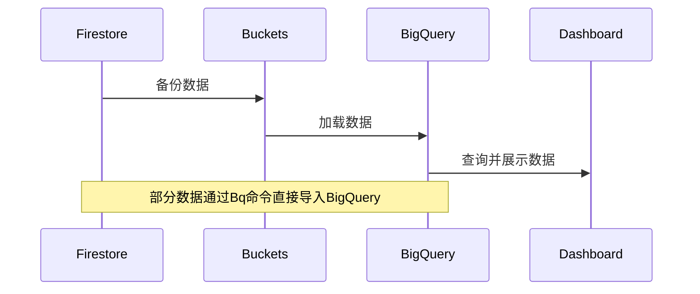

以下是对应的Mermaid代码：

```mermaid
sequenceDiagram
    participant Firestore
    participant Buckets
    participant BigQuery
    participant Dashboard

    Firestore ->> Buckets: 备份数据
    Buckets ->> BigQuery: 加载数据
    BigQuery ->> Dashboard: 查询并展示数据

    note over Firestore, BigQuery: 部分数据通过Bq命令直接导入BigQuery
```
