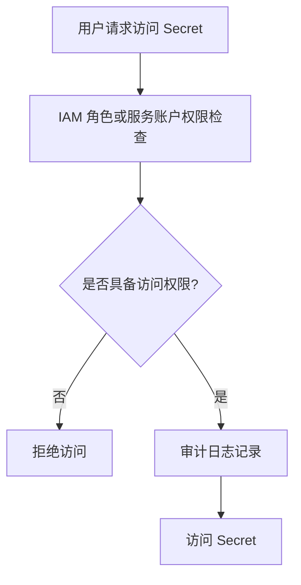

在GCP中使用gcloud secrets可以方便地管理和存储敏感信息，比如账户密码、API密钥等。以下是一些常用的用法和应用场景：

1. **创建和管理密钥**：使用gcloud命令行工具可以轻松地创建和管理密钥。例如，使用`gcloud secrets create`命令创建一个新的密钥，然后使用`gcloud secrets versions add`命令添加版本。

2. **访问控制**：可以通过IAM角色和权限来控制谁可以访问和管理密钥。这样可以确保只有授权的用户才能访问敏感信息。

3. **在应用程序中使用**：可以通过gcloud命令行或Cloud SDK在应用程序中访问密钥。这样可以轻松地在应用程序中使用敏感信息，而无需将其硬编码到代码中。

4. **密钥轮换**：定期更改密钥是一种安全最佳实践。使用gcloud secrets可以轻松地轮换密钥，并确保应用程序能够无缝继续运行。

5. **集成CI/CD流程**：可以在CI/CD流程中使用gcloud secrets来获取应用程序所需的敏感信息。这样可以确保在部署过程中敏感信息不会暴露在外。

6. **存储其他敏感数据**：除了账户密码，还可以存储其他类型的敏感数据，如TLS证书、OAuth令牌等。

总的来说，使用gcloud secrets可以帮助您更安全地管理和存储敏感信息，并确保您的应用程序和系统的安全性。


在GCP (Google Cloud Platform) 中，使用 Secret Manager 来管理和控制对敏感信息的访问是一个常见的需求。你可以通过配置 IAM（Identity and Access Management）策略，在 Secret Level 给不同的用户或服务账户分配不同的权限。下面是一个实现步骤和示例：

### 实现步骤

1. **创建一个 Secret**:
   你可以使用 GCP 控制台、`gcloud` 命令行工具或 GCP API 来创建一个新的 Secret。

   ```sh
   gcloud secrets create my-secret --replication-policy="automatic"
   ```

2. **添加 Secret 版本**:
   添加一个新的版本到 Secret 中。

   ```sh
   echo -n "my-secret-value" | gcloud secrets versions add my-secret --data-file=-
   ```

3. **设置 IAM 权限**:
   使用 `gcloud` 命令行工具为不同的用户或服务账户设置 IAM 权限。你可以在 Secret Level 设置以下几种权限：
   - `roles/secretmanager.viewer`: 允许读取 Secret。
   - `roles/secretmanager.secretAccessor`: 允许访问 Secret 的内容。
   - `roles/secretmanager.secretVersionManager`: 允许管理 Secret 版本。

   ```sh
   # 给用户 user1@example.com 授予读取 secret 的权限
   gcloud secrets add-iam-policy-binding my-secret \
       --member="user:user1@example.com" \
       --role="roles/secretmanager.viewer"
   
   # 给用户 user2@example.com 授予访问 secret 内容的权限
   gcloud secrets add-iam-policy-binding my-secret \
       --member="user:user2@example.com" \
       --role="roles/secretmanager.secretAccessor"
   
   # 给服务账户 service-account@example-project.iam.gserviceaccount.com 授予管理 secret 版本的权限
   gcloud secrets add-iam-policy-binding my-secret \
       --member="serviceAccount:service-account@example-project.iam.gserviceaccount.com" \
       --role="roles/secretmanager.secretVersionManager"
   ```

### 示例: Terraform 配置

如果你使用 Terraform 来管理 GCP 资源，可以使用以下配置来实现相同的目标：

```hcl
resource "google_secret_manager_secret" "my_secret" {
  secret_id = "my-secret"
  replication {
    automatic = true
  }
}

resource "google_secret_manager_secret_version" "my_secret_version" {
  secret      = google_secret_manager_secret.my_secret.id
  secret_data = "my-secret-value"
}

resource "google_secret_manager_secret_iam_binding" "viewer_binding" {
  secret_id = google_secret_manager_secret.my_secret.id
  role      = "roles/secretmanager.viewer"
  members   = [
    "user:user1@example.com",
  ]
}

resource "google_secret_manager_secret_iam_binding" "accessor_binding" {
  secret_id = google_secret_manager_secret.my_secret.id
  role      = "roles/secretmanager.secretAccessor"
  members   = [
    "user:user2@example.com",
  ]
}

resource "google_secret_manager_secret_iam_binding" "version_manager_binding" {
  secret_id = google_secret_manager_secret.my_secret.id
  role      = "roles/secretmanager.secretVersionManager"
  members   = [
    "serviceAccount:service-account@example-project.iam.gserviceaccount.com",
  ]
}
```

### 总结

通过上述步骤和示例配置，你可以在 GCP Secret Manager 中对不同的用户和服务账户分配不同的权限，从而实现精细化的权限管理。你可以根据具体需求调整 IAM 权限，确保敏感信息的安全和合规。


在 GCP Secret Manager 中，你可以通过使用 IAM 条件来实现更精细化的权限控制。IAM 条件允许你基于特定的条件（如邮箱地址的模式匹配）来授予权限。这样，你可以在组内成员的基础上添加额外的限制，确保只有特定的用户才能访问特定的 Secret。


# summary 
我们现在有这样一个需求,我们给每个用户不同的Secret不同的权限,是直接可以通过gcloud secrets add-iam-policy-binding可以实现了.我们现在有这样一个问题,我们不想基于用户去控制,这样操作起来比较复杂.我们想通过GROUP来实现.但是GROUP里面又有这样一个问题.组内的成员都会有相同的权限,而且能够彼此修改密码.那么我们能否通过condition去做一些更精细化的控制?比如组内的某些邮箱结尾的用户才可以拿到对应的权限?


### 实现步骤

1. **创建 Secret**:
   这个步骤与之前相同，你可以创建你的 Secret。

2. **使用 IAM 条件设置权限**:
   使用 `gcloud` 命令行工具，基于条件给组中的某些用户设置权限。以下是一个示例，展示了如何基于邮箱结尾设置条件权限：

### 示例: 使用 IAM 条件

假设你有一个组 `group@example.com`，你想给组内邮箱结尾为 `@example.com` 的用户访问权限。

```sh
gcloud secrets add-iam-policy-binding my-secret \
    --role="roles/secretmanager.secretAccessor" \
    --member="group:group@example.com" \
    --condition="title=EmailCondition,expression=regex.matches(request.auth.claims.email, '.*@example.com$')"
```

### 详细说明

- `title=EmailCondition`：这是条件的标题，方便描述和管理。
- `expression=regex.matches(request.auth.claims.email, '.*@example.com$')`：这是条件表达式，使用正则表达式匹配邮箱结尾。`request.auth.claims.email` 是被请求者的邮箱。

### IAM 条件的语法

GCP IAM 条件的表达式语法基于 CEL（Common Expression Language）。以下是一些常见的表达式示例：

- **匹配特定域名**：
  ```plaintext
  request.auth.claims.email.matches('.*@example.com$')
  ```

- **排除特定用户**：
  ```plaintext
  request.auth.claims.email != 'user@example.com'
  ```

- **匹配多个条件**：
  ```plaintext
  request.auth.claims.email.matches('.*@example.com$') && request.time < timestamp('2025-01-01T00:00:00Z')
  ```

### 示例: 完整的 Terraform 配置

如果你使用 Terraform，可以使用以下配置来实现相同的目标：

```hcl
resource "google_secret_manager_secret" "my_secret" {
  secret_id = "my-secret"
  replication {
    automatic = true
  }
}

resource "google_secret_manager_secret_version" "my_secret_version" {
  secret      = google_secret_manager_secret.my_secret.id
  secret_data = "my-secret-value"
}

resource "google_secret_manager_secret_iam_member" "conditioned_binding" {
  secret_id = google_secret_manager_secret.my_secret.id
  role      = "roles/secretmanager.secretAccessor"
  member    = "group:group@example.com"

  condition {
    title       = "EmailCondition"
    description = "Only users with @example.com email can access"
    expression  = "request.auth.claims.email.matches('.*@example.com$')"
  }
}
```

### 总结

通过使用 IAM 条件，你可以在 GCP Secret Manager 中实现更精细化的权限控制，确保组内只有符合特定条件的用户可以访问 Secret。这样，你可以避免直接基于用户的权限管理，简化操作复杂度，并确保安全性。


## Using Conditions for Fine-grained Access Control with GCP Secret Manager and IAM

While granting permissions based on individual users can be effective for granular control, managing permissions at the group level can simplify administration. However, assigning identical permissions to all group members may not always align with your access control requirements.

To address this challenge, you can leverage IAM conditions to implement more refined access control within groups. Conditions allow you to specify criteria that must be met for a member to exercise a particular role. In your case, you can utilize conditions to restrict access to specific secrets based on email address endings within a group.

**Implementation Steps:**

1. **Create a Custom Role:**
   Define a custom IAM role that grants the desired access permissions for the specific secret you want to control. This role will be assigned to group members who meet the condition.

2. **Create an IAM Policy with Conditions:**
   Create an IAM policy for the secret using `gcloud secrets iam policy add-member` command. In this policy, specify the group as the member and define the condition that determines which group members can access the secret.

3. **Define the Condition:**
   Within the condition, use the `usergroup()` function to check the group membership of the user. Additionally, use a regular expression to match the email address ending of the user. For instance, to grant access to users with email addresses ending in "@example.com," you would use the following condition:

   ```json
   "condition": {
     "allOf": [
       { "usergroup": "groups/your-group-id" },
       { "iam": {
           "claims": {
             "email": {
               "endsWith": "@example.com"
             }
           }
         }
       }
     ]
   }
   ```

4. **Assign the Custom Role:**
   Bind the custom role you created earlier to the condition using `gcloud secrets iam policy add-binding` command. This ensures that only group members meeting the condition can exercise the granted permissions.

**Example:**

```
gcloud secrets iam policy add-binding my-secret \
  --member="group:groups/your-group-id" \
  --role="roles/your-custom-role" \
  --condition="condition:allOf([usergroup('groups/your-group-id'), iam('claims', {'email': {'endsWith': '@example.com'}})])]"
```

**Benefits of Using Conditions:**

* **Fine-grained Access Control:** Conditions enable precise control over who can access specific secrets within a group, preventing unauthorized access.

* **Simplified Group Management:** By managing permissions at the group level with conditions, you reduce the overhead of assigning individual permissions to each group member.

* **Enhanced Security:** Conditions strengthen security by ensuring that only authorized users with specific email address endings can access sensitive information.

**Additional Considerations:**

* **Regular Condition Review:** Periodically review the conditions to ensure they align with your evolving access control requirements.

* **Documentation and Communication:** Clearly document the conditions and their purpose to avoid confusion and facilitate understanding among stakeholders.

* **Testing and Validation:** Thoroughly test the conditions and access control setup to ensure they function as intended and prevent unintended access.

By implementing conditions with IAM policies, you can effectively manage access to secrets within groups while maintaining granular control based on specific user attributes like email address endings. This approach simplifies administration and enhances security for your sensitive data.


在Google Cloud Platform (GCP)中，利用Secret Manager结合条件策略（Condition）和IAM（Identity and Access Management）功能，可以实现更细粒度的权限控制。通过IAM条件（IAM Conditions），你可以基于特定条件（如用户邮箱的域名）为组成员分配不同的权限。

### 通过组和条件的精细化控制：
1. **创建一个组**：确保你在GCP中建立了一个组（例如`developers@example.com`）。
2. **添加IAM条件策略（Condition Policy）**：利用条件策略来限制权限，例如，只允许来自特定域名的成员访问某些Secret。

### 以下是具体步骤：

#### 步骤1：创建并管理Google组

在Google Workspace中创建和管理你的组，例如`developers@example.com`组，成员包括不同权限需求的用户。

#### 步骤2：将组添加到Secret Manager的IAM策略中

你可以使用`gcloud`命令行工具来为Secret添加IAM条件策略。例如，以下命令添加一个条件，仅允许组内的指定邮件域名用户查看Secret。

```bash
gcloud secrets add-iam-policy-binding your-secret-name \
  --member="group:developers@example.com" \
  --role="roles/secretmanager.secretAccessor" \
  --condition=expression="request.auth.claims.email.endsWith('engineer.example.com')",title="EngineerCondition",description="Allow only engineer@example.com domain"
```

#### 步骤3：进一步细化权限

为了进一步细化控制，你可以添加多个条件和不同的IAM策略。例如，为管理账号添加`Secret Admin`角色，条件仅允许特定邮箱域的用户：

```bash
gcloud secrets add-iam-policy-binding your-secret-name \
  --member="group:developers@example.com" \
  --role="roles/secretmanager.admin" \
  --condition=expression="request.auth.claims.email.endsWith('admin.example.com')",title="AdminCondition",description="Allow only admin@example.com domain"
```

### 示例操作和策略
1. **添加Secret**
   如果还没有Secret，可以使用以下命令创建一个：

   ```bash
   gcloud secrets create my-secret --replication-policy="automatic"
   ```

2. **设置和获取Secret值**
   设置Secret值（例如API密钥）：

   ```bash
   echo -n "api-key-value" | gcloud secrets versions add my-secret --data-file=-
   ```

3. **添加基于条件的IAM策略**
   将上述策略应用到你的Secret上：

   ```bash
   gcloud secrets add-iam-policy-binding my-secret \
     --member="group:developers@example.com" \
     --role="roles/secretmanager.secretAccessor" \
     --condition=expression="request.auth.claims.email.endsWith('engineer.example.com') OR request.auth.claims.email.endsWith('dev.example.com')",title="DeveloperAccess",description="Access for engineers and developers"
   ```

### IAM条件策略的编写
细化条件策略时，可以使用逻辑运算符（如`AND`、`OR`）和字符串函数（如`startswith()`和`endswith()`）来实现复杂条件：

```yaml
bindings:
- role: roles/secretmanager.secretAccessor
  members:
  - group:developers@example.com
  condition:
    title: "Domain-Based Access"
    description: "Allow access based on email domain"
    expression: "request.auth.claims.email.endsWith('engineer.example.com') OR request.auth.claims.email.endsWith('admin.example.com')"
```

### 最佳实践和安全考虑
1. **最小权限原则**：仅赋予最少、最需要的权限，以减少安全风险并确保最小权限原则。
2. **定期审计与管理**：定期检查IAM绑定和条件策略，确保权限合理和符合组织需求。
3. **角色分离**：使用不同的条件策略分离系统管理员、开发人员和普通用户的权限。
4. **文档与记录**：保持策略和权限甚至组成员的变更记录，以便于后续审计和管理。


# Q and A 
如何使用IAM条件策略为组内的成员分配不同的权限？
我如何在Secret Manager中创建一个组？
如何使用IAM条件策略限制特定域名用户对Secret的访问？

要为组内成员分配不同权限，并使用IAM条件策略限制特定域名的用户对Secret的访问，可以按照以下步骤操作：

### 步骤1：在Google Workspace或Cloud Identity中创建和管理组
在Google Workspace中创建和管理你的组，并添加成员。组的管理需要在Google Admin控制台中完成。

1. 登录到[Google Admin控制台](https://admin.google.com)。
2. 前往 `目录 > 群组`。
3. 点击 `创建群组`，并按照提示创建群组，例如`developers@example.com`。
4. 添加组成员。

### 步骤2：在Secret Manager中创建Secret
如果还没有创建Secret，可以先创建一个：

1. 转到[Google Cloud Console](https://console.cloud.google.com)。
2. 打开`Secret Manager`。
3. 点击 `Create secret`。
4. 输入`Secret ID`并添加初始化的Secret值（例如API密钥）。

或者使用`gcloud`命令：
```bash
gcloud secrets create my-secret --replication-policy="automatic"
echo -n "your-secret-value" | gcloud secrets versions add my-secret --data-file=-
```

### 步骤3：为组添加IAM条件策略并限制特定域名用户访问Secret
利用`gcloud`命令行工具为Secret添加IAM条件策略，这样可以基于组和特定条件（例如用户邮箱的域名）来控制访问权限。

#### 3.1 添加条件策略
以下是一个为组`developers@example.com`添加条件策略的示例，限制只有特定域名的用户才能访问这个Secret：

```bash
gcloud secrets add-iam-policy-binding my-secret \
  --member="group:developers@example.com" \
  --role="roles/secretmanager.secretAccessor" \
  --condition=expression="request.auth.claims.email.endsWith('@engineer.example.com')",title="EngineerAccess",description="Allow only @engineer.example.com domain"
```

### 解释：
- `--member="group:developers@example.com"`：指定组成员。
- `--role="roles/secretmanager.secretAccessor"`：指定角色且在这里分配了读取Secret的权限。
- `--condition`：定义具体条件，包括表达式、标题和描述。
  - `expression="request.auth.claims.email.endsWith('@engineer.example.com')"`：只允许那些邮箱以`@engineer.example.com`结尾的用户访问。
  - `title="EngineerAccess"`：条件策略的标题。
  - `description="Allow only @engineer.example.com domain"`：描述条件策略的用途。

#### 3.2 添加更多条件策略
你可以根据需要为不同组或子组添加更多的条件策略。例如添加管理员权限：

```bash
gcloud secrets add-iam-policy-binding my-secret \
  --member="group:developers@example.com" \
  --role="roles/secretmanager.admin" \
  --condition=expression="request.auth.claims.email.endsWith('@admin.example.com')",title="AdminAccess",description="Allow only @admin.example.com domain"
```

### 管理和验证IAM策略
1. **验证策略是否应用**：在GCP控制台的Secret Manager部分，查看IAM策略的绑定和条件部分，确保策略已经正确应用。
2. **测试权限**：尝试通过组内不同域名的用户账号访问Secret，验证是否符合预期的权限控制。

### 示例操作及总结

1. **添加Secret并设置条件策略**
   ```bash
   gcloud secrets create my-secret --replication-policy="automatic"
   echo -n "your-secret-value" | gcloud secrets versions add my-secret --data-file=-
   ```

2. **创建并管理组（Admin Console中完成）**

3. **设置IAM条件策略**
   ```bash
   gcloud secrets add-iam-policy-binding my-secret \
     --member="group:developers@example.com" \
     --role="roles/secretmanager.secretAccessor" \
     --condition=expression="request.auth.claims.email.endsWith('@engineer.example.com')",title="EngineerAccess",description="Allow only @engineer.example.com domain"
   ```

4. **监控与验证**
   - 通过GCP控制台或`gcloud`命令行工具查看和验证IAM策略的正确应用与效果。

这种方式通过IAM条件策略细化了组内部基于邮件域名的访问控制，确保更高的安全性和管理效率。如果在操作过程中有任何疑问或需要进一步的帮助，请随时提问。


# Claude
在GCP Secret Manager中,您可以通过一些技巧来实现基于组的精细化访问控制权限,具体步骤如下:

1. **创建不同的组**

首先,您需要在Google Cloud Identity中创建不同的组,每个组代表一种权限级别。例如,您可以创建`secret-admin`组、`secret-reader`组等。

2. **为每个组设置不同的IAM策略绑定**

接下来,您需要针对每个组设置不同的IAM策略绑定。例如:

```
gcloud secrets add-iam-policy-binding SECRET_NAME --member='group:secret-admin@example.com' --role='roles/secretmanager.admin'

gcloud secrets add-iam-policy-binding SECRET_NAME --member='group:secret-reader@example.com' --role='roles/secretmanager.viewer'
```

这样,`secret-admin`组将获得对密钥的管理权限,而`secret-reader`组将只有查看权限。

3. **使用条件约束实现精细化控制**

为了避免组内所有成员共享相同的权限,您可以使用条件约束来进一步限制权限。条件约束允许您根据属性(如电子邮件域)来控制访问权限。

例如,您可以创建一个条件,只允许`@example.com`域的用户访问密钥:

```
gcloud secrets add-iam-policy-binding SECRET_NAME --member='group:secret-admin@example.com' --role='roles/secretmanager.admin' --condition='resource.type=="secret" && resource.name=="projects/_/secrets/SECRET_NAME" && payload.matches("//iam.gserviceaccount.com/domains/example.com")'
```

上面的命令将为`secret-admin`组添加一个条件约束,要求只有`@example.com`域的用户才能访问该密钥。

您还可以使用其他条件,例如基于IP地址范围、时间范围等。具体的条件表达式语法可以参考[Google Cloud条件表达式文档](https://cloud.google.com/iam/docs/conditions-and-conditions-expressions)。

通过这种方式,您可以实现基于组的精细化访问控制权限,并避免组内成员共享相同的权限。需要注意的是,条件约束会增加一些复杂性,您需要根据实际情况权衡利弊。


理解了你的需求和问题。假如语法没有问题，但对应的权限不对，需要确保IAM角色和条件策略是正确的配置。我们来详细检查角色的设置，并确保条件策略确实能够准确限制到特定的域名用户。以下是优化与检查步骤：

### 确保IAM角色与权限正确

#### 确认你正在添加的角色
`roles/secretmanager.secretAccessor`角色应该用于读取Secret的权限。如果你需要其他权限，例如管理Secret，可以使用`roles/secretmanager.admin`或其他适当的角色。

### 确认IAM条件策略是否正确应用

#### 检查策略应用的具体步骤
1. **获取当前的IAM政策**：
   首先获取当前Secret的IAM策略，以便查看已有的绑定和条件：

   ```bash
   gcloud secrets get-iam-policy my-secret --format=json
   ```

2. **添加新的IAM条件策略**：
   确认策略添加是否成功（注意条件表达式的正确性）：
   
   ```bash
   gcloud secrets add-iam-policy-binding my-secret \
     --member="group:developers@example.com" \
     --role="roles/secretmanager.secretAccessor" \
     --condition=expression="request.auth.claims.email.endsWith('@engineer.example.com')",title="EngineerAccess",description="Allow only @engineer.example.com domain"
   ```

### 样例策略全面覆盖
确保你的策略全面且适当：

#### 完整的策略样例

```yaml
bindings:
- members:
  - group:developers@example.com
  role: roles/secretmanager.secretAccessor
  condition:
    title: "EngineerAccess"
    description: "Allow only @engineer.example.com domain"
    expression: "request.auth.claims.email.endsWith('@engineer.example.com')"
- members:
  - group:developers@example.com
  role: roles/secretmanager.admin
  condition:
    title: "AdminAccess"
    description: "Allow only @admin.example.com domain"
    expression: "request.auth.claims.email.endsWith('@admin.example.com')"
```

### 验证条件策略的效果
确保在应用策略后进行验证：

1. **通过一个具备该条件的用户账号（如`user@engineer.example.com`）测试读取权限**。

   ```bash
   gcloud secrets versions access latest --secret=my-secret --account=user@engineer.example.com
   ```

2. **确保不符合条件的用户无法访问**。使用一个不符合条件的用户账号（如`user@anotherdomain.com`）进行测试，验证用户无法访问该Secret。

   ```bash
   gcloud secrets versions access latest --secret=my-secret --account=user@anotherdomain.com
   ```

### 确保Cloud IAM条件完全支持
IAM条件是条件性情况下有效的部分策略。本地环境和策略编辑较为复杂时，可以使用IAM条件编辑器（条件生成器）来帮助生成条件。

### 使用IAM条件编辑器
在Google Cloud Console中：

1. **转到IAM & 管理 > IAM > 添加成员**。
2. **添加角色和条件**。在添加条件时，使用条件编辑器生成表达式内容。

### 条件表达式调试
使用条件生成器和IAM条件编辑器有助于避免语法错误和逻辑问题。在表达式中，确保`request.auth.claims.email`真正匹配。

最终，如果IAM条件策略和角色都正确，策略的落地和验证就会顺畅。如果上述方法未能解决具体问题，还可以尝试以下步骤：

1. **重新验证邮箱域是否正确**:
   确保邮箱后缀`@engineer.example.com`的格式和内容完全符合公司邮件系统和IAM条件策略的一致性。
  
2. **检验环境变量**:
   确认当前环境变量或服务账号确实具备测试的权限，如果是通过服务账号访问测试，请确保该服务账号包含在组的成员里。

如果仍然遇到问题，请提供更加详细的信息，有助于我为你提供进一步的帮助。


The question is asking whether it's possible to use conditions to achieve fine-grained access control when granting permissions to a group of users in Google Cloud Secret Manager, rather than controlling access based on individual users.

The answer is yes, you can use conditions to achieve this. The `gcloud secrets add-iam-policy-binding` command allows you to specify a condition using the `--condition` flag or `--condition-from-file` flag.

For example, you can create a condition that grants access to users with a specific email domain or suffix. Here's an example:
```
gcloud secrets add-iam-policy-binding my-secret --member='group:my-group@example.com' --role='roles/secretmanager.secretAccessor' --condition='resource.name == "my-secret" && requester.email.endsWith("@example.com")'
```
This command grants the `secretAccessor` role to the `my-group@example.com` group, but only for users within that group who have an email address ending with `@example.com`.

You can also use more complex conditions using the `--condition-from-file` flag, which allows you to specify a YAML file containing the condition.

By using conditions, you can achieve fine-grained access control and avoid granting unnecessary permissions to users within a group.


您遇到的问题是使用 Google Cloud Secret Manager 的分组管理权限时，如何实现更精细的控制，特别是针对组内成员的权限差异。您希望能够根据成员的邮箱地址后缀来分配不同的权限，而不是所有组员都拥有相同的权限。

**答案是：是的，您可以使用条件（Condition）来实现更精细的权限控制。**

**具体步骤如下：**

1. **创建 Secret：** 首先，您需要在 Google Cloud Secret Manager 中创建一个 Secret。
2. **创建 IAM 角色：**  创建两个 IAM 角色，分别代表您想要分配的两种权限级别：
    * **`secret-reader`:**  只能读取 Secret 的角色。
    * **`secret-writer`:**  可以读取和修改 Secret 的角色。
3. **创建 IAM 组：** 创建一个 IAM 组，例如 `secret-access-group`。
4. **创建 IAM 绑定：**  使用 `gcloud secrets add-iam-policy-binding` 命令将 IAM 组绑定到 Secret，并使用条件来限制权限。

**示例命令：**

```bash
# 为组成员的邮箱后缀为 @example.com 的用户分配读取权限
gcloud secrets add-iam-policy-binding \
  secrets/your-project-id/your-secret-name \
  --member="group:secret-access-group" \
  --role="roles/secretmanager.secretAccessor" \
  --condition="expression='resource.name.endsWith(\"@example.com\")'"
```

**解释：**

* `--member="group:secret-access-group"`：将 IAM 绑定到 `secret-access-group` 组。
* `--role="roles/secretmanager.secretAccessor"`：为组成员分配 `secret-reader` 角色，即读取权限。
* `--condition="expression='resource.name.endsWith(\"@example.com\")'"`：使用条件表达式来限制权限，只有邮箱地址后缀为 `@example.com` 的组成员才能获得读取权限。

**其他注意事项：**

* 条件表达式可以使用任何有效的 Cloud IAM 表达式语法。
* 您需要为不同的权限级别创建不同的 IAM 角色，并使用不同的条件表达式来限制权限。
* 您可以使用 `gcloud secrets get-iam-policy` 命令来查看 Secret 的当前 IAM 策略。

**通过使用条件，您可以实现更精细的权限控制，并根据组成员的属性分配不同的权限，从而更好地管理 Secret 的访问权限。**

# groq
You're looking for a way to manage permissions for a group of users without having to manage individual user permissions. You want to use groups to simplify the process, but you're concerned about the limitations of traditional group-based access control.

You're correct that traditional group-based access control can be inflexible, as all members of the group would have the same permissions and could potentially modify each other's passwords.

To address this issue, you can use Cloud Identity and Access Management (IAM) conditions to create more fine-grained access control. Conditions allow you to define custom policies that evaluate to true or false based on specific conditions.

In your case, you can create a condition that checks the email address of the user and grants access to the secret only if the email address matches a specific pattern. For example, you can create a condition that checks if the user's email address ends with a specific domain (e.g., "@example.com").

Here's an example of how you can create a condition:
```json
{
  "Condition": {
    "Title": "Email domain condition",
    "Description": "Allow access only for users with email addresses ending with @example.com",
    "Expression": "request.email.endsWith('@example.com')"
  }
}
```
You can then use this condition in your IAM policy to grant access to the secret only if the condition evaluates to true.

Here's an example of how you can create an IAM policy with a condition:
```json
{
  "Version": "3",
  "Binding": [
    {
      "Role": "roles/secretmanager.secretAccessor",
      "Members": ["group:example-group"],
      "Condition": {
        "Title": "Email domain condition",
        "Description": "Allow access only for users with email addresses ending with @example.com",
        "Expression": "request.email.endsWith('@example.com')"
      }
    }
  ]
}
```
In this example, the policy grants the `secretAccessor` role to the `example-group` group, but only if the user's email address ends with `@example.com`.

By using conditions, you can create more fine-grained access control policies that take into account the specific needs of your organization.


# perplexity 

是的,您可以通过使用 IAM 条件来实现更精细化的访问控制,而不仅仅依赖组。IAM 条件允许您根据属性(如用户电子邮件地址)来限制对资源的访问。以下是一些建议:

## 使用 IAM 条件限制访问

您可以使用 `--condition` 或 `--condition-from-file` 标志来指定 IAM 条件。例如:

```
gcloud secrets add-iam-policy-binding secret-id \
  --member='group:my-group@example.com' \
  --role='roles/secretmanager.secretAccessor' \
  --condition='expression=resource.name.startsWith("projects/_/secrets/my-secret-prefix-") && request.auth.token.email.endsWith("@example.com")'
```

上面的命令为 `my-group@example.com` 组添加了 `roles/secretmanager.secretAccessor` 角色的绑定，但仅对以 `my-secret-prefix-` 开头的 Secret 有效,并且只有电子邮件地址以 `@example.com` 结尾的用户才能访问。[1][2][3]

## 使用自定义角色

如果您需要更复杂的访问控制规则,可以考虑创建自定义角色。自定义角色允许您精确定义所需的权限,而不是使用预定义的角色。[3]

## 最佳实践

除了使用 IAM 条件外,还有一些最佳实践可以帮助您更好地管理 Secret:

- 将 Secret 分组到不同的项目中,每个项目对应不同的环境或服务。这样可以更好地隔离和控制访问。[4]
- 定期轮换 Secret 以降低泄露风险。[4]
- 启用数据访问日志来监控对 Secret 的访问情况。[4]
- 使用 VPC 服务控制来限制对 Secret Manager API 的网络访问。[4]

通过结合使用 IAM 条件、自定义角色和最佳实践,您可以实现对 Secret 的精细化访问控制,同时降低安全风险。

Sources
[1] gcloud secrets add-iam-policy-binding <SECRET> - Fig.io https://fig.io/manual/gcloud/secrets/add-iam-policy-binding
[2] gcloud secrets add-iam-policy-binding https://cloud.google.com/sdk/gcloud/reference/secrets/add-iam-policy-binding
[3] Manage access to secrets - Google Cloud https://cloud.google.com/secret-manager/docs/manage-access-to-secrets
[4] Secret Manager best practices - Google Cloud https://cloud.google.com/secret-manager/docs/best-practices
[5] gcloud confusion around add-iam-policy-binding - Stack Overflow https://stackoverflow.com/questions/61875357/gcloud-confusion-around-add-iam-policy-binding
[6] Google Cloud - How to grant access to group of secrets by label or ... https://stackoverflow.com/questions/62834938/google-cloud-how-to-grant-access-to-group-of-secrets-by-label-or-name
[7] Google Cloud Platform Secret Manager - Vault - HashiCorp Developer https://developer.hashicorp.com/vault/docs/sync/gcpsm
[8] multiple --role for `gcloud iam service-accounts a... https://www.googlecloudcommunity.com/gc/Developer-Tools/multiple-role-for-gcloud-iam-service-accounts-add-iam-policy/m-p/686863
[9] How to protect your Google Cloud Platform (GCP) secrets - BluBracket https://blubracket.com/how-to-protect-your-google-cloud-platform-gcp-secrets/
[10] How to Handle Secrets with Google Cloud Secret Manager https://blog.gitguardian.com/how-to-handle-secrets-with-google-cloud-secret-manager/
[11] google cloud platform - gcloud projects add-iam-policy-binding ... https://stackoverflow.com/questions/75941192/gcloud-projects-add-iam-policy-binding-gcloud-iam-service-accounts-add-iam-pol
[12] Gcp secret manager · Secrets · Ci · Help · GitLab https://gis.nec.com.sg/gitlab/help/ci/secrets/gcp_secret_manager.md
[13] Day 20: trying to figure out how Google Cloud IAM works - Julia Evans https://jvns.ca/blog/2020/12/05/day-20--trying-to-run-a-rails-app-in-google-cloud-run/
[14] Access control with IAM - Secret Manager - Google Cloud https://cloud.google.com/secret-manager/docs/access-control
[15] Use GCP Secret Manager secrets in GitLab CI/CD https://docs.gitlab.com/ee/ci/secrets/gcp_secret_manager.html
[16] Permissions reference for AWS Secrets Manager https://docs.aws.amazon.com/secretsmanager/latest/userguide/reference_iam-permissions.html
[17] Check for secretmanager resource labels on condition? https://stackoverflow.com/questions/76258185/check-for-secretmanager-resource-labels-on-condition
[18] In GCP, How do I give a role the permission to access a secret? https://stackoverflow.com/questions/72967199/in-gcp-how-do-i-give-a-role-the-permission-to-access-a-secret
[19] IAM Actions defined by Secret Manager - Google Cloud https://gcp.permissions.cloud/iam/secretmanager
[20] hashicorp/google - IAM policy for Service Account - Terraform Registry https://registry.terraform.io/providers/hashicorp/google/latest/docs/resources/google_service_account_iam
# gemini
是的，通过 `gcloud secrets add-iam-policy-binding` 命令结合条件 (`--condition`) 可以实现基于组的细粒度权限控制，并根据邮箱结尾来进一步限制访问权限。

**方案概述：**

1. **创建组：** 首先，为每个权限级别创建相应的组，例如 `secret-readers@project.iam.gserviceaccount.com` 和 `secret-editors@project.iam.gserviceaccount.com`。
2. **添加组成员：** 将用户添加到相应的组中，例如将拥有读取权限的用户添加到 `secret-readers` 组，将拥有编辑权限的用户添加到 `secret-editors` 组。
3. **使用条件：** 在 `gcloud secrets add-iam-policy-binding` 命令中使用条件来限制访问权限。条件可以根据用户邮箱结尾进行过滤。

**示例：**

```bash
# 授予 `secret-readers` 组读取权限，并限制访问权限仅限邮箱结尾为 `@example.com` 的用户：

gcloud secrets add-iam-policy-binding my-secret \
  --member=group:secret-readers@project.iam.gserviceaccount.com \
  --role=roles/secretmanager.secretAccessor \
  --condition="resource.labels.email_suffix == '@example.com'"
```

**解释：**

* `my-secret`：要授予权限的 Secret 名称。
* `group:secret-readers@project.iam.gserviceaccount.com`：要授予权限的组。
* `roles/secretmanager.secretAccessor`：要授予的权限角色。
* `resource.labels.email_suffix == '@example.com'`：条件表达式，用于限制访问权限仅限邮箱结尾为 `@example.com` 的用户。

**注意事项：**

* 条件表达式使用 [CEL](https://cloud.google.com/trace/docs/setup/php) 语法。有关更多信息，请参阅 [CEL 文档](https://cloud.google.com/trace/docs/setup/php)。
* 只能使用与 Secret 相关的信息作为条件表达式中的资源标签。有关可用标签的列表，请参阅 Secret 标签文档 [移除了无效网址]。
* 条件表达式中的值必须与 Secret 标签的值相匹配。

**通过使用条件，您可以实现更细粒度的权限控制，并确保只有拥有适当权限的用户才能访问 Secret。**

**建议：**

* 对于敏感 Secret，建议使用更严格的条件表达式，例如要求用户进行多因素身份验证。
* 定期审核 Secret 的 IAM 政策，以确保其符合您的安全要求。

希望以上信息对您有所帮助。

# about Versionmanager Control

在 GCP 中，roles/secretmanager.secretVersionManager 的确会授予用户对 Secret Manager 中所有密钥版本的查看和管理权限，包括读取密钥的内容。为了避免敏感数据泄露，限制对 Secret 的访问可以通过以下几种优化策略来实现：

1. 最小权限原则（Principle of Least Privilege）

确保仅授予用户访问特定 secret 的最低权限。可以按需创建自定义 IAM 角色，而不是授予通用的 roles/secretmanager.secretVersionManager 角色。例如，针对某个特定的 Secret，可以授予该用户更低权限的角色（如 roles/secretmanager.secretAccessor），以仅允许访问指定版本，而不允许全局管理。
	•	示例：创建一个自定义 IAM 角色，仅允许用户访问指定的 secret 版本：
```bash
title: CustomSecretAccessor
permissions:
  - secretmanager.versions.access
```


在设置 IAM 绑定时，指定用户和该特定的 Secret 资源，如：
```bash
gcloud secrets add-iam-policy-binding my-secret \
  --member="user:user@example.com" \
  --role="roles/secretmanager.secretAccessor"
```
2. 使用动态生成的密钥或令牌

如果在应用中需要经常访问 Secret，可以考虑使用动态密钥或一次性令牌来代替长期静态密钥。动态密钥由短期权限控制器（如 Identity-Aware Proxy，IAP）生成并过期，避免长期暴露静态密钥的风险。

例如，可以使用 OAuth 或 JWT 令牌代替静态密码，从而确保动态授权访问，并且限制令牌的使用时间。

3. 基于服务账户的访问控制

	•	为需要访问 Secret 的应用程序创建专用的 GCP 服务账户，并仅在该服务账户上授予所需的最低权限，而非个人账户。
	•	将服务账户绑定到特定资源（如 GKE Workload Identity）或 VM 上，确保访问权限仅限于该服务的生命周期，并减少人为因素的干扰。

4. 审计日志和监控

开启 Secret Manager 的审计日志，以监控谁在什么时间访问了哪些密钥。GCP 的 Cloud Audit Logs 可以帮助跟踪 secretmanager.secrets.get 和 secretmanager.versions.access 等操作，发现可能存在的异常访问行为。
	•	示例：在 GCP Console 中开启审计日志并设置通知。

5. 按环境隔离密钥

如果存在多种环境（如开发、测试、生产），应为每个环境单独创建密钥，并严格限制每个环境的访问权限。这样，即便开发环境的密钥被意外访问，也不会影响生产环境。

6. 使用 HashiCorp Vault 或其他外部密钥管理服务

在敏感场景下，可以考虑使用第三方密钥管理服务（如 HashiCorp Vault）替代 GCP Secret Manager，以进一步精细化访问控制，并增加审计和动态令牌生成功能。

7. Mermaid 流程图概览

总结

通过这些方式，可以有效减少过度权限访问 Secret 的风险，并保障系统的安全性和合规性。
