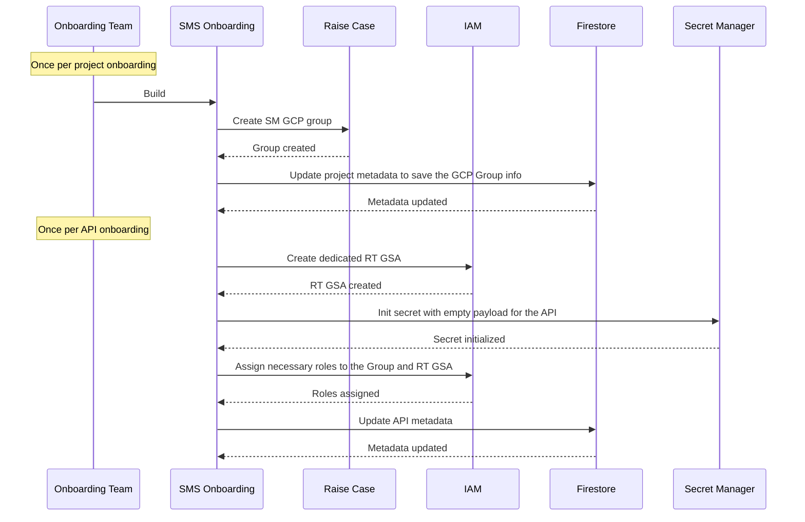
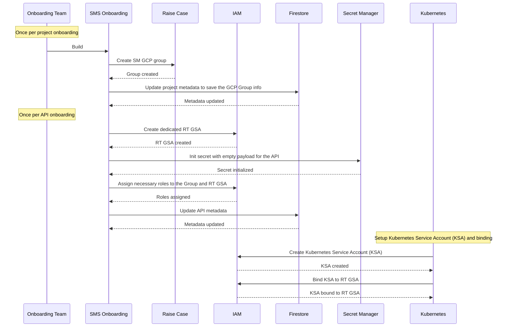
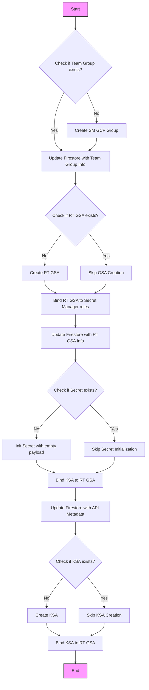
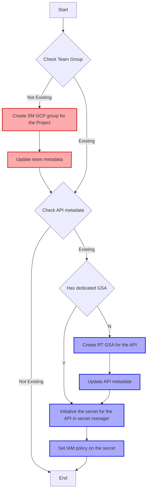
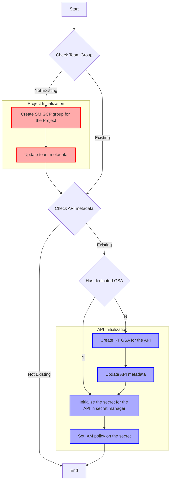

这个Mermaid序列图描述了SMS Onboarding的流程，包括以下主要步骤：

1. 项目onboarding（每个项目一次）：
   - Onboarding Team 启动构建过程
   - 创建SM GCP组
   - 更新项目元数据以保存GCP组信息

2. API onboarding（每个API一次）：
   - 创建专用RT GSA
   - 为API初始化带有空payload的secret
   - 为Group和RT GSA分配必要的角色
   - 更新API元数据

图中包含了原图中的所有主要参与者：

Onboarding Team、SMS Onboarding、RaisCase、IAM、Firestore和Secret Manager。

这个Mermaid图表可以在支持Mermaid的Markdown查看器中渲染，给您一个清晰的SMS Onboarding流程视图。如果您需要对图表进行任何修改或者有任何问题，请随时告诉我。


当然,我可以为您提供创建GCP群组和服务账号的gcloud命令参考。让我们逐步来看这些命令。

```bash
# Create SM GCP group
# Note: You need to have the necessary permissions to create groups

# 1. Create a Google Group (if you're using Google Workspace)
# This typically needs to be done through the Google Workspace Admin Console
# There's no direct gcloud command for this, but you can use the Directory API

# 2. Grant the group access to GCP resources
gcloud projects add-iam-policy-binding PROJECT_ID \
    --member="group:sm-group@yourdomain.com" \
    --role="roles/secretmanager.admin"

# Create dedicated RT GSA (GCP Service Account)
# Replace YOUR_PROJECT_ID and SERVICE_ACCOUNT_NAME with your actual values

# 1. Create the service account
gcloud iam service-accounts create SERVICE_ACCOUNT_NAME \
    --description="RT GSA for API access" \
    --display-name="RT GSA"

# 2. Get the full service account email
SA_EMAIL=$(gcloud iam service-accounts list \
    --filter="displayName:RT GSA" \
    --format='value(email)')

# 3. Grant the service account access to Secret Manager
gcloud projects add-iam-policy-binding YOUR_PROJECT_ID \
    --member="serviceAccount:$SA_EMAIL" \
    --role="roles/secretmanager.secretAccessor"

# 4. (Optional) If you need to create a key for this service account
gcloud iam service-accounts keys create key-file.json \
    --iam-account=$SA_EMAIL

# Note: Be cautious with key files and never store them in version control

```

这些命令提供了创建GCP群组和服务账号的基本步骤。以下是一些解释和注意事项：

1. 创建SM GCP群组：
   - 实际上，创建Google Group通常需要通过Google Workspace Admin Console完成，没有直接的gcloud命令。
   - 提供的命令展示了如何将已创建的群组授予GCP资源的访问权限。

2. 创建专用RT GSA（GCP服务账号）：
   - 创建服务账号
   - 获取服务账号的完整电子邮件地址
   - 授予服务账号访问Secret Manager的权限
   - 可选步骤：为服务账号创建密钥文件

使用这些命令时，请注意：

- 替换 `PROJECT_ID`, `YOUR_PROJECT_ID`, 和 `SERVICE_ACCOUNT_NAME` 为你的实际值。
- 确保你有足够的权限执行这些操作。
- 小心处理服务账号密钥，不要将它们存储在版本控制系统中。
- 根据你的具体需求，你可能需要调整角色和权限。

这些命令提供了一个起点，但在实际使用中，你可能需要根据你的特定项目设置和安全要求进行调整。如果你需要更多关于特定步骤的信息或有任何其他问题，请随时问我。

# chatgpt 

要实现您的需求，我们需要按以下步骤执行GCP的操作。每个步骤将对应具体的`gcloud`命令：

1. **创建SM GCP组**
2. **创建专用RT GSA**
3. **初始化API的Secret**
4. **分配必要的角色**
5. **更新元数据**

### 1. 创建SM GCP组

使用`gcloud`命令来创建一个GCP组：

```sh
gcloud identity groups create "env-region-team-sm-group@example.com" \
    --display-name="Secret Manager Group for Team"
```

### 2. 创建专用RT GSA

创建一个专用的RT GSA (Service Account)：

```sh
gcloud iam service-accounts create "env-region-api-1-rt-sa" \
    --display-name="Service Account for API 1"
```

### 3. 初始化API的Secret

初始化一个Secret并设置初始的空值：

```sh
gcloud secrets create api-1-secret --replication-policy="automatic"
echo -n "" | gcloud secrets versions add api-1-secret --data-file=-
```

### 4. 分配必要的角色

给SM GCP组和RT GSA分配角色：

```sh
# 给RT GSA分配Secret访问角色
gcloud projects add-iam-policy-binding PROJECT_ID \
    --member="serviceAccount:env-region-api-1-rt-sa@PROJECT_ID.iam.gserviceaccount.com" \
    --role="roles/secretmanager.secretAccessor"

# 给SM GCP组分配Secret版本管理角色
gcloud projects add-iam-policy-binding PROJECT_ID \
    --member="group:env-region-team-sm-group@example.com" \
    --role="roles/secretmanager.secretVersionManager"
```


### 5. 更新元数据

假设Firestore已经设置好用于存储元数据，你可以使用以下示例命令将元数据更新到Firestore：

```sh
# 设置项目元数据（此示例使用gcloud命令）
gcloud firestore documents create projects/YOUR_PROJECT_ID/databases/(default)/documents/metadata/GCP_GROUP \
    --fields group="env-region-team-sm-group@example.com"

# 设置API元数据
gcloud firestore documents create projects/YOUR_PROJECT_ID/databases/(default)/documents/metadata/APIs/API_NAME \
    --fields serviceAccount="env-region-api-1-rt-sa@YOUR_PROJECT_ID.iam.gserviceaccount.com", \
             secret="api-1-secret"
```

### 完整流程图

为了更好地理解整个流程，这里是上述流程的完整Mermaid图表：



### 其他注意事项

1. **环境变量设置**：
   在实际运行这些命令之前，请确保您已经设置了相应的环境变量，如`PROJECT_ID`和`YOUR_PROJECT_ID`。

2. **权限**：
   执行这些操作的用户必须拥有相应的权限，确保有权限创建服务账户、IAM角色绑定，以及访问和更新Firestore。

3. **错误处理**：
   为了在自动化脚本中处理潜在的错误，建议在每个命令后添加错误处理逻辑，以确保整个流程的健壮性。

通过这些步骤，您可以为每个团队创建专用的Secret，并确保每个团队只能访问和管理其自己的Secret。


是的，您在GKE环境中需要创建KSA (Kubernetes Service Account) 并将其绑定到相应的GCP Service Account (RT GSA)，以确保您的Deployment能够使用Workload Identity来访问GCP资源。以下是详细的步骤和命令：

### 1. 创建Kubernetes Service Account (KSA)

```sh
kubectl create serviceaccount api-1-ksa --namespace your-namespace
```

### 2. 为KSA绑定GCP Service Account (RT GSA)

创建IAM policy binding，使得KSA与RT GSA绑定：

```sh
gcloud iam service-accounts add-iam-policy-binding env-region-api-1-rt-sa@YOUR_PROJECT_ID.iam.gserviceaccount.com \
    --role roles/iam.workloadIdentityUser \
    --member "serviceAccount:YOUR_PROJECT_ID.svc.id.goog[your-namespace/api-1-ksa]"
```

### 3. 配置Kubernetes Deployment以使用KSA

在您的Kubernetes Deployment中，指定KSA：

```yaml
apiVersion: apps/v1
kind: Deployment
metadata:
  name: api-1-deployment
  namespace: your-namespace
spec:
  replicas: 1
  selector:
    matchLabels:
      app: api-1
  template:
    metadata:
      labels:
        app: api-1
    spec:
      serviceAccountName: api-1-ksa
      containers:
      - name: api-1-container
        image: gcr.io/YOUR_PROJECT_ID/api-1-image
        # 其他容器配置...
```

### 4. 更新Kubernetes Cluster以启用Workload Identity

确保您的GKE集群已启用Workload Identity：

```sh
gcloud container clusters update your-cluster-name \
    --workload-pool=YOUR_PROJECT_ID.svc.id.goog
```

### 完整流程图

为了更好地理解整个流程，这里是上述流程的完整Mermaid图表，包含KSA和RT GSA的绑定步骤：



### 其他注意事项

1. **权限**：
   确保执行这些操作的用户有相应的权限，包括创建和管理GKE Service Accounts以及IAM policy bindings。

2. **命名空间**：
   确保您的KSA和Kubernetes Deployment在同一个命名空间中，以便正确绑定和访问。

3. **Workload Identity**：
   Workload Identity需要在GKE集群中启用，并且配置正确的工作池（Workload Pool）。

通过这些步骤，您可以确保每个Team的Deployment在GKE中使用正确的身份验证机制访问GCP资源。


您的流程总体上是合理的，但可以进一步优化和增强安全性，以确保提供一个平台级别的Security Management解决方案。以下是对您的流程的详细审查和优化建议：

### 审查流程

1. **SM GCP组的创建和管理**：为每个团队创建一个独立的GCP组，以确保Secret的管理和访问权限分离。
2. **专用RT GSA的创建和绑定**：为每个API创建一个独立的GCP Service Account (RT GSA)，并将其与Kubernetes Service Account (KSA)绑定，以便通过Workload Identity进行身份验证。
3. **Secret的初始化和访问控制**：在Secret Manager中初始化Secret，并为GCP组和RT GSA分配适当的角色，确保仅有特定团队可以访问和管理相关Secret。
4. **更新元数据**：将相关的元数据存储在Firestore中，以便后续查询和管理。

### 安全和优化建议

1. **使用最小权限原则**：
   - 确保为每个Service Account和组分配的权限尽可能小，只授予执行所需操作的最低权限。
   - 检查和审计IAM角色，以确保没有多余的权限。

2. **Secret的生命周期管理**：
   - 定期轮换Secret，并更新应用配置以使用新Secret。
   - 使用Secret Manager的版本控制功能，确保旧版本Secret可以回滚。

3. **Kubernetes Namespace隔离**：
   - 为每个团队创建独立的Namespace，以进一步隔离不同团队的资源。
   - 配置Network Policies以限制不同Namespace之间的流量。

4. **审计和监控**：
   - 配置日志记录和监控，使用Google Cloud Logging和Monitoring，跟踪Secret的访问和使用情况。
   - 设置警报，以便在检测到异常访问或行为时通知相关团队。

5. **自动化和CI/CD集成**：
   - 将这些流程自动化，使用CI/CD管道在代码提交时自动触发创建和配置步骤。
   - 使用Infrastructure as Code (如Terraform)管理和版本控制GCP和Kubernetes资源。

6. **安全评估和渗透测试**：
   - 定期进行安全评估和渗透测试，以发现和修复潜在的安全漏洞。
   - 使用GCP的安全工具，如Security Command Center，进行持续的安全监控和威胁检测。

### 优化流程示例


### 实现命令示例

```sh
# 1. 创建SM GCP组
gcloud identity groups create "env-region-team-sm-group@example.com" --display-name="Secret Manager Group for Team"

# 2. 创建专用RT GSA
gcloud iam service-accounts create "env-region-api-1-rt-sa" --display-name="Service Account for API 1"

# 3. 初始化API的Secret
gcloud secrets create api-1-secret --replication-policy="automatic"
echo -n "" | gcloud secrets versions add api-1-secret --data-file=-

# 4. 分配必要的角色
gcloud projects add-iam-policy-binding PROJECT_ID --member="serviceAccount:env-region-api-1-rt-sa@PROJECT_ID.iam.gserviceaccount.com" --role="roles/secretmanager.secretAccessor"
gcloud projects add-iam-policy-binding PROJECT_ID --member="group:env-region-team-sm-group@example.com" --role="roles/secretmanager.secretVersionManager"
gcloud projects add-iam-policy-binding PROJECT_ID --member="serviceAccount:env-region-sm-admin-sa@PROJECT_ID.iam.gserviceaccount.com" --role="roles/secretManagerUser"

# 5. 更新Firestore元数据
gcloud firestore documents create projects/YOUR_PROJECT_ID/databases/(default)/documents/metadata/GCP_GROUP --fields group="env-region-team-sm-group@example.com"
gcloud firestore documents create projects/YOUR_PROJECT_ID/databases/(default)/documents/metadata/APIs/API_NAME --fields serviceAccount="env-region-api-1-rt-sa@YOUR_PROJECT_ID.iam.gserviceaccount.com", secret="api-1-secret"

# 6. 创建Kubernetes Service Account (KSA)
kubectl create serviceaccount api-1-ksa --namespace your-namespace

# 7. 为KSA绑定GCP Service Account (RT GSA)
gcloud iam service-accounts add-iam-policy-binding env-region-api-1-rt-sa@YOUR_PROJECT_ID.iam.gserviceaccount.com --role roles/iam.workloadIdentityUser --member "serviceAccount:YOUR_PROJECT_ID.svc.id.goog[your-namespace/api-1-ksa]"

# 8. 确保GKE集群启用Workload Identity
gcloud container clusters update your-cluster-name --workload-pool=YOUR_PROJECT_ID.svc.id.goog
```

通过以上的优化和调整，您可以确保您的平台级别的Security Management解决方案既安全又高效。


好的，基于您的需求，我将设计一个CI/CD pipeline的流程图来实现整个过程。这个流程将包括检查Team Group是否存在，创建RT GSA，初始化Secret，以及相关的绑定和配置。我们将使用一个决策树的模式来指导每个步骤。

### Pipeline 流程图



### 解释

1. **Start**: Pipeline开始。
2. **Check if Team Group exists?**: 检查团队组是否存在。
   - **Yes**: 更新Firestore中的团队组信息。
   - **No**: 创建SM GCP组，然后更新Firestore中的团队组信息。
3. **Check if RT GSA exists?**: 检查RT GSA是否存在。
   - **Yes**: 跳过GSA创建步骤。
   - **No**: 创建RT GSA。
4. **Bind RT GSA to Secret Manager roles**: 将RT GSA绑定到Secret Manager角色。
5. **Update Firestore with RT GSA Info**: 更新Firestore中的RT GSA信息。
6. **Check if Secret exists?**: 检查Secret是否存在。
   - **Yes**: 跳过Secret初始化步骤。
   - **No**: 初始化Secret并设置初始空值。
7. **Bind KSA to RT GSA**: 将KSA绑定到RT GSA。
8. **Update Firestore with API Metadata**: 更新Firestore中的API元数据。
9. **Check if KSA exists?**: 检查KSA是否存在。
   - **Yes**: 跳过KSA创建步骤。
   - **No**: 创建KSA。
10. **Bind KSA to RT GSA**: 将KSA绑定到RT GSA。
11. **End**: Pipeline结束。

通过这种流程图，您可以清晰地看到每个步骤的决策和操作，确保整个过程高效且安全。

### 示例代码

基于上述流程，这里是一个简单的伪代码示例，您可以将其实现为实际的CI/CD管道脚本（如Jenkins、GitLab CI/CD或其他工具）。

```python
def pipeline():
    if not check_team_group_exists():
        create_team_group()
    update_firestore_with_team_group_info()

    if not check_rt_gsa_exists():
        create_rt_gsa()
    bind_rt_gsa_to_secret_manager_roles()
    update_firestore_with_rt_gsa_info()

    if not check_secret_exists():
        init_secret_with_empty_payload()
    bind_ksa_to_rt_gsa()
    update_firestore_with_api_metadata()

    if not check_ksa_exists():
        create_ksa()
    bind_ksa_to_rt_gsa()

pipeline()
```

通过这种方式，您可以确保每个步骤都符合您的安全和操作需求，同时提高自动化程度和流程的可靠性。

下面是对应的Mermaid代码：


将上述代码复制到Mermaid在线工具或支持Mermaid的Markdown编辑器中进行预览，应该可以正确生成流程图。


此Mermaid代码对应的流程图与您提供的图像相匹配，包括决定树节点、流程步骤以及颜色编码。您可以将此代码复制到Mermaid在线工具或支持Mermaid的Markdown编辑器中进行预览和使用。

为了优化这个流程图，使其更加美观和易读，我们可以进行以下调整：

1. **调整布局**：通过重新安排节点的位置和方向，使流程更加直观。
2. **增加节点间距**：确保节点之间有足够的间距，使图表不显得拥挤。
3. **使用子图**：对于项目和API相关的部分，我们可以使用子图来分组。

以下是优化后的Mermaid代码：



### 解释

1. **子图**：
   - 使用`subgraph`标签来分组项目初始化和API初始化相关的步骤。
2. **布局调整**：
   - 将项目和API的初始化步骤分组，使流程更加清晰。
3. **样式**：
   - 保留原有的颜色编码来区分项目和API的步骤。

您可以将此代码复制到Mermaid在线工具或支持Mermaid的Markdown编辑器中进行预览，来查看优化后的效果。
