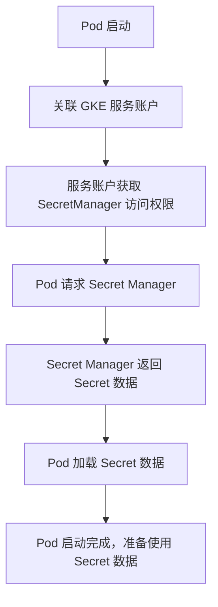

在 GKE 环境中，Pod 使用 GCP Secret Manager 时，通常会通过 GKE 服务账户（GKE SA）来访问秘密。这个过程的整体流程包括权限分配、密钥访问和 Secret 的加载等步骤。下面是一个简化的流程图，展示了 Pod 启动并访问 GCP Secret Manager 的过程：

### 流程说明：

1. **Pod 启动**：Pod 开始启动。
2. **关联 GKE 服务账户**：Pod 配置了一个 GKE 服务账户，该账户已经被赋予访问 Secret Manager 的权限。
3. **服务账户获取 SecretManager 访问权限**：通过 IAM，GKE 服务账户被授权访问 GCP Secret Manager 中的机密信息。
4. **Pod 请求 Secret Manager**：Pod 在启动时向 Secret Manager 发送请求，请求特定的机密数据。
5. **Secret Manager 返回 Secret 数据**：Secret Manager 根据服务账户的权限返回机密数据。
6. **Pod 加载 Secret 数据**：Pod 加载并使用从 Secret Manager 获取的机密数据。
7. **Pod 启动完成**：Pod 完成启动并准备使用这些机密信息（如数据库密码、API 密钥等）。

这个流程确保 Pod 能安全地访问存储在 Secret Manager 中的敏感数据，且只有授权的服务账户才能进行访问。
