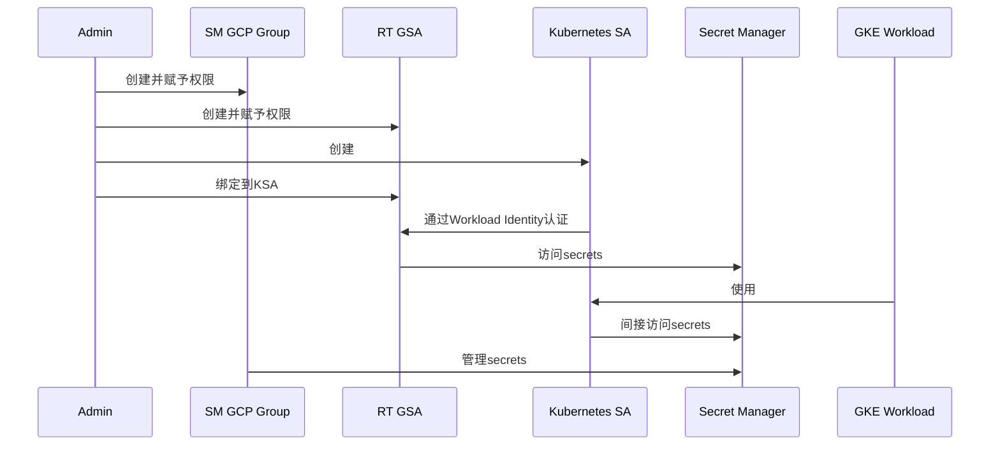

# summmary
GCP工程我配置对应的 GKE  runtime. 运行的时候使用gcp secret manager 所以需要下面三个账户
0. 一个admin 组 <space>-‹region>-sm-admin-sa ==>赋予对应的role /roles/cr.secretManagerUser
1. **SM GCP组的创建和管理**：为每个团队创建一个独立的GCP组，以确保Secret的管理和访问权限分离。Create SM GCP group ‹space>-‹region>-‹team> - sm-group赋予对应的role roles/secretmanager. secretVersionManager
2. **专用RT GSA的创建和绑定**：为每个API创建一个独立的GCP Service Account (RT GSA)，命名规范大致如下 < space>-<region>-<api-name>-rt-sa赋予对应的role roles/secretmanager,secretAccessor
并将其与Kubernetes Service Account (KSA)绑定，以便通过Workload Identity进行身份验证。
请帮我梳理上面的这个流程是否可行？ 如果可以的话，请给出我对应的操作命令。
再帮我将对应的关系能够最好输出一个对应的mermaid seqdiagram


我们需要为每一个API创建一个对应的Kubernetes Service Account (KSA)，并将其注释到每一个对应的RT GSA。下面是更新后的操作步骤和Mermaid流程图：

### 详细步骤和命令

#### 1. 创建 admin 组并赋予角色
```bash
gcloud iam service-accounts create sm-admin-sa --display-name "Secret Manager Admin"
gcloud projects add-iam-policy-binding [PROJECT_ID] --member "serviceAccount:sm-admin-sa@[PROJECT_ID].iam.gserviceaccount.com" --role "roles/secretmanager.admin"
```

#### 2. 创建和管理 SM GCP 组
```bash
gcloud iam service-accounts create [space]-[region]-[team]-sm-group --display-name "Secret Manager Group"
gcloud projects add-iam-policy-binding [PROJECT_ID] --member "serviceAccount:[space]-[region]-[team]-sm-group@[PROJECT_ID].iam.gserviceaccount.com" --role "roles/secretmanager.secretVersionManager"
```

#### 3. 创建和绑定专用 RT GSA
```bash
# 为每个API创建一个RT GSA
gcloud iam service-accounts create [space]-[region]-[api-name]-rt-sa --display-name "RT Service Account"
gcloud projects add-iam-policy-binding [PROJECT_ID] --member "serviceAccount:[space]-[region]-[api-name]-rt-sa@[PROJECT_ID].iam.gserviceaccount.com" --role "roles/secretmanager.secretAccessor"

# 为每个API创建一个KSA并绑定到RT GSA
kubectl create serviceaccount [api-name]-ksa --namespace [namespace]

# 绑定 RT GSA 和 KSA
gcloud iam service-accounts add-iam-policy-binding [space]-[region]-[api-name]-rt-sa@[PROJECT_ID].iam.gserviceaccount.com --role roles/iam.workloadIdentityUser --member "serviceAccount:[PROJECT_ID].svc.id.goog[[namespace]/[api-name]-ksa]"

kubectl annotate serviceaccount [api-name]-ksa --namespace [namespace] iam.gke.io/gcp-service-account=[space]-[region]-[api-name]-rt-sa@[PROJECT_ID].iam.gserviceaccount.com
```

### Mermaid Sequence Diagram


这样，流程中为每个API创建了对应的Kubernetes Service Account (KSA)，并将其与RT GSA进行绑定并注解。请根据你的具体项目ID、命名空间和其他细节替换占位符。

这个流程是可行的，下面是详细的操作步骤和对应的命令：

1. **创建 admin 组并赋予角色**
2. **创建和管理 SM GCP 组**
3. **创建和绑定专用 RT GSA**

### 详细步骤和命令

#### 1. 创建 admin 组并赋予角色
```bash
gcloud iam service-accounts create sm-admin-sa --display-name "Secret Manager Admin"
gcloud projects add-iam-policy-binding [PROJECT_ID] --member "serviceAccount:[PROJECT_ID]@sm-admin-sa.iam.gserviceaccount.com" --role "roles/secretmanager.admin"
```

#### 2. 创建和管理 SM GCP 组
```bash
gcloud iam service-accounts create [space]-[region]-[team]-sm-group --display-name "Secret Manager Group"
gcloud projects add-iam-policy-binding [PROJECT_ID] --member "serviceAccount:[PROJECT_ID]@[space]-[region]-[team]-sm-group.iam.gserviceaccount.com" --role "roles/secretmanager.secretVersionManager"
```

#### 3. 创建和绑定专用 RT GSA
```bash
gcloud iam service-accounts create [space]-[region]-[api-name]-rt-sa --display-name "RT Service Account"
gcloud projects add-iam-policy-binding [PROJECT_ID] --member "serviceAccount:[PROJECT_ID]@[space]-[region]-[api-name]-rt-sa.iam.gserviceaccount.com" --role "roles/secretmanager.secretAccessor"

# 绑定 RT GSA 和 KSA
kubectl create serviceaccount [ksa-name] --namespace [namespace]

gcloud iam service-accounts add-iam-policy-binding [space]-[region]-[api-name]-rt-sa@[PROJECT_ID].iam.gserviceaccount.com --role roles/iam.workloadIdentityUser --member "serviceAccount:[PROJECT_ID].svc.id.goog[[namespace]/[ksa-name]]"

kubectl annotate serviceaccount [ksa-name] --namespace [namespace] iam.gke.io/gcp-service-account=[space]-[region]-[api-name]-rt-sa@[PROJECT_ID].iam.gserviceaccount.com
```

### Mermaid Sequence Diagram


这个流程图和步骤涵盖了创建和管理所需账户及其权限设置的详细过程。请根据你的具体项目ID、命名空间和其他细节替换占位符。

您提出的流程看起来是一个合理的方法来管理GCP Secret Manager的访问权限和身份验证。我会为您梳理这个流程，提供相应的操作命令，并创建一个Mermaid序列图来展示这些关系。

首先，让我们逐步梳理这个流程：

1. 创建admin组和赋予权限
2. 为每个团队创建SM GCP组并赋予权限
3. 为每个API创建GCP Service Account (RT GSA)并赋予权限
4. 创建Kubernetes Service Account (KSA)
5. 绑定RT GSA和KSA

这个流程看起来是可行的。现在，让我们看看相应的操作命令：


```bash
# 设置变量
SPACE="your-space"
REGION="your-region"
TEAM="your-team"
API_NAME="your-api-name"
PROJECT_ID="your-project-id"

# 1. 创建admin组和赋予权限
gcloud iam service-accounts create ${SPACE}-${REGION}-sm-admin-sa \
    --display-name="${SPACE} ${REGION} Secret Manager Admin"

gcloud projects add-iam-policy-binding ${PROJECT_ID} \
    --member="serviceAccount:${SPACE}-${REGION}-sm-admin-sa@${PROJECT_ID}.iam.gserviceaccount.com" \
    --role="roles/secretmanager.admin"

# 2. 创建SM GCP组并赋予权限
gcloud iam service-accounts create ${SPACE}-${REGION}-${TEAM}-sm-group \
    --display-name="${SPACE} ${REGION} ${TEAM} Secret Manager Group"

gcloud projects add-iam-policy-binding ${PROJECT_ID} \
    --member="serviceAccount:${SPACE}-${REGION}-${TEAM}-sm-group@${PROJECT_ID}.iam.gserviceaccount.com" \
    --role="roles/secretmanager.secretVersionManager"

# 3. 创建RT GSA并赋予权限
gcloud iam service-accounts create ${SPACE}-${REGION}-${API_NAME}-rt-sa \
    --display-name="${SPACE} ${REGION} ${API_NAME} Runtime Service Account"

gcloud projects add-iam-policy-binding ${PROJECT_ID} \
    --member="serviceAccount:${SPACE}-${REGION}-${API_NAME}-rt-sa@${PROJECT_ID}.iam.gserviceaccount.com" \
    --role="roles/secretmanager.secretAccessor"

# 4. 创建Kubernetes Service Account (KSA)
kubectl create serviceaccount ${SPACE}-${REGION}-${API_NAME}-ksa -n your-namespace

# 5. 绑定RT GSA和KSA
gcloud iam service-accounts add-iam-policy-binding \
    ${SPACE}-${REGION}-${API_NAME}-rt-sa@${PROJECT_ID}.iam.gserviceaccount.com \
    --role roles/iam.workloadIdentityUser \
    --member "serviceAccount:${PROJECT_ID}.svc.id.goog[your-namespace/${SPACE}-${REGION}-${API_NAME}-ksa]"

kubectl annotate serviceaccount ${SPACE}-${REGION}-${API_NAME}-ksa \
    --namespace your-namespace \
    iam.gke.io/gcp-service-account=${SPACE}-${REGION}-${API_NAME}-rt-sa@${PROJECT_ID}.iam.gserviceaccount.com
```

请注意，您需要替换命令中的变量（如 `SPACE`, `REGION`, `TEAM`, `API_NAME`, `PROJECT_ID`）为您的实际值。

现在，让我们创建一个Mermaid序列图来展示这些关系：




这个序列图展示了各个组件之间的关系和交互。

关于您的最后一点补充：是的，您需要为每个API创建一个对应的GKE Service Account (KSA)，然后将每个KSA通过annotation绑定到相应的 `<space>-<region>-<api-name>-rt-sa`。这个步骤在上面的命令中的第4和第5步已经包含了。您需要为每个API重复这两个步骤，确保每个API都有自己的KSA，并且每个KSA都正确地绑定到对应的RT GSA。

这种设置可以确保每个API都有其独立的身份和权限，增强了安全性和可管理性。如果您有任何其他问题或需要进一步澄清，请随时告诉我。​​​​​​​​​​​​​​​​


