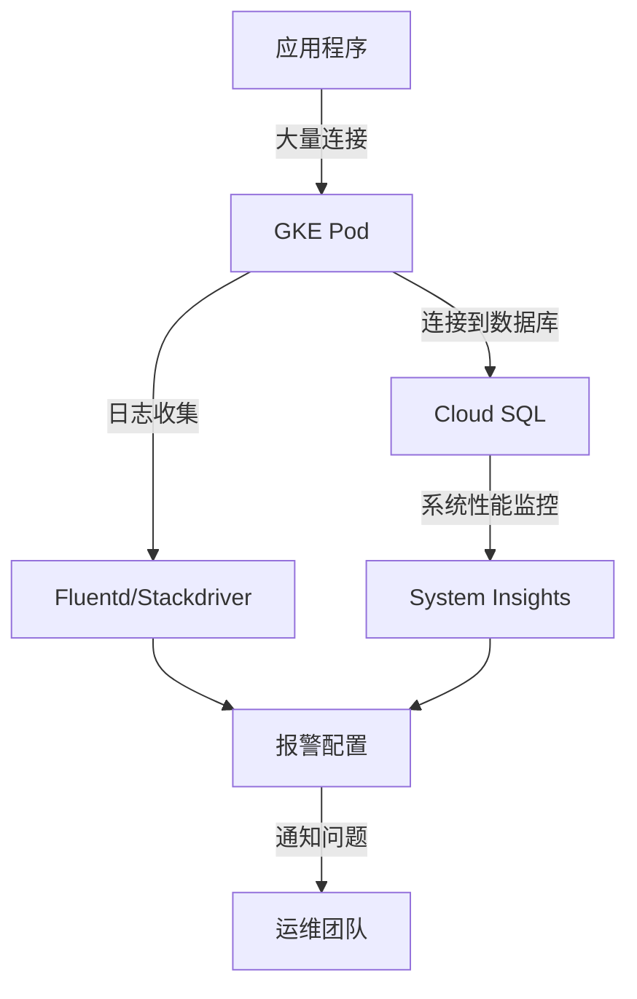

在 GCP 环境中运行的 PostgreSQL，尤其是通过 Cloud SQL 部署时，有几个关键概念可以帮助你理解数据库的性能和资源利用情况。以下是对你提到的几个重要参数的详细解释：

### 1. **PostgreSQL 的基础概念**

- **版本**：这通常指的是数据库实例运行的 PostgreSQL 的版本。例如，你可能运行的是 PostgreSQL 12、13 或 14 版本。不同版本可能会影响性能、功能和兼容性。
- **vCPU 数量**：这是指分配给数据库实例的虚拟 CPU 核心数。在 Cloud SQL 中，vCPU 是按需分配的资源，更多的 vCPU 可以提供更好的并发处理能力。
- **内存**：是分配给 PostgreSQL 实例的内存大小。内存越大，可以缓存更多的数据，减少磁盘 I/O，从而提高性能。
- **SSD Storage**：指的是数据库使用的存储类型，SSD 相比 HDD 提供更高的读写性能。通常，SSD 存储对性能要求较高的数据库应用更为合适。

### 2. **Peak Connections**

“Peak Connections” 是指数据库实例在一定时间段内达到的最大连接数。连接数是数据库能够处理的并发客户端连接的数量。这个参数非常关键，因为数据库实例有最大并发连接限制，一旦超过这个限制，后续的连接请求会被拒绝，或会导致性能下降。

- **默认值**：PostgreSQL 的默认最大连接数通常是 100 个，但在 Cloud SQL 中，它会根据实例的规格（如 vCPU 数量和内存大小）动态调整。对于更大的实例，默认的最大连接数可能会高达 1500 或更多。
- **实际情况**：你提到的 `Peak Connections` 达到 1498，接近默认的 1500，这意味着数据库几乎已经达到其最大连接数。如果此时继续增加连接请求，就会出现连接问题，导致拒绝服务或者性能问题。

### 3. **如何 Debug Peak Connections 问题**

当 `Peak Connections` 达到接近最大值时，你可能会遇到性能瓶颈，甚至出现连接失败的情况。为了调试和优化这个问题，下面是一些可能的步骤：

#### 1. **检查连接池配置**

PostgreSQL 通常会使用连接池来管理数据库连接。如果你有很多客户端应用直接连接到数据库，可能会导致连接数过多。为了解决这个问题，你可以：

- **启用连接池**：使用连接池工具（如 `pgbouncer` 或 `pgpool`）来管理连接。连接池可以通过复用连接来减少数据库连接数，避免每个请求都创建新的数据库连接。
- **优化连接池参数**：调整连接池的 `pool_size` 和 `max_connections` 参数，避免过多的并发连接直接暴露给数据库。

#### 2. **监控和分析连接的来源**

在 PostgreSQL 中，你可以使用以下 SQL 查询来查看当前的连接状态：

```sql
SELECT * FROM pg_stat_activity;
```

这将返回所有当前活动的连接。你可以分析哪些连接长时间占用资源，哪些查询占用了最多的连接，帮助你识别潜在的瓶颈。

#### 3. **增加数据库实例的资源**

如果你的应用需要处理大量的并发连接，可以考虑升级你的 PostgreSQL 实例：

- 增加更多的 vCPU 和内存。
- 调整 Cloud SQL 配置中的最大连接数。通过设置 `max_connections` 参数来增加允许的最大连接数。

在 Cloud SQL 中，你可以通过控制台、gcloud 或 API 修改这些参数：

```bash
gcloud sql instances patch [INSTANCE_NAME] --database-flags max_connections=2000
```

#### 4. **限制连接数的使用**

- **连接超时**：确保应用程序配置了合理的连接超时。长时间空闲的连接不应该占用数据库资源。你可以通过调整 `tcp_keepalives` 或使用连接池设置来减少超时连接。
- **数据库用户限制**：可以对不同的数据库用户设置连接限制，以避免某个用户占用过多的连接资源。

  ```sql
  ALTER ROLE my_user CONNECTION LIMIT 100;
  ```

#### 5. **查看数据库日志**

PostgreSQL 会记录与连接和性能相关的日志。你可以通过查看日志文件来帮助你了解连接数过多的原因：

- 在 Cloud SQL 中，查看 **SQL 实例日志**，查找连接相关的错误或警告信息。
- 通过查询 PostgreSQL 日志，可以发现是否有连接泄漏或长时间执行的查询。

#### 6. **优化数据库查询**

频繁的长时间运行查询可能导致连接数急剧增加。通过优化查询，使用索引、避免不必要的全表扫描，或者减少复杂查询的执行时间，可以减少每个连接的使用时间，从而避免连接堆积。

### 总结

`Peak Connections` 达到接近最大限制时，可能会导致数据库性能问题，甚至拒绝连接。通过以下几种方法可以解决或缓解问题：

- 使用连接池来管理数据库连接。
- 增加数据库实例的资源，尤其是 vCPU 和内存，来提高并发处理能力。
- 通过日志分析、优化查询来减少数据库连接的数量。
- 调整最大连接数限制，以适应更高的并发需求。

调试时，最重要的是理解连接的来源，并优化连接的管理方式。

当你发现 GKE 中的 Pod 连接数据库时，`Peak Connections` 达到接近最大限制，意味着你需要分析和调试 Pod 到数据库的连接态。你提出的问题涉及如何在 GKE 环境中监控 Pod 的连接状态，类似于在 Linux 主机上使用 `netstat` 或 `ss` 命令来检查网络连接。

### 1. **如何监控 GKE Pod 的连接状态**

GKE 本身提供了一些工具和方法来监控 Pod 内部的网络连接状态。虽然你不能直接像在 Linux 主机上那样运行 `netstat` 或 `ss` 命令，但你可以通过以下几种方法间接获取连接信息：

#### 1.1 **使用 `kubectl exec` 进入 Pod**

你可以进入一个 Pod 并使用类似 `netstat` 或 `ss` 的工具来查看 Pod 的网络连接状态。前提是容器镜像中已经安装了这些工具。

- **进入 Pod**：

  ```bash
  kubectl exec -it <pod_name> -- /bin/bash
  ```

- **检查连接（使用 `netstat` 或 `ss`）**：

  ```bash
  netstat -tn
  ```

  或者：

  ```bash
  ss -tn
  ```

  这两个命令会列出当前 TCP 连接，显示源端口、目标端口、连接状态等信息。你可以通过它们监控 Pod 到数据库的连接状态，特别是查看是否有过多的处于 **ESTABLISHED** 状态的连接。

- **查看数据库连接**（过滤出 PostgreSQL 相关连接）：
  如果你的 Pod 有很多连接，可能会有难以筛选的连接。你可以使用如下命令来筛选数据库连接：

  ```bash
  ss -tn | grep 5432
  ```

  PostgreSQL 默认的端口是 5432，使用这个命令可以显示所有与 PostgreSQL 端口（或其他数据库端口）相关的连接。

#### 1.2 **安装并使用 `pg_stat_activity` 查看数据库连接**

PostgreSQL 提供了一个内建的视图 `pg_stat_activity`，它可以显示当前所有活动的数据库连接信息。你可以查询此视图来查看与数据库的连接数和状态。

- **查询数据库连接信息**：

  ```sql
  SELECT * FROM pg_stat_activity WHERE datname = 'your_database';
  ```

  这将列出所有与 `your_database` 相关的连接。你可以分析连接的来源、连接时间等，看看是否有长时间未释放的连接，或者某些查询占用了过多的连接。

#### 1.3 **使用 Prometheus + Grafana 监控 Pod 和数据库连接**

对于更高级的监控，你可以使用 **Prometheus** 和 **Grafana** 来收集和展示 Pod 的网络连接信息。GKE 支持集成 Prometheus 来监控各种资源，包括 Pod 的网络连接数。

- **安装 Prometheus 和 Grafana**：
  使用 Helm 可以很方便地将 Prometheus 和 Grafana 安装到 GKE 集群中：

  ```bash
  helm install prometheus prometheus-community/kube-prometheus-stack
  ```

- **配置 Prometheus 监控网络连接**：
  在 Prometheus 中，你可以监控以下指标来查看 Pod 的网络连接状态：

  - `container_network_transmit_bytes_total`：Pod 网络的传出字节数。
  - `container_network_receive_bytes_total`：Pod 网络的接收字节数。
  - `container_network_tcp_connections`：当前 Pod 的 TCP 连接数（可以监控数据库连接）。

- **创建 Grafana Dashboard**：
  使用 Grafana，你可以创建自定义仪表板来可视化连接数、流量、延迟等信息，从而帮助你监控 Pod 到数据库的连接状态。

#### 1.4 **分析日志**

GKE 中的 Pod 和容器日志对于调试连接问题非常有帮助。你可以查看 Pod 的日志，检查是否有异常或错误信息，比如数据库连接失败、超时等。

- **查看 Pod 日志**：

  ```bash
  kubectl logs <pod_name>
  ```

  查找与数据库连接相关的错误信息（例如，连接超时、无法建立连接等）。

### 2. **如何在 GKE 中避免和调试连接数问题**

当你看到 `Peak Connections` 达到接近最大限制时，可以采取以下措施来减少数据库连接数并调试该问题：

#### 2.1 **使用连接池**

如前所述，使用连接池（如 `pgbouncer` 或 `pgpool`）是减少数据库连接数的有效方式。你可以在 GKE 中部署这些工具，来管理 Pod 与 PostgreSQL 数据库之间的连接池。

- **部署连接池**：可以将连接池作为一个单独的 Pod 部署到 GKE 中，并通过配置应用程序使其连接到连接池，而不是直接连接数据库。

#### 2.2 **增加 Pod 的资源限制**

如果你的 Pod 上连接数过高导致性能问题，可以考虑增加 Pod 的资源限制，特别是内存和 CPU，以便处理更多的连接。

- **修改资源请求和限制**：
  在你的 Deployment YAML 文件中，增加适当的资源限制：

  ```yaml
  resources:
    requests:
      cpu: "500m"
      memory: "1Gi"
    limits:
      cpu: "1000m"
      memory: "2Gi"
  ```

#### 2.3 **调整 PostgreSQL 配置**

如果你的数据库实例的最大连接数已经接近上限，可以考虑增加 `max_connections` 参数。你可以通过 Cloud SQL 或直接修改 `postgresql.conf` 来增加连接数。

- **修改 PostgreSQL 的连接数**：

  ```sql
  ALTER SYSTEM SET max_connections = 2000;
  ```

  或者，在 Cloud SQL 中通过 `gcloud` 命令：

  ```bash
  gcloud sql instances patch <instance-name> --database-flags max_connections=2000
  ```

#### 2.4 **分析数据库查询和连接超时**

如果某些查询导致连接占用时间过长，可以优化这些查询，减少每个连接的占用时间。此外，可以设置连接超时，确保长时间没有响应的连接会被自动关闭。

- **设置查询超时**：
  在应用程序中配置适当的连接超时和查询超时参数。

### 总结

监控和调试 GKE 中 Pod 到数据库的连接状态可以通过以下方式实现：

1. 使用 `kubectl exec` 进入 Pod，运行 `netstat` 或 `ss` 来查看连接情况。
2. 查询 PostgreSQL 的 `pg_stat_activity` 视图，检查数据库连接。
3. 使用 Prometheus 和 Grafana 进行持续的监控和可视化。
4. 调整资源限制、使用连接池工具、增加数据库连接数限制等方式优化连接管理。

通过这些方法，你可以更好地监控和调试 GKE 中 Pod 的连接状态，确保数据库连接数在合理范围内，避免达到最大连接限制。


关于这一部分:
Peak Connections**

“Peak Connections” 是指数据库实例在一定时间段内达到的最大连接数。连接数是数据库能够处理的并发客户端连接的数量。这个参数非常关键，因为数据库实例有最大并发连接限制，一旦超过这个限制，后续的连接请求会被拒绝，或会导致性能下降。

- **默认值**：PostgreSQL 的默认最大连接数通常是 100 个，但在 Cloud SQL 中，它会根据实例的规格（如 vCPU 数量和内存大小）动态调整。对于更大的实例，默认的最大连接数可能会高达 1500 或更多。
- **实际情况**：你提到的 `Peak Connections` 达到 1498，接近默认的 1500，这意味着数据库几乎已经达到其最大连接数。如果此时继续增加连接请求，就会出现连接问题，导致拒绝服务或者性能问题。
通过跳转到监控页面
里面有个监控选项是 Average connections by status，
我能看到有大概下面几个选项
active
idle
idle in transaction
idle in transaction (aborted)
max connections 1.5k
看起来这个参加就是我说的 Peak Connections
https://cloud.google.com/sql/docs/postgres/use-system-insights?hl=zh-cn
使用 System Insights 提高系统性能

您提到的 Cloud SQL 的 **System Insights** 是一个非常有用的工具，能够直观地展示 PostgreSQL 实例的连接状态信息，从而帮助诊断和优化数据库性能问题。我们可以结合 System Insights 提供的数据进一步分析和调优。

### **理解 `Average connections by status` 各项指标**

1. **active**：
   - 表示当前正在执行查询或事务的连接数。
   - 这些连接占用数据库资源（CPU、内存等），通常是性能问题的重点关注对象。
   
2. **idle**：
   - 表示已经建立连接，但当前未执行任何操作的连接数。
   - 如果 `idle` 状态连接过多，可能意味着应用程序未正确释放连接，或者连接池设置过大。

3. **idle in transaction**：
   - 表示已经建立连接且事务已经启动，但该事务当前未执行任何操作。
   - 如果大量连接处于此状态，可能是由于应用程序未正确结束事务（例如，忘记提交或回滚）。

4. **idle in transaction (aborted)**：
   - 表示事务已失败但未被显式回滚。
   - 这些连接可能会占用数据库资源而没有实际用途。

5. **max connections**：
   - 表示数据库的最大连接限制。您提到的是 1500，这是 Cloud SQL 实例根据规格动态配置的最大连接数。
   - `Peak Connections` 是指监控时间段内的最大并发连接数。

---

### **如何通过 `System Insights` 诊断问题？**

1. **识别主要的连接状态**：
   - 检查是否有大量 `idle` 状态的连接。
     - 如果有，可能是连接池配置问题，导致连接被创建但未被有效利用。
   - 如果 `idle in transaction` 或 `idle in transaction (aborted)` 较多：
     - 检查应用程序是否有未结束的事务（例如，事务未提交或回滚）。
   - 如果 `active` 连接持续接近峰值：
     - 数据库的并发请求可能已经超过其设计能力，需要优化查询或扩展数据库资源。

2. **确定哪些客户端导致高连接数**：
   - Cloud SQL 提供了 `pg_stat_activity` 视图，可以帮助识别连接的来源。
     - 查询连接来源（客户端 IP 或应用）：
       ```sql
       SELECT client_addr, state, COUNT(*) 
       FROM pg_stat_activity 
       GROUP BY client_addr, state;
       ```
       此查询可以显示来自不同客户端的连接状态统计，帮助您确定哪些客户端占用过多连接。

3. **检查长时间运行的查询或事务**：
   - 使用以下查询查看正在运行的长时间事务：
     ```sql
     SELECT pid, usename, datname, state, now() - query_start AS duration, query
     FROM pg_stat_activity
     WHERE state = 'active' AND now() - query_start > interval '5 minutes';
     ```
     长时间未完成的查询可能占用宝贵的 `active` 连接资源。

---

### **优化连接数的建议**

1. **优化连接池**：
   - 配置应用程序的连接池，减少 `idle` 状态的连接。
   - 常用连接池工具：
     - **Java**：HikariCP
     - **Python**：SQLAlchemy、Psycopg2
   - 示例：在 HikariCP 中配置最大连接数：
     ```java
     HikariConfig config = new HikariConfig();
     config.setMaximumPoolSize(50);  // 限制连接池大小
     config.setIdleTimeout(30000);  // 连接空闲超时（30秒）
     ```

2. **使用连接池代理（例如 PgBouncer）**：
   - 在 GKE 部署 `PgBouncer`，减少到数据库的直接连接。
   - `PgBouncer` 可以复用连接，使应用程序保持高效连接而不耗尽数据库资源。

3. **调整 PostgreSQL 配置**：
   - 增加 `max_connections`，但这可能需要更大的实例规格。
     ```bash
     gcloud sql instances patch <instance-name> --database-flags max_connections=2000
     ```
   - 也可以降低 `idle` 状态连接的超时时间：
     ```sql
     SET idle_in_transaction_session_timeout = '1m';
     ```

4. **扩展数据库实例**：
   - 如果资源消耗接近实例规格上限，可以考虑升级实例规格（增加 vCPU 和内存）。

---

### **实时监控连接状态**

您还可以结合 Cloud SQL Logs 和 GKE 的日志系统（如 Fluentd）实现持续的监控。以下是一个推荐的监控流程：



通过这种监控链条，您可以随时掌握数据库的连接状态和问题来源。

---

### **总结**

1. 使用 Cloud SQL 的 `System Insights` 定位连接问题。
2. 通过 `pg_stat_activity` 等工具深入分析连接状态。
3. 配置连接池和连接池代理优化连接使用。
4. 调整数据库和应用程序配置，减少 `idle` 和无用连接。
5. 如有必要，扩展实例规格或增加最大连接数。 

这样可以有效避免 `Peak Connections` 达到上限的问题，同时确保数据库性能和稳定性。


# IDLE 
在 PostgreSQL 中，**`idle` 状态的连接**表示连接已经建立，但当前没有正在执行的查询或事务。这种状态并不会直接占用 CPU 资源，但仍然会消耗一定的内存和连接槽位。因此，是否正常需要结合具体使用场景和数据库配置分析。

---

### **`idle` 占用数量大的原因和分析**

1. **正常情况**：
   - 如果您的应用程序使用了 **连接池**（如 HikariCP、PgBouncer），`idle` 状态连接可能较多。这是因为连接池会提前创建一些空闲连接以提高性能，而不是每次请求都重新建立连接。
   - 只要这些 `idle` 连接数没有超过 `max_connections` 限制，通常不会对性能产生显著影响。

2. **异常情况**：
   - **连接未正确释放**：
     - 应用程序未正确关闭数据库连接（如忘记调用 `close()` 方法），导致大量连接保持 `idle` 状态。
   - **连接池配置过大**：
     - 如果连接池的最大连接数设置过高，可能会导致许多无效连接长期处于 `idle` 状态。
   - **网络断开未检测**：
     - 网络中断后，应用程序的连接未被正确清理，数据库仍然保持这些连接为 `idle`。
   - **资源浪费**：
     - 如果大量 `idle` 连接长期占用数据库的连接槽位，但实际并未被使用，这可能会限制其他应用程序或服务的连接需求。

---

### **如何判断是否正常**

可以通过以下方式分析 `idle` 连接是否正常：

1. **检查连接状态的比例**：
   - 使用以下 SQL 查看不同连接状态的数量：
     ```sql
     SELECT state, COUNT(*) 
     FROM pg_stat_activity 
     GROUP BY state;
     ```
     如果 `idle` 的比例过高（例如超过 80%），需要进一步分析其原因。

2. **查看连接来源**：
   - 分析哪些客户端或服务导致了大量 `idle` 连接：
     ```sql
     SELECT client_addr, usename, COUNT(*) 
     FROM pg_stat_activity 
     WHERE state = 'idle' 
     GROUP BY client_addr, usename;
     ```

3. **分析连接池配置**：
   - 检查应用程序的连接池配置是否合理：
     - **最大连接数**是否与数据库的 `max_connections` 相匹配。
     - **空闲连接超时时间**是否设置过长（例如超过几分钟）。

4. **跟踪长时间未活动的连接**：
   - 查找空闲时间过长的连接：
     ```sql
     SELECT pid, usename, client_addr, state, state_change 
     FROM pg_stat_activity 
     WHERE state = 'idle' 
     ORDER BY state_change DESC 
     LIMIT 10;
     ```
     如果某些连接 `idle` 时间过长，说明这些连接可能未被正确释放。

---

### **如何优化过多的 `idle` 连接**

1. **应用程序端优化**：
   - 确保正确关闭数据库连接：
     - 在 Java 中：
       ```java
       try (Connection connection = dataSource.getConnection()) {
           // 执行查询
       } // 自动关闭连接
       ```
     - 在 Python 中：
       ```python
       with psycopg2.connect(conn_str) as conn:
           with conn.cursor() as cursor:
               # 执行查询
       ```
   - 优化连接池配置：
     - 设置合适的连接池大小：
       - 小型实例：5-10
       - 中型实例：20-50
     - 设置空闲连接超时时间（减少无效连接）：
       - 示例（HikariCP）：
         ```java
         config.setIdleTimeout(30000); // 30秒空闲超时
         config.setMaxLifetime(1800000); // 最大生命周期30分钟
         ```

2. **数据库端优化**：
   - 限制 `idle` 连接的生命周期：
     ```sql
     ALTER SYSTEM SET idle_in_transaction_session_timeout = '5min';
     ```
     这会强制关闭空闲超过 5 分钟的事务。

3. **使用连接池代理**：
   - 部署 PgBouncer 等工具，可以有效减少到数据库的直接连接。
   - 配置 `pool_mode` 为 `transaction` 模式，保证连接的高效复用。

4. **监控并清理过多的 `idle` 连接**：
   - 创建定时任务，清理长时间未活动的连接：
     ```sql
     SELECT pg_terminate_backend(pid) 
     FROM pg_stat_activity 
     WHERE state = 'idle' AND now() - state_change > interval '10 minutes';
     ```

---

### **总结**

- 如果您的系统使用了连接池，`idle` 状态连接占多数是正常的。
- 需要警惕的是长时间未被清理的 `idle` 连接，因为它们会浪费数据库资源并可能导致连接不足。
- 定期监控连接状态、优化连接池配置、并设置合理的空闲超时时间，可以有效防止问题发生。