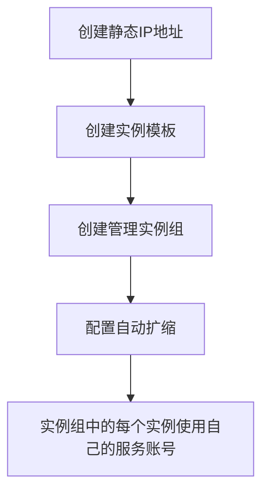

在Google Cloud Platform (GCP)中，为了确保实例的IP地址静态化，并且在扩缩时能够维持多个实例，每个实例对应自己的服务账号，可以采用以下策略：

1. **使用静态外部IP地址**：
   为每个实例分配一个静态外部IP地址。静态IP地址不会随实例的重启或删除而改变。

2. **使用实例模板和实例组**：
   使用实例模板创建管理实例组（Managed Instance Group, MIG），以便在扩缩时自动分配静态IP地址。

3. **确保每个实例使用自己的服务账号**：
   在创建实例模板时，可以指定服务账号，这样每个实例会使用自己的服务账号。

以下是详细步骤：

### 1. 创建静态外部IP地址
在GCP控制台或使用`gcloud`命令行工具创建静态外部IP地址。

```bash
gcloud compute addresses create my-static-ip --region us-central1
```

### 2. 创建实例模板
使用实例模板定义实例配置，包括分配静态IP地址和指定服务账号。

```bash
gcloud compute instance-templates create my-template \
    --machine-type n1-standard-1 \
    --region us-central1 \
    --network default \
    --address my-static-ip \
    --service-account my-service-account@my-project.iam.gserviceaccount.com \
    --image-family debian-9 \
    --image-project debian-cloud
```

### 3. 创建管理实例组（MIG）
使用实例模板创建管理实例组，并设置自动扩缩策略。

```bash
gcloud compute instance-groups managed create my-instance-group \
    --base-instance-name my-instance \
    --template my-template \
    --size 1 \
    --region us-central1
```

### 4. 配置自动扩缩
为实例组配置自动扩缩策略。

```bash
gcloud compute instance-groups managed set-autoscaling my-instance-group \
    --region us-central1 \
    --min-num-replicas 1 \
    --max-num-replicas 10 \
    --target-cpu-utilization 0.6
```

### 5. 确保每个实例使用独立服务账号
在实例模板中已经指定了服务账号，因此每个实例会使用指定的服务账号。

通过以上步骤，你可以在GCP中创建一组使用静态IP地址的实例，并在扩缩时自动管理这些实例。此外，每个实例将使用自己的服务账号，以确保正确的权限管理。

### Mermaid 流程图
以下是上述流程的示意图：



这样可以确保实例在扩缩时使用静态IP地址，并且每个实例都有自己的服务账号。