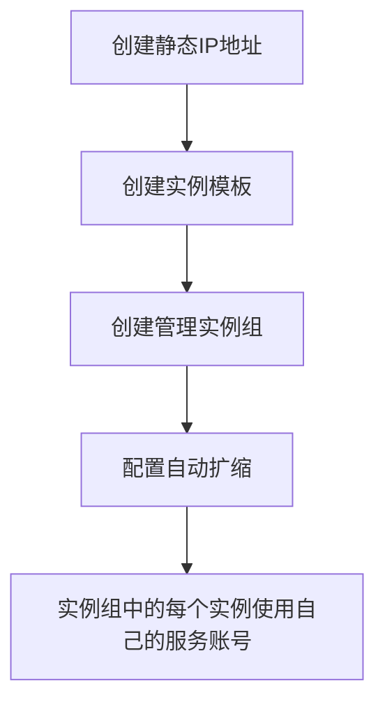
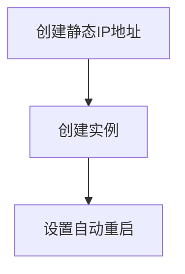
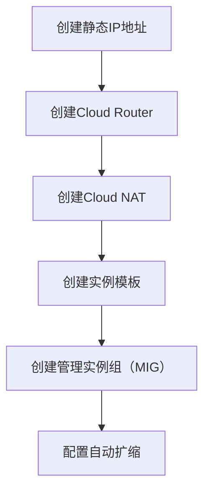

在Google Cloud Platform (GCP)中，为了确保实例的IP地址静态化，并且在扩缩时能够维持多个实例，每个实例对应自己的服务账号，可以采用以下策略：

1. **使用静态外部IP地址**：
   为每个实例分配一个静态外部IP地址。静态IP地址不会随实例的重启或删除而改变。

2. **使用实例模板和实例组**：
   使用实例模板创建管理实例组（Managed Instance Group, MIG），以便在扩缩时自动分配静态IP地址。

3. **确保每个实例使用自己的服务账号**：
   在创建实例模板时，可以指定服务账号，这样每个实例会使用自己的服务账号。

以下是详细步骤：

### 1. 创建静态外部IP地址
在GCP控制台或使用`gcloud`命令行工具创建静态外部IP地址。

```bash
gcloud compute addresses create my-static-ip --region us-central1
```

### 2. 创建实例模板
使用实例模板定义实例配置，包括分配静态IP地址和指定服务账号。

```bash
gcloud compute instance-templates create my-template \
    --machine-type n1-standard-1 \
    --region us-central1 \
    --network default \
    --address my-static-ip \
    --service-account my-service-account@my-project.iam.gserviceaccount.com \
    --image-family debian-9 \
    --image-project debian-cloud
```

### 3. 创建管理实例组（MIG）
使用实例模板创建管理实例组，并设置自动扩缩策略。

```bash
gcloud compute instance-groups managed create my-instance-group \
    --base-instance-name my-instance \
    --template my-template \
    --size 1 \
    --region us-central1
```

### 4. 配置自动扩缩
为实例组配置自动扩缩策略。

```bash
gcloud compute instance-groups managed set-autoscaling my-instance-group \
    --region us-central1 \
    --min-num-replicas 1 \
    --max-num-replicas 10 \
    --target-cpu-utilization 0.6
```

### 5. 确保每个实例使用独立服务账号
在实例模板中已经指定了服务账号，因此每个实例会使用指定的服务账号。

通过以上步骤，你可以在GCP中创建一组使用静态IP地址的实例，并在扩缩时自动管理这些实例。此外，每个实例将使用自己的服务账号，以确保正确的权限管理。

### Mermaid 流程图
以下是上述流程的示意图：



这样可以确保实例在扩缩时使用静态IP地址，并且每个实例都有自己的服务账号。

在Google Cloud Platform (GCP) 中，要确保每个实例在每次重启后都能获取到对应的静态IP地址，使用管理实例组（MIG）和负载均衡器或NAT网关的方法可能不足以满足你的需求，因为这些方法无法直接为每个实例分配静态IP。

要确保每个实例都有其对应的静态IP地址，即使在重启后，可以采取以下步骤：

### 1. 手动分配静态IP给每个实例
- 为每个实例手动分配一个静态外部IP地址。

### 2. 使用实例模板创建独立实例
- 创建单独的实例，而不是使用MIG，以确保每个实例都可以使用静态IP地址。

### 步骤详细说明：

#### 1. 创建静态IP地址
为每个实例预先创建静态IP地址。

```bash
gcloud compute addresses create static-ip-1 --region us-central1
gcloud compute addresses create static-ip-2 --region us-central1
```

#### 2. 创建实例模板
虽然使用实例模板是MIG的常用方法，但在这种情况下，需要直接使用这些模板创建独立实例。

```bash
gcloud compute instances create instance-1 \
    --zone us-central1-a \
    --machine-type n1-standard-1 \
    --network default \
    --address static-ip-1 \
    --service-account my-service-account@my-project.iam.gserviceaccount.com \
    --image-family debian-9 \
    --image-project debian-cloud

gcloud compute instances create instance-2 \
    --zone us-central1-a \
    --machine-type n1-standard-1 \
    --network default \
    --address static-ip-2 \
    --service-account my-service-account@my-project.iam.gserviceaccount.com \
    --image-family debian-9 \
    --image-project debian-cloud
```

#### 3. 设置自动重启和预留IP地址
确保实例在重启后仍然使用相同的静态IP地址。

```bash
gcloud compute instances set-scheduling instance-1 \
    --zone us-central1-a \
    --restart-on-failure

gcloud compute instances set-scheduling instance-2 \
    --zone us-central1-a \
    --restart-on-failure
```

### 4. 配置实例组的自动化（可选）
如果需要管理多个实例，并希望在扩缩容时自动化，可以编写脚本，使用API或Terraform等工具动态管理实例和静态IP地址的分配。

### 综合示例

假设我们有两个实例，每个实例在每次重启后需要保持其静态IP地址，步骤如下：

```bash
# 创建静态IP地址
gcloud compute addresses create static-ip-1 --region us-central1
gcloud compute addresses create static-ip-2 --region us-central1

# 创建实例
gcloud compute instances create instance-1 \
    --zone us-central1-a \
    --machine-type n1-standard-1 \
    --network default \
    --address static-ip-1 \
    --service-account my-service-account@my-project.iam.gserviceaccount.com \
    --image-family debian-9 \
    --image-project debian-cloud

gcloud compute instances create instance-2 \
    --zone us-central1-a \
    --machine-type n1-standard-1 \
    --network default \
    --address static-ip-2 \
    --service-account my-service-account@my-project.iam.gserviceaccount.com \
    --image-family debian-9 \
    --image-project debian-cloud

# 设置自动重启
gcloud compute instances set-scheduling instance-1 \
    --zone us-central1-a \
    --restart-on-failure

gcloud compute instances set-scheduling instance-2 \
    --zone us-central1-a \
    --restart-on-failure
```

### Mermaid 流程图



通过这些步骤，每个实例在重启后都能保持其静态IP地址。这种方法确保了每个实例都有一个固定的静态IP，即使在扩缩和重启过程中也不会改变。

在Google Cloud Platform (GCP)中，为实例组中的实例分配外部静态IP地址，并通过NAT网关确保它们能够使用静态IP进行出站流量的配置步骤如下：

### 步骤1：创建静态IP地址
首先，创建一个或多个静态IP地址。这些IP地址将由NAT网关使用。

```bash
gcloud compute addresses create my-static-ip --region us-central1
```

### 步骤2：创建Cloud Router
创建一个Cloud Router，这是配置Cloud NAT的前提条件。

```bash
gcloud compute routers create my-router --network default --region us-central1
```

### 步骤3：创建Cloud NAT
使用之前创建的Cloud Router配置Cloud NAT，并指定静态IP地址。

```bash
gcloud compute routers nats create my-nat-config \
    --router=my-router \
    --region us-central1 \
    --nat-external-ip-pool=my-static-ip \
    --nat-all-subnet-ip-ranges
```

### 步骤4：创建实例模板
创建一个实例模板，指定服务账号和其他配置。这些实例将由Managed Instance Group (MIG)管理。

```bash
gcloud compute instance-templates create my-template \
    --machine-type n1-standard-1 \
    --network default \
    --subnet default \
    --service-account my-service-account@my-project.iam.gserviceaccount.com \
    --image-family debian-9 \
    --image-project debian-cloud
```

### 步骤5：创建管理实例组（MIG）
使用实例模板创建一个管理实例组，并设置初始大小。

```bash
gcloud compute instance-groups managed create my-instance-group \
    --base-instance-name my-instance \
    --template my-template \
    --size 1 \
    --region us-central1
```

### 步骤6：配置自动扩缩
为实例组配置自动扩缩策略。

```bash
gcloud compute instance-groups managed set-autoscaling my-instance-group \
    --region us-central1 \
    --min-num-replicas 1 \
    --max-num-replicas 10 \
    --target-cpu-utilization 0.6
```

### 详细示例
以下是一个详细的示例，展示了如何设置这些组件：

```bash
# 1. 创建静态IP地址
gcloud compute addresses create my-static-ip --region us-central1

# 2. 创建Cloud Router
gcloud compute routers create my-router --network default --region us-central1

# 3. 创建Cloud NAT，使用静态IP地址
gcloud compute routers nats create my-nat-config \
    --router=my-router \
    --region us-central1 \
    --nat-external-ip-pool=my-static-ip \
    --nat-all-subnet-ip-ranges

# 4. 创建实例模板
gcloud compute instance-templates create my-template \
    --machine-type n1-standard-1 \
    --network default \
    --subnet default \
    --service-account my-service-account@my-project.iam.gserviceaccount.com \
    --image-family debian-9 \
    --image-project debian-cloud

# 5. 创建管理实例组（MIG）
gcloud compute instance-groups managed create my-instance-group \
    --base-instance-name my-instance \
    --template my-template \
    --size 1 \
    --region us-central1

# 6. 配置自动扩缩
gcloud compute instance-groups managed set-autoscaling my-instance-group \
    --region us-central1 \
    --min-num-replicas 1 \
    --max-num-replicas 10 \
    --target-cpu-utilization 0.6
```

### Mermaid 流程图
以下是上述流程的示意图：



### 解释
1. **静态IP地址**：创建一个静态IP地址，用于NAT网关出站流量。
2. **Cloud Router**：创建一个Cloud Router，为NAT服务配置路由。
3. **Cloud NAT**：创建Cloud NAT并分配静态IP地址，确保实例出站流量使用静态IP。
4. **实例模板**：创建一个实例模板，定义实例的配置和服务账号。
5. **管理实例组（MIG）**：使用实例模板创建一个管理实例组，便于实例的扩缩管理。
6. **自动扩缩**：配置实例组的自动扩缩策略，根据需求自动调整实例数量。

通过这些步骤，实例组中的实例将使用Cloud NAT的静态IP地址进行出站流量，同时可以动态扩缩实例数量，确保每个实例的IP地址静态化。

